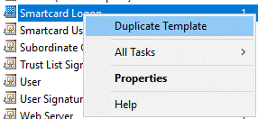
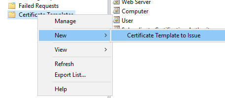
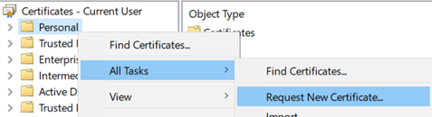

# Deploying Certificates to Key Trust Users to Enable RDP

**Applies To**

- Windows 10, version 1703 or later
- Windows 11
- Hybrid deployment
- Key trust

Windows Hello for Business supports using a certificate as the supplied credential when establishing a remote desktop connection to a server or other device. For certificate trust deployments, creation of this certificate occurs at container creation time.

This document discusses an approach for key trust deployments where authentication certificates can be deployed to an existing key trust user.

Three approaches are documented here:

1. Deploying a certificate to hybrid joined devices using an on-premises Active Directory certificate enrollment policy.

1. Deploying a certificate to hybrid or Azure AD joined devices using Simple Certificate Enrollment Protocol (SCEP) and Intune.

1. Working with non-Microsoft enterprise certificate authorities.

## Deploying a certificate to a hybrid joined device using an on-premises Active Directory Certificate enrollment policy

### Create a Windows Hello for Business certificate template

1. Sign in to your issuing certificate authority (CA).

1. Open the **Certificate Authority** Console (%windir%\system32\certsrv.msc).

1. In the left pane of the MMC, expand **Certification Authority (Local)**, and then expand your CA within the Certification Authority list.

1. Right-click **Certificate Templates** and then click **Manage** to open the **Certificate Templates** console.

1. Right-click the **Smartcard Logon** template and click **Duplicate Template**

    

1. On the **Compatibility** tab:
    1. Clear the **Show resulting changes** check box
    1. Select **Windows Server 2012 or Windows Server 2012 R2** from the Certification Authority list
    1. Select **Windows Server 2012 or Windows Server 2012 R2** from the Certification Recipient list

1. On the **General** tab:
    1. Specify a Template display name, such as **WHfB Certificate Authentication**
    1. Set the validity period to the desired value
    1. Take note of the Template name for later, which should be the same as the Template display name minus spaces (**WHfBCertificateAuthentication** in this example).

1. On the **Extensions** tab, verify the **Application Policies** extension includes **Smart Card Logon**.

1. On the **Subject Name** tab:
    1. Select the **Build from this Active Directory** information button if it is not already selected
    1. Select **Fully distinguished name** from the **Subject name format** list if Fully distinguished name is not already selected
    1. Select the **User Principal Name (UPN)** check box under **Include this information in alternative subject name**
1. On the **Request Handling** tab:
    1. Select the **Renew with same key** check box
    1. Set the Purpose to **Signature and smartcard logon**
        1. Click **Yes** when prompted to change the certificate purpose
    1. Click **Prompt the user during enrollment**

1. On the **Cryptography** tab:
    1. Set the Provider Category to **Key Storage Provider**
    1. Set the Algorithm name to **RSA**
    1. Set the minimum key size to **2048**
    1. Select **Requests must use one of the following providers**
    1. Tick **Microsoft Software Key Storage Provider**
    1. Set the Request hash to **SHA256**

1. On the **Security** tab, add the security group that you want to give **Enroll** access to. For example, if you want to give access to all users, select the **Authenticated** users group, and then select Enroll permissions for them  .

1. Click **OK** to finalize your changes and create the new template. Your new template should now appear in the list of Certificate Templates.

1. Close the Certificate Templates console.

1. Open an elevated command prompt and change to a temporary working directory.

1. Execute the following command:

    certutil -dstemplate \<TemplateName\> \> \<TemplateName\>.txt

    Replace \<TemplateName\> with the Template name you took note of earlier in step 7.

1. Open the text file created by the command above.
    1. Delete the last line of the output from the file that reads **CertUtil: -dsTemplate command completed successfully.**
    1. Modify the line that reads **pKIDefaultCSPs = "1,Microsoft Software Key Storage Provider"** to **pKIDefaultCSPs = "1,Microsoft Passport Key Storage Provider"**

1. Save the text file.

1. Update the certificate template by executing the following command:

    certutil -dsaddtemplate \<TemplateName\>.txt

1. In the Certificate Authority console, right-click **Certificate Templates**, select **New**, and select **Certificate Template to Issue**

    

1. From the list of templates, select the template you previously created (**WHFB Certificate Authentication**) and click **OK**. It can take some time for the template to replicate to all servers and become available in this list.

1. After the template replicates, in the MMC, right-click in the Certification Authority list, click **All Tasks** and then click **Stop Service**. Right-click the name of the CA again, click **All Tasks**, and then click **Start Service**.

### Requesting a Certificate

1. Ensure the hybrid Azure AD joined device has network line of sight to Active Directory domain controllers and the issuing certificate authority. 

1. Start the **Certificates – Current User** console (%windir%\system32\certmgr.msc).

1. In the left pane of the MMC, right-click **Personal**, click **All Tasks**, and then click **Request New Certificate…**

    

1. On the Certificate Enrollment screen, click **Next**.

1. Under Select Certificate Enrollment Policy, ensure **Active Directory Enrollment Policy** is selected and then click **Next**.

1. Under Request Certificates, click the check-box next to the certificate template you created in the previous section (WHfB Certificate Authentication) and then click **Enroll**.

1. After a successful certificate request, click Finish on the Certificate Installation Results screen

## Deploying a certificate to Hybrid or Azure AD Joined Devices using Simple Certificate Enrollment Protocol (SCEP) via Intune

Deploying a certificate to Azure AD Joined Devices may be achieved with the Simple Certificate Enrollment Protocol (SCEP) via Intune. For guidance deploying the required infrastructure, refer to [Configure infrastructure to support SCEP certificate profiles with Microsoft Intune](/mem/intune/protect/certificates-scep-configure).

Next you should deploy the root CA certificate (and any other intermediate certificate authority certificates) to Azure AD Joined Devices using a Trusted root certificate profile with Intune. For guidance, refer to [Create trusted certificate profiles in Microsoft Intune](/mem/intune/protect/certificates-trusted-root).

Once these requirements have been met, a new device configuration profile may be configured from Intune that provisions a certificate for the user of the device. Proceed as follows:

1. Sign in to the Microsoft [Endpoint Manager admin center](https://go.microsoft.com/fwlink/?linkid=2109431).

1. Navigate to Devices \> Configuration Profiles \> Create profile.

1. Enter the following properties:
    1. For Platform, select **Windows 10 and later**.
    1. For Profile, select **SCEP Certificate**.
    1. Click **Create**.

1. In **Basics**, enter the following parameters:
    1. **Name**: Enter a descriptive name for the profile. Name your profiles so you can easily identify them later. For example, a good profile name is SCEP profile for entire company.
    1. **Description**: Enter a description for the profile. This setting is optional, but recommended.
    1. Select **Next**.

1. In the **Configuration settings**, complete the following:
    1. For Certificate Type, choose **User**.
    1. For Subject name format, set it to **CN={{UserPrincipalName}}**.
    1. Under Subject alternative name, select **User principal name (UPN)** from the drop-down menu and set the value to **CN={{UserPrincipalName}}**.
    1. For Certificate validity period, set a value of your choosing.
    1. For Key storage provider (KSP), choose **Enroll to Windows Hello for Business, otherwise fail (Windows 10 and later)**.
    1. For Key usage, choose **Digital Signature**.
    1. For Key size (bits), choose **2048**.
    1. For Hash algorithm, choose **SHA-2**.
    1. Under Root Certificate, click **+Root Certificate** and select the trusted certificate profile you created earlier for the Root CA Certificate.
    1. Under Extended key usage, add the following:

        | Name | Object Identifier | Predefined Values |
        |------|-------------------|-------------------|
        | Smart Card Logon | 1.3.6.1.4.1.311.20.2.2 | Smart Card Logon |
        | Client Authentication | 1.3.6.1.5.5.7.3.2 | Client Authentication |

    1. For Renewal threshold (%), set a value of your choosing.
    1. For SCEP Server URLs, provide the public endpoint that you configured during the deployment of your SCEP infrastructure.
    1. Click **Next**
1. In Assignments, target the devices or users who should receive a certificate and click **Next**

1. In Applicability Rules, provide additional issuance restrictions if required and click **Next**

1. In Review + create, click **Create**

Once the configuration profile has been created, targeted clients will receive the profile from Intune on their next refresh cycle. You should find a new certificate in the user store. To validate the certificate is present, do the following steps:

1. Open the Certificates - Current User console (%windir%\system32\certmgr.msc)

1. In the left pane of the MMC, expand **Personal** and select **Certificates**

1. In the right-hand pane of the MMC, check for the new certificate

> [!NOTE]
> This infrastructure may also deploy the same certificates to co-managed or modern-managed Hybrid AAD-Joined devices using Intune Policies.

## Using non-Microsoft Enterprise Certificate Authorities

If you are using a Public Key Infrastructure that uses non-Microsoft services, the certificate templates published to the on-premises Active Directory may not be available. For guidance with integration of Intune/SCEP with non-Microsoft PKI deployments, refer to [Use third-party certification authorities (CA) with SCEP in Microsoft Intune](/mem/intune/protect/certificate-authority-add-scep-overview).

As an alternative to using SCEP or if none of the previously covered solutions will work in your environment, you can manually generate Certificate Signing Requests (CSR) for submission to your PKI. To assist with this approach, you can use the [Generate-CertificateRequest](https://www.powershellgallery.com/packages/Generate-CertificateRequest) PowerShell commandlet.

The Generate-CertificateRequest commandlet will generate an .inf file for a pre-existing Windows Hello for Business key. The .inf can be used to generate a certificate request manually using certreq.exe. The commandlet will also generate a .req file, which can be submitted to your PKI for a certificate.

## RDP Sign-in with Windows Hello for Business Certificate Authentication

After adding the certificate using an approach from any of the previous sections, you should be able to RDP to any Windows device or server in the same Forest as the user’s on-premises Active Directory account, provided the PKI certificate chain for the issuing certificate authority is deployed to that target server.

1. Open the Remote Desktop Client (%windir%\system32\mstsc.exe) on the Hybrid AAD-Joined client where the authentication certificate has been deployed.
1. Attempt an RDP session to a target server.
1. Use the certificate credential protected by your Windows Hello for Business gesture.
