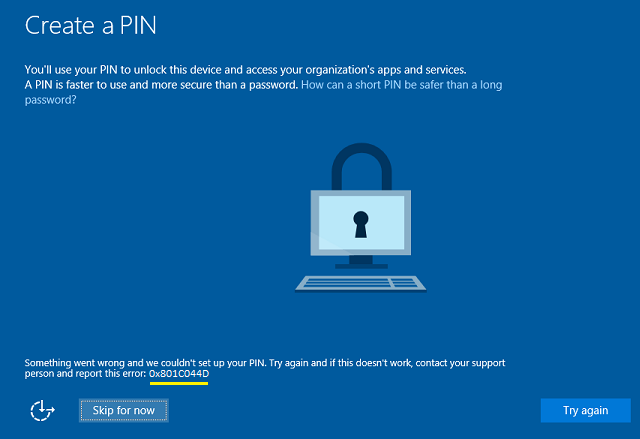

# Windows Hello errors during PIN creation

**Applies to**
-   Windows 10

When you set up Windows Hello in Windows 10, you may get an error during the **Create a PIN** step. This topic lists some of the error codes with recommendations for mitigating the problem. If you get an error code that is not listed here, contact Microsoft Support.

## Where is the error code?

The following image shows an example of an error during **Create a PIN**.

## Error mitigations

When a user encounters an error when creating the work PIN, advise the user to try the following steps. Many errors can be mitigated by one of these steps.
1.  Try to create the PIN again. Some errors are transient and resolve themselves.
2.  Sign out, sign in, and try to create the PIN again.
3.  Reboot the device and then try to create the PIN again.
4.  Unjoin the device from Azure Active Directory (Azure AD), rejoin, and then try to create the PIN again. To unjoin a desktop PC, go to **Settings** &gt; **System** &gt; **About** and select **Disconnect from organization**. To unjoin a device running Windows 10 Mobile, you must [reset the device](https://go.microsoft.com/fwlink/p/?LinkId=715697).
5.  On mobile devices, if you are unable to setup a PIN after multiple attempts, reset your device and start over. For help on how to reset your phone go to [Reset my phone](https://go.microsoft.com/fwlink/p/?LinkId=715697).
If the error occurs again, check the error code against the following table to see if there is another mitigation for that error. When no mitigation is listed in the table, contact Microsoft Support for assistance.

<table>

<thead>
<tr class="header">
<th align="left">Hex</th>
<th align="left">Cause</th>
<th align="left">Mitigation</th>
</tr>
</thead>
<tbody>

<tr class="even">
<td align="left">0x801C044D</td>
<td align="left">Authorization token does not contain device ID</td>
<td align="left">Unjoin the device from Azure AD and rejoin</td>
</tr>

<tr class="odd">
<td align="left">0x80090036</td>
<td align="left">User cancelled an interactive dialog</td>
<td align="left">User will be asked to try again</td>
</tr>
<tr class="even">
<td align="left">0x80090011</td>
<td align="left">The container or key was not found</td>
<td align="left">Unjoin the device from Azure AD and rejoin</td>
</tr>
<tr class="odd">
<td align="left">0x8009000F</td>
<td align="left">The container or key already exists</td>
<td align="left">Unjoin the device from Azure AD and rejoin</td>
</tr>
<tr class="even">
<td align="left">0x8009002A</td>
<td align="left">NTE_NO_MEMORY</td>
<td align="left">Close programs which are taking up memory and try again.</td>
</tr>
<tr class="odd">
<td align="left">0x80090005</td>
<td align="left">NTE_BAD_DATA</td>
<td align="left">Unjoin the device from Azure AD and rejoin</td>
</tr><tr class="even">
<td align="left">0x80090029</td>
<td align="left">TPM is not set up.</td>
<td align="left">Sign on with an administrator account. Click <strong>Start</strong>, type &quot;tpm.msc&quot;, and select <strong>tpm.msc Microsoft Common Console Document</strong>. In the <strong>Actions</strong> pane, select <strong>Prepare the TPM</strong>. </td>
</tr>
<tr class="even">
<td align="left">0x80090031</td>
<td align="left">NTE_AUTHENTICATION_IGNORED</td>
<td align="left">Reboot the device. If the error occurs again after rebooting, <a href="https://go.microsoft.com/fwlink/p/?LinkId=619969" data-raw-source="[reset the TPM]( https://go.microsoft.com/fwlink/p/?LinkId=619969)">reset the TPM</a> or run <a href="https://go.microsoft.com/fwlink/p/?LinkId=629650" data-raw-source="[Clear-TPM](https://go.microsoft.com/fwlink/p/?LinkId=629650)">Clear-TPM</a></td>
</tr>
<tr class="odd">
<td align="left">0x80090035</td>
<td align="left">Policy requires TPM and the device does not have TPM.</td>
<td align="left">Change the Windows Hello for Business policy to not require a TPM.</td>
</tr>
<tr class="even">
<td align="left">0x801C0003</td>
<td align="left">User is not authorized to enroll</td>
<td align="left">Check if the user has permission to perform the operation​.</td>
</tr>
<tr class="odd">
<td align="left">0x801C000E</td>
<td align="left">Registration quota reached</td>
<td align="left">
Unjoin some other device that is currently joined using the same account or <a href="https://go.microsoft.com/fwlink/p/?LinkId=626933" data-raw-source="[increase the maximum number of devices per user](https://go.microsoft.com/fwlink/p/?LinkId=626933)">increase the maximum number of devices per user</a>.
</td>
</tr>
<tr class="even">
<td align="left">0x801C000F</td>
<td align="left">Operation successful but the device requires a reboot</td>
<td align="left">Reboot the device.</td>
</tr>
<tr class="odd">
<td align="left">0x801C0010</td>
<td align="left">The AIK certificate is not valid or trusted</td>
<td align="left">Sign out and then sign in again.</td>
</tr>
<tr class="even">
<td align="left">0x801C0011</td>
<td align="left">The attestation statement of the transport key is invalid</td>
<td align="left">Sign out and then sign in again.</td>
</tr>
<tr class="odd">
<td align="left">0x801C0012</td>
<td align="left">Discovery request is not in a valid format</td>
<td align="left">Sign out and then sign in again.</td>
</tr>
<tr class="even">
<td align="left">0x801C0015</td>
<td align="left">The device is required to be joined to an Active Directory domain</td>
<td align="left">​Join the device to an Active Directory domain.</td>
</tr>
<tr class="odd">
<td align="left">0x801C0016</td>
<td align="left">The federation provider configuration is empty</td>
<td align="left">Go to <a href="http://clientconfig.microsoftonline-p.net/FPURL.xml" data-raw-source="[http://clientconfig.microsoftonline-p.net/FPURL.xml](http://clientconfig.microsoftonline-p.net/FPURL.xml)">http://clientconfig.microsoftonline-p.net/FPURL.xml</a> and verify that the file is not empty.</td>
</tr>
<tr class="even">
<td align="left">0x801C0017</td>
<td align="left">​The federation provider domain is empty</td>
<td align="left">Go to <a href="http://clientconfig.microsoftonline-p.net/FPURL.xml" data-raw-source="[http://clientconfig.microsoftonline-p.net/FPURL.xml](http://clientconfig.microsoftonline-p.net/FPURL.xml)">http://clientconfig.microsoftonline-p.net/FPURL.xml</a> and verify that the FPDOMAINNAME element is not empty.</td>
</tr>
<tr class="odd">
<td align="left">0x801C0018</td>
<td align="left">The federation provider client configuration URL is empty</td>
<td align="left">Go to <a href="http://clientconfig.microsoftonline-p.net/FPURL.xml" data-raw-source="[http://clientconfig.microsoftonline-p.net/FPURL.xml](http://clientconfig.microsoftonline-p.net/FPURL.xml)">http://clientconfig.microsoftonline-p.net/FPURL.xml</a> and verify that the CLIENTCONFIG element contains a valid URL.</td>
</tr>
<tr class="even">
<td align="left">0x801C03E9</td>
<td align="left">Server response message is invalid</td>
<td align="left">Sign out and then sign in again.</td>
</tr>
<tr class="odd">
<td align="left">0x801C03EA</td>
<td align="left">Server failed to authorize user or device.</td>
<td align="left">Check if the token is valid and user has permission to register Windows Hello for Business keys.</td>
</tr>
<tr class="even">
<td align="left">0x801C03EB</td>
<td align="left">Server response http status is not valid</td>
<td align="left">Sign out and then sign in again.</td>
</tr>
<tr class="odd">
<td align="left">0x801C03EC</td>
<td align="left">Unhandled exception from server.</td>
<td align="left">sign out and then sign in again.</td>
</tr>
<tr class="even">
<td align="left">0x801C03ED</td>
<td align="left">
Multi-factor authentication is required for a &#39;ProvisionKey&#39; operation, but was not performed

-or-

Token was not found in the Authorization header

-or-

Failed to read one or more objects

-or-

The request sent to the server was invalid.
</td>
<td align="left">Sign out and then sign in again. If that doesn&#39;t resolve the issue, unjoin the device from Azure Active Directory (Azure AD) and rejoin.</td>
</tr>
<tr class="odd">
<td align="left">0x801C03EE</td>
<td align="left">Attestation failed</td>
<td align="left">Sign out and then sign in again.</td>
</tr>
<tr class="even">
<td align="left">0x801C03EF</td>
<td align="left">The AIK certificate is no longer valid</td>
<td align="left">Sign out and then sign in again.</td>
</tr>
<tr class="odd">
<td align="left">​0x801C044D</td>
<td align="left">Unable to obtain user token</td>
<td align="left">Sign out and then sign in again. Check network and credentials.</td>
</tr>
<tr class="even">
<td align="left">0x801C044E</td>
<td align="left">Failed to receive user creds input</td>
<td align="left">Sign out and then sign in again.</td>
</tr>
</tbody>
</table>
 
## Errors with unknown mitigation
For errors listed in this table, contact Microsoft Support for assistance.

| Hex         | Cause     |
|-------------|---------|
| 0x80072f0c  | Unknown    |
| 0x80070057 | Invalid parameter or argument is passed |
| 0x80090027  | Caller provided wrong parameter. If third-party code receives this error they must change their code. |
| 0x8009002D  | NTE\_INTERNAL\_ERROR   |
| 0x80090020  | NTE\_FAIL     |
| 0x801C0001  | ​ADRS server response is not in valid format    |
| 0x801C0002  | Server failed to authenticate the user   |
| 0x801C0006  | Unhandled exception from server    |
| 0x801C000C  | Discovery failed      |
| 0x801C001B  | ​The device certificate is not found    |
| 0x801C000B  | Redirection is needed and redirected location is not a well known server   |
| 0x801C0019  | ​The federation provider client configuration is empty    |
| 0x801C001A  | The DRS endpoint in the federation provider client configuration is empty   |
| 0x801C0013  | Tenant ID is not found in the token    |
| 0x801C0014  | User SID is not found in the token       |
| 0x801C03F1  | There is no UPN in the token       |
| 0x801C03F0  | ​There is no key registered for the user   |
| 0x801C03F1  | ​There is no UPN in the token          |
| ​0x801C044C | There is no core window for the current thread     |
 

## Related topics

- [Windows Hello for Business](hello-identity-verification.md)
- [How Windows Hello for Business works](hello-how-it-works.md)
- [Manage Windows Hello for Business in your organization](hello-manage-in-organization.md)
- [Why a PIN is better than a password](hello-why-pin-is-better-than-password.md)
- [Prepare people to use Windows Hello](hello-prepare-people-to-use.md)
- [Windows Hello and password changes](hello-and-password-changes.md)
- [Event ID 300 - Windows Hello successfully created](hello-event-300.md)
- [Windows Hello biometrics in the enterprise](hello-biometrics-in-enterprise.md)
