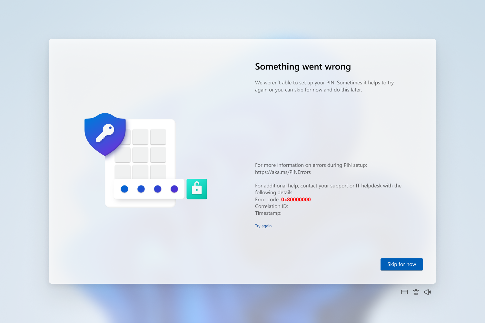

# Windows Hello errors during PIN creation

When you set up Windows Hello in Windows client, you might get an error during the **Create a PIN** step. This article lists some of the error codes with recommendations for mitigating the problem.

> [!IMPORTANT]
> If you get an error code that isn't listed here, contact Microsoft Support.

## Where is the error code?

The following image shows an example of an error during **Create a PIN**.

## Error mitigations

When a user encounters an error when creating the work PIN, advise the user to try the following steps. Many errors can be mitigated by one of these steps.

1. Try to create the PIN again. Some errors are transient and resolve themselves
1. Sign out, sign in, and try to create the PIN again
1. Reboot the device and then try to create the PIN again
1. Unjoin the device from Microsoft Entra ID, rejoin, and then try to create the PIN again. To unjoin a device, go to **Settings > System > About > Disconnect from organization**

If the error occurs again, check the error code against the following table to see if there's another mitigation for that error. When no mitigation is listed in the table, contact Microsoft Support for assistance.

| Hex | Cause | Mitigation |
|:-|:-|:-|
| 0x80090005 | NTE_BAD_DATA | Unjoin the device from Microsoft Entra ID and rejoin. |
| 0x8009000F | The container or key already exists. | Unjoin the device from Microsoft Entra ID and rejoin. |
| 0x80090011 | The container or key wasn't found. | Unjoin the device from Microsoft Entra ID and rejoin. |
| 0x80090029 | TPM isn't set up. | Sign on with an administrator account. Select **Start**, type `tpm.msc`, and select **tpm.msc Microsoft Common Console Document**. In the **Actions** pane, select **Prepare the TPM**. |
| 0x8009002A | NTE_NO_MEMORY | Close programs, which are taking up memory and try again. |
| 0x80090031 | NTE_AUTHENTICATION_IGNORED | Reboot the device. If the error occurs again after rebooting, [reset the TPM](/previous-versions/windows/it-pro/windows-server-2008-R2-and-2008/dd851452(v=ws.11)) or run [Clear-TPM](/powershell/module/trustedplatformmodule/clear-tpm). |
| 0x80090035 | Policy requires TPM and the device doesn't have TPM. | Change the Windows Hello for Business policy to not require a TPM. |
| 0x80090036 | User canceled an interactive dialog. | User is asked to try again. |
| 0x801C0003 | User isn't authorized to enroll. | Check if the user has permission to perform the operation​. |
| 0x801C000E | Registration quota reached. | Unjoin some other device that is currently joined using the same account or [increase the maximum number of devices per user](/entra/identity/devices/manage-device-identities). |
| 0x801C000F | Operation successful, but the device requires a reboot. | Reboot the device. |
| 0x801C0010 | The AIK certificate isn't valid or trusted. | Sign out and then sign in again. |
| 0x801C0011 | The attestation statement of the transport key is invalid. | Sign out and then sign in again. |
| 0x801C0012 | Discovery request isn't in a valid format. | Sign out and then sign in again. |
| 0x801C0015 | The device is required to be joined to an Active Directory domain. | Join the device to an Active Directory domain. |
| 0x801C0016 | The federation provider configuration is empty | Go to http://clientconfig.microsoftonline-p.net/FPURL.xml and verify that the file isn't empty. |
| 0x801C0017 | The federation provider domain is empty | Go to http://clientconfig.microsoftonline-p.net/FPURL.xml and verify that the FPDOMAINNAME element isn't empty. |
| 0x801C0018 | The federation provider client configuration URL is empty | Go to http://clientconfig.microsoftonline-p.net/FPURL.xml and verify that the CLIENTCONFIG element contains a valid URL. |
| 0x801C03E9 | Server response message is invalid | Sign out and then sign in again. |
| 0x801C03EA | Server failed to authorize user or device. | Check if the token is valid and user has permission to register Windows Hello for Business keys. |
| 0x801C03EB | Server response http status isn't valid | Sign out and then sign in again. |
| 0x801C03EC | Unhandled exception from server. | sign out and then sign in again. |
| 0x801C03ED | Multi-factor authentication is required for a 'ProvisionKey' operation, but wasn't performed.    -or-    Token wasn't found in the Authorization header.    -or-    Failed to read one or more objects.    -or-    The request sent to the server was invalid.    -or-    User doesn't have permissions to join to Microsoft Entra ID. | Sign out and then sign in again. If that doesn't resolve the issue, unjoin the device from Microsoft Entra ID and rejoin.   Allow user(s) to join to Microsoft Entra ID under Microsoft Entra Device settings. |
| 0x801C03EE | Attestation failed. | Sign out and then sign in again. |
| 0x801C03EF | The AIK certificate is no longer valid. | Sign out and then sign in again. |
| 0x801C03F2 | Windows Hello key registration failed. | ERROR_BAD_DIRECTORY_REQUEST. Another object with the same value for property proxyAddresses already exists. To resolve the issue, refer to [Duplicate Attributes Prevent Dirsync](/office365/troubleshoot/administration/duplicate-attributes-prevent-dirsync). Also, if no sync conflict exists, please verify that the "Mail/Email address" in Microsoft Entra ID and the Primary SMTP address are the same in the proxy address. |
| 0x801C044D | Authorization token doesn't contain device ID. | Unjoin the device from Microsoft Entra ID and rejoin. |
|  | Unable to obtain user token. | Sign out and then sign in again. Check network and credentials. |
| 0x801C044E | Failed to receive user credentials input. | Sign out and then sign in again. |
| 0x801C0451 | User token switch account. | Delete the Web Account Manager token broker files located in `%LOCALAPPDATA%\Packages\Microsoft.AAD.BrokerPlugin_cw5n1h2txyewy\AC\TokenBroker\Accounts\*.*\` and reboot. |
| 0xC00000BB | Your PIN or this option is temporarily unavailable. | The destination domain controller doesn't support the login method. Most often the KDC service doesn't have the proper certificate to support the login. Another common cause can be the client cannot verify the KDC certificate CRL. Use a different login method. |

## Errors with unknown mitigation

For errors listed in this table, contact Microsoft Support for assistance.

| Hex | Cause |
|--|--|
| 0x80070057 | Invalid parameter or argument is passed. |
| 0X80072F0C | Unknown |
| 0x80072F8F | A mismatch happens between the system's clock and the activation server's clock when attempting to activate Windows. |
| 0x80090010 | NTE_PERM |
| 0x80090020 | NTE_FAIL |
| 0x80090027 | Caller provided a wrong parameter. If non-Microsoft code receives this error, they must change their code. |
| 0x8009002D | NTE_INTERNAL_ERROR |
| 0x801C0001 | ADRS server response isn't in a valid format. |
| 0x801C0002 | Server failed to authenticate the user. |
| 0x801C0006 | Unhandled exception from server. |
| 0x801C000B | Redirection is needed and redirected location isn't a well known server. |
| 0x801C000C | Discovery failed. |
| 0x801C0013 | Tenant ID isn't found in the token. |
| 0x801C0014 | User SID isn't found in the token. |
| 0x801C0019 | ​The federation provider client configuration is empty |
| 0x801C001A | The DRS endpoint in the federation provider client configuration is empty. |
| 0x801C001B | ​The device certificate isn't found. |
| 0x801C03F0 | ​There's no key registered for the user. |
| 0x801C03F1 | ​There's no UPN in the token. |
| ​0x801C044C | There's no core window for the current thread. |
| 0x801c004D | DSREG_NO_DEFAULT_ACCOUNT: NGC provisioning is unable to find the default WAM account to use to request Microsoft Entra token for provisioning. Unable to enroll a device to use a PIN for login. |
| 0xCAA30193 | HTTP 403 Request Forbidden: it means request left the device, however either Server, proxy or firewall generated this response. |
