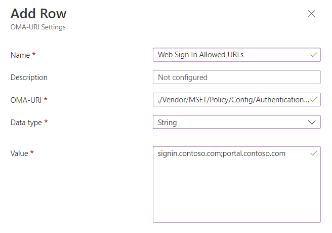

# PIN reset

**Applies to:**

- Windows 10, version 1709 or later

Windows Hello for Business provides the capability for users to reset forgotten PINs using the "I forgot my PIN link" from the Sign-in options page in Settings or from above the lock screen. User's are required to authenticate and complete multi-factor authentication to reset their PIN.

There are two forms of PIN reset called destructive and non-destructive. Destructive PIN reset is the default and does not require configuration. During a destructive PIN reset, the user's existing PIN and underlying credentials, including any keys or certificates added to their Windows Hello container, will be deleted from the client and a new logon key and PIN are provisioned. For non-destructive PIN reset, you must deploy the Microsoft PIN reset service and client policy to enable the PIN recovery feature. During a non-destructive PIN reset, the user's Windows Hello for Business container and keys are preserved, but the user's PIN that they use to authorize key usage is changed.

## Using PIN Reset

**Requirements**

- Reset from settings - Windows 10, version 1703
- Reset above Lock - Windows 10, version 1709

Destructive and non-destructive PIN reset use the same entry points for initiating a PIN reset. If a user has forgotten their PIN, but has an alternate logon method, they can navigate to Sign-in options in Settings and initiate a PIN reset from the PIN options. If they do not have an alternate way to sign into their device, PIN reset can also be initiated from above the lock screen in the PIN credential provider.

>[!IMPORTANT]
>For hybrid Azure AD joined devices, users must have corporate network connectivity to domain controllers to reset their PIN. If AD FS is being used for certificate trust or for on-premises only deployments, users must also have corporate network connectivity to federation services to reset their PIN.

### Reset PIN from Settings

1. Sign-in to Windows 10, version 1703 or later using an alternate credential.
2. Open **Settings**, click **Accounts**, click **Sign-in options**.
3. Under **PIN**, click **I forgot my PIN** and follow the instructions.

### Reset PIN above the Lock Screen

For Azure AD joined devices:

1. If the PIN credential provider is not selected, expand the **Sign-in options** link, and select the PIN pad icon.
1. Click **I forgot my PIN** from the PIN credential provider
1. Select an authentication option from the list of presented options. This list will be based on the different authentication methods enabled in your tenant (i.e. Password, PIN, Security key)
1. Follow the instructions provided by the provisioning process
1. When finished, unlock your desktop using your newly created PIN.

For Hybrid Azure AD joined devices:

1. If the PIN credential provider is not selected, expand the **Sign-in options** link, and select the PIN pad icon.
1. Click **I forgot my PIN** from the PIN credential provider
1. Enter your password and press enter.
1. Follow the instructions provided by the provisioning process
1. When finished, unlock your desktop using your newly created PIN.

> [!NOTE]
> Key trust on hybrid Azure AD joined devices does not support destructive PIN reset from above the Lock Screen. This is due to the sync delay between when a user provisions their Windows Hello for Business credential and being able to use it for sign-in. For this deployment model, you must deploy non-destructive PIN reset for above lock PIN reset to work.

You may find that PIN reset from settings only works post login, and that the "lock screen" PIN reset function will not work if you have any matching limitation of SSPR password reset from the lock screen. For more information, see [Enable Azure Active Directory self-service password reset at the Windows sign-in screen - General ](/azure/active-directory/authentication/howto-sspr-windows#general-limitations).

Visit the [Windows Hello for Business Videos](./hello-videos.md) page and watch [Windows Hello for Business forgotten PIN user experience](./hello-videos.md#windows-hello-for-business-forgotten-pin-user-experience).

## Non-Destructive PIN reset

**Requirements:**

- Azure Active Directory
- Hybrid Windows Hello for Business deployment
- Azure AD registered, Azure AD joined, and Hybrid Azure AD joined
- Windows 10, version 1709 to 1809, **Enterprise Edition**. There is no licensing requirement for this feature since version 1903.

When non-destructive PIN reset is enabled on a client, a 256-bit AES key is generated locally and added to a user's Windows Hello for Business container and keys as the PIN reset protector. This PIN reset protector is encrypted using a public key retrieved from the Microsoft PIN reset service and then stored on the client for later use during PIN reset. After a user initiates a PIN reset, completes authentication to Azure, and completes multi-factor authentication, the encrypted PIN reset protector is sent to the Microsoft PIN reset service, decrypted, and returned to the client. The decrypted PIN reset protector is used to change the PIN used to authorize Windows Hello for Business keys and it is then cleared from memory.

Using Group Policy, Microsoft Intune or a compatible MDM, you can configure Windows 10 devices to securely use the Microsoft PIN reset service that enables users to reset their forgotten PIN through settings or above the lock screen without requiring re-enrollment.

>[!IMPORTANT]
> The Microsoft PIN Reset service only works with **Enterprise Edition** for Windows 10, version 1709 to 1809.  The feature works with **Enterprise Edition** and **Pro** edition with Windows 10, version 1903 and newer.
> The Microsoft PIN Reset service is not currently available in Azure Government.

### Onboarding the Microsoft PIN reset service to your Intune tenant

Before you can remotely reset PINs, you must on-board the Microsoft PIN reset service to your Azure Active Directory tenant, and configure devices you manage.

### Connect Azure Active Directory with the PIN reset service

1. Go to the [Microsoft PIN Reset Service Production website](https://login.windows.net/common/oauth2/authorize?response_type=code&client_id=b8456c59-1230-44c7-a4a2-99b085333e84&resource=https%3A%2F%2Fgraph.windows.net&redirect_uri=https%3A%2F%2Fcred.microsoft.com&state=e9191523-6c2f-4f1d-a4f9-c36f26f89df0&prompt=admin_consent), and sign in using the Global administrator account you use to manage your Azure Active Directory tenant.
1. After you have logged in, choose **Accept** to give consent for the PIN reset service to access your account.
   
1. Go to the [Microsoft PIN Reset Client Production website](https://login.windows.net/common/oauth2/authorize?response_type=code&client_id=9115dd05-fad5-4f9c-acc7-305d08b1b04e&resource=https%3A%2F%2Fcred.microsoft.com%2F&redirect_uri=ms-appx-web%3A%2F%2FMicrosoft.AAD.BrokerPlugin%2F9115dd05-fad5-4f9c-acc7-305d08b1b04e&state=6765f8c5-f4a7-4029-b667-46a6776ad611&prompt=admin_consent), and sign in using the Global administrator account you use to manage your Azure Active Directory tenant.
1. After you have logged in, choose **Accept** to give consent for the PIN reset client to access your account.
 
    > [!NOTE]
    > After you have accepted the PIN reset service and client requests, you will land on a page that states "You do not have permission to view this directory or page." This behavior is expected. Be sure to confirm that the two PIN reset applications are listed for your tenant.
1. In the [Azure portal](https://portal.azure.com), verify that the Microsoft PIN Reset Service and Microsoft PIN Reset Client are integrated from the **Enterprise applications** blade. Filter to application status "Enabled" and both Microsoft Pin Reset Service Production and Microsoft Pin Reset Client Production will show up in your tenant.

   > [!div class="mx-imgBorder"]
   > 

### Configure Windows devices to use PIN reset using Group Policy

You configure Windows 10 to use the Microsoft PIN Reset service using the computer configuration portion of a Group Policy object.

1. Using the Group Policy Management Console (GPMC), scope a domain-based Group Policy to computer accounts in Active Directory.
1. Edit the Group Policy object from Step 1.
1. Enable the **Use PIN Recovery** policy setting located under **Computer Configuration > Administrative Templates > Windows Components > Windows Hello for Business**.
1. Close the Group Policy Management Editor to save the Group Policy object.  Close the GPMC.

#### Create a PIN Reset Device configuration profile using Microsoft Intune

1. Sign-in to [Endpoint Manager admin center](https://endpoint.microsoft.com/) using a Global administrator account.
1. Click **Endpoint Security** > **Account Protection** > **Properties**.
1. Set **Enable PIN recovery** to **Yes**.

> [!NOTE]
> You can also setup PIN recovery using configuration profiles.
>
> 1. Sign in to Endpoint Manager.
> 1. Click **Devices** > **Configuration Profiles** > Create a new profile or edit an existing profile using the Identity Protection profile type.
> 1. Set **Enable PIN recovery** to **Yes**.

#### Assign the PIN Reset Device configuration profile using Microsoft Intune

1. Sign in to the [Azure portal](https://portal.azure.com) using a Global administrator account. 
1. Navigate to the Microsoft Intune blade. Choose **Device configuration** > **Profiles**. From the list of device configuration profiles, choose the profile that contains the PIN reset configuration.
1. In the device configuration profile, select **Assignments**.
1. Use the **Include** and/or **Exclude** tabs to target the device configuration profile to select groups.

### Confirm that PIN recovery policy is enforced on the client

The PIN reset configuration for a user can be viewed by running [**dsregcmd /status**](/azure/active-directory/devices/troubleshoot-device-dsregcmd) from the command line. This state can be found under the output in the user state section as the **CanReset** line item. If **CanReset** reports as DestructiveOnly, then only destructive PIN reset is enabled. If **CanReset** reports DestructiveAndNonDestructive, then non-destructive PIN reset is enabled.

#### Sample User state Output for Destructive PIN Reset

```
+----------------------------------------------------------------------+
| User State                                                           |
+----------------------------------------------------------------------+

                    NgcSet : YES
                  NgcKeyId : {FA0DB076-A5D7-4844-82D8-50A2FB42EC7B}
                  CanReset : DestructiveOnly
           WorkplaceJoined : NO
             WamDefaultSet : YES
       WamDefaultAuthority : organizations
              WamDefaultId : https://login.microsoft.com
            WamDefaultGUID : { B16898C6-A148-4967-9171-64D755DA8520 } (AzureAd)

+----------------------------------------------------------------------+
```

#### Sample User state Output for Non-Destructive PIN Reset

```
+----------------------------------------------------------------------+
| User State                                                           |
+----------------------------------------------------------------------+

                    NgcSet : YES
                  NgcKeyId : {FA0DB076-A5D7-4844-82D8-50A2FB42EC7B}
                  CanReset : DestructiveAndNonDestructive
           WorkplaceJoined : NO
             WamDefaultSet : YES
       WamDefaultAuthority : organizations
              WamDefaultId : https://login.microsoft.com
            WamDefaultGUID : { B16898C6-A148-4967-9171-64D755DA8520 } (AzureAd)

+----------------------------------------------------------------------+
```

## Configure Web Sign-in Allowed URLs for Third Party Identity Providers on Azure AD Joined Devices

**Applies to:**

- Windows 10, version 1803 or later
- Azure AD joined

The [ConfigureWebSignInAllowedUrls](/windows/client-management/mdm/policy-csp-authentication#authentication-configurewebsigninallowedurls) policy allows you to specify a list of domains that are allowed to be navigated to during PIN reset flows on Azure AD joined devices. If you have a federated environment and authentication is handled using AD FS or a third-party identity provider, this policy should be set to ensure that authentication pages from that identity provider can be used during Azure AD joined PIN reset.

### Configuring Policy Using Intune

1. Sign-in to [Endpoint Manager admin center](https://endpoint.microsoft.com/) using a Global administrator account.
1. Click **Devices**. Click **Configuration profiles**. Click **Create profile**.
1. For Platform select **Windows 10 and later** and for Profile type select **Templates**. In the list of templates that is loaded, select **Custom** and click Create.
1. In the **Name** field type **Web Sign In Allowed URLs** and optionally provide a description for the configuration. Click Next.
1. On the Configuration settings page, click **Add** to add a custom OMA-URI setting. Provide the following information for the custom settings
    - **Name:** Web Sign In Allowed URLs
    - **Description:** (Optional) List of domains that are allowed during PIN reset flows.
    - **OMA-URI:** ./Vendor/MSFT/Policy/Config/Authentication/ConfigureWebSignInAllowedUrls
    - **Data type:** String
    - **Value**: Provide a semicolon delimited list of domains needed for authentication during the PIN reset scenario. An example value would be signin.contoso.com;portal.contoso.com (no double quotes)

   

1. Click the Save button to save the custom configuration.
1. On the Assignments page, use the Included groups and Excluded groups sections to define the groups of users or devices that should receive this policy. Once you have completed configuring groups click the Next button.
1. On the Applicability rules page, click Next.
1. Review the configuration that is shown on the Review + create page to make sure that it is accurate. Click create to save the profile and apply it to the configured groups.

> [!NOTE]
> For Azure Government, there is a known issue with PIN reset on Azure AD Joined devices failing. When the user attempts to launch PIN reset, the PIN reset UI shows an error page that says, "We can't open that page right now." The ConfigureWebSignInAllowedUrls policy can be used to work around this issue. If you are experiencing this problem and you are using Azure US Government cloud, set **login.microsoftonline.us** as the value for the ConfigureWebSignInAllowedUrls policy.

## Related topics

- [Windows Hello for Business](hello-identity-verification.md)
- [Manage Windows Hello for Business in your organization](hello-manage-in-organization.md)
- [Why a PIN is better than a password](hello-why-pin-is-better-than-password.md)
- [Prepare people to use Windows Hello](hello-prepare-people-to-use.md)
- [Windows Hello and password changes](hello-and-password-changes.md)
- [Windows Hello errors during PIN creation](hello-errors-during-pin-creation.md)
- [Event ID 300 - Windows Hello successfully created](hello-event-300.md)
- [Windows Hello biometrics in the enterprise](hello-biometrics-in-enterprise.md)
