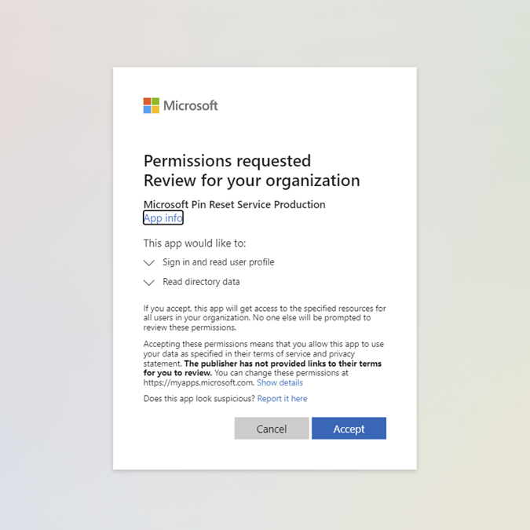
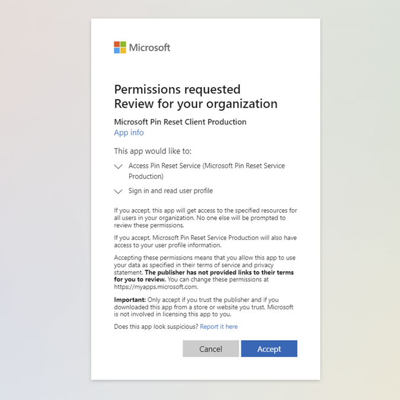

# PIN reset

Windows Hello for Business provides the capability for users to reset forgotten PINs using the *I forgot my PIN* link from the Sign-in options page in *Settings* or from the Windows lock screen. Users are required to authenticate and complete multi-factor authentication to reset their PIN.

There are two forms of PIN reset:

- **Destructive PIN reset**: with this option, the user's existing PIN and underlying credentials, including any keys or certificates added to their Windows Hello container, are deleted from the client and a new login key and PIN are provisioned. Destructive PIN reset is the default option, and doesn't require configuration.
- **Non-destructive PIN reset**: with this option, the user's Windows Hello for Business container and keys are preserved, but the user's PIN that they use to authorize key usage is changed. For non-destructive PIN reset, you must deploy the **Microsoft PIN Reset Service** and configure your clients' policy to enable the **PIN Recovery** feature.
## Using PIN reset

There are two forms of PIN reset called destructive and non-destructive. Destructive PIN reset is the default and doesn't require configuration. During a destructive PIN reset, the user's existing PIN and underlying credentials, including any keys or certificates added to their Windows Hello container, will be deleted from the client and a new logon key and PIN are provisioned. For non-destructive PIN reset, you must deploy the Microsoft PIN reset service and client policy to enable the PIN recovery feature. During a non-destructive PIN reset, the user's Windows Hello for Business container and keys are preserved, but the user's PIN that they use to authorize key usage is changed.

Destructive and non-destructive PIN reset use the same steps for initiating a PIN reset. If users have forgotten their PINs, but have an alternate sign-in method, they can navigate to Sign-in options in *Settings* and initiate a PIN reset from the PIN options. If users don't have an alternate way to sign into their devices, PIN reset can also be initiated from the Windows lock screen in the PIN credential provider.

>[!IMPORTANT]
>For hybrid Azure AD-joined devices, users must have corporate network connectivity to domain controllers to complete destructive PIN reset. If AD FS is being used for certificate trust or for on-premises only deployments, users must also have corporate network connectivity to federation services to reset their PIN.

### Reset PIN from Settings

1. Sign-in to Windows 10 using an alternate credential.
1. Open **Settings**, select **Accounts** > **Sign-in options**.
1. Select **PIN (Windows Hello)** > **I forgot my PIN** and follow the instructions.

### Reset PIN above the Lock Screen

For Azure AD-joined devices:

1. If the PIN credential provider isn't selected, expand the **Sign-in options** link, and select the PIN pad icon.
1. Select **I forgot my PIN** from the PIN credential provider.
1. Select an authentication option from the list of presented options. This list will be based on the different authentication methods enabled in your tenant (like Password, PIN, Security key).
1. Follow the instructions provided by the provisioning process.
1. When finished, unlock your desktop using your newly created PIN.

For Hybrid Azure AD-joined devices:

1. If the PIN credential provider isn't selected, expand the **Sign-in options** link, and select the PIN pad icon.
1. Select **I forgot my PIN** from the PIN credential provider.
1. Enter your password and press enter.
1. Follow the instructions provided by the provisioning process.
1. When finished, unlock your desktop using your newly created PIN.

> [!NOTE]
> Key trust on hybrid Azure AD-joined devices does not support destructive PIN reset from above the Lock Screen. This is due to the sync delay between when a user provisions their Windows Hello for Business credential and being able to use it for sign-in. For this deployment model, you must deploy non-destructive PIN reset for above lock PIN reset to work.

You may find that PIN reset from settings only works post login. Also, the lock screen PIN reset function won't work if you have any matching limitation of self-service password reset from the lock screen. For more information, see [Enable Azure Active Directory self-service password reset at the Windows sign-in screen - General ](/azure/active-directory/authentication/howto-sspr-windows#general-limitations).

## Non-Destructive PIN reset

**Requirements:**

- Azure Active Directory
- Windows Enterprise and Pro editions. There's no licensing requirement for this feature.
- Hybrid Windows Hello for Business deployment
- Azure AD registered, Azure AD joined, and Hybrid Azure AD joined

When non-destructive PIN reset is enabled on a client, a 256-bit AES key is generated locally. The key is added to a user's Windows Hello for Business container and keys as the PIN reset protector. This PIN reset protector is encrypted using a public key retrieved from the Microsoft PIN reset service and then stored on the client for later use during PIN reset. After a user initiates a PIN reset, completes authentication and multi-factor authentication to Azure AD, the encrypted PIN reset protector is sent to the Microsoft PIN reset service, decrypted, and returned to the client. The decrypted PIN reset protector is used to change the PIN used to authorize Windows Hello for Business keys and it's then cleared from memory.

Using Group Policy, Microsoft Intune or a compatible MDM solution, you can configure Windows devices to securely use the **Microsoft PIN Reset Service** which enables users to reset their forgotten PIN without requiring re-enrollment.

>[!IMPORTANT]
> The Microsoft PIN Reset service is not currently available in Azure Government.

### Summary

|Category|Destructive PIN Reset|Non-Destructive PIN Reset|
|--- |--- |--- |
|**Functionality**|The user's existing PIN and underlying credentials, including any keys or certificates added to their Windows Hello container, will be deleted from the client and a new logon key and PIN are provisioned.|You must deploy the Microsoft PIN reset service and client policy to enable the PIN recovery feature. For more information on how to deploy the Microsoft PIN reset service and client policy, see [Connect Azure Active Directory with the PIN reset service](#connect-azure-active-directory-with-the-pin-reset-service). During a non-destructive PIN reset, the user's Windows Hello for Business container and keys are preserved, but the user's PIN that they use to authorize key usage is changed.|
|**Windows editions and versions**| Windows Enterprise and Pro editions.|
|**Azure Active Directory Joined**|Cert Trust, Key Trust, and cloud Kerberos trust|Cert Trust, Key Trust, and cloud Kerberos trust|
|**Hybrid Azure Active Directory Joined**|Cert Trust and cloud Kerberos trust for both settings and above the lock support destructive PIN reset. Key Trust doesn't support this from above the lock screen. This is due to the sync delay between when a user provisions their Windows Hello for Business credential and being able to use it for sign-in. It does support from the settings page and the users must have a corporate network connectivity to the DC. |Cert Trust, Key Trust, and cloud Kerberos trust for both settings and above the lock support non-destructive PIN reset. No network connection is required for the DC.|
|**On Premises**|If ADFS is being used for on premises deployments, users must have a corporate network connectivity to federation services. |The PIN reset service relies on Azure Active Directory identities, so it's only available for Hybrid Azure Active Directory Joined and Azure Active Directory Joined devices.|
|**Additional Configuration required**|Supported by default and doesn't require configuration|Deploy the Microsoft PIN reset service and client policy to enable the PIN recovery feature On-board the Microsoft PIN reset service to respective Azure Active Directory tenant Configure Windows devices to use PIN reset using Group *Policy\MDM*.|
|**MSA/Enterprise**|MSA and Enterprise|Enterprise only.|

### Onboarding the Microsoft PIN reset service to your Intune tenant

> The **Microsoft PIN Reset Service** is not currently available in Azure Government.

### Enable the Microsoft PIN Reset Service in your Azure AD tenant

Before you can remotely reset PINs, you must register two applications in your Azure Active Directory tenant:

- PIN Reset Service
- PIN Reset Client

#### Connect Azure Active Directory with the PIN Reset Service

1. Go to the [Microsoft PIN Reset Service Production website](https://login.windows.net/common/oauth2/authorize?response_type=code&client_id=b8456c59-1230-44c7-a4a2-99b085333e84&resource=https%3A%2F%2Fgraph.windows.net&redirect_uri=https%3A%2F%2Fcred.microsoft.com&state=e9191523-6c2f-4f1d-a4f9-c36f26f89df0&prompt=admin_consent), and sign in using a Global Administrator account you use to manage your Azure Active Directory tenant.
1. After you've logged in, select **Accept** to give consent to the **PIN Reset Service** to access your organization.
   

#### Connect Azure Active Directory with the PIN Reset Client

1. Go to the [Microsoft PIN Reset Client Production website](https://login.windows.net/common/oauth2/authorize?response_type=code&client_id=9115dd05-fad5-4f9c-acc7-305d08b1b04e&resource=https%3A%2F%2Fcred.microsoft.com%2F&redirect_uri=ms-appx-web%3A%2F%2FMicrosoft.AAD.BrokerPlugin%2F9115dd05-fad5-4f9c-acc7-305d08b1b04e&state=6765f8c5-f4a7-4029-b667-46a6776ad611&prompt=admin_consent), and sign in using a Global Administrator account you use to manage your Azure Active Directory tenant.
1. After you've logged in, select **Accept** to give consent for the **PIN Reset Client** to access your organization.
   

#### Confirm that the two PIN Reset service principals are registered in your tenant

1. Sign in to the [Microsoft Entra Manager admin center](https://entra.microsoft.com).
1. Select **Azure Active Directory** > **Applications** > **Enterprise applications**.
1. Search by application name "Microsoft PIN" and both **Microsoft Pin Reset Service Production** and **Microsoft Pin Reset Client Production** will show up in the list.
   :::image type="content" alt-text="PIN reset service permissions page." source="images/pinreset/pin-reset-applications.png" lightbox="images/pinreset/pin-reset-applications-expanded.png":::

### Enable PIN Recovery on your devices

Before you can remotely reset PINs, your devices must be configured to enable PIN Recovery. Follow the instructions below to configure your devices using either Microsoft Intune, Group Policy Objects (GPO), or Configuration Service Providers (CSP).

#### [:::image type="icon" source="../../images/icons/intune.svg"::: **Intune**](#tab/intune)

You can configure Windows devices to use the **Microsoft PIN Reset Service** using Microsoft Intune.

1. Sign in to the [Microsoft Intune admin center](https://go.microsoft.com/fwlink/?linkid=2109431).
1. Select **Devices** > **Configuration profiles** > **Create profile**.
1. Enter the following properties:
    - **Platform**: Select **Windows 10 and later**.
    - **Profile type**: Select **Settings catalog**.
1. Select **Create**.
1. In **Basics**, enter the following properties:
    - **Name**: Enter a descriptive name for the profile.
    - **Description**: Enter a description for the profile. This setting is optional, but recommended.
1. Select **Next**.
1. In **Configuration settings**, select **Add settings**.
1. In the settings picker, select **Windows Hello For Business** > **Enable Pin Recovery**.
1. Configure **Enable Pin Recovery** to **true**.
1. Select **Next**.
1. In **Scope tags**, assign any applicable tags (optional).
1. Select **Next**.
1. In **Assignments**, select the security groups that will receive the policy.
1. Select **Next**.
1. In **Review + create**, review your settings and select **Create**.

>[!NOTE]
> You can also configure PIN recovery from the **Endpoint security** blade:
> 1. Sign in to the [Microsoft Intune admin center](https://go.microsoft.com/fwlink/?linkid=2109431).
> 1. Select **Endpoint security** > **Account protection** > **Create Policy**.

#### [:::image type="icon" source="../../images/icons/group-policy.svg"::: **GPO**](#tab/gpo)

You can configure Windows devices to use the **Microsoft PIN Reset Service** using a Group Policy Object (GPO).

1. Using the Group Policy Management Console (GPMC), scope a domain-based Group Policy to computer accounts in Active Directory.
1. Edit the Group Policy object from Step 1.
1. Enable the **Use PIN Recovery** policy setting located under **Computer Configuration > Administrative Templates > Windows Components > Windows Hello for Business**.
1. Close the Group Policy Management Editor to save the Group Policy object.

#### [:::image type="icon" source="../../images/icons/windows-os.svg"::: **CSP**](#tab/CSP)

You can configure Windows devices to use the **Microsoft PIN Reset Service** using the [PassportForWork CSP](/windows/client-management/mdm/passportforwork-csp).

- OMA-URI: `./Vendor/MSFT/Policy/PassportForWork/`*TenantId*`/Policies/EnablePinRecovery`
- Data type: **Boolean**
- Value: **True**

>[!NOTE]
> You must replace `TenantId` with the identifier of your Azure Active Directory tenant. To look up your Tenant ID, see [How to find your Azure Active Directory tenant ID](/azure/active-directory/fundamentals/how-to-find-tenant) or try the following, ensuring to sign-in with your organization's account::

```msgraph-interactive
GET https://graph.microsoft.com/v1.0/organization?$select=id
```

---

#### Confirm that PIN Recovery policy is enforced on the devices

The _PIN reset_ configuration can be viewed by running [**dsregcmd /status**](/azure/active-directory/devices/troubleshoot-device-dsregcmd) from the command line. This state can be found under the output in the user state section as the **CanReset** line item. If **CanReset** reports as DestructiveOnly, then only destructive PIN reset is enabled. If **CanReset** reports DestructiveAndNonDestructive, then non-destructive PIN reset is enabled.

**Sample User state Output for Destructive PIN Reset**

```console
+----------------------------------------------------------------------+
| User State                                                           |
+----------------------------------------------------------------------+

                    NgcSet : YES
                  NgcKeyId : {FA0DB076-A5D7-4844-82D8-50A2FB42EC7B}
                  CanReset : DestructiveOnly
           WorkplaceJoined : NO
             WamDefaultSet : YES
       WamDefaultAuthority : organizations
              WamDefaultId : https://login.microsoft.com
            WamDefaultGUID : { B16898C6-A148-4967-9171-64D755DA8520 } (AzureAd)

+----------------------------------------------------------------------+
```

**Sample User state Output for Non-Destructive PIN Reset**

```console
+----------------------------------------------------------------------+
| User State                                                           |
+----------------------------------------------------------------------+

                    NgcSet : YES
                  NgcKeyId : {FA0DB076-A5D7-4844-82D8-50A2FB42EC7B}
                  CanReset : DestructiveAndNonDestructive
           WorkplaceJoined : NO
             WamDefaultSet : YES
       WamDefaultAuthority : organizations
              WamDefaultId : https://login.microsoft.com
            WamDefaultGUID : { B16898C6-A148-4967-9171-64D755DA8520 } (AzureAd)

+----------------------------------------------------------------------+
```

## Configure Web Sign-in Allowed URLs for Third Party Identity Providers on Azure AD Joined Devices

**Applies to:**

- Azure AD joined devices

The [ConfigureWebSignInAllowedUrls](/windows/client-management/mdm/policy-csp-authentication#authentication-configurewebsigninallowedurls) policy allows you to specify a list of domains that can be reached during PIN reset flows on Azure AD-joined devices. If you have a federated environment and authentication is handled using AD FS or a third-party identity provider, then this policy should be set. When set, it ensures that authentication pages from that identity provider can be used during Azure AD joined PIN reset.

### Configure Web Sign-in Allowed URLs using Microsoft Intune

1. Sign in to the [Microsoft Intune admin center](https://go.microsoft.com/fwlink/?linkid=2109431)
1. Select **Devices** > **Configuration profiles** > **Create profile**
1. Enter the following properties:
    - **Platform**: Select **Windows 10 and later**
    - **Profile type**: Select **Templates**
    - In the list of templates that is loaded, select **Custom** > **Create**
1. In **Basics**, enter the following properties:
    - **Name**: Enter a descriptive name for the profile
    - **Description**: Enter a description for the profile. This setting is optional, but recommended
1. Select **Next**
1. In **Configuration settings**, select **Add** and enter the following settings:
    - Name: **Web Sign In Allowed URLs**
    - Description: **(Optional) List of domains that are allowed during PIN reset flows**
    - OMA-URI: `./Vendor/MSFT/Policy/Config/Authentication/ConfigureWebSignInAllowedUrls`
    - Data type: **String**
    - Value: Provide a semicolon delimited list of domains needed for authentication during the PIN reset scenario. An example value would be **signin.contoso.com;portal.contoso.com**
    :::image type="content" alt-text="Custom Configuration for ConfigureWebSignInAllowedUrls policy." source="images/pinreset/allowlist.png" lightbox="images/pinreset/allowlist-expanded.png":::
1. Select **Save** > **Next**
1. In **Assignments**, select the security groups that will receive the policy
1. Select **Next**
1. In **Applicability Rules**, select **Next**
1. In **Review + create**, review your settings and select **Create**

> [!NOTE]
> For Azure Government, there is a known issue with PIN reset on Azure AD Joined devices failing. When the user attempts to launch PIN reset, the PIN reset UI shows an error page that says, "We can't open that page right now." The ConfigureWebSignInAllowedUrls policy can be used to work around this issue. If you are experiencing this problem and you are using Azure US Government cloud, set **login.microsoftonline.us** as the value for the ConfigureWebSignInAllowedUrls policy.

## Related articles

- [Windows Hello for Business](hello-identity-verification.md)
- [Manage Windows Hello for Business in your organization](hello-manage-in-organization.md)
- [Why a PIN is better than a password](hello-why-pin-is-better-than-password.md)
- [Prepare people to use Windows Hello](hello-prepare-people-to-use.md)
- [Windows Hello and password changes](hello-and-password-changes.md)
- [Windows Hello errors during PIN creation](hello-errors-during-pin-creation.md)
- [Event ID 300 - Windows Hello successfully created](/windows/security/identity-protection/hello-for-business/hello-faq)
- [Windows Hello biometrics in the enterprise](hello-biometrics-in-enterprise.md)
