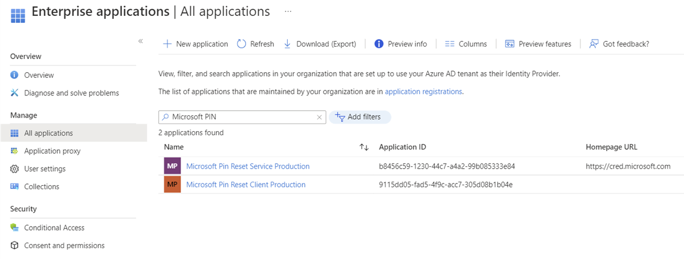

# PIN reset

**Applies to:**

- Windows 10, version 1709 or later

## Hybrid Deployments

**Requirements:**

- Azure Active Directory
- Hybrid Windows Hello for Business deployment
- Azure AD registered, Azure AD joined, and Hybrid Azure AD joined
- Windows 10, version 1709 to 1809, **Enterprise Edition**. There is no licensing requirement for this feature since version 1903.

The Microsoft PIN reset services enables you to help users recover who have forgotten their PIN.  Using Group Policy, Microsoft Intune or a compatible MDM, you can configure Windows 10 devices to securely use the Microsoft PIN reset service that enables users to reset their forgotten PIN through settings or above the lock screen without requiring re-enrollment.

>[!IMPORTANT]
> The Microsoft PIN Reset service only works with **Enterprise Edition** for Windows 10, version 1709 to 1809.  The feature works with **Enterprise Edition** and **Pro** edition with Windows 10, version 1903 and newer.

### Onboarding the Microsoft PIN reset service to your Intune tenant

Before you can remotely reset PINs, you must on-board the Microsoft PIN reset service to your Azure Active Directory tenant, and configure devices you manage.

### Connect Azure Active Directory with the PIN reset service

1. Go to the [Microsoft PIN Reset Service Production website](https://login.windows.net/common/oauth2/authorize?response_type=code&client_id=b8456c59-1230-44c7-a4a2-99b085333e84&resource=https%3A%2F%2Fgraph.windows.net&redirect_uri=https%3A%2F%2Fcred.microsoft.com&state=e9191523-6c2f-4f1d-a4f9-c36f26f89df0&prompt=admin_consent), and sign in using the Global administrator account you use to manage your Azure Active Directory tenant.
2. After you have logged in, choose **Accept** to give consent for the PIN reset service to access your account.
 
3. Go to the [Microsoft PIN Reset Client Production website](https://login.windows.net/common/oauth2/authorize?response_type=code&client_id=9115dd05-fad5-4f9c-acc7-305d08b1b04e&resource=https%3A%2F%2Fcred.microsoft.com%2F&redirect_uri=ms-appx-web%3A%2F%2FMicrosoft.AAD.BrokerPlugin%2F9115dd05-fad5-4f9c-acc7-305d08b1b04e&state=6765f8c5-f4a7-4029-b667-46a6776ad611&prompt=admin_consent), and sign in using the Global administrator account you use to manage your Azure Active Directory tenant.
4. After you have logged in, choose **Accept** to give consent for the PIN reset client to access your account.
 
> [!NOTE]
> After you have accepted the PIN reset service and client requests, you will land on a page that states "You do not have permission to view this directory or page." This behavior is expected. Be sure to confirm that the two PIN reset applications are listed for your tenant.
5. In the [Azure portal](https://portal.azure.com), verify that the Microsoft PIN Reset Service and Microsoft PIN Reset Client are integrated from the **Enterprise applications** blade. Filter to application status "Enabled" and both Microsoft Pin Reset Service Production and Microsoft Pin Reset Client Production will show up in your tenant.
 

### Configure Windows devices to use PIN reset using Group Policy

You configure Windows 10 to use the Microsoft PIN Reset service using the computer configuration portion of a Group Policy object.

1. Using the Group Policy Management Console (GPMC), scope a domain-based Group Policy to computer accounts in Active Directory.
2. Edit the Group Policy object from Step 1.
3. Enable the **Use PIN Recovery** policy setting located under **Computer Configuration > Administrative Templates > Windows Components > Windows Hello for Business**.
4. Close the Group Policy Management Editor to save the Group Policy object.  Close the GPMC.

#### Create a PIN Reset Device configuration profile using Microsoft Intune

1. Sign-in to [Endpoint Manager admin center](https://endpoint.microsoft.com/) using a Global administrator account.
2. Click **Endpoint Security** > **Account Protection** > **Properties**.
3. Set **Enable PIN recovery** to **Yes**.

> [!NOTE]
> You can also setup PIN recovery using configuration profiles.
> 1. Sign in to Endpoint Manager.
> 2. Click **Devices** > **Configuration Profiles** > Create a new profile or edit an existing profile using the Identity Protection profile type.
> 3. Set **Enable PIN recovery** to **Yes**.

#### Assign the PIN Reset Device configuration profile using Microsoft Intune

1. Sign in to the [Azure Portal](https://portal.azure.com) using a Global administrator account. 
2. Navigate to the Microsoft Intune blade. Choose **Device configuration** > **Profiles**. From the list of device configuration profiles, choose the profile that contains the PIN reset configuration.
3. In the device configuration profile, select **Assignments**.
4. Use the **Include** and/or **Exclude** tabs to target the device configuration profile to select groups.

## On-premises Deployments

**Requirements**

* Active Directory
* On-premises Windows Hello for Business deployment
* Reset from settings - Windows 10, version 1703, Professional
* Reset above Lock - Windows 10, version 1709, Professional

On-premises deployments provide users with the ability to reset forgotten PINs either through the settings page or from above the user's lock screen.  Users must know or be provided their password for authentication, must perform a second factor of authentication, and then re-provision Windows Hello for Business.

>[!IMPORTANT]
>Users must have corporate network connectivity to domain controllers and the federation service to reset their PINs.

### Reset PIN from Settings

1. Sign-in to Windows 10, version 1703 or later using an alternate credential.
2. Open **Settings**, click **Accounts**, click **Sign-in options**.
3. Under **PIN**, click **I forgot my PIN** and follow the instructions.

#### Reset PIN above the Lock Screen

 1. On Windows 10, version 1709, click **I forgot my PIN** from the Windows Sign-in
 2. Enter your password and press enter.
 3. Follow the instructions provided by the provisioning process
 4. When finished, unlock your desktop using your newly created PIN.

you may find PIN reset only works from settings post login and This lock screen PIN reset will not work if you have any matching limitation of SSPR password reset from lock screen. refer the below doc
https://docs.microsoft.com/en-us/azure/active-directory/authentication/howto-sspr-windows#general-limitations

>[!NOTE]
> Visit the [Windows Hello for Business Videos](https://docs.microsoft.com/windows/security/identity-protection/hello-for-business/hello-videos.md) page and watch the [Windows Hello for Business forgotten PIN user experience](https://docs.microsoft.com/windows/security/identity-protection/hello-for-business/hello-videos#windows-hello-for-business-forgotten-pin-user-experience) video.

## Related topics

- [Windows Hello for Business](hello-identity-verification.md)
- [Manage Windows Hello for Business in your organization](hello-manage-in-organization.md)
- [Why a PIN is better than a password](hello-why-pin-is-better-than-password.md)
- [Prepare people to use Windows Hello](hello-prepare-people-to-use.md)
- [Windows Hello and password changes](hello-and-password-changes.md)
- [Windows Hello errors during PIN creation](hello-errors-during-pin-creation.md)
- [Event ID 300 - Windows Hello successfully created](hello-event-300.md)
- [Windows Hello biometrics in the enterprise](hello-biometrics-in-enterprise.md)
