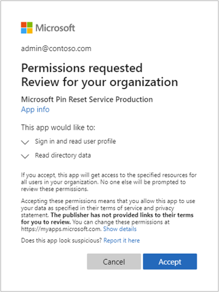

# Windows Hello for Business Features

**Applies to:**
-   Windows 10

Consider these additional features you can use after your organization deploys Windows Hello for Business. 

- [Conditional access](#conditional-access)
- [Dynamic lock](#dynamic-lock)
- [PIN reset](#pin-reset)
- [Dual Enrollment](#dual-enrollment)
- [Remote Desktop with Biometrics](#remote-desktop-with-biometrics)

## Conditional access 

**Requirements:**
* Azure Active Directory  
* Hybrid Windows Hello for Business deployment 


In a mobile-first, cloud-first world, Azure Active Directory enables single sign-on to devices, applications, and services from anywhere. With the proliferation of devices (including BYOD), work off corporate networks, and 3rd party SaaS applications, IT professionals are faced with two opposing goals:+  
* Empower the end users to be productive wherever and whenever
* Protect the corporate assets at any time
 
To improve productivity, Azure Active Directory provides your users with a broad range of options to access your corporate assets. With application access management, Azure Active Directory enables you to ensure that only the right people can access your applications. What if you want to have more control over how the right people are accessing your resources under certain conditions? What if you even have conditions under which you want to block access to certain applications even for the right people? For example, it might be OK for you if the right people are accessing certain applications from a trusted network; however, you might not want them to access these applications from a network you don't trust. You can address these questions using conditional access.

Read [Conditional access in Azure Active Directory](https://docs.microsoft.com/azure/active-directory/active-directory-conditional-access-azure-portal) to learn more about Conditional Access.  Afterwards, read [Getting started with conditional access in Azure Active Directory](https://docs.microsoft.com/azure/active-directory/active-directory-conditional-access-azure-portal-get-started) to start deploying Conditional access.

## Dynamic lock

**Requirements:**
* Windows 10, version 1703

Dynamic lock enables you to configure Windows 10 devices to automatically lock when Bluetooth paired device signal falls below the maximum Received Signal Strength Indicator (RSSI) value.  You configure the dynamic lock policy using Group Policy.  You can locate the policy setting at **Computer Configuration\Administrative Templates\Windows Components\Windows Hello for Business**.  The name of the policy is **Configure dynamic lock factors**.

The Group Policy Editor, when the policy is enabled, creates a default signal rule policy with the following value:

>[!IMPORTANT]
>Microsoft recommends using the default values for this policy settings.  Measurements are relative based on the varying conditions of each environment.  Therefore, the same values may produce different results. Test policy settings in each environment prior to broadly deploying the setting. 

```
<rule schemaVersion="1.0"> 
	<signal type="bluetooth" scenario="Dynamic Lock" classOfDevice="512" rssiMin="-10" rssiMaxDelta="-10"/> 
</rule>
```

For this policy setting, the **type** and **scenario** attribute values are static and cannot change.  The **classofDevice** attribute defaults Phones and uses the values from the following table 

|Description|Value|
|:-------------|:-------:|
|Miscellaneous|0|
|Computer|256|
|Phone|512|
|LAN/Network Access Point|768|
|Audio/Video|1024|
|Peripheral|1280|
|Imaging|1536|
|Wearable|1792|
|Toy|2048|
|Health|2304|
|Uncategorized|7936|

The **rssiMin** attribute value signal indicates the strength needed for the device to be considered "in-range".  The default value of **-10** enables a user to move about an average size office or cubicle without triggering Windows to lock the device.  The **rssiMaxDelta** has a default value of **-10**, which instruct Windows 10 to lock the device once the signal strength weakens by more than measurement of 10.  

RSSI measurements are relative and lower as the bluetooth signals between the two paired devices reduces. Therefore a measurement of 0 is stronger than -10, which is stronger than -60, which is an indicator the devices are moving further apart from each other.

## PIN reset

**Applies to:**
-   Windows 10, version 1709 or later


### Hybrid Deployments

**Requirements:**
- Azure Active Directory
- Hybrid Windows Hello for Business deployment
- Azure AD registered, Azure AD joined, and Hybrid Azure AD joined
- Windows 10, version 1709 or later, **Enterprise Edition**
 
The Microsoft PIN reset services enables you to help users who have forgotten their PIN.  Using Group Policy, Microsoft Intune or a compatible MDM, you can configure Windows 10 devices to securely use the Microsoft PIN reset service that enables users to reset their forgotten PIN through settings or above the lock screen without requiring re-enrollment.

>[!IMPORTANT]
> The Microsoft PIN Reset service only works with Windows 10, version 1709 or later **Enterprise Edition**.  The feature does not work with the **Pro** edition.]

#### Onboarding the Microsoft PIN reset service to your Intune tenant

Before you can remotely reset PINs, you must on-board the Microsoft PIN reset service to your Azure Active Directory tenant, and configure devices you manage. 

#### Connect Azure Active Directory with the PIN reset service

1. Visit [Microsoft PIN Reset Service Integration website](https://login.windows.net/common/oauth2/authorize?response_type=code&client_id=b8456c59-1230-44c7-a4a2-99b085333e84&resource=https%3A%2F%2Fgraph.windows.net&redirect_uri=https%3A%2F%2Fcred.microsoft.com&state=e9191523-6c2f-4f1d-a4f9-c36f26f89df0&prompt=admin_consent), and sign in using the tenant administrator account you use to manage your Azure Active Directory tenant.
2. After you log in, click **Accept** to give consent for the PIN reset service to access your account.<br>
<br>
3. In the Azure portal, you can verify that the Microsoft PIN reset service is integrated from the **Enterprise applications**, **All applications** blade.<br>


#### Configure Windows devices to use PIN reset using Group Policy
You configure Windows 10 to use the Microsoft PIN Reset service using the computer configuration portion of a Group Policy object. 

1. Using the Group Policy Management Console (GPMC), scope a domain-based Group Policy to computer accounts in Active Directory.
2. Edit the Group Policy object from step 1.
3. Enable the **Use PIN Recovery** policy setting located under **Computer Configuration->Administrative Templates->Windows Components->Windows Hello for Business**.
4. Close the Group Policy Management Editor to save the Group Policy object.  Close the GPMC. 

#### Configure Windows devices to use PIN reset using Microsoft Intune
To configure PIN reset on Windows devices you manage, use an [Intune Windows 10 custom device policy](https://docs.microsoft.com/intune/custom-settings-windows-10) to enable the feature. Configure the policy using the following Windows policy configuration service provider (CSP):

##### Create a PIN Reset Device configuration profile using Microsoft Intune

1. Sign-in to [Azure Portal](https://portal.azure.com) using a tenant administrator account. 
2. You need your tenant ID to complete the following task.  You can discovery your tenant ID viewing the **Properties** of your Azure Active Directory from the Azure Portal.  You can also use the following command in a command Window on any Azure AD joined or hybrid Azure AD joined computer.</br>
```
dsregcmd /status | findstr -snip "tenantid"
```
3. Navigate to the Microsoft Intune blade. Click **Device configuration**. Click **Profiles**. Click **Create profile**.
4. Type **Use PIN Recovery** in the **Name** field. Select **Windows 10 and later** from the **Platform** list.  Select **Custom** from the **Profile type** list.
5. In the **Custom OMA-URI Settings** blade, Click **Add**.
6. In the **Add Row** blade, type **PIN Reset Settings** in the **Name** field. In the **OMA-URI** field, type **./Device/Vendor/MSFT/PassportForWork/*tenant ID*/Policies/EnablePinRecovery** where <b>*tenant ID*</b> is your Azure Active Directory tenant ID from step 2.
7. Select **Boolean** from the **Data type** list and select **True** from the **Value** list.
8. Click **OK** to save the row configuration. Click **OK** to close the **Custom OMA-URI Settings blade.  Click **Create** to save the profile.
 
##### Assign the PIN Reset Device configuration profile using Microsoft Intune
1. Sign-in to [Azure Portal](https://portal.azure.com) using a tenant administrator account. 
2. Navigate to the Microsoft Intune blade. Click **Device configuration**. Click **Profiles**. From the list of device configuration profiles, click the profile that contains the PIN reset configuration.
3. In the device configuration profile, click **Assignments**.
4. Use the **Include** and/or **Exclude** tabs to target the device configuration profile to select groups.

### On-premises Deployments

** Requirements**
* Active Directory
* On-premises Windows Hello for Business deployment
* Reset from settings - Windows 10, version 1703, Professional
* Reset above Lock - Windows 10, version 1709, Professional

On-premises deployments provide users with the ability to reset forgotten PINs either through the settings page or from above the user's lock screen.  Users must know or be provided their password for authentication, must perform a second factor of authentication, and then re-provision Windows Hello for Business.

>[!IMPORTANT]
>Users must have corporate network connectivity to domain controllers and the federation service to reset their PINs.

#### Reset PIN from Settings
1. Sign-in to Windows 10, version 1703 or later using an alternate credential.
2. Open **Settings**, click **Accounts**, click **Sign-in options**.
3. Under **PIN**, click **I forgot my PIN** and follow the instructions.

#### Reset PIN above the Lock Screen
 1. On Windows 10, version 1709, click **I forgot my PIN** from the Windows Sign-in
 2. Enter your password and press enter.
 3. Follow the instructions provided by the provisioning process
 4. When finished, unlock your desktop using your newly created PIN.

>[!NOTE]
> Visit the [Windows Hello for Business Videos](https://docs.microsoft.com/windows/security/identity-protection/hello-for-business/hello-videos.md) page and watch the [Windows Hello for Business forgotten PIN user experience](https://docs.microsoft.com/windows/security/identity-protection/hello-for-business/hello-videos#windows-hello-for-business-forgotten-pin-user-experience) video.

## Dual Enrollment

**Requirements**
* Hybrid and On-premises Windows Hello for Business deployments
* Enterprise Joined or Hybrid Azure joined devices
* Windows 10, version 1709

> [!NOTE]
> This feature was previously known as **Privileged Credential** but was renamed to **Dual Enrollment** to prevent any confusion with the **Privileged Access Workstation** feature.

> [!IMPORTANT]
> Dual enrollment does not replace or provide the same security as Privileged Access Workstations feature.  Microsoft encourages enterprises to use the Privileged Access Workstations for their privileged credential users.  Enterprises can consider Windows Hello for Business dual enrollment in situations where the Privileged Access feature cannot be used.  Read [Privileged Access Workstations](https://docs.microsoft.com/windows-server/identity/securing-privileged-access/privileged-access-workstations) for more information.

Dual enrollment enables administrators to perform elevated, administrative functions by enrolling both their non-privileged and privileged credentials on their device.

By design, Windows 10 does not enumerate all Windows Hello for Business users from within a user's session.  Using the computer Group Policy setting, **Allow enumeration of emulated smart card for all users**, you can configure a device to enumerate all enrolled Windows Hello for Business credentials on selected devices. 

With this setting, administrative users can sign-in to Windows 10, version 1709 using their non-privileged Windows Hello for Business credentials for normal work flow such as email, but can launch Microsoft Management Consoles (MMCs), Remote Desktop Services clients, and other applications by selecting **Run as different user** or **Run as administrator**, selecting the privileged user account, and providing their PIN.  Administrators can also take advantage of this feature with command line applications by using **runas.exe** combined with the **/smartcard** argument.  This enables administrators to perform their day-to-day operations without needing to sign-in and out, or use fast user switching when alternating between privileged and non-privileged workloads.

> [!IMPORTANT]
> You must configure a Windows 10 computer for Windows Hello for Business dual enrollment before either user (privileged or non-privileged) provisions Windows Hello for Business.  Dual enrollment is a special setting that is configured on the Windows Hello container during creation.

### Configure Windows Hello for Business Dual Enroll
In this task you will 
- Configure Active Directory to support Domain Administrator enrollment
- Configure Dual Enrollment using Group Policy

#### Configure Active Directory to support Domain Administrator enrollment
The designed Windows for Business configuration has you give the **Key Admins** (or **KeyCredential Admins** when using domain controllers prior to Windows Server 2016) group read and write permissions to the msDS-KeyCredentialsLink attribute.  You provided these permissions at root of the domain and use object inheritance to ensure the permissions apply to all users in the domain regardless of their location within the domain hierarchy.

Active Directory Domain Services uses AdminSDHolder to secure privileged users and groups from unintentional modification by comparing and replacing the security on privileged users and groups to match those defined on the AdminSDHolder object on an hourly cycle. For Windows Hello for Business, your domain administrator account may receive the permissions but will they will disappear from the user object unless you give the AdminSDHolder read and write permissions to the msDS-KeyCredential attribute.

Sign-in to a domain controller or management workstation with access equivalent to _domain administrator_.

1. Type the following command to add the **allow** read and write property permissions for msDS-KeyCredentialLink attribute for the **Key Admins** (or **KeyCredential Admins**) group on the AdminSDHolder object.</br>
```dsacls "CN=AdminSDHolder,CN=System,DC=domain,DC=com" /g "[domainName\keyAdminGroup]":RPWP;msDS-KeyCredentialLink```</br>
where **DC=domain,DC=com** is the LDAP path of your Active Directory domain and **domainName\keyAdminGroup]** is the NetBIOS name of your domain and the name of the group you use to give access to keys based on your deployment.  For example:</br>
```dsacls "CN=AdminSDHolder,CN=System,DC=corp,DC=mstepdemo,DC=net" /g "mstepdemo\Key Admins":RPWP;msDS-KeyCredentialLink```
2. To trigger security descriptor propagation, open **ldp.exe**.
3. Click **Connection** and select **Connect...**  Next to **Server**, type the name of the domain controller that holds the PDC role for the domain. Next to **Port**, type **389** and click **OK**.
4. Click **Connection** and select **Bind...**  Click **OK** to bind as the currently signed-in user.
5. Click **Browser** and select **Modify**.  Leave the **DN** text box blank.  Next to **Attribute**, type **RunProtectAdminGroupsTask**. Next to **Values**, type **1**.  Click **Enter** to add this to the **Entry List**.
6. Click **Run** to start the task.
7. Close LDP.  

#### Configuring Dual Enrollment using Group Policy
You configure Windows 10 to support dual enrollment using the computer configuration portion of a Group Policy object.

1. Using the Group Policy Management Console (GPMC), create a new domain-based Group Policy object and link it to an organizational Unit that contains Active Directory computer objects used by privileged users.
2. Edit the Group Policy object from step 1.
3. Enable the **Allow enumeration of emulated smart cards for all users** policy setting located under **Computer Configuration->Administrative Templates->Windows Components->Windows Hello for Business**.
4. Close the Group Policy Management Editor to save the Group Policy object.  Close the GPMC.
5. Restart computers targeted by this Group Policy object. 

The computer is ready for dual enrollment.  Sign-in as the privileged user first and enroll for Windows Hello for Business. Once completed, sign-out and sign-in as the non-privileged user and enroll for Windows Hello for Business.  You can now use your privileged credential to perform privileged tasks without using your password and without needing to switch users.

## Remote Desktop with Biometrics 

> [!Warning]
> Some information relates to pre-released product that may change before it is commercially released.  Microsoft makes no warranties, express or implied, with respect to the information provided here. 

**Requirements**
- Hybrid and On-premises Windows Hello for Business deployments
- Azure AD joined, Hybrid Azure AD joined, and Enterprise joined devices
- Certificate trust deployments
- Biometric enrollments
- Windows 10, version 1809

Users using earlier versions of Windows 10 could remote desktop to using Windows Hello for Business but were limited to the using their PIN as their authentication gesture.  Windows 10, version 1809 introduces the ability for users to authenticate to a remote desktop session using their Windows Hello for Business biometric gesture.  The feature is on by default, so your users can take advantage of it as soon as they upgrade to Windows 10, version 1809.

> [!IMPORTANT]
> The remote desktop with biometrics feature only works with certificate trust deployments.  The feature takes advantage of the redirected smart card capabilities of the remote desktop protocol.  Microsoft continues to investigate supporting this feature for key trust deployments.

### How does it work 
It start with creating cryptographic keys.  Windows generates and stores cryptographic keys using a software component called a key storage provider (KSP).  Software-based keys are created and stored using the Microsoft Software Key Storage Provider.  Smart card keys are created and stored using the Microsoft Smart Card Key Storage Provider.  Keys created and protected by Windows Hello for Business are created and stored using the Microsoft Passport Key Storage Provider.

A certificate on a smart card starts with creating an asymmetric key pair using the Microsoft Smart Card KSP.  Windows requests a certificate based on the key pair from your enterprises issuing certificate authority, which returns a certificate that is stored in the user's Personal certificate store.  The private key remains on the smart card and the public key is stored with the certificate.  Metadata on the certificate (and the key) store the key storage provider used to create the key (remember the certificate contains the public key). 

This same concept applies to Windows Hello for Business. Except, the keys are created using the Microsoft Passport KSP and the user's private key remains protected by the device's security module (TPM) and the user's gesture (PIN/biometric).  The certificate APIs hide this complexity.  When an application uses a certificate, the certificate APIs locate the keys using the saved key storage provider.  The key storage providers directs the certificate APIs on which provider they use to find the private key associated with the certificate.  This is how Windows knows you have a smart card certificate without the smart card inserted (and prompts you to insert the smart card). 

Windows Hello for Business emulates a smart card for application compatibility.  Versions of Windows 10 prior to version 1809, would redirect private key access for Windows Hello for Business certificate to use its emulated smart card using the Microsoft Smart Card KSP, which would enable the user to provide their PIN.  Windows 10, version 1809 no longer redirects private key access for Windows Hello for Business certificates to the Microsoft Smart Card KSP-- it continues using the Microsoft Passport KSP. The Microsoft Passport KSP enabled Windows 10 to prompt the user for their biometric gesture or PIN. 

### Compatibility
Users appreciate convenience of biometrics and administrators value the security however, you may experience compatibility issues with your applications and Windows Hello for Business certificates.  You can relax knowing a Group Policy setting and a [MDM URI](https://docs.microsoft.com/windows/client-management/mdm/passportforwork-csp) exist to help you revert to the previous behavior for those users who need it.


> [!IMPORTANT]
> The remote desktop with biometric feature does not work with [Dual Enrollment](#dual-enrollment) feature or scenarios where the user provides alternative credentials.  Microsoft continues to investigate supporting the feature.\

## Related topics

- [Windows Hello for Business](hello-identity-verification.md)
- [Manage Windows Hello for Business in your organization](hello-manage-in-organization.md)
- [Why a PIN is better than a password](hello-why-pin-is-better-than-password.md)
- [Prepare people to use Windows Hello](hello-prepare-people-to-use.md)
- [Windows Hello and password changes](hello-and-password-changes.md)
- [Windows Hello errors during PIN creation](hello-errors-during-pin-creation.md)
- [Event ID 300 - Windows Hello successfully created](hello-event-300.md)
- [Windows Hello biometrics in the enterprise](hello-biometrics-in-enterprise.md)
