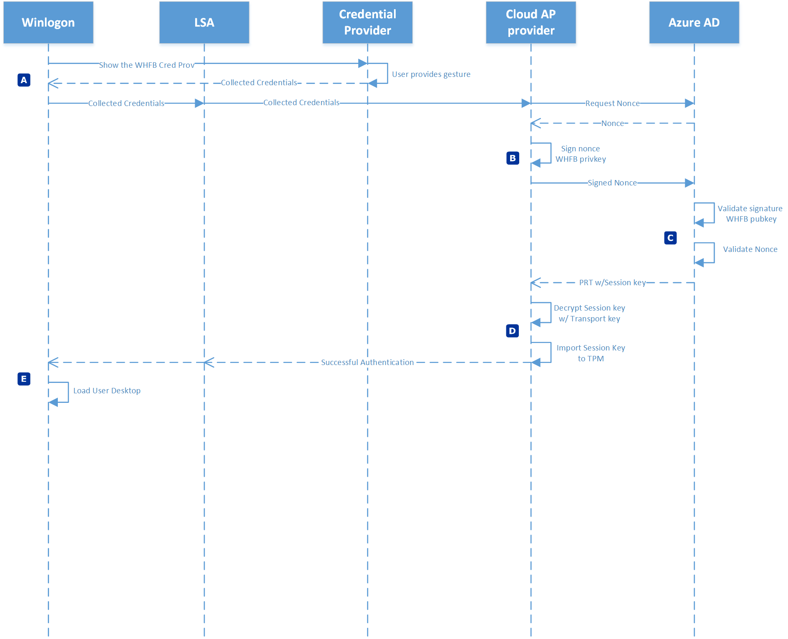
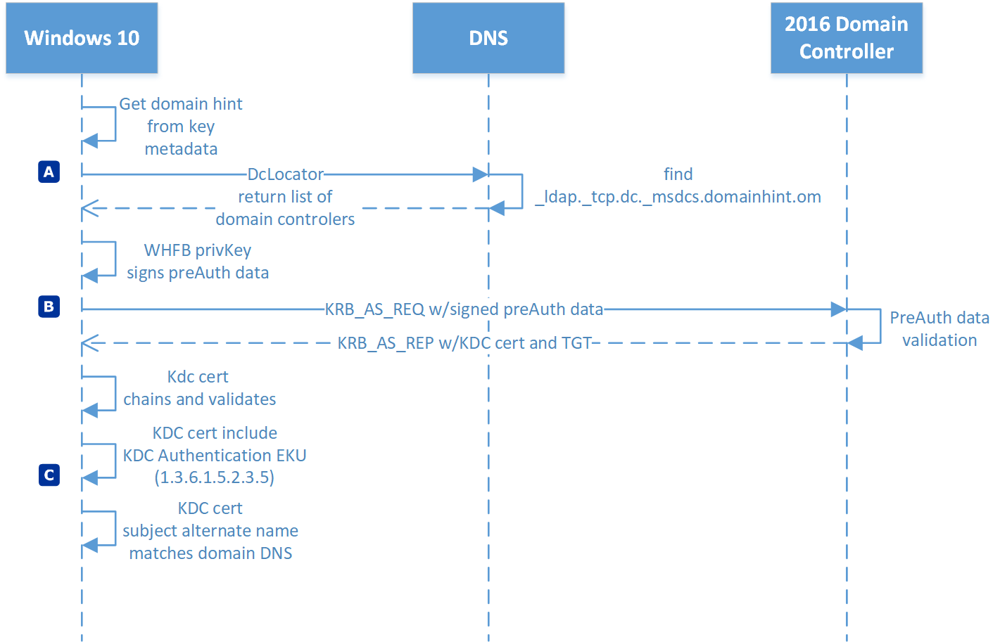
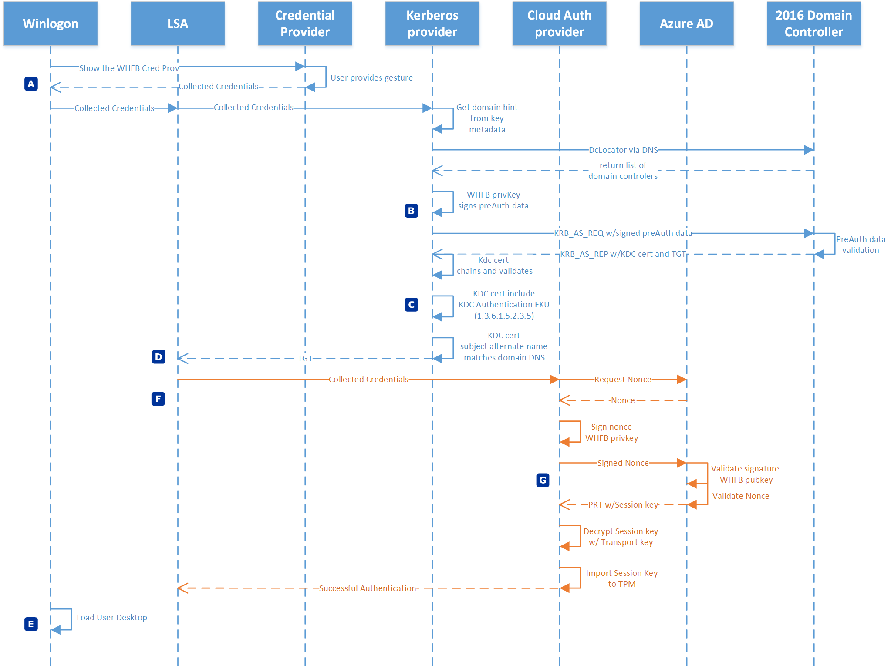
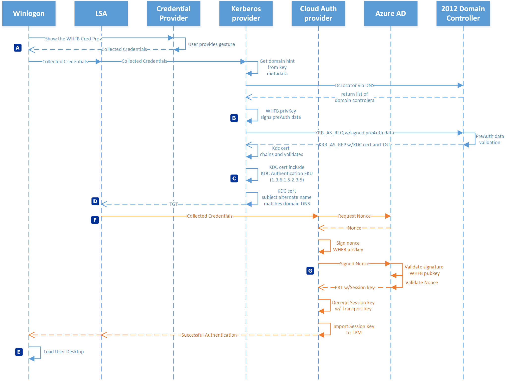

# Windows Hello for Business and Authentication

**Applies to:**
-   Windows 10

Windows Hello for Business authentication is passwordless, two-factor authentication.  Authenticating with Windows Hello for Business provides a convenient sign-in experience that authenticates the user to both Azure Active Directory and Active Directory resources. 
Azure Active Directory joined devices authenticate to Azure during sign-in and can optional authenticate to Active Directory.  Hybrid Azure Active Directory joined devices authenticate to Active Directory during sign-in, and authenticate to Azure Active Directory in the background. 

[Azure AD join authentication to Azure Active Directory](#azure-ad-join-authentication-to-azure-active-directory) 
[Azure AD join authentication to Active Directory using a Key](#azure-ad-join-authentication-to-active-directory-using-a-key) 
[Azure AD join authentication to Active Directory using a Certificate](#azure-ad-join-authentication-to-active-directory-using-a-certificate) 
[Hybrid Azure AD join authentication using a Key](#hybrid-azure-ad-join-authentication-using-a-key) 
[Hybrid Azure AD join authentication using a Certificate](#hybrid-azure-ad-join-authentication-using-a-certificate) 

## Azure AD join authentication to Azure Active Directory

| Phase  | Description  |
| :----: | :----------- |
|A | Authentication begins when the users dismisses the lock screen, which triggers winlogon to show the Windows Hello for Business credential provider.  The user provides their Windows Hello gesture (PIN or biometrics).  The credential provider packages these credentials and returns them to winlogon.  Winlogon passes the collected credentials to lsass. Lsass passes the collected credentials to the Cloud Authentication security support provider, referred to as the Cloud AP provider.| 
|B | The Cloud AP provider requests a nonce from Azure Active Directory.  Azure AD returns a nonce. The Cloud AP provider signs the nonce using the user's private key and returns the signed nonce to the Azure Active Directory.|
|C | Azure Active Directory validates the signed nonce using the user's securely registered public key against the nonce signature.  After validating the signature, Azure AD then validates the returned signed nonce. After validating the nonce, Azure AD creates a PRT with session key that is encrypted to the device's transport key and returns it to the Cloud AP provider.|
|D | The Cloud AP provider receives the encrypted PRT with session key.  Using the device's private transport key, the Cloud AP provider decrypt the session key and protects the session key using the device's TPM.|
|E | The Cloud AP provider returns a successful authentication response to lsass. Lsass caches the PRT, and informs winlogon of the success authentication.  Winlogon creates a logon session, loads the user's profile, and starts explorer.exe.| 

## Azure AD join authentication to Active Directory using a Key

| Phase  | Description  |
| :----: | :----------- |
|A | Authentication to Active Directory from a Azure AD joined device begins with the user first attempts to use a resource that needs Kerberos authentication.  The Kerberos security support provider, hosted in lsass, uses metadata from the Windows Hello for Business key to get a hint of the user's domain.  Using the hint, the provider uses the DClocator service to locate a 2016 domain controller. After the provider locates an active 2016 domain controller, the provider uses the private key to sign the Kerberos pre-authentication data.|
|B | The Kerberos provider sends the signed pre-authentication data and its public key (in the form of a self-signed certificate) to the Key Distribution Center (KDC) service running on the 2016 domain controller in the form of a KERB_AS_REQ. The 2016 domain controller determines the certificate is a self-signed certificate.  It retrieves the public key from the certificate included in the KERB_AS_REQ and searches for the public key in Active Directory.  It validates the UPN for authentication request matches the UPN registered in Active Directory and validates the signed pre-authentication data using the public key from Active Directory.  On success, the KDC returns a TGT to the client with its certificate in a KERB_AS_REP.|
|C | The Kerberos provider ensures it can trust the response from the domain controller. First, it ensures the KDC certificate chains to a root certificate that is trusted by the device.  Next, it ensures the certificate is within its validity period and that it has not be revoked.  The Kerberos provider then verifies the certificate has the KDC Authentication present and that the subject alternate name listed in the KDC's certificate matches the domain name to which the user is authenticating. After passing this criteria, Kerberos returns the TGT to lsass, where it is cached and used for subsequent service ticket requests.|

## Azure AD join authentication to Active Directory using a Certificate

| Phase  | Description  |
| :----: | :----------- |
|A | Authentication to Active Directory from a Azure AD joined device begins with the user first attempts to use a resource that needs Kerberos authentication.  The Kerberos security support provider, hosted in lsass, uses information from the certificate to get a hint of the user's domain. Kerberos can use the distinguished name of the user found in the subject of the certificate, or it can use the user principal name of the user found in the subject alternate name of the certificate.  Using the hint, the provider uses the DClocator service to locate a domain controller. After the provider locates an active domain controller, the provider use the private key to sign the Kerberos pre-authentication data.|
|B | The Kerberos provider sends the signed pre-authentication data and  user's certificate, which includes the public key, to the Key Distribution Center (KDC) service running on the domain controller in the form of a KERB_AS_REQ. The domain controller determines the certificate is not self-signed certificate.  The domain controller ensures the certificate chains to trusted root certificate, is within its validity period, can be used for authentication, and has not been revoked.  It retrieves the public key and UPN from the certificate included in the KERB_AS_REQ and searches for the UPN in Active Directory.  It validates the signed pre-authentication data using the public key from the certificate.  On success, the KDC returns a TGT to the client with its certificate in a KERB_AS_REP.|
|C | The Kerberos provider ensures it can trust the response from the domain controller. First, it ensures the KDC certificate chains to a root certificate that is trusted by the device.  Next, it ensures the certificate is within its validity period and that it has not be revoked.  The Kerberos provider then verifies the certificate has the KDC Authentication present and that the subject alternate name listed in the KDC's certificate matches the domain name to which the user is authenticating. After passing this criteria, Kerberos returns the TGT to lsass, where it is cached and used for subsequent service ticket requests.|

## Hybrid Azure AD join authentication using a Key

| Phase  | Description  |
| :----: | :----------- |
|A | Authentication begins when the users dismisses the lock screen, which triggers winlogon to show the Windows Hello for Business credential provider.  The user provides their Windows Hello gesture (PIN or biometrics).  The credential provider packages these credentials and returns them to winlogon.  Winlogon passes the collected credentials to lsass. Lsass passes the collected credentials to the Kerberos security support provider.  The Kerberos provider gets domain hints from the domain joined workstation to locate a domain controller for the user.|
|B | The Kerberos provider sends the signed pre-authentication data and the user's public key (in the form of a self-signed certificate) to the Key Distribution Center (KDC) service running on the 2016 domain controller in the form of a KERB_AS_REQ. The 2016 domain controller determines the certificate is a self-signed certificate.  It retrieves the public key from the certificate included in the KERB_AS_REQ and searches for the public key in Active Directory.  It validates the UPN for authentication request matches the UPN registered in Active Directory and validates the signed pre-authentication data using the public key from Active Directory.  On success, the KDC returns a TGT to the client with its certificate in a KERB_AS_REP.| 
|C | The Kerberos provider ensures it can trust the response from the domain controller. First, it ensures the KDC certificate chains to a root certificate that is trusted by the device.  Next, it ensures the certificate is within its validity period and that it has not be revoked.  The Kerberos provider then verifies the certificate has the KDC Authentication present and that the subject alternate name listed in the KDC's certificate matches the domain name to which the user is authenticating. 
|D | After passing this criteria, Kerberos returns the TGT to lsass, where it is cached and used for subsequent service ticket requests.|
|E | Lsass informs winlogon of the success authentication.  Winlogon creates a logon session, loads the user's profile, and starts explorer.exe.|
|F | While Windows loads the user's desktop, lsass passes the collected credentials to the Cloud Authentication security support provider, referred to as the Cloud AP provider.  The Cloud AP provider requests a nonce from Azure Active Directory.  Azure AD returns a nonce.|
|G |  The Cloud AP provider signs the nonce using the user's private key and returns the signed nonce to the Azure Active Directory.  Azure Active Directory validates the signed nonce using the user's securely registered public key against the nonce signature.  After validating the signature, Azure AD then validates the returned signed nonce. After validating the nonce, Azure AD creates a PRT with session key that is encrypted to the device's transport key and returns it to the Cloud AP provider. The Cloud AP provider receives the encrypted PRT with session key.  Using the device's private transport key, the Cloud AP provider decrypt the session key and protects the session key using the device's TPM. The Cloud AP provider returns a successful authentication response to lsass. Lsass caches the PRT.|

## Hybrid Azure AD join authentication using a Certificate

| Phase  | Description  |
| :----: | :----------- |
|A | Authentication begins when the users dismisses the lock screen, which triggers winlogon to show the Windows Hello for Business credential provider.  The user provides their Windows Hello gesture (PIN or biometrics).  The credential provider packages these credentials and returns them to winlogon.  Winlogon passes the collected credentials to lsass. Lsass passes the collected credentials to the Kerberos security support provider.  The Kerberos provider gets domain hints from the domain joined workstation to locate a domain controller for the user.|
|B | The Kerberos provider sends the signed pre-authentication data and  user's certificate, which includes the public key, to the Key Distribution Center (KDC) service running on the domain controller in the form of a KERB_AS_REQ. The domain controller determines the certificate is not self-signed certificate.  The domain controller ensures the certificate chains to trusted root certificate, is within its validity period, can be used for authentication, and has not been revoked.  It retrieves the public key and UPN from the certificate included in the KERB_AS_REQ and searches for the UPN in Active Directory.  It validates the signed pre-authentication data using the public key from the certificate.  On success, the KDC returns a TGT to the client with its certificate in a KERB_AS_REP.| 
|C | The Kerberos provider ensures it can trust the response from the domain controller. First, it ensures the KDC certificate chains to a root certificate that is trusted by the device.  Next, it ensures the certificate is within its validity period and that it has not be revoked.  The Kerberos provider then verifies the certificate has the KDC Authentication present and that the subject alternate name listed in the KDC's certificate matches the domain name to which the user is authenticating. 
|D | After passing this criteria, Kerberos returns the TGT to lsass, where it is cached and used for subsequent service ticket requests.|
|E | Lsass informs winlogon of the success authentication.  Winlogon creates a logon session, loads the user's profile, and starts explorer.exe.|
|F | While Windows loads the user's desktop, lsass passes the collected credentials to the Cloud Authentication security support provider, referred to as the Cloud AP provider.  The Cloud AP provider requests a nonce from Azure Active Directory.  Azure AD returns a nonce.|
|G |  The Cloud AP provider signs the nonce using the user's private key and returns the signed nonce to the Azure Active Directory.  Azure Active Directory validates the signed nonce using the user's securely registered public key against the nonce signature.  After validating the signature, Azure AD then validates the returned signed nonce. After validating the nonce, Azure AD creates a PRT with session key that is encrypted to the device's transport key and returns it to the Cloud AP provider. The Cloud AP provider receives the encrypted PRT with session key.  Using the device's private transport key, the Cloud AP provider decrypt the session key and protects the session key using the device's TPM. The Cloud AP provider returns a successful authentication response to lsass. Lsass caches the PRT.|

