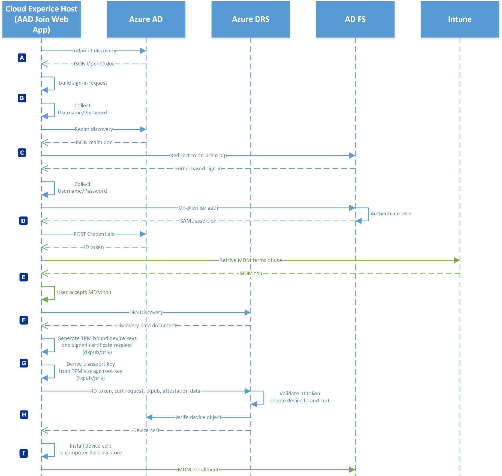
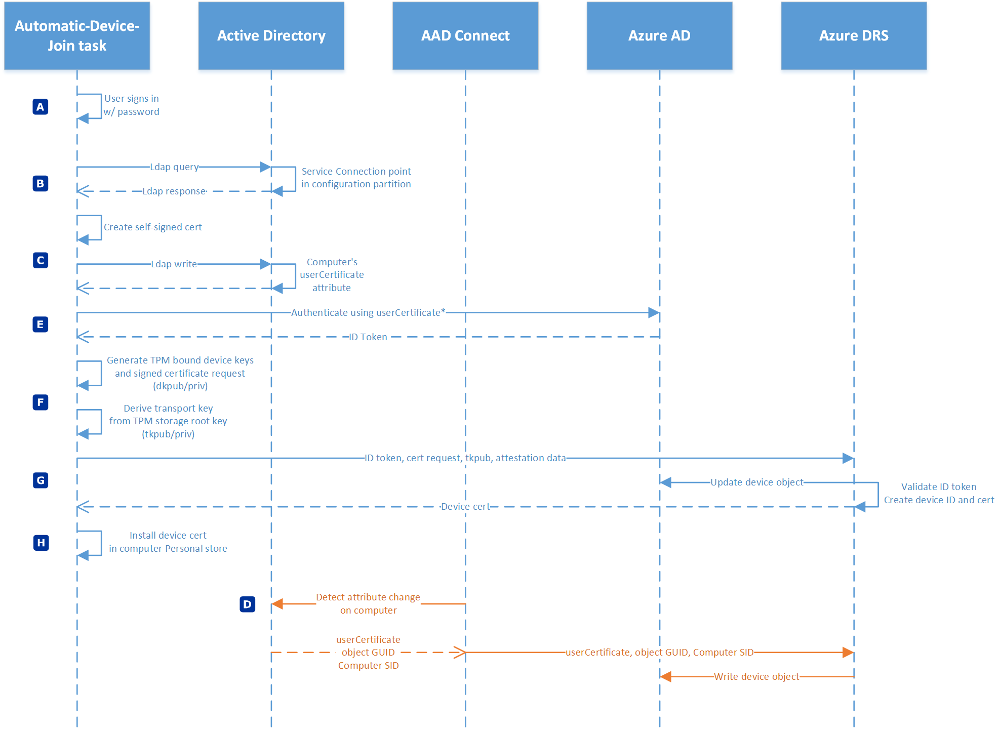
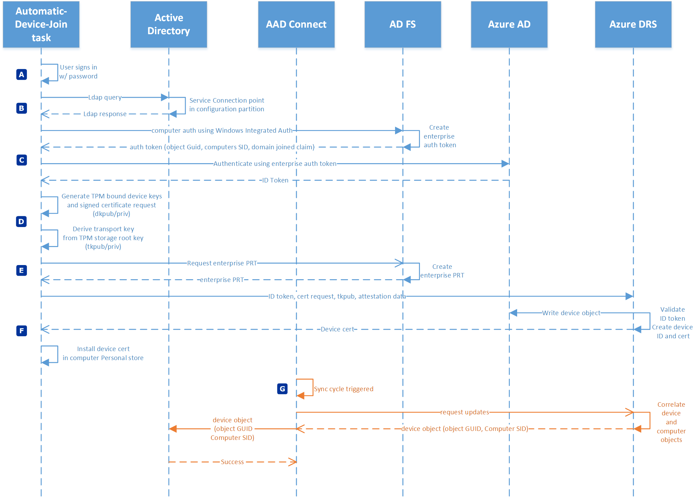

# Windows Hello for Business and Device Registration

**Applies to:**
-   Windows 10

Device Registration is a prerequisite to Windows Hello for Business provisioning.  Device registration occurs regardless of a cloud, hybrid, or on-premises deployments.  For cloud and hybrid deployments, devices register with Azure Active Directory. For on-premises deployments, devices registered with the enterprise device registration service hosted by Active Directory Federation Services (AD FS).

[Azure AD joined in Managed environments](#azure-ad-joined-in-managed-environments) 
[Azure AD joined in Federated environments](#azure-ad-joined-in-federated-environments) 
[Hybrid Azure AD joined in Managed environments](#hybrid-azure-ad-joined-in-managed-environments) 
[Hybrid Azure AD joined in Federated environments](#hybrid-azure-ad-joined-in-federated-environments) 

## Azure AD joined in Managed environments

| Phase  | Description  |
| :----: | :----------- |
|A | The most common way Azure AD joined devices register with Azure is during the out-of-box-experience (OOBE) where it loads the Azure AD join web application in the Cloud Experience Host (CXH) application.  The application sends a GET request to the Azure OpenID configuration endpoint to discover authorization endpoints.  Azure returns the OpenID configuration, which includes the authorization endpoints, to application as JSON document.|
|B | The application builds a sign-in request for the authorization end point and collects user credentials.|
|C |  After the user provides their user name (in UPN format), the application sends a GET request to Azure to discover corresponding realm information for the user.  This determines if the environment is managed or federated.  Azure returns the information in a JSON object.  The application determines the environment is managed (non-federated). The last step in this phase has the application create an authentication buffer and if in OOBE, temporarily caches it for automatic sign-in at the end of OOBE.  The application POSTs the credentials to Azure Active Directory where they are validated.  Azure Active Directory returns an ID token with claims.|
|D | The application looks for MDM terms of use (the mdm_tou_url claim). If present, the application retrieves the terms of use from the claim's value, present the contents to the user, and waits for the user to accept the terms of use.  This step is optional and skipped if the claim is not present or if the claim value is empty.|
|E | The application sends a device registration discovery request to the Azure Device Registration Service (ADRS).  Azure DRS returns a discovery data document, which returns tenant specific URIs to complete device registration.|
|F | The application creates TPM bound (preferred) RSA 2048 bit key-pair known as the device key (dkpub/dkpriv).  The application create a certificate request using dkpub and the public key and signs the certificate request with using dkpriv.  Next, the application derives second key pair from the TPM's storage root key.  This is the transport key (tkpub/tkpriv).|
|G | The application sends a device registration request to Azure DRS that includes the ID token, certificate request, tkpub, and attestation data.  Azure DRS validates the ID token, creates a device ID, and creates a certificate based on the included certificate request. Azure DRS then writes a device object in Azure Active Directory and sends the device ID and the device certificate to the client.|
|H |  Device registration completes by receiving the device ID and the device certificate from Azure DRS.  The device ID is saved for future reference (viewable from dsregcmd.exe /status), and the device certificate is installed in the Personal store of the computer.  With device registration complete, the process continues with MDM enrollment.|

[Return to top](#Windows-Hello-for-Business-and-Device-Registration)
## Azure AD joined in Federated environments

| Phase  | Description  |
| :----: | :----------- |
|A | The most common way Azure AD joined devices register with Azure is during the out-of-box-experience (OOBE) where it loads the Azure AD join web application in the Cloud Experience Host (CXH) application.  The application sends a GET request to the Azure OpenID configuration endpoint to discover authorization endpoints.  Azure returns the OpenID configuration, which includes the authorization endpoints, to application as JSON document.|
|B | The application builds a sign-in request for the authorization end point and collects user credentials.|
|C |  After the user provides their user name (in UPN format), the application sends a GET request to Azure to discover corresponding realm information for the user.  This determines if the environment is managed or federated.  Azure returns the information in a JSON object.  The application determines the environment is federated. The application redirects to the AuthURL value (on-premises STS sign-in page) in the returned JSON realm object.  The application collects credentials through the STS web page.|
|D | The application POST the credential to the on-premises STS, which may require additional factors of authentication.  The on-premises STS authenticates the user and returns a token.   The application POSTs the token to Azure Active Directory for authentication.  Azure Active Directory validates the token and returns an ID token with claims.|
|E | The application looks for MDM terms of use (the mdm_tou_url claim). If present, the application retrieves the terms of use from the claim's value, present the contents to the user, and waits for the user to accept the terms of use.  This step is optional and skipped if the claim is not present or if the claim value is empty.|
|F | The application sends a device registration discovery request to the Azure Device Registration Service (ADRS).  Azure DRS returns a discovery data document, which returns tenant specific URIs to complete device registration.|
|G | The application creates TPM bound (preferred) RSA 2048 bit key-pair known as the device key (dkpub/dkpriv).  The application create a certificate request using dkpub and the public key and signs the certificate request with using dkpriv.  Next, the application derives second key pair from the TPM's storage root key.  This is the transport key (tkpub/tkpriv).|
|H | The application sends a device registration request to Azure DRS that includes the ID token, certificate request, tkpub, and attestation data.  Azure DRS validates the ID token, creates a device ID, and creates a certificate based on the included certificate request. Azure DRS then writes a device object in Azure Active Directory and sends the device ID and the device certificate to the client.|
|I |  Device registration completes by receiving the device ID and the device certificate from Azure DRS.  The device ID is saved for future reference (viewable from dsregcmd.exe /status), and the device certificate is installed in the Personal store of the computer.  With device registration complete, the process continues with MDM enrollment.|

[Return to top](#Windows-Hello-for-Business-and-Device-Registration)
## Hybrid Azure AD joined in Managed environments

| Phase  | Description  |
| :----: | :----------- |
| A | The user signs in to a domain joined Windows 10 computers using domain credentials.  This can be user name and password or smart card authentication.  The user sign-in triggers the Automatic Device Join task.|
|B | The task queries Active Directory using the LDAP protocol for the keywords attribute on service connection point stored in the configuration partition in Active Directory (CN=62a0ff2e-97b9-4513-943f-0d221bd30080,CN=Device Registration Configuration,CN=Services,CN=Configuration,DC=corp,DC=contoso,DC=com).  The value returned in the keywords attribute determines if device registration is directed to Azure Device Registration Service (ADRS) or the enterprise device registration service hosted on-premises.|
|C | For the managed environment, the task creates an initial authentication credential in the form of a self-signed certificate.  The task write the certificate to the userCertificate attribute on the computer object in Active Directory using LDAP.
|D |The computer cannot authenticate to Azure DRS until a device object representing the computer that includes the certificate on the userCertificate attribute is created in Azure Active Directory.  Azure AD Connect detects an attribute change.  On the next synchronization cycle, Azure AD Connect sends the userCertificate, object GUID, and computer SID to Azure DRS.  Azure DRS uses the attribute information to create a device object in Azure Active Directory.|
|E | The Automatic Device Join task triggers with each user sign-in and tries to authenticate the computer to Azure Active Directory using the corresponding private key of the public key in the userCertificate attribute.  Azure Active Directory authenticates the computer and issues a ID token to the computer.|
|F | The task creates TPM bound (preferred) RSA 2048 bit key-pair known as the device key (dkpub/dkpriv).  The application create a certificate request using dkpub and the public key and signs the certificate request with using dkpriv.  Next, the application derives second key pair from the TPM's storage root key.  This is the transport key (tkpub/tkpriv).|
|G | The task sends a device registration request to Azure DRS that includes the ID token, certificate request, tkpub, and attestation data.  Azure DRS validates the ID token, creates a device ID, and creates a certificate based on the included certificate request. Azure DRS then updates the device object in Azure Active Directory and sends the device ID and the device certificate to the client.|
|H | Device registration completes by receiving the device ID and the device certificate from Azure DRS.  The device ID is saved for future reference (viewable from dsregcmd.exe /status), and the device certificate is installed in the Personal store of the computer.  With device registration complete, the task exits.|

[Return to top](#Windows-Hello-for-Business-and-Device-Registration)
## Hybrid Azure AD joined in Federated environments

| Phase  | Description  |
| :----: | :----------- |
| A | The user signs in to a domain joined Windows 10 computers using domain credentials.  This can be user name and password or smart card authentication.  The user sign-in triggers the Automatic Device Join task.|
|B | The task queries Active Directory using the LDAP protocol for the keywords attribute on service connection point stored in the configuration partition in Active Directory (CN=62a0ff2e-97b9-4513-943f-0d221bd30080,CN=Device Registration Configuration,CN=Services,CN=Configuration,DC=corp,DC=contoso,DC=com).  The value returned in the keywords attribute determines if device registration is directed to Azure Device Registration Service (ADRS) or the enterprise device registration service hosted on-premises.|
|C | For the federated environments, the computer authenticates the enterprise device registration endpoint using Windows integrated authentication.  The enterprise device registration service creates and returns a token that includes claims for the object GUID, computer SID, and domain joined state. The task submits the token and claims to Azure Active Directory where it is validated.  Azure Active Directory returns an ID token to the running task.
|D | The application creates TPM bound (preferred) RSA 2048 bit key-pair known as the device key (dkpub/dkpriv).  The application create a certificate request using dkpub and the public key and signs the certificate request with using dkpriv.  Next, the application derives second key pair from the TPM's storage root key.  This is the transport key (tkpub/tkpriv).|
|E | To provide SSO for on-premises federated application, the task requests an enterprise PRT from the on-premises STS. Windows Server 2016 running the Active Directory Federation Services role validate the request and return it the running task.|
|F | The task sends a device registration request to Azure DRS that includes the ID token, certificate request, tkpub, and attestation data. Azure DRS validates the ID token, creates a device ID, and creates a certificate based on the included certificate request. Azure DRS then writes a device object in Azure Active Directory and sends the device ID and the device certificate to the client.  Device registration completes by receiving the device ID and the device certificate from Azure DRS.  The device ID is saved for future reference (viewable from dsregcmd.exe /status), and the device certificate is installed in the Personal store of the computer.  With device registration complete, the task exits.|
|G | If Azure AD Connect device write-back is enabled, Azure AD Connect requests updates from Azure Active Directory at its next synchronization cycle (device write-back is required for hybrid deployment using certificate trust). Azure Active Directory correlates the device object with a matching synchronized computer object. Azure AD Connect receives the device object that includes the object GUID and computer SID and writes the device object to Active Directory.|

[Return to top](#Windows-Hello-for-Business-and-Device-Registration)
