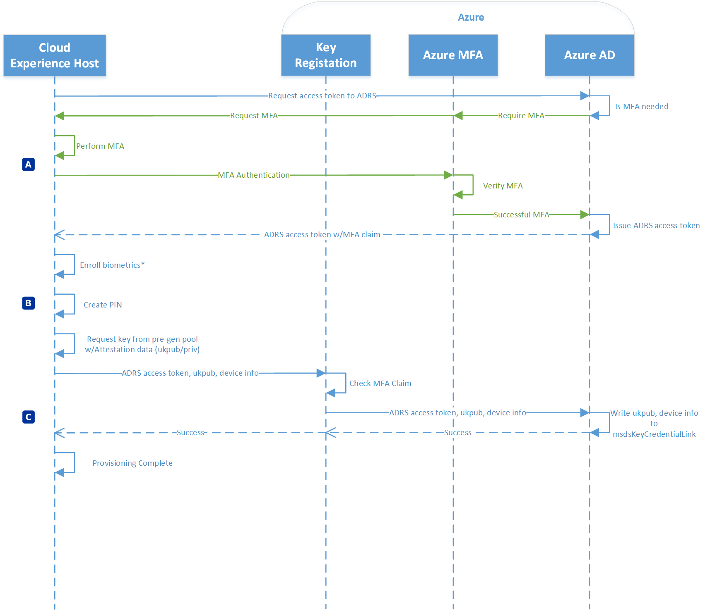
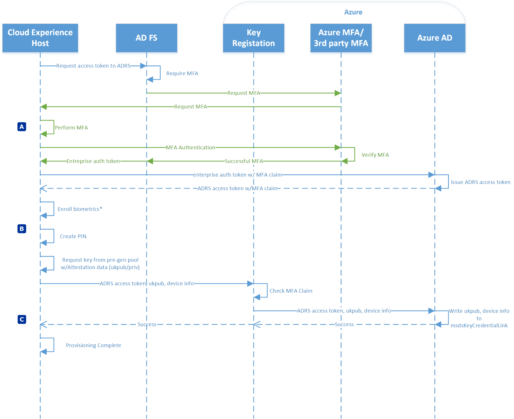
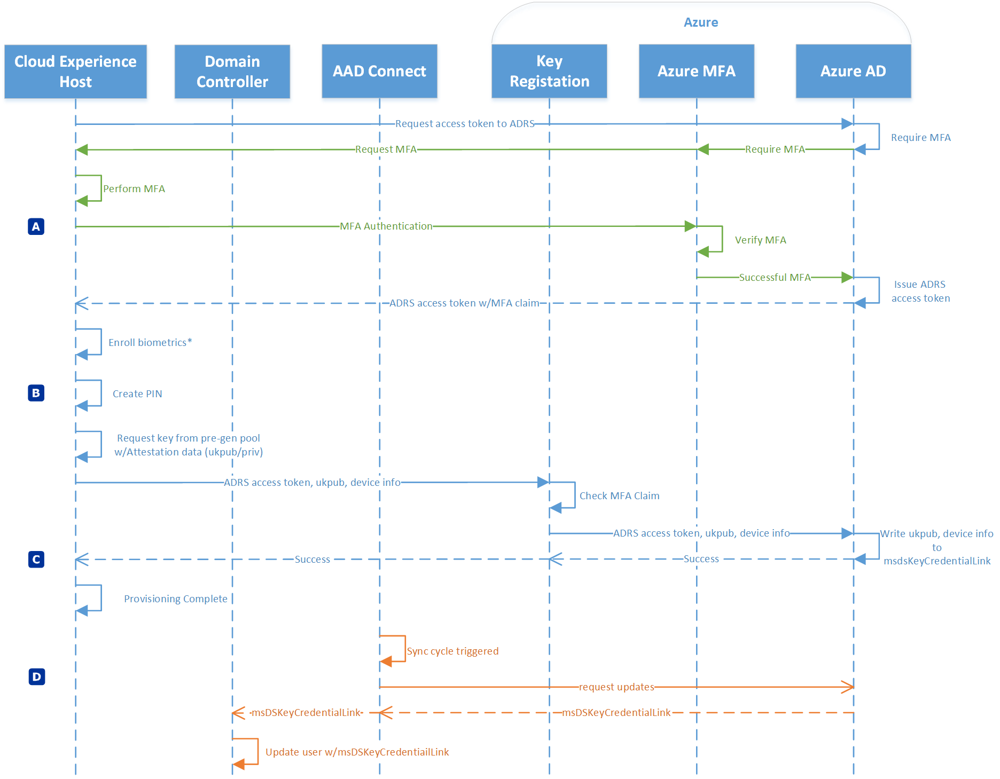
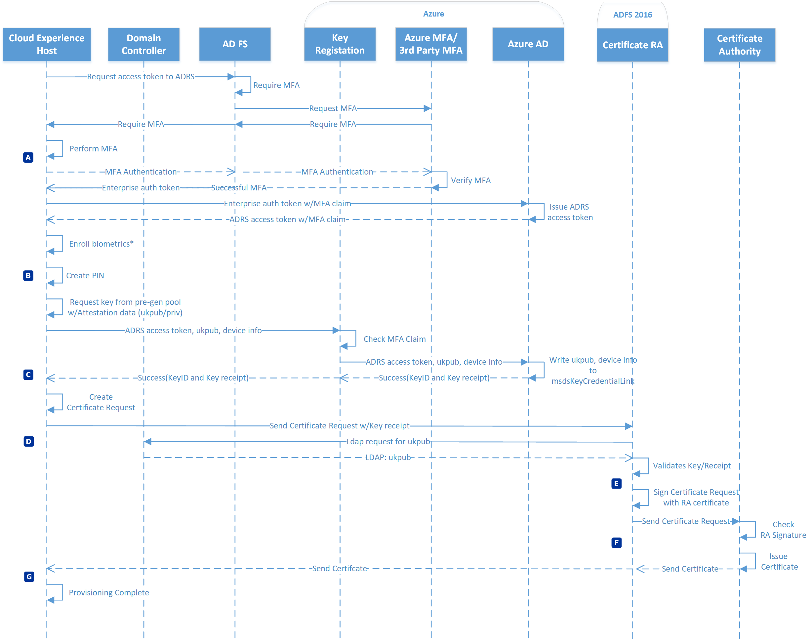
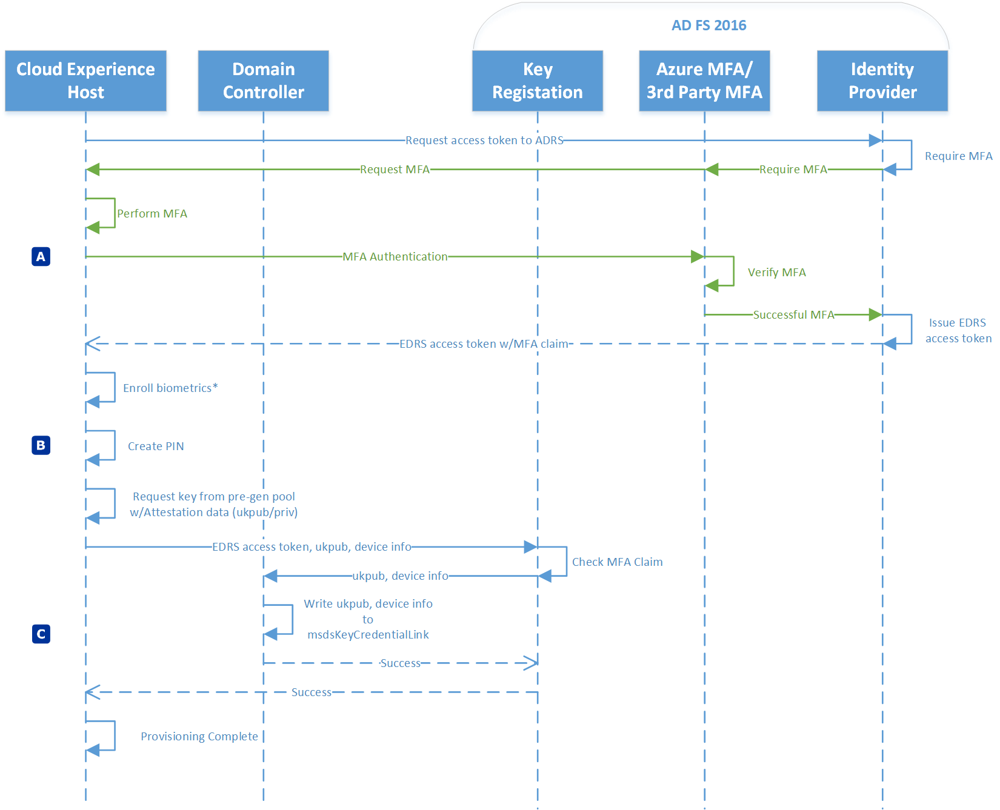
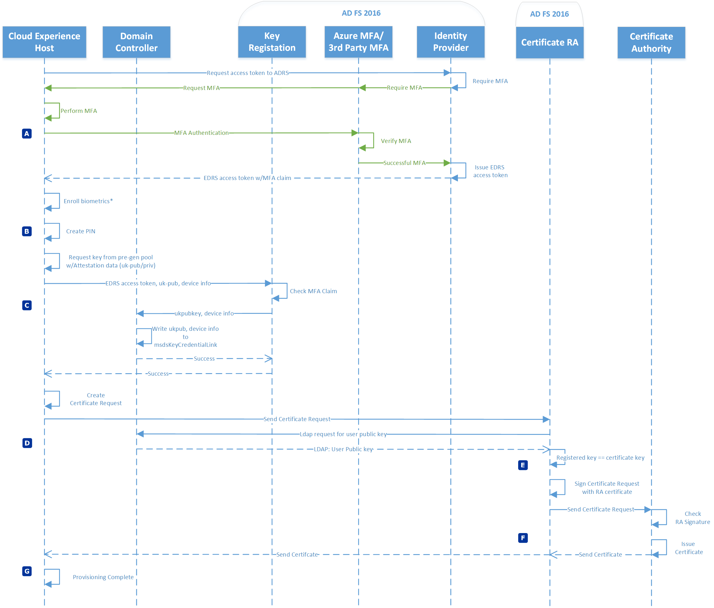

# Windows Hello for Business Provisioning

<strong>Applies to:</strong>
-   Windows 10

Windows Hello for Business provisioning enables a user to enroll a new, strong, two-factor credential that they can use for passwordless authentication.  Provisioning experience vary based on:
- How the device is joined to Azure Active Directory
- The Windows Hello for Business deployment type
- If the environment is managed or federated

[Azure AD joined provisioning in a Managed environment](#azure-ad-joined-provisioning-in-a-managed-environment) 
[Azure AD joined provisioning in a Federated environment](#azure-ad-joined-provisioning-in-a-federated-environment) 
[Hybrid Azure AD joined provisioning in a Key Trust deployment in a Managed environment](#hybrid-azure-ad-joined-provisioning-in-a-key-trust-deployment-in-a-managed-environment) 
[Hybrid Azure AD joined provisioning in a Certificate Trust deployment in a Federated environment](#hybrid-azure-ad-joined-provisioning-in-a-certificate-trust-deployment-in-a-federated-environment) 
[Hybrid Azure AD joined provisioning in a synchronous Certificate Trust deployment in a Federated environment](#hybrid-azure-ad-joined-provisioning-in-a-synchronous-certificate-trust-deployment-in-a-federated-environment) 
[Domain joined provisioning in an On-premises Key Trust deployment](#domain-joined-provisioning-in-an-on-premises-key-trust-deployment) 
[Domain joined provisioning in an On-premises Certificate Trust deployment](#domain-joined-provisioning-in-an-on-premises-certificate-trust-deployment) 

## Azure AD joined provisioning in a Managed environment

| Phase  | Description  |
| :----: | :----------- |
| A|The provisioning application hosted in the Cloud Experience Host (CXH) starts provisioning by requesting an access token for the Azure Device Registration Service (ADRS). The application makes the request using the Azure Active Directory Web Account Manager plug-in. Users must provide two factors of authentication.  In this phase, the user has already provided one factor of authentication, typically user name and password.  Azure MFA services provides the second factor of authentication.  If the user has performed Azure MFA within the last 10 minutes, such as when registering the device from the out-of-box-experience (OOBE), then they are not prompted for MFA because the current MFA remains valid. Azure Active Directory validates the access token request and the MFA claim associated with it, creates an ADRS access token, and returns it to the application. |
|B | After receiving a ADRS access token, the application detects if the device has a Windows Hello biometric compatible sensor.  If the application detects a biometric sensor, it gives the user the choice to enroll biometrics.  After completing or skipping biometric enrollment, the application requires the user to create a PIN and the default (and fall-back gesture when used with biometrics).  The user provides and confirms their PIN.  Next, the application requests a Windows Hello for Business key pair from the key pre-generation pool, which includes attestation data.  This is the user key (ukpub/ukpriv).|
|C | The application sends the ADRS token, ukpub, attestation data, and device information to ADRS for user key registration.  Azure DRS validates the MFA claim remains current.  On successful validation, Azure DRS locates the user's object in Azure Active Directory, writes the key information to a multi-values attribute. The key information includes a reference to the device from which it was created. Azure Active Directory returns a key ID to the application which signals the end of user provisioning and the application exits.|

[Return to top](#windows-hello-for-business-provisioning)
## Azure AD joined provisioning in a Federated environment

| Phase  | Description  |
| :----: | :----------- |
| A|The provisioning application hosted in the Cloud Experience Host (CXH) starts provisioning by requesting an access token for the Azure Device Registration Service (ADRS). The application makes the request using the Azure Active Directory Web Account Manager plug-in.   In a federated environment, the plug-in sends the token request to the on-premises STS, such as Active Directory Federation Services.  The on-premises STS authenticates the user and determines if the user should perform another factor of authentication. Users must provide two factors of authentication.  In this phase, the user has already provided one factor of authentication, typically user name and password.  Azure MFA services provides the second factor of authentication.  If the user has performed Azure MFA within the last 10 minutes, such as when registering the device from the out-of-box-experience (OOBE), then they are not prompted for MFA because the current MFA remains valid.  The on-premises STS server issues a enterprise token on successful MFA.  The application sends the token to Azure Active Directory. Azure Active Directory validates the access token request and the MFA claim associated with it, creates an ADRS access token, and returns it to the application. |
|B | After receiving a ADRS access token, the application detects if the device has a Windows Hello biometric compatible sensor.  If the application detects a biometric sensor, it gives the user the choice to enroll biometrics.  After completing or skipping biometric enrollment, the application requires the user to create a PIN and the default (and fall-back gesture when used with biometrics).  The user provides and confirms their PIN.  Next, the application requests a Windows Hello for Business key pair from the key pre-generation pool, which includes attestation data.  This is the user key (ukpub/ukpriv).|
|C | The application sends the ADRS token, ukpub, attestation data, and device information to ADRS for user key registration.  Azure DRS validates MFA claim remains current.  On successful validation, Azure DRS locates the user's object in Azure Active Directory, writes the key information to a multi-values attribute. The key information includes a reference to the device from which it was created. Azure Active Directory returns key ID to the application which signals the end of user provisioning and the application exits.|

[Return to top](#windows-hello-for-business-provisioning)
## Hybrid Azure AD joined provisioning in a Key Trust deployment in a Managed environment

| Phase | Description                                                                                                                                                                                                                                                                                                                                                                                                                                                                                                                                                                                                                                                                                                                                                                                                                                                                                               |
|:-----:|:----------------------------------------------------------------------------------------------------------------------------------------------------------------------------------------------------------------------------------------------------------------------------------------------------------------------------------------------------------------------------------------------------------------------------------------------------------------------------------------------------------------------------------------------------------------------------------------------------------------------------------------------------------------------------------------------------------------------------------------------------------------------------------------------------------------------------------------------------------------------------------------------------------|
|   A   | The provisioning application hosted in the Cloud Experience Host (CXH) starts provisioning by requesting an access token for the Azure Device Registration Service (ADRS). The application makes the request using the Azure Active Directory Web Account Manager plug-in. Users must provide two factors of authentication.  In this phase, the user has already provided one factor of authentication, typically user name and password.  Azure MFA services provides the second factor of authentication.  If the user has performed Azure MFA within the last 10 minutes, such as when registering the device from the out-of-box-experience (OOBE), then they are not prompted for MFA because the current MFA remains valid. Azure Active Directory validates the access token request and the MFA claim associated with it, creates an ADRS access token, and returns it to the application. |
|   B   | After receiving a ADRS access token, the application detects if the device has a Windows Hello biometric compatible sensor.  If the application detects a biometric sensor, it gives the user the choice to enroll biometrics.  After completing or skipping biometric enrollment, the application requires the user to create a PIN and the default (and fall-back gesture when used with biometrics).  The user provides and confirms their PIN.  Next, the application requests a Windows Hello for Business key pair from the key pre-generation pool, which includes attestation data.  This is the user key (ukpub/ukpriv).                                                                                                                                                                                                                                                                         |
|   C   | The application sends the ADRS token, ukpub, attestation data, and device information to ADRS for user key registration.  Azure DRS validates the MFA claim remains current.  On successful validation, Azure DRS locates the user's object in Azure Active Directory, writes the key information to a multi-values attribute. The key information includes a reference to the device from which it was created. Azure Active Directory returns a key ID to the application which signals the end of user provisioning and the application exits.                                                                                                                                                                                                                                                                                                                                                         |
|   D   | Azure AD Connect requests updates on its next synchronization cycle.  Azure Active Directory sends the user's public key that was securely registered through provisioning.  AAD Connect receives the public key and writes it to user's msDS-KeyCredentialLink attribute in Active Directory.                                                                                                                                                                                                                                                                                                                                                                                                                                                                                                                                                                                                            |

> [!IMPORTANT]
> The newly provisioned user will not be able to sign in using Windows Hello for Business until Azure AD Connect successfully synchronizes the public key to the on-premises Active Directory.

[Return to top](#windows-hello-for-business-provisioning)

## Hybrid Azure AD joined provisioning in a synchronous Certificate Trust deployment in a Federated environment

| Phase | Description                                                                                                                                                                                                                                                                                                                                                                                                                                                                                                                                                                                                                                                                                                                                                                                                                                                                                                                                                                                                                                                                                                                   |
|:-----:|:------------------------------------------------------------------------------------------------------------------------------------------------------------------------------------------------------------------------------------------------------------------------------------------------------------------------------------------------------------------------------------------------------------------------------------------------------------------------------------------------------------------------------------------------------------------------------------------------------------------------------------------------------------------------------------------------------------------------------------------------------------------------------------------------------------------------------------------------------------------------------------------------------------------------------------------------------------------------------------------------------------------------------------------------------------------------------------------------------------------------------|
|   A   | The provisioning application hosted in the Cloud Experience Host (CXH) starts provisioning by requesting an access token for the Azure Device Registration Service (ADRS). The application makes the request using the Azure Active Directory Web Account Manager plug-in.   In a federated environment, the plug-in sends the token request to the on-premises STS, such as Active Directory Federation Services.  The on-premises STS authenticates the user and determines if the user should perform another factor of authentication. Users must provide two factors of authentication.  In this phase, the user has already provided one factor of authentication, typically user name and password.  Azure MFA services (or a third party MFA service) provides the second factor of authentication.  The on-premises STS server issues a enterprise token on successful MFA.  The application sends the token to Azure Active Directory. Azure Active Directory validates the access token request and the MFA claim associated with it, creates an ADRS access token, and returns it to the application. |
|   B   | After receiving a ADRS access token, the application detects if the device has a Windows Hello biometric compatible sensor.  If the application detects a biometric sensor, it gives the user the choice to enroll biometrics.  After completing or skipping biometric enrollment, the application requires the user to create a PIN and the default (and fall-back gesture when used with biometrics).  The user provides and confirms their PIN.  Next, the application requests a Windows Hello for Business key pair from the key pre-generation pool, which includes attestation data.  This is the user key (ukpub/ukpriv).                                                                                                                                                                                                                                                                                                                                                                                                                                                                                             |
|   C   | The application sends the ADRS token, ukpub, attestation data, and device information to ADRS for user key registration.  Azure DRS validates the MFA claim remains current.  On successful validation, Azure DRS locates the user's object in Azure Active Directory, writes the key information to a multi-values attribute. The key information includes a reference to the device from which it was created. Azure Active Directory returns a key ID and a key receipt to the application, which represents the end of user key registration.                                                                                                                                                                                                                                                                                                                                                                                                                                                                                                                                                                             |
|   D   | The certificate request portion of provisioning begins after the application receives a successful response from key registration.  The application creates a PKCS#10 certificate request.  The key used in the certificate request is the same key that was securely provisioned.  The application sends the key receipt and certificate request, which includes the public key, to the certificate registration authority hosted on the Active Directory Federation Services (AD FS) farm.   After receiving the certificate request, the certificate registration authority queries Active Directory for the msDS-KeyCredentailsLink for a list of registered public keys.                                                                                                                                                                                                                                                                                                                                                                                                                                           |
|   E   | The registration authority validates the public key in the certificate request matches a registered key for the user.   If the public key in the certificate is not found in the list of registered public keys, it then validates the key receipt to confirm the key was securely registered with Azure. After validating the key receipt or public key, the registration authority signs the certificate request using its enrollment agent certificate.                                                                                                                                                                                                                                                                                                                                                                                                                                                                                                                                                                                                                                                              |
|   F   | The registration authority sends the certificate request to the enterprise issuing certificate authority. The certificate authority validates the certificate request is signed by a valid enrollment agent and, on success, issues a certificate and returns it to the registration authority that then returns the certificate to the application.                                                                                                                                                                                                                                                                                                                                                                                                                                                                                                                                                                                                                                                                                                                                                                          |
|   G   | The application receives the newly issued certificate and installs the it into the Personal store of the user.  This signals the end of provisioning.                                                                                                                                                                                                                                                                                                                                                                                                                                                                                                                                                                                                                                                                                                                                                                                                                                                                                                                                                                         |

> [!IMPORTANT]
> Synchronous certificate enrollment does not depend on Azure AD Connect to synchronize the user's public key to issue the Windows Hello for Business authentication certificate.  Users can sign-in using the certificate immediately after provisioning completes.  Azure AD Connect continues to synchronize the public key to Active Directory, but is not shown in this flow.

[Return to top](#windows-hello-for-business-provisioning)
## Domain joined provisioning in an On-premises Key Trust deployment

| Phase  | Description  |
| :----: | :----------- |
|A| The provisioning application hosted in the Cloud Experience Host (CXH) starts provisioning by requesting an access token for the Enterprise Device Registration Service (EDRS). The application makes the request using the Azure Active Directory Web Account Manager plug-in.   In an on-premises deployment, the plug-in sends the token request to the on-premises STS, such as Active Directory Federation Services.  The on-premises STS authenticates the user and determines if the user should perform another factor of authentication. Users must provide two factors of authentication.  In this phase, the user has already provided one factor of authentication, typically user name and password.  Azure MFA server (or a third party MFA service) provides the second factor of authentication.  The on-premises STS server issues a enterprise DRS token on successful MFA.|
| B| After receiving a EDRS access token, the application detects if the device has a Windows Hello biometric compatible sensor.  If the application detects a biometric sensor, it gives the user the choice to enroll biometrics.  After completing or skipping biometric enrollment, the application requires the user to create a PIN and the default (and fall-back gesture when used with biometrics).  The user provides and confirms their PIN.  Next, the application requests a Windows Hello for Business key pair from the key pre-generation pool, which includes attestation data.  This is the user key (ukpub/ukpriv).|
|C | The application sends the EDRS token, ukpub, attestation data, and device information to the Enterprise DRS for user key registration.  Enterprise DRS validates the MFA claim remains current.  On successful validation, the Enterprise DRS locates the user's object in Active Directory, writes the key information to a multi-values attribute. The key information includes a reference to the device from which it was created. The Enterprise DRS returns a key ID to the application, which represents the end of user key registration.|

[Return to top](#windows-hello-for-business-provisioning)
## Domain joined provisioning in an On-premises Certificate Trust deployment

| Phase  | Description  |
| :----: | :----------- |
|A| The provisioning application hosted in the Cloud Experience Host (CXH) starts provisioning by requesting an access token for the Enterprise Device Registration Service (EDRS). The application makes the request using the Azure Active Directory Web Account Manager plug-in.   In an on-premises deployment, the plug-in sends the token request to the on-premises STS, such as Active Directory Federation Services.  The on-premises STS authenticates the user and determines if the user should perform another factor of authentication. Users must provide two factors of authentication.  In this phase, the user has already provided one factor of authentication, typically user name and password.  Azure MFA server (or a third party MFA service) provides the second factor of authentication.  The on-premises STS server issues a enterprise DRS token on successful MFA.|
| B| After receiving a EDRS access token, the application detects if the device has a Windows Hello biometric compatible sensor.  If the application detects a biometric sensor, it gives the user the choice to enroll biometrics.  After completing or skipping biometric enrollment, the application requires the user to create a PIN and the default (and fall-back gesture when used with biometrics).  The user provides and confirms their PIN.  Next, the application requests a Windows Hello for Business key pair from the key pre-generation pool, which includes attestation data.  This is the user key (ukpub/ukpriv).|
|C | The application sends the EDRS token, ukpub, attestation data, and device information to the Enterprise DRS for user key registration.  Enterprise DRS validates the MFA claim remains current.  On successful validation, the Enterprise DRS locates the user's object in Active Directory, writes the key information to a multi-values attribute. The key information includes a reference to the device from which it was created. The Enterprise DRS returns a key ID to the application, which represents the end of user key registration.|
|D | The certificate request portion of provisioning begins after the application receives a successful response from key registration.  The application creates a PKCS#10 certificate request.  The key used in the certificate request is the same key that was securely provisioned.  The application sends the certificate request, which includes the public key, to the certificate registration authority hosted on the Active Directory Federation Services (AD FS) farm.   After receiving the certificate request, the certificate registration authority queries Active Directory for the msDS-KeyCredentailsLink for a list of registered public keys.|
|E | The registration authority validates the public key in the certificate request matches a registered key for the user.   After validating the  public key, the registration authority signs the certificate request using its enrollment agent certificate.|
|F |The registration authority sends the certificate request to the enterprise issuing certificate authority. The certificate authority validates the certificate request is signed by a valid enrollment agent and, on success, issues a certificate and returns it to the registration authority that then returns the certificate to the application.|
|G | The application receives the newly issued certificate and installs it into the Personal store of the user.  This signals the end of provisioning.|

[Return to top](#windows-hello-for-business-provisioning)
