# Configure Azure AD joined devices for On-premises Single-Sign On using Windows Hello for Business

**Applies to**
- Windows 10
- Azure Active Directory joined
- Hybrid Deployment
- Key trust model

## Prerequisites

Before adding Azure Active Directory (Azure AD) joined devices to your existing hybrid deployment, you need to verify the existing deployment can support Azure AD joined devices.  Unlike hybrid Azure AD joined devices, Azure AD joined devices do not have a relationship with your Active Directory domain.  This factor changes the way in which users authenticate to Active Directory.  Validate the following configurations to ensure they support Azure AD joined devices.

- Azure Active Directory Connect synchronization
- Device Registration
- Certificate Revocation List (CRL) Distribution Point (CDP)
- 2016 Domain Controllers
- Domain Controller certificate

### Azure Active Directory Connect synchronization
Azure AD join, as well as hybrid Azure AD join devices register the user's Windows Hello for Business credential with Azure.  To enable on-premises authentication, the credential must be synchronized to the on-premises Active Directory, regardless whether you are using a key or a certificate.  Ensure you have Azure AD Connect installed and functioning properly.  To learn more about Azure AD Connect, read [Integrate your on-premises directories with Azure Active Directory](https://docs.microsoft.com/azure/active-directory/connect/active-directory-aadconnect).

If you upgraded your Active Directory schema to the Windows Server 2016 schema after installing Azure AD Connect, run Azure AD Connect and run **Refresh directory schema** from the list of tasks.

### Azure Active Directory Device Registration
A fundamental prerequisite of all cloud and hybrid Windows Hello for Business deployments is device registration.  A user cannot provision Windows Hello for Business unless the device from which they are trying to provision has registered with Azure Active Directory.  For more information about device registration, read [Introduction to device management in Azure Active Directory](https://docs.microsoft.com/azure/active-directory/devices/overview).

You can use the **dsregcmd.exe** command to determine if your device is registered to Azure Active Directory.
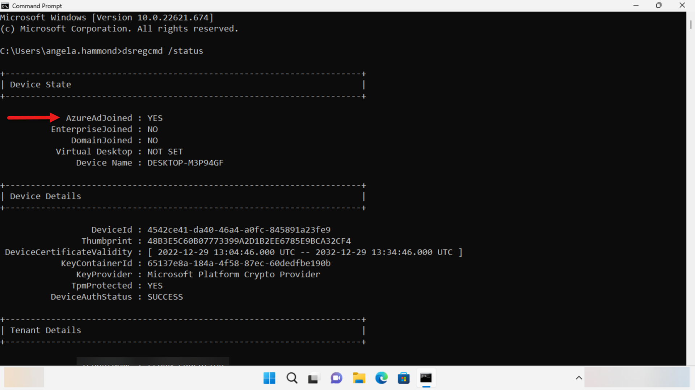

### CRL Distribution Point (CDP)

Certificates issued by a certificate authority can be revoked.  When a certificate authority revokes as certificate, it writes information about the certificate into a revocation list.  During certificate validation, Windows 10 consults the CRL distribution point within the certificate to get a list of revoked certificates.  Validation compares the current certificate with information in the certificate revocation list to determine if the certificate remains valid.  

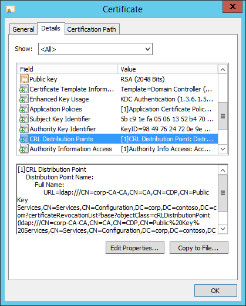

The preceding domain controller certificate shows a CRL distribution path (CDP) using Active Directory.  You can determine this because the value in the URL begins with **ldap**.  Using Active Directory for domain joined devices provides a highly available CRL distribution point.  However, Azure Active Directory joined devices and users on Azure Active Directory joined devices cannot read data from Active Directory, and certificate validation does not provide an opportunity to authenticate prior to reading the certificate revocation list.  This becomes a circular problem as the user is attempting to authenticate, but must read Active Directory to complete the authentication, but the user cannot read Active Directory because they have not authenticated.

To resolve this issue, the CRL distribution point must be a location that is accessible by Azure Active Directory joined devices that does not require authentication.  The easiest solution is to publish the CRL distribution point on a web server that uses HTTP (not HTTPS).

If your CRL distribution point does not list an HTTP distribution point, then you need to reconfigure the issuing certificate authority to include an HTTP CRL distribution point, preferably first in the list of distribution points.

### Windows Server 2016 Domain Controllers
If you are interested in configuring your environment to use the Windows Hello for Business key rather than a certificate, then your environment must have an adequate number of Windows Server 2016 domain controllers.  Only Windows Server 2016 domain controllers are capable of authenticating user with a Windows Hello for Business key.  What do we mean by adequate?  We are glad you asked.  Read [Planning an adequate number of Windows Server 2016 Domain Controllers for Windows Hello for Business deployments](hello-adequate-domain-controllers.md) to learn more.

If you are interested in configuring your environment to use the Windows Hello for Business certificate rather than key, then you are the right place.  The same certificate configuration on the domain controllers is needed, whether you are using Windows Server 2016 domain controllers or domain controllers running earlier versions of Windows Server.  You can simply ignore the Windows Server 2016 domain controller requirement.  

### Domain Controller Certificates

Certificate authorities write CRL distribution points in certificates as they are issued.  If the distribution point changes, then previously issued certificates must be reissued for the certificate authority to include the new CRL distribution point.  The domain controller certificate is one the critical components of Azure AD joined devices authenticating to Active Directory

#### Why does Windows need to validate the domain controller certificate?

Windows Hello for Business enforces the strict KDC validation security feature, which imposes more restrictive criteria that must be met by the Key Distribution Center (KDC). When authenticating using Windows Hello for Business, the Windows 10 client validates the reply from the domain controller by ensuring all of the following are met:

- The domain controller has the private key for the certificate provided.
- The root CA that issued the domain controller's certificate is in the device's **Trusted Root Certificate Authorities**. 
- Use the **Kerberos Authentication certificate template** instead of any other older template.
- The domain controller's certificate has the **KDC Authentication** enhanced key usage.
- The domain controller's certificate's subject alternate name has a DNS Name that matches the name of the domain.

> [!Tip]
> If you are using Windows Server 2008, **Kerberos Authentication** is not the default template, so make sure to use the correct template when issuing or re-issuing the certificate.
 

## Configuring a CRL Distribution Point for an issuing certificate authority

Use this set of procedures to update your certificate authority that issues your domain controller certificates to include an http-based CRL distribution point. 

Steps you will perform include:

- [Configure Internet Information Services to host CRL distribution point](#configure-internet-information-services-to-host-crl-distribution-point) 
- [Prepare a file share to host the certificate revocation list](#prepare-a-file-share-to-host-the-certificate-revocation-list)
- [Configure the new CRL distribution point in the issuing certificate authority](#Configure-the-new-crl-distribution-point-in-the-issuing-certificate-authority)
- [Publish CRL](#publish-a-new-crl)
- [Reissue domain controller certificates](#reissue-domain-controller-certificates)

### Configure Internet Information Services to host CRL distribution point

You need to host your new certificate revocation list of a web server so Azure AD joined devices can easily validate certificates without authentication.  You can host these files on web servers many ways.  The following steps is just one and may be useful for those unfamiliar with adding a new CRL distribution point.

> [!IMPORTANT]
> Do not configure the IIS server hosting your CRL distribution point to use https or a server authentication certificate.  Clients should access the distribution point using http. 

#### Installing the Web Server

1. Sign-in to your server as a local administrator and start **Server Manager** if it did not start during your sign in. 
2. Click the **Local Server** node in the navigation pane.  Click **Manage** and click **Add Roles and Features**.
3. In the **Add Role and Features Wizard**, click **Server Selection**.  Verify the selected server is the local server.  Click **Server Roles**.  Select the check box next to **Web Server (IIS)**.
4. Click **Next** through the remaining options in the wizard, accepting the defaults, and install the Web Server role.
 
#### Configure the Web Server

1. From **Windows Administrative Tools**, Open **Internet Information Services (IIS) Manager**.
2. Expand the navigation pane to show **Default Web Site**.  Select and then right-click **Default Web site** and click **Add Virtual Directory...**.
3. In the **Add Virtual Directory** dialog box, type **cdp** in **alias**.  For physical path, type or browse for the physical file location where you will host the certificate revocation list.  For this example, the path **c:\cdp** is used. Click **OK**.
   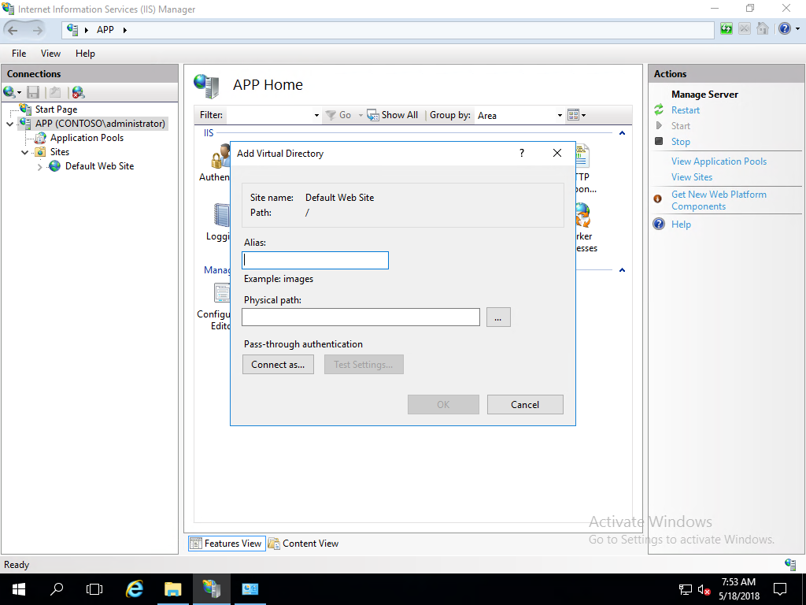 
   > [!NOTE]
   > Make note of this path as you will use it later to configure share and file permissions.

4. Select **CDP** under **Default Web Site** in the navigation pane.  Double-click **Directory Browsing** in the content pane.  Click **Enable** in the details pane.
5. Select **CDP** under **Default Web Site** in the navigation pane.  Double-click **Configuration Editor**.
6. In the **Section** list, navigate to **system.webServer/security/requestFiltering**.
   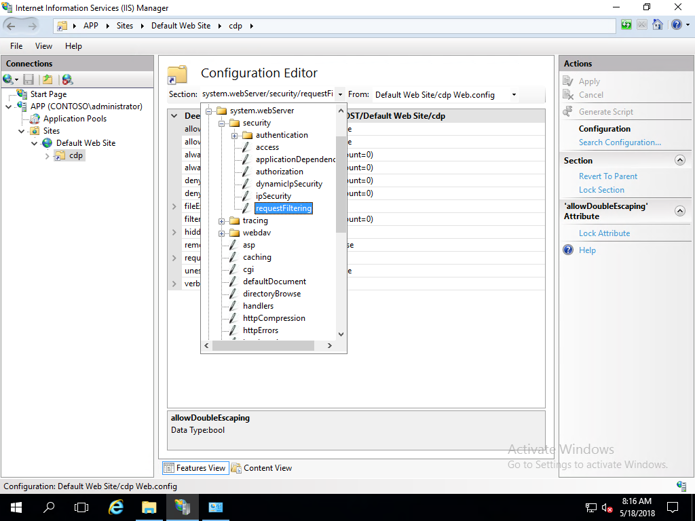   
   In the list of named value-pairs in the content pane, configure **allowDoubleEscapting** to **True**.  Click **Apply** in the actions pane.
   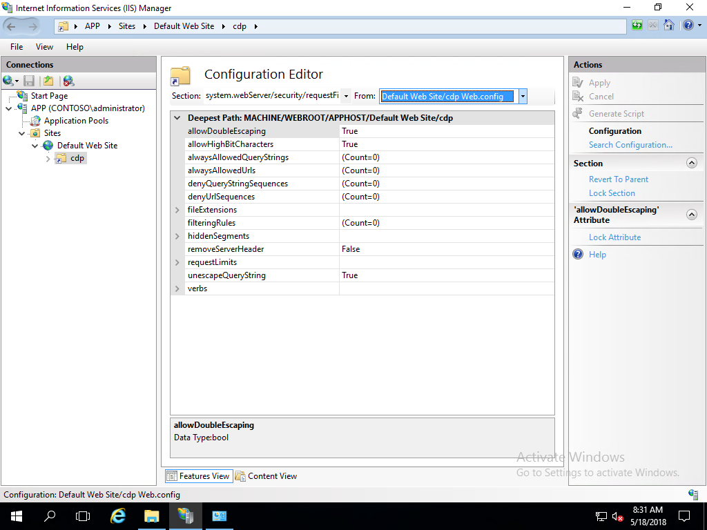
7. Close **Internet Information Services (IIS) Manager**. 

#### Create a DNS resource record for the CRL distribution point URL 

1. On your DNS server or from an administrative workstation, open **DNS Manager** from **Administrative Tools**.
2. Expand **Forward Lookup Zones** to show the DNS zone for your domain.  Right-click your domain name in the navigation pane and click **New Host (A or AAAA)...**.
3. In the **New Host** dialog box, type **crl** in **Name**.  Type the IP address of the web server you configured in **IP Address**. Click **Add Host**.  Click **OK** to close the **DNS** dialog box.  Click **Done**.
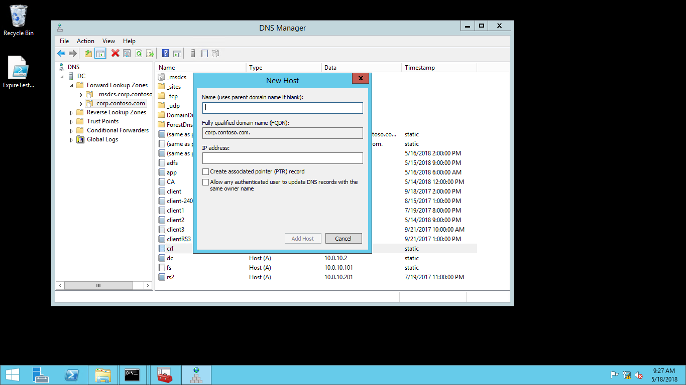
4. Close the **DNS Manager**. 

### Prepare a file share to host the certificate revocation list

These procedures configure NTFS and share permissions on the web server to allow the certificate authority to automatically publish the certificate revocation list.

#### Configure the CDP file share

1. On the web server, open **Windows Explorer** and navigate to the **cdp** folder you created in step 3 of [Configure the Web Server](#configure-the-web-server).
2. Right-click the **cdp** folder and click **Properties**.  Click the **Sharing** tab.  Click **Advanced Sharing**.
3. Select **Share this folder**. Type **cdp$** in **Share name**. Click **Permissions**.
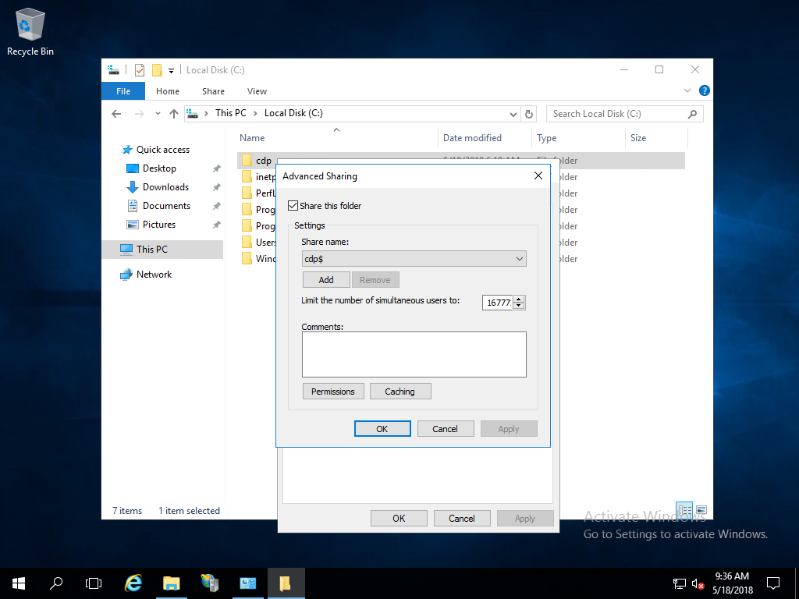
4. In the **Permissions for cdp$** dialog box, click **Add**.
5. In the **Select Users, Computers, Service Accounts, or Groups** dialog box, click **Object Types**.  In the **Object Types** dialog box, select **Computers**, and then click **OK**.
7. In the **Select Users, Computers, Service Accounts, or Groups** dialog box, in **Enter the object names to select**, type the name of the server running the certificate authority issuing the certificate revocation list, and then click **Check Names**. Click **OK**.
8. In the **Permissions for cdp$** dialog box, select the certificate authority from the **Group or user names list**. In the **Permissions for** section, select **Allow** for **Full control**. Click **OK**.
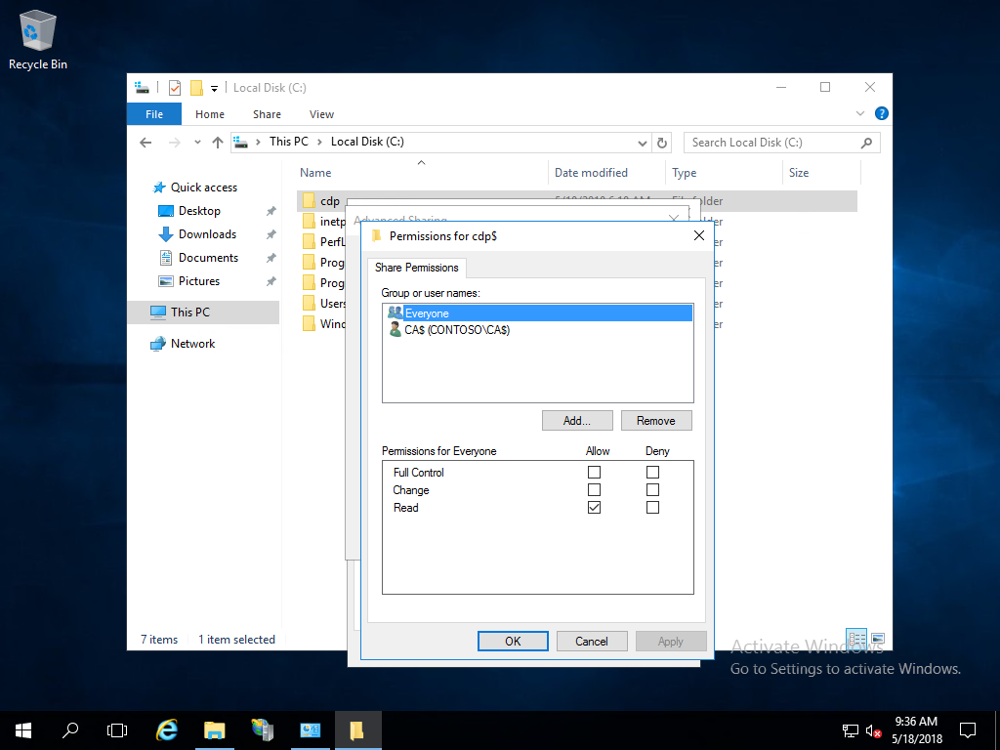
9. In the **Advanced Sharing** dialog box, click **OK**.

#### Disable Caching 
1. On the web server, open **Windows Explorer** and navigate to the **cdp** folder you created in step 3 of [Configure the Web Server](#configure-the-web-server).
2. Right-click the **cdp** folder and click **Properties**.  Click the **Sharing** tab.  Click **Advanced Sharing**.
3. Click **Caching**. Select **No files or programs from the shared folder are available offline**.
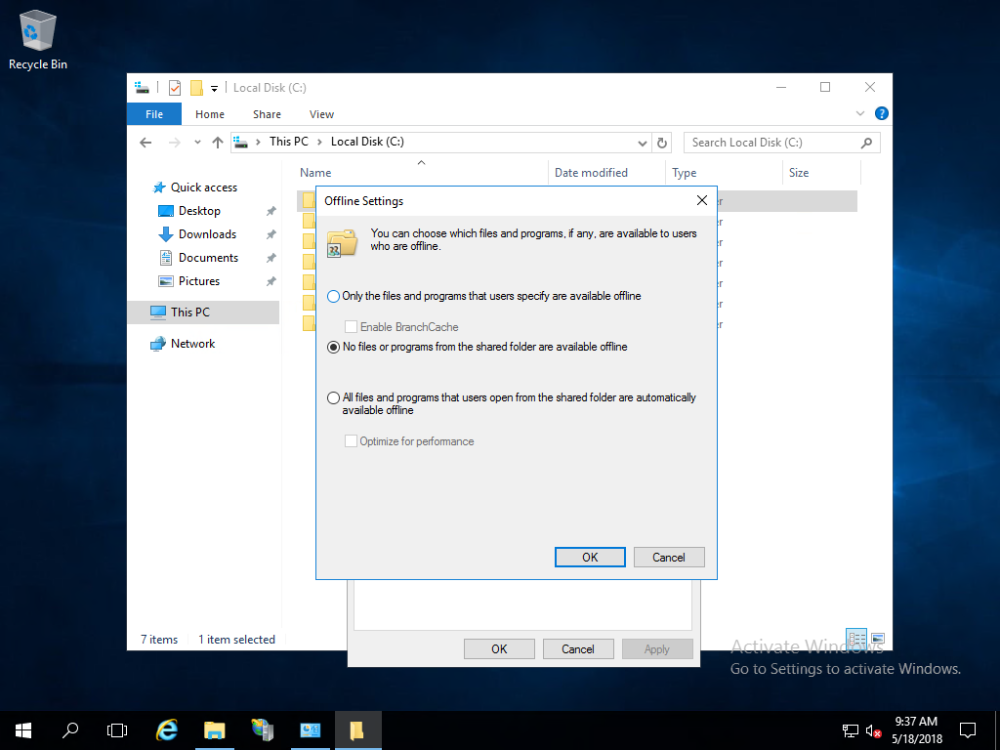
4. Click **OK**. 

#### Configure NTFS permission for the CDP folder

1. On the web server, open **Windows Explorer** and navigate to the **cdp** folder you created in step 3 of [Configure the Web Server](#configure-the-web-server).
2. Right-click the **cdp** folder and click **Properties**.  Click the **Security** tab.
3. On the **Security** tab, click Edit.
5. In the **Permissions for cdp** dialog box, click **Add**.
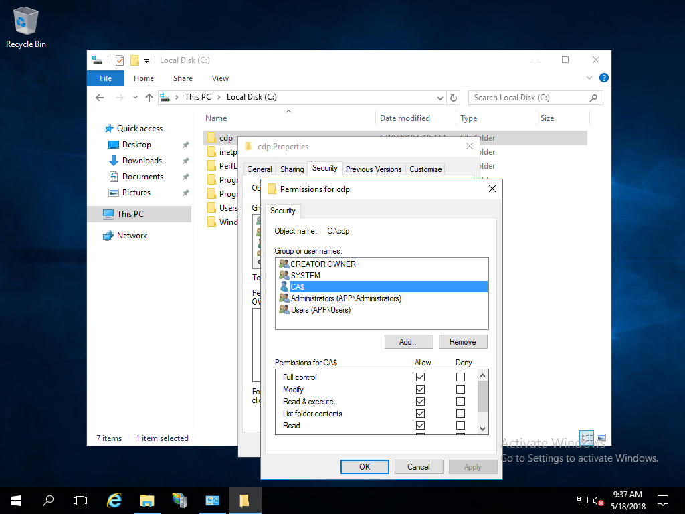
6. In the **Select Users, Computers, Service Accounts, or Groups** dialog box, click **Object Types**.  In the **Object Types** dialog box, select **Computers**. Click **OK**.
7. In the **Select Users, Computers, Service Accounts, or Groups** dialog box, in **Enter the object names to select**, type the name of the certificate authority, and then click **Check Names**. Click **OK**.
8. In the **Permissions for cdp** dialog box, select the name of the certificate authority from the **Group or user names** list. In the **Permissions for** section, select **Allow** for **Full control**. Click **OK**.
9. Click **Close** in the **cdp Properties** dialog box.

### Configure the new CRL distribution point and Publishing location in the issuing certificate authority

The web server is ready to host the CRL distribution point.  Now, configure the issuing certificate authority to publish the CRL at the new location and to include the new CRL distribution point

#### Configure the CRL distribution Point
1. On the issuing certificate authority, sign-in as a local administrator.  Start the **Certificate Authority** console from **Administrative Tools**. 
2. In the navigation pane, right-click the name of the certificate authority and click **Properties**
3. Click **Extensions**.  On the **Extensions** tab, select **CRL Distribution Point (CDP)** from the **Select extension** list.
4. On the **Extensions** tab, click **Add**. Type <strong>http://crl.[domainname]/cdp/</strong> in **location**.  For example, *<http://crl.corp.contoso.com/cdp/>* or *<http://crl.contoso.com/cdp/>* (do not forget the trailing forward slash). 
   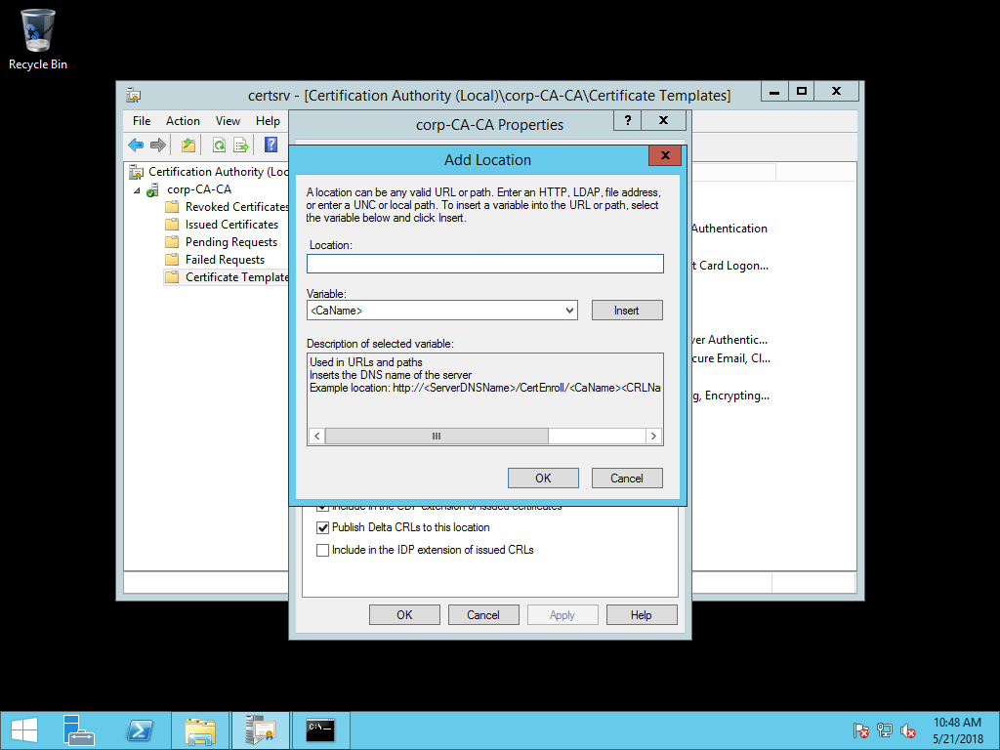
5. Select **\<CaName>** from the **Variable** list and click **Insert**.  Select **\<CRLNameSuffix>** from the **Variable** list and click **Insert**.  Select **\<DeltaCRLAllowed>** from the **Variable** list and click **Insert**.
6. Type **.crl** at the end of the text in **Location**. Click **OK**.
7. Select the CDP you just created.
   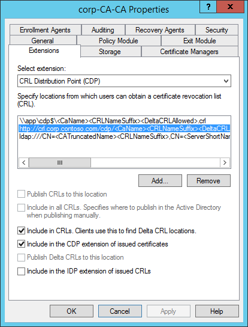
8. Select **Include in CRLs.  Clients use this to find Delta CRL locations**.
9. Select **Include in the CDP extension of issued certificates**.
10. Click **Apply** save your selections.  Click **No** when ask to restart the service.

> [!NOTE]
> Optionally, you can remove unused CRL distribution points and publishing locations.

#### Configure the CRL publishing location

1. On the issuing certificate authority, sign-in as a local administrator.  Start the **Certificate Authority** console from **Administrative Tools**. 
2. In the navigation pane, right-click the name of the certificate authority and click **Properties**
3. Click **Extensions**.  On the **Extensions** tab, select **CRL Distribution Point (CDP)** from the **Select extension** list.
4. On the **Extensions** tab, click **Add**.  Type the computer and share name you create for your CRL distribution point in [Configure the CDP file share](#configure-the-cdp-file-share).  For example, **\\\app\cdp$\\** (do not forget the trailing backwards slash).
5. Select **\<CaName>** from the **Variable** list and click **Insert**.  Select **\<CRLNameSuffix>** from the **Variable** list and click **Insert**.  Select **\<DeltaCRLAllowed>** from the **Variable** list and click **Insert**.
6. Type **.crl** at the end of the text in **Location**. Click **OK**.
7. Select the CDP you just created.
   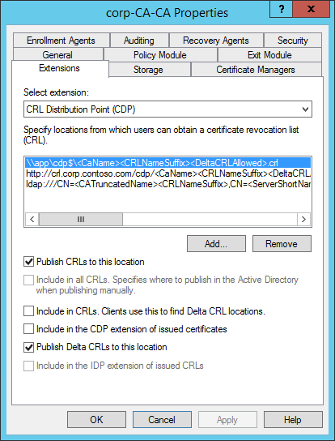
8. Select **Publish CRLs to this location**.
9. Select **Publish Delta CRLs to this location**.
10. Click **Apply** save your selections.  Click **Yes** when ask to restart the service.  Click **OK** to close the properties dialog box.

### Publish a new CRL

1. On the issuing certificate authority, sign-in as a local administrator.  Start the **Certificate Authority** console from **Administrative Tools**.
2. In the navigation pane, right-click **Revoked Certificates**, hover over **All Tasks**, and click **Publish**
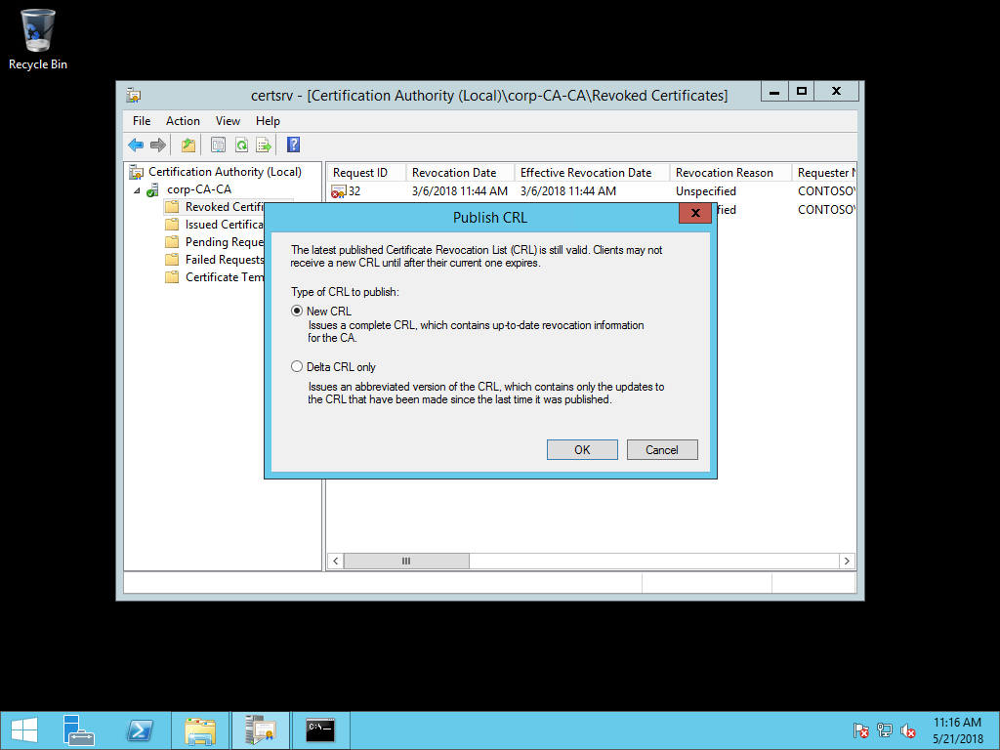
3. In the **Publish CRL** dialog box, select **New CRL** and click **OK**.

#### Validate CDP Publishing

Validate your new CRL distribution point is working. 

1. Open a web browser.  Navigate to <strong>http://crl.[yourdomain].com/cdp</strong>.  You should see two files created from publishing your new CRL.
   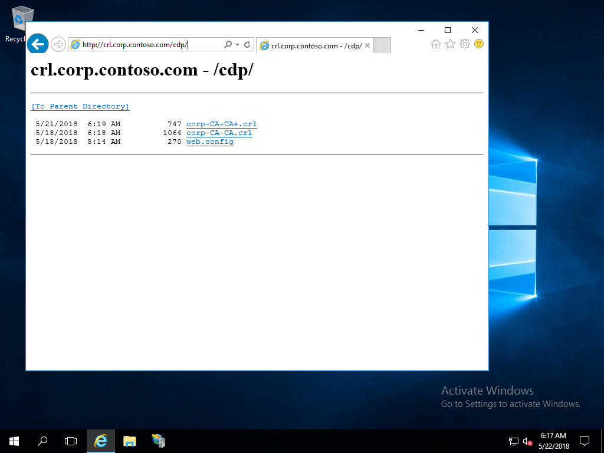

### Reissue domain controller certificates

With the CA properly configured with a valid HTTP-based CRL distribution point, you need to reissue certificates to domain controllers as the old certificate does not have the updated CRL distribution point. 

1. Sign-in a domain controller using administrative credentials.
2. Open the **Run** dialog box.  Type **certlm.msc** to open the **Certificate Manager** for the local computer.
3. In the navigation pane, expand **Personal**.  Click **Certificates**.  In the details pane, select the existing domain controller certificate includes **KDC Authentication** in the list of **Intended Purposes**.
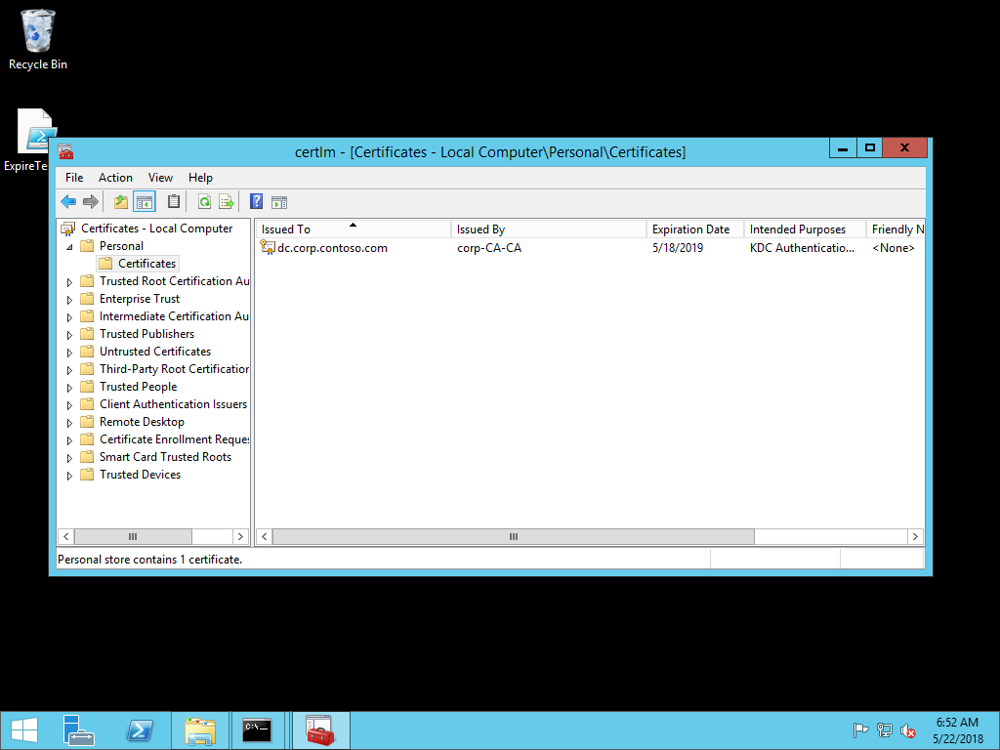
4. Right-click the selected certificate.  Hover over **All Tasks** and then select **Renew Certificate with New Key...**.  In the **Certificate Enrollment** wizard, click **Next**.
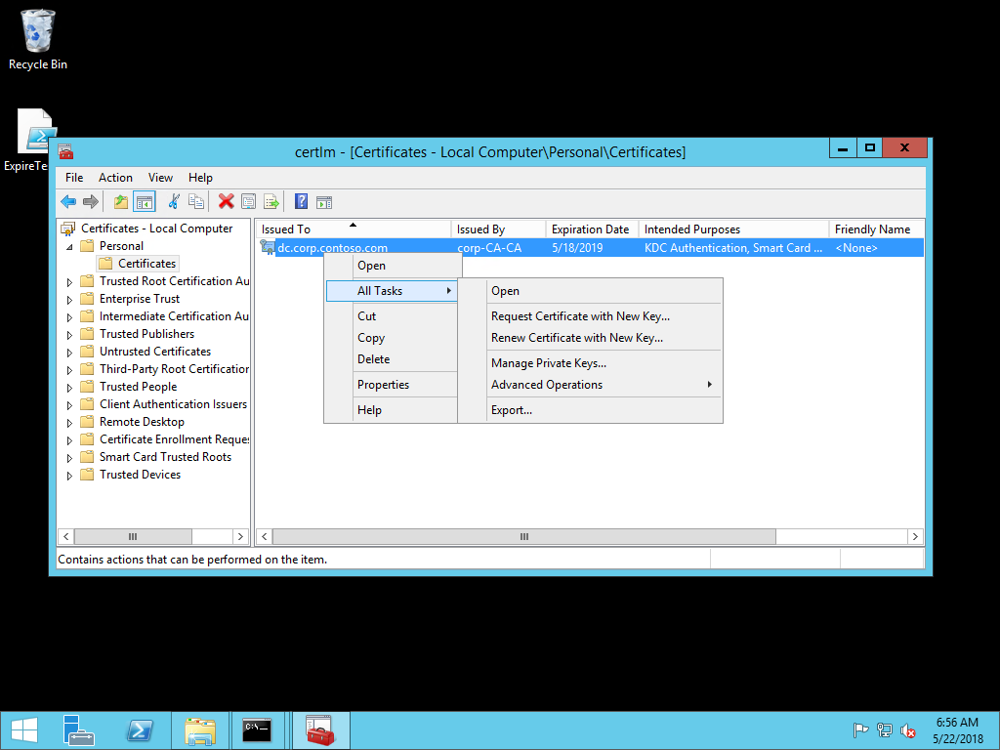 
5. In the **Request Certificates** page of the wizard, verify the selected certificate has the correct certificate template and ensure the status is available.  Click **Enroll**.
6. After the enrollment completes, click **Finish** to close the wizard. 
7. Repeat this procedure on all your domain controllers.

> [!NOTE]
> You can configure domain controllers to automatically enroll and renew their certificates.  Automatic certificate enrollment helps prevent authentication outages due to expired certificates.  Refer to the [Windows Hello Deployment Guides](https://docs.microsoft.com/windows/security/identity-protection/hello-for-business/hello-deployment-guide) to learn how to deploy automatic certificate enrollment for domain controllers. 

> [!IMPORTANT]
> If you are not using automatic certificate enrollment, create a calendar reminder to alert you two months before the certificate expiration date. Send the reminder to multiple people in the organization to ensure more than one or two people know when these certificates expire.

#### Validate CDP in the new certificate

1. Sign-in a domain controller using administrative credentials.
2. Open the **Run** dialog box.  Type **certlm.msc** to open the **Certificate Manager** for the local computer.
3. In the navigation pane, expand **Personal**.  Click **Certificates**.  In the details pane, double-click the existing domain controller certificate includes **KDC Authentication** in the list of **Intended Purposes**.
4. Click the **Details** tab.  Scroll down the list until **CRL Distribution Points** is visible in the **Field** column of the list.  Select **CRL Distribution Point**.
5. Review the information below the list of fields to confirm the new URL for the CRL distribution point is present in the certificate.  Click **OK**. 
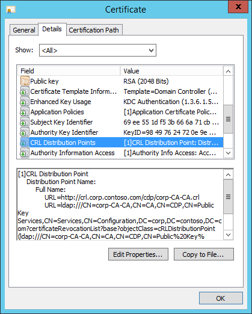

## Configure and Assign a Trusted Certificate Device Configuration Profile

Your domain controllers have new certificate that include the new CRL distribution point.  Next, you need your enterprise root certificate so you can deploy it to Azure AD joined devices.  Deploying the enterprise root certificates to the device, ensures the device trusts any certificates issued by the certificate authority.  Without the certificate, Azure AD joined devices do not trust domain controller certificates and authentication fails. 

Steps you will perform include:
- [Export Enterprise Root certificate](#export-enterprise-root-certificate)
- [Create and Assign a Trust Certificate Device Configuration Profile](#create-and-assign-a-trust-certificate-device-configuration-profile)

### Export Enterprise Root certificate

1. Sign-in a domain controller using administrative credentials.
2. Open the **Run** dialog box.  Type **certlm.msc** to open the **Certificate Manager** for the local computer.
3. In the navigation pane, expand **Personal**.  Click **Certificates**.  In the details pane, double-click the existing domain controller certificate includes **KDC Authentication** in the list of **Intended Purposes**.
4. Click the **Certification Path** tab.  In the **Certifcation path** view, select the top most node and click **View Certificate**.
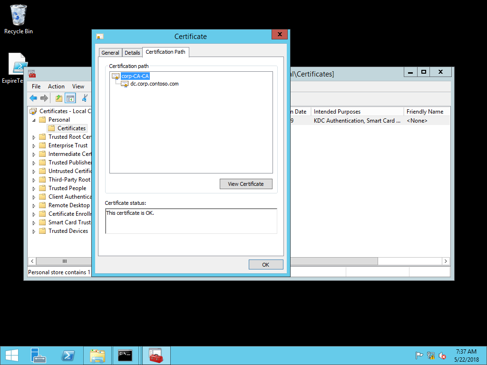
5. In the new **Certificate** dialog box, click the **Details** tab. Click **Copy to File**.
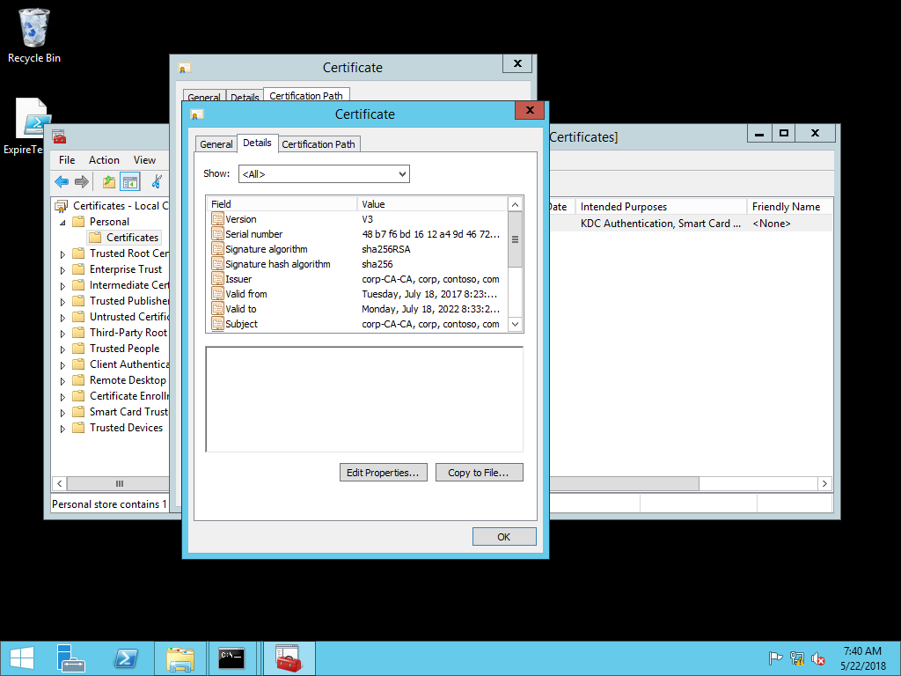
6. In the **Certificate Export Wizard**, click **Next**.  
7. On the **Export File Format** page of the wizard, click **Next**.  
8. On the **File to Export** page in the wizard, type the name and location of the root certificate and click **Next**. Click **Finish** and then click **OK** to close the success dialog box.
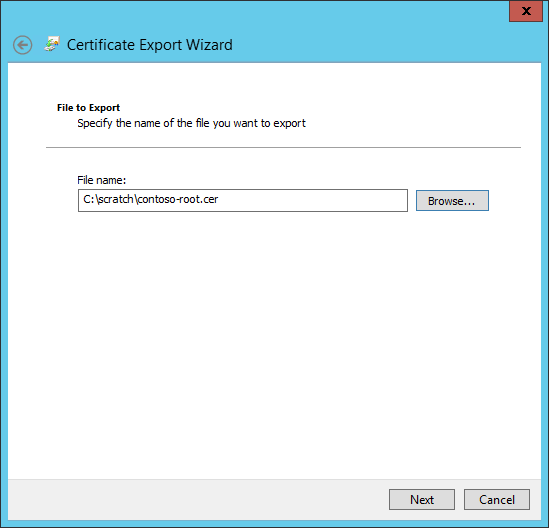
9. Click **OK**  two times to return to the **Certificate Manager** for the local computer.  Close the **Certificate Manager**.

### Create and Assign a Trust Certificate Device Configuration Profile

A **Trusted Certificate** device configuration profile is how you deploy trusted certificates to Azure AD joined devices.

1. Sign-in to the [Microsoft Azure Portal](https://portal.azure.com) and select **Microsoft Intune**.
2. Click **Device configuration**.  In the **Device Configuration** blade, click **Create profile**.
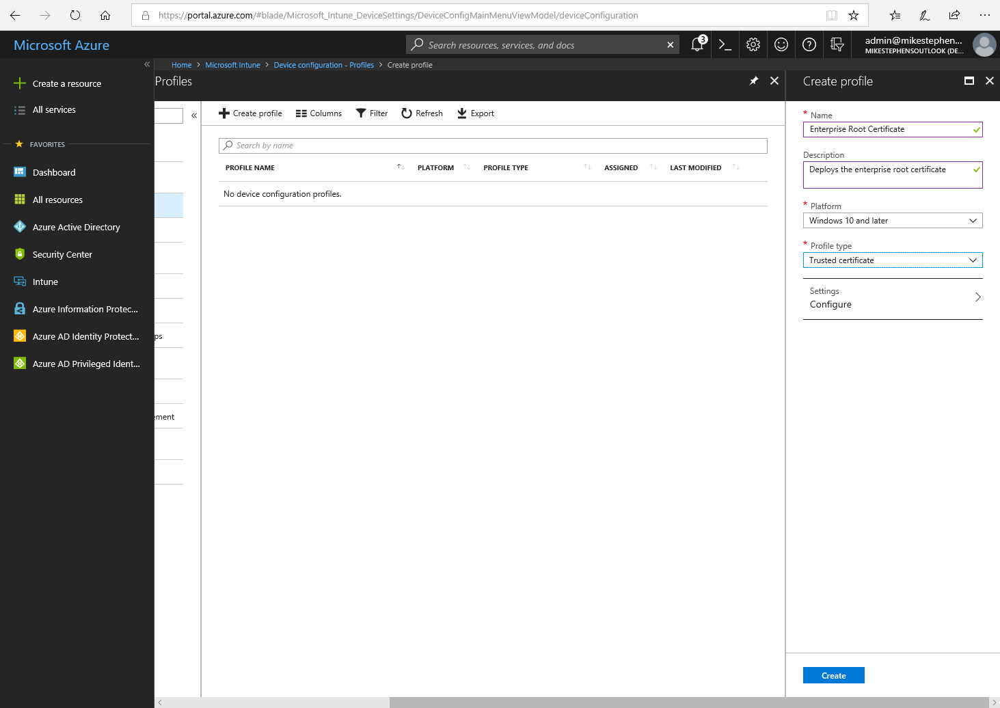
3. In the **Create profile** blade, type **Enterprise Root Certificate** in **Name**.  Provide a description.  Select **Windows 10 and later** from the **Platform** list.  Select **Trusted certificate** from the **Profile type** list.  Click **Configure**.
4. In the **Trusted Certificate** blade, use the folder icon to browse for the location of the enterprise root certificate file you created in step 8 of [Export Enterprise Root certificate](#export-enterprise-root-certificate).  Click **OK**.  Click **Create**.
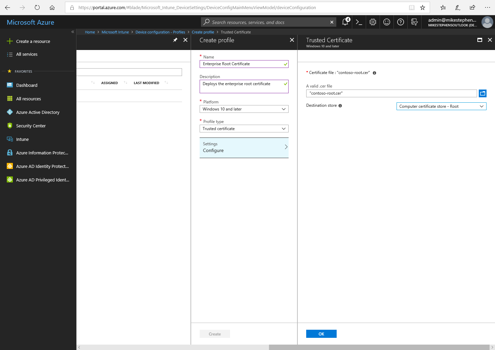
5. In the **Enterprise Root Certificate** blade, click **Assignments**.  In the **Include** tab, select **All Devices** from the **Assign to** list.  Click **Save**.
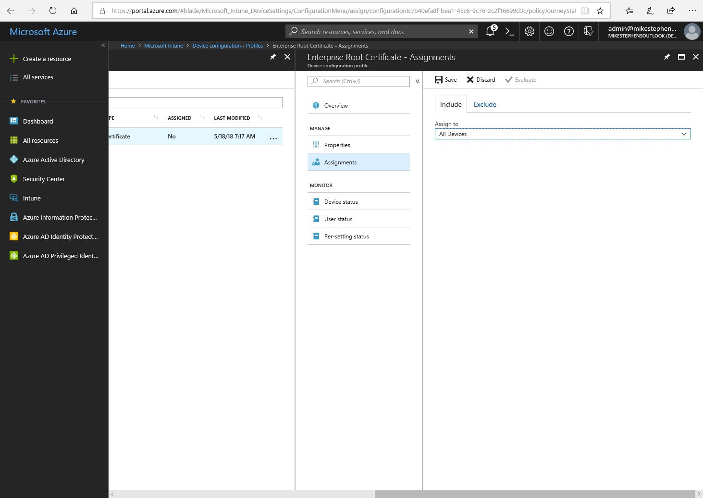
6. Sign out of the Microsoft Azure Portal.

## Configure Windows Hello for Business Device Enrollment

Sign-in a workstation with access equivalent to a _domain user_.

1. Sign-in to the [Azure Portal](https://portal.azure.com/).
2. Select **All Services**.  Type **Intune** to filter the list of services.  Click **Microsoft Intune**.
3. Click **device enrollment**.
4. Click **Windows enrollment**
5. Under **Windows enrollment**, click **Windows Hello for Business**.
   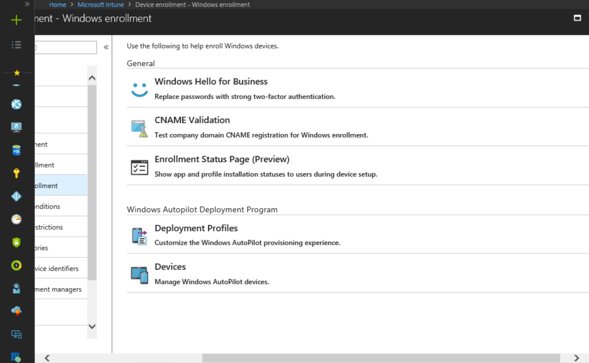
6. Under **Priority**, click **Default**. 
7. Under **All users and all devices**, click **Settings**.
8. Select **Enabled** from the **Configure Windows Hello for Business** list.
9. Select **Required** next to **Use a Trusted Platform Module (TPM)**.  By default, Windows Hello for Business prefers TPM 2.0 or falls backs to software. Choosing **Required** forces Windows Hello for Business to only use TPM 2.0 or TPM 1.2 and does not allow fall back to software based keys.
10. Type the desired **Minimum PIN length** and **Maximum PIN length**.
    > [!IMPORTANT]
    > The default minimum PIN length for Windows Hello for Business on Windows 10 is 6.  Microsoft Intune defaults the minimum PIN length to 4, which reduces the security of the user's PIN.  If you do not have a desired PIN length, set the minimum PIN length to 6.

11. Select the appropriate configuration for the following settings.
   * **Lowercase letters in PIN**
   * **Uppercase letters in PIN**
   * **Special characters in PIN**
   * **PIN expiration (days)**
   * **Remember PIN history**
     > [!NOTE]
     > The Windows Hello for Business PIN is not a symmetric key (a password).  A copy of the current PIN is not stored locally or on a server like in the case of passwords.  Making the PIN as complex and changed frequently as a password increases the likelihood of forgotten PINs.  Additionally, enabling PIN history is the only scenario that requires Windows 10 to store older PIN combinations (protected to the current PIN). Windows Hello for Business combined with a TPM provides anti-hammering functionality that prevents brute force attacks of the user's PIN.  If you are concerned with user-to-user shoulder surfacing, rather that forcing complex PIN that change frequently, consider using the [Multifactor Unlock](feature-multifactor-unlock.md) feature.

12. Select **Yes** next to **Allow biometric authentication** if you want to allow users to use biometrics (fingerprint and/or facial recognition) to unlock the device.  To further secure the use of biometrics, select **Yes** to **Use enhanced anti-spoofing, when available**.
13. Select **No** to **Allow phone sign-in**.  This feature has been deprecated.
14. Click **Save**
15. Sign-out of the Azure portal.

## Section Review
> [!div class="checklist"]
> * Configure Internet Information Services to host CRL distribution point
> * Prepare a file share to host the certificate revocation list
> * Configure the new CRL distribution point in the issuing certificate authority
> * Publish CRL
> * Reissue domain controller certificates
> * Export Enterprise Root certificate
> * Create and Assign a Trust Certificate Device Configuration Profile
> * Configure Windows Hello for Business Device Enrollment

If you plan on using certificates for on-premises single-sign on, perform the additional steps in [Using Certificates for On-premises Single-sign On](hello-hybrid-aadj-sso-cert.md). 
 

