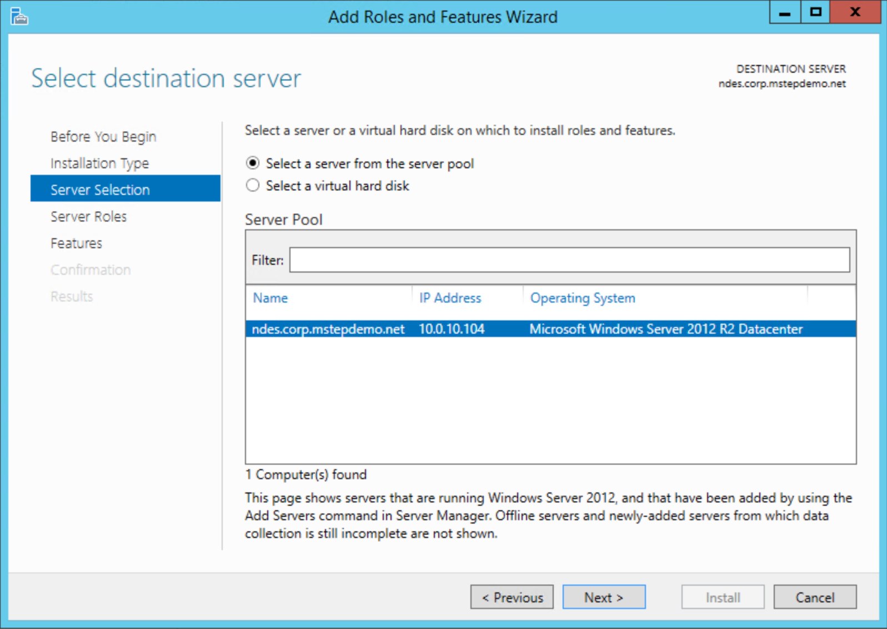
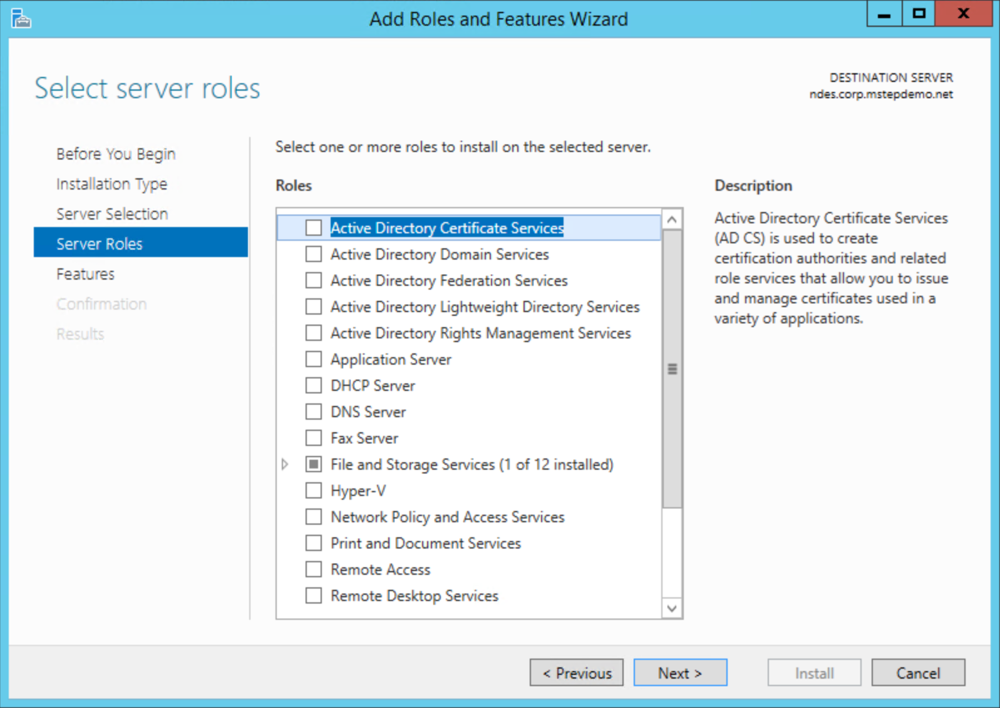

# Using Certificates for AADJ On-premises Single-sign On

**Applies to**
- Windows 10
- Azure Active Directory joined
- Hybrid Deployment
- Certificate trust

If you plan to use certificates for on-premises single-sign on, then follow these **additional** steps to configure the environment to enroll Windows Hello for Business certificates for Azure AD joined devices.

> [!IMPORTANT]
> Ensure you have performed the configurations in [Azure AD joined devices for On-premises Single-Sign On](hello-hybrid-aadj-sso-base.md) before you continue. 

Steps you will perform include:
- [Prepare Azure AD Connect](#prepare-azure-ad-connect)
- [Prepare the Network Device Enrollment Services Service Account](#prepare-the-network-device-enrollment-services-ndes-service-account)
- [Prepare Active Directory Certificate Services](#prepare-active-directory-certificate-authority)
- [Install the Network Device Enrollment Services Role](#install-and-configure-the-ndes-role)
- [Configure Network Device Enrollment Services to work with Microsoft Intune](#configure-network-device-enrollment-services-to-work-with-microsoft-intune)
- [Download, Install and Configure the Intune Certificate Connector](#download-install-and-configure-the-intune-certificate-connector)
- [Create and Assign a Simple Certificate Enrollment Protocol (SCEP) Certificate Profile](#create-and-assign-a-simple-certificate-enrollment-protocol-scep-certificate-profile)

## Requirements
You need to install and configure additional infrastructure to provide Azure AD joined devices with on-premises single-sign on.

- An existing Windows Server 2012 R2 or later Enterprise Certificate Authority
- A Windows Server 2012 R2 domain joined server that hosts the Network Device Enrollment Services role

### High Availaibilty
The Network Device Enrollment Services (NDES) server role acts as a certificate registration authority.  Certificate registration servers enroll certificates on behalf of the user.  Users request certificates from the NDES service rather than directly from the issuing certificate authority. 

The architecture of the NDES server prevents it from being clustered or load balanced for high availability.  To provide high availability, you need to install more than one identically configured NDES servers and use Microsoft Intune to load balance then (in round-robin fashion).

The Network Device Enrollment Service (NDES) server role can issue up to three unique certificate templates.  The server role accomplishes this by mapping the purpose of the certificate request to a configured certificate template.  The certificate request purpose has three options:

- Signature
- Encryption
- Signature and Encryption

If you need to deploy more than three types of certificates to the Azure AD joined device, you need additional NDES servers.  Alternatively, consider consolidating certificates templates to reduce the number of certificate templates.

### Network Requirements
All communication occurs securely over port 443. 

## Prepare Azure AD Connect
Successful authentication to on-premises resources using a certificate requires the certificate to provide a hint about the on-premises domain.  The hint can be the user's Active Directory distinguished name as the subject of the certificate, or the hint can be the user's user principal name where the suffix matches the Active Directory domain name.

Most environments change the user principal name suffix to match the organization's external domain name (or vanity domain), which prevents the user principal name as a hint to locate a domain controller.  Therefore, the certificate needs the user's on-premises distinguished name in the subject to properly locate a domain controller.

To include the on-premises distinguished name in the certificate's subject, Azure AD Connect must replicate the Active Directory **distinguishedName** attribute to the Azure Active Directory **onPremisesDistinguishedName** attribute.  Azure AD Connect version 1.1.819 includes the proper synchronization rules need to for these attributes. 

### Verify AAD Connect version
Sign-in to computer running Azure AD Connect with access equivalent to _local administrator_.

1. Open **Synchronization Services** from the **Azure AD Connect** folder.
2. In the **Synchronization Service Manager**, click **Help** and then click **About**.
3. If the version number is not **1.1.819** or later, then upgrade Azure AD Connect to the latest version.

### Verify the onPremisesDistinguishedName attribute is synchronized
The easiest way to verify the onPremisesDistingushedNamne attribute is synchronized is to use Azure AD Graph Explorer.

1. Open a web browser and navigate to https://graphexplorer.azurewebsites.net/
2. Click **Login** and provide Azure credentials
3. In the Azure AD Graph Explorer URL, type https://graph.windows.net/myorganization/users/[userid], where **[userid]** is the user principal name of user in Azure Active Directory.  Click **Go**
4. In the returned results, review the JSON data for the **onPremisesDistinguishedName** attribute.  Ensure the attribute has a value and the value is accurate for the given user.
   

## Prepare the Network Device Enrollment Services (NDES) Service Account

### Create the NDES Servers global security group
The deployment uses the **NDES Servers** security group to assign the NDES service the proper user right assignments.

Sign-in to a domain controller or management workstation with access equivalent to _domain administrator_.

1. Open **Active Directory Users and Computers**.
2. Expand the domain node from the navigation pane.
3. Right-click the **Users** container. Hover over **New** and click **Group**.
4. Type **NDES Servers** in the **Group Name** text box.
5. Click **OK**.

### Add the NDES server to the NDES Servers global security group
Sign-in to a domain controller or management workstation with access equivalent to _domain administrator_.

1. Open **Active Directory Users and Computers**.
2.  Expand the domain node from the navigation pane.
3.  Click **Computers** from the navigation pane. Right-click the name of the NDES server that will host the NDES server role.  Click **Add to a group...**.
4. Type **NDES Servers** in **Enter the object names to select**.  Click **OK**.  Click **OK** on the **Active Directory Domain Services** success dialog.

> [!NOTE]
> For high-availability, you should have more than one NDES server to service Windows Hello for Business certificate requests.  You should add additional Windows Hello for Business NDES servers to this group to ensure they receive the proper configuration.

### Create the NDES Service Account
The Network Device Enrollment Services (NDES) role runs under a service account. Typically, it is preferential to run services using a Group Managed Service Account (GMSA).  While the NDES role can be configured to run using a GMSA, the Intune Certificate Connector was not designed nor tested using a GMSA and is considered an unsupported configuration.  The deployment uses a normal services account.

Sign-in to a domain controller or management workstation with access equivalent to _domain administrator_.

1. In the navigation pane, expand the node that has your domain name.  Select **Users**.
2. Right-click the **Users** container. Hover over **New** and then select **User**.  Type **NDESSvc** in  **Full Name** and **User logon name**. Click **Next**.
3. Type a secure password in **Password**.  Confirm the secure password in **Confirm Password**.  Clear **User must change password at next logon**.  Click **Next**.
4. Click **Finish**.

> [!IMPORTANT]
> Configuring the service's account password to **Password never expires** may be more convenient, but it presents a security risk.  Normal service account passwords should expire in accordance with the organizations user password expiration policy.  Create a reminder to change the service account's password two weeks before it will expire.  Share the reminder with others that are allowed to change the password to ensure the password is changed before it expires. 

### Create the NDES Service User Rights Group Policy object
The Group Policy object ensures the NDES Service account has the proper user right assign all the NDES servers in the **NDES Servers** group.  As you add new NDES servers to your environment and this group, the service account automatically receives the proper user rights through Group Policy.

Sign-in a domain controller or management workstations with _Domain Admin_ equivalent credentials.

1. Start the **Group Policy Management Console** (gpmc.msc)
2. Expand the domain and select the **Group Policy Object** node in the navigation pane.
3. Right-click **Group Policy object** and select **New**.
4. Type **NDES Service Rights** in the name box and click **OK**.
5. In the content pane, right-click the **NDES Service Rights** Group Policy object and click **Edit**.
6. In the navigation pane, expand **Policies** under **Computer Configuration**.
7. Expand **Windows Settings > Security Settings > Local Policies**. Select **User Rights Assignments**.
8. In the content pane, double-click **Allow log on locally**. Select **Define these policy settings** and click **OK**.  Click **Add User or Group...**.  In the **Add User or Group** dialog box, click **Browse**.  In the **Select Users, Computers, Service Accounts, or Groups** dialog box, type **Administrators;Backup Operators;DOMAINNAME\NDESSvc;Users** where **DOMAINNAME** is the NetBios name of the domain (Example CONTOSO\NDESSvc) in **User and group names**.  Click **OK** twice.
9. In the content pane, double-click **Log on as a batch job**. Select **Define these policy settings** and click **OK**.  Click **Add User or Group...**.  In the **Add User or Group** dialog box, click **Browse**.  In the **Select Users, Computers, Service Accounts, or Groups** dialog box, type **Administrators;Backup Operators;DOMAINNAME\NDESSvc;Performance Log Users** where **DOMAINNAME** is the NetBios name of the domain (Example CONTOSO\NDESSvc) in **User and group names**.  Click **OK** twice.
10. In the content pane, double-click **Log on as a service**. Select **Define these policy settings** and click **OK**.  Click **Add User or Group...**.  In the **Add User or Group** dialog box, click **Browse**.  In the **Select Users, Computers, Service Accounts, or Groups** dialog box, type **NT SERVICE\ALL SERVICES;DOMAINNAME\NDESSvc** where **DOMAINNAME** is the NetBios name of the domain (Example CONTOSO\NDESSvc) in **User and group names**.  Click **OK** three times.
11. Close the **Group Policy Management Editor**. 

### Configure security for the NDES Service User Rights Group Policy object
The best way to deploy the **NDES Service User Rights** Group Policy object is to use security group filtering. This enables you to easily manage the computers that  receive the Group Policy settings by adding them to a group. 

Sign-in to a domain controller or management workstation with access equivalent to _domain administrator_.

1. Start the **Group Policy Management Console** (gpmc.msc)
2. Expand the domain and select the **Group Policy Object** node in the navigation pane.
3. Double-click the **NDES Service User Rights** Group Policy object.
4. In the **Security Filtering** section of the content pane, click **Add**.  Type **NDES Servers** or the name of the security group you previously created and click **OK**.
5. Click the **Delegation** tab. Select **Authenticated Users** and click **Advanced**.
6. In the **Group or User names** list, select **Authenticated Users**.  In the **Permissions for Authenticated Users** list, clear the **Allow** check box for the **Apply Group Policy** permission. Click **OK**.

### Deploy the NDES Service User Rights Group Policy object
The application of the **NDES Service User Rights** Group Policy object uses security group filtering.  This enables you to link the Group Policy object at the domain, ensuring the Group Policy object is within scope to all computers. However, the security group filtering ensures only computers included in the **NDES Servers** global security group receive and apply the Group Policy object, which results in providing the **NDESSvc** service account with the proper user rights.

Sign-in to a domain controller or management workstation with access equivalent to _domain administrator_.

1. Start the **Group Policy Management Console** (gpmc.msc)
2. In the navigation pane, expand the domain and right-click the node that has your Active Directory domain name and click **Link an existing GPO**
3. In the **Select GPO** dialog box, select **NDES Service User Rights** or the name of the Group Policy object you previously created and click **OK**.

> [!IMPORTANT]
> Linking the **NDES Service User Rights** Group Policy object to the domain ensures the Group Policy object is in scope for all computers. However, not all computers will have the policy settings applied to them. Only computers that are members of the **NDES Servers** global security group receive the policy settings. All others computers ignore the Group Policy object. 

## Prepare Active Directory Certificate Authority
You must prepare the public key infrastructure and the issuing certificate authority to support issuing certificates using Microsoft Intune and the Network Devices Enrollment Services (NDES) server role.  In this task, you will

- Configure the certificate authority to let Intune provide validity periods
- Create an NDES-Intune Authentication Certificate template
- Create an Azure AD joined Windows Hello for Business authentication certificate template
- Publish certificate templates

### Configure the certificate authority to let Intune provide validity periods
When deploying certificates using Microsoft Intune, you have the option of providing the validity period in the SCEP certificate profile rather than relying on the validity period in the certificate template.  If you need to issue the same certificate with different validity periods, it may be advantageous to use the SCEP profile, given the limited number of certificates a single NDES server can issue.

> [!NOTE]
> Skip this step if you do not want to enable Microsoft Intune to specify the validity period of the certificate.  Without this configuration, the certificate request uses the validity period configured in the certificate template.

Sign-in to the issuing certificate authority with access equivalent to _local administrator_.

1. Open and elevated command prompt.  Type the command
   ```
   certutil -setreg Policy\EditFlags +EDITF_ATTRIBUTEENDDATE
   ```
2. Restart the **Active Directory Certificate Services** service. 

### Create an NDES-Intune authentication certificate template
NDES uses a server authentication certificate to authenticate the server endpoint, which encrypts the communication between it and the connecting client.  The Intune Certificate Connector uses a client authentication certificate template to authenticate to the certificate registration point. 

Sign-in to the issuing certificate authority or management workstations with _Domain Admin_ equivalent credentials.

1.  Open the **Certificate Authority** management console.
2. Right-click **Certificate Templates** and click **Manage**.
3. In the **Certificate Template Console**, right-click the **Computer** template in the details pane and click **Duplicate Template**.
4. On the **General** tab, type **NDES-Intune Authentication** in **Template display name**.  Adjust the validity and renewal period to meet your enterprise's needs.  
    **Note:** If you use different template names, you'll need to remember and substitute these names in different portions of the lab.
5.  On the **Subject** tab, select **Supply in the request**.
6.  On the **Cryptography** tab, validate the **Minimum key size** is **2048**.
7.  On the **Security** tab, click **Add**. 
8.  Type **NDES server** in the **Enter the object names to select** text box and click **OK**.
9.  Select **NDES server** from the **Group or users names** list. In the **Permissions for** section, select the **Allow** check box for the **Enroll** permission. Clear the **Allow** check box for the **Enroll** and **Autoenroll** permissions for all other items in the **Group or users names** list if the check boxes are not already cleared. Click **OK**.
10.	 Click on the **Apply** to save changes and close the console. 

### Create an Azure AD joined Windows Hello for Business authentication certificate template
During Windows Hello for Business provisioning,  Windows 10 requests an authentication certificate from the Microsoft Intune, which requests the authentication certificate on behalf of the user.  This task configures the Windows Hello for Business authentication certificate template.  You use the name of the certificate template when configuring the NDES Server.

Sign-in a certificate authority or management workstations with _Domain Admin equivalent_ credentials.

1. Open the **Certificate Authority** management console.
2. Right-click **Certificate Templates** and click **Manage**.
3. Right-click the **Smartcard Logon** template and choose **Duplicate Template**.
4. On the **Compatibility** tab, clear the **Show resulting changes** check box.  Select **Windows Server 2012** or **Windows Server 2012 R2** from the **Certification Authority** list. Select **Windows Server 2012** or **Windows Server 2012 R2** from the **Certification Recipient** list.
5. On the **General** tab, type **AADJ WHFB Authentication** in **Template display name**.  Adjust the validity and renewal period to meet your enterprise's needs.   
    **Note:** If you use different template names, you'll need to remember and substitute these names in different portions of the deployment.
6. On the **Cryptography** tab, select **Key Storage Provider** from the **Provider Category** list.  Select **RSA** from the **Algorithm name** list.  Type **2048** in the **Minimum key size** text box.  Select **SHA256** from the **Request hash** list.  
7. On the **Extensions** tab, verify the **Application Policies** extension includes **Smart Card Logon**.
8. On the **Subject** tab, select **Supply in the request**.
9. On the **Request Handling** tab, select **Signature and encryption** from the **Purpose** list.  Select the **Renew with same key** check box. Select **Enroll subject without requiring any user input**.
10. On the **Security** tab, click **Add**. Type **NDESSvc** in the **Enter the object names to select** text box and click **OK**.
12. Select  **NDESSvc** from the **Group or users names** list. In the **Permissions for NDES Servers** section, select the **Allow** check box for the **Read**, **Enroll**. Clear the **Allow** check box for the **Enroll** and **Autoenroll** permissions for all other entries in the **Group or users names** section if the check boxes are not already cleared. Click **OK**. 
13. Close the console.

### Publish certificate templates
The certificate authority may only issue certificates for certificate templates that are published to that certificate authority.  If you have more than one certificate authority and you want that certificate authority to issue certificates based on a specific certificate template, then you must publish the certificate template to all certificate authorities that are expected to issue the certificate.

> [!Important]
> Ensure you publish the **AADJ WHFB Authentication** certificate templates to the certificate authority that Microsoft Intune uses by way of the NDES servers. The NDES configuration asks you to choose a certificate authority from which it requests certificates.  You need to publish that certificate templates to that issuing certificate authority.  The **NDES-Intune Authentication** certificate is directly enrolled and can be published to any certificate authority.

Sign-in to the certificate authority or management workstations with an _Enterprise Admin_ equivalent credentials.

1. Open the **Certificate Authority** management console.
2. Expand the parent node from the navigation pane.
3. Click **Certificate Templates** in the navigation pane.
4. Right-click the **Certificate Templates** node.  Click **New**, and click **Certificate Template** to issue.
5. In the **Enable Certificates Templates** window, select the **NDES-Intune Authentication** and **AADJ WHFB Authentication** templates you created in the previous steps.  Click **OK** to publish the selected certificate templates to the certificate authority.   
6. Close the console.

## Install and Configure the NDES Role
This section includes the following topics:
* Install the Network Device Enrollment Service Role
* Configure the NDES service account
* Configure the NDES role and Certificate Templates
* Create a Web Application Proxy for the Internal NDES URL.
* Enroll for an NDES-Intune Authentication Certificate
* Configure the Web Server Certificate for NDES
* Verify the configuration

### Install the Network Device Enrollment Services Role
Install the Network Device Enrollment Service role on a computer other than the issuing certificate authority.

Sign-in to the certificate authority or management workstations with an _Enterprise Admin_ equivalent credentials.

1. Open **Server Manager** on the NDES server.
2. Click **Manage**.  Click **Add Roles and Features**. 
3. In the **Add Roles and Features Wizard**, on the **Before you begin** page, click **Next**.  Select **Role-based or feature-based installation** on the **Select installation type** page.  Click **Next**.  Click **Select a server from the server pool**.  Select the local server from the **Server Pool** list.  Click **Next**.
   
4. On the **Select server roles** page, select **Active Directory Certificate Services** from the **Roles** list.  
   
   Click **Add Features** on the **Add Roles and Feature Wizard** dialog box.  Click **Next**.
   
5. On the **Features** page, expand **.NET Framework 3.5 Features**.  Select **HTTP Activation**.  Click **Add Features** on the **Add Roles and Feature Wizard** dialog box.  Expand **.NET Framework 4.5 Features**.  Expand **WCF Services**.  Select **HTTP Activation**.  Click **Add Features** on the **Add Roles and Feature Wizard** dialog box.  Click **Next**.
   
6. On the **Select role services** page, clear the **Certificate Authority** check box. Select the **Network Device Enrollment Service**.  Click **Add Features** on the **Add Roles and Features Wizard** dialog box. Click **Next**.
   
7. Click **Next** on the **Web Server Role (IIS)** page.
8. On the **Select role services** page for the Web Serve role, Select the following additional services if they are not already selected and then click **Next**.
   * **Web Server > Security > Request Filtering**
   * **Web Server > Application Development > ASP.NET 3.5**.
   * **Web Server > Application Development > ASP.NET 4.5**.   .
   * **Management Tools > IIS 6 Management Compatibility > IIS 6 Metabase Compatibility**
   * **Management Tools > IIS 6 Management Compatibility > IIS 6 WMI Compatibility**
   
9. Click **Install**. When the installation completes, continue with the next procedure.  **Do not click Close**.
   > [!Important]
   > The .NET Framework 3.5 is not included in the typical installation.  If the server is connected to the Internet, the installation attempts to get the files using Windows Update.  If the server is not connected to the Internet, you need to **Specify an alternate source path** such as \<driveLetter>:\\Sources\SxS\
   

### Configure the NDES service account
This task adds the NDES service account to the local IIS_USRS group.  The task also configures the NDES service account for Kerberos authentication and delegation

#### Add the NDES service account to the IIS_USRS group
Sign-in the NDES server with access equivalent to _local administrator_.

1. Start the **Local Users and Groups** management console (lusrmgr.msc).
2. Select **Groups** from the navigation pane. Double-click the IIS_IUSRS group.
3. In the **IIS_IUSRS Properties** dialog box, click **Add**.  Type **NDESSvc** or the name of your NDES service account.  Click **Check Names** to verify the name and then click **OK**. Click **OK** to close the properties dialog box.
4. Close the management console.

#### Register a Service Principal Name on the NDES Service account
Sign-in the NDES server with a access equivalent to _Domain Admins_.

1. Open an elevated command prompt.
2. Type the following command to register the service principal name<br>
```setspn -s http/[FqdnOfNdesServer] [DomainName\\NdesServiceAccount]```<br>
where **[FqdnOfNdesServer]** is the fully qualified domain name of the NDES server and **[DomainName\NdesServiceAccount]** is the domain name and NDES service account name separated by a backslash (\\).  An example of the command looks like the following.<br>
```setspn -s http/ndes.corp.contoso.com contoso\ndessvc```

> [!NOTE]
> If you use the same service account for multiple NDES Servers, repeat the following task for each NDES server under which the NDES service runs.


#### Configure the NDES Service account for delegation
The NDES service enrolls certificates on behalf of users.  Therefore, you want to limit the actions it can perform on behalf of the user. You do this through delegation.

Sign-in a domain controller with a minimum access equivalent to _Domain Admins_.

1. Open **Active Directory Users and Computers**
2. Locate the NDES Service account (NDESSvc). Right-click and select **Properties**. Click the **Delegation** tab.

3. Select **Trust this user for delegation to specified services only**.
4. Select **Use any authentication protocol**.
5. Click **Add**.
6. Click **Users or Computers...**  Type the name of the _NDES Server_ you use to issue Windows Hello for Business authentication certificates to Azure AD joined devices.  From the **Avaiable services** list, select **HOST**.  Click **OK**.

7. Repeat steps 5 and 6 for each NDES server using this service account.8. Click **Add**.
8. Click **Users or computers...**  Type the name of the issuing certificate authority this NDES service account uses to issue Windows Hello for Business authentication certificates to Azure AD joined devices.  From the **Available services** list, select **dcom**.  Hold the **CTRL** key and select **HOST**. Click **OK**.
9. Repeat steps 8 and 9 for each issuing certificate authority from which one or more NDES servers request certificates.

10. Click **OK**.  Close **Active Directory Users and Computers**.

### Configure the NDES Role and Certificate Templates
This task configures the NDES role and the certificate templates the NDES server issues.

#### Configure the NDES Role
Sign-in to the certificate authority or management workstations with an _Enterprise Admin_ equivalent credentials.

> [!NOTE]
> If you closed Server Manger from the last set of tasks, start Server Manager and click the action flag that shows a yellow exclamation point. 


1. Click the **Configure Active Directory Certificate Services on the destination server** link.
2. On the **Credentials** page, click **Next**.

3. On the **Role Services** page, select **Network Device Enrollment Service** and then click **Next**

4. On the **Service Account for NDES** page, select **Specify service account (recommended)**.  Click **Select...** Type the user name and password for the NDES service account in the **Windows Security** dialog box.  Click **Next**.

5. On the **CA for NDES** page, select **CA name**. Click **Select...**.  Select the issuing certificate authority from which the NDES server requests certificates.  Click **Next**.

6. On the **RA Information**, click **Next**.
7. On the **Cryptography for NDES** page, click **Next**.
8. Review the **Confirmation** page.  Click **Configure**.

8. Click **Close** after the configuration completes.

#### Configure Certificate Templates on NDES
A single NDES server can request a maximum of three certificate template.  The NDES server determines which certificate to issue based on the incoming certificate request that is assigned in the Microsoft Intune SCEP certificate profile.  The Microsoft Intune SCEP certificate profile has three values.  
* Digital Signature
* Key Encipherment
* Key Encipherment, Digital Signature

Each value maps to a registry value name in the NDES server.  The NDES server translate an incoming SCEP provide value into the correspond certificate template.  The table belows shows the SCEP profile value to the NDES certificate template registry value name

|SCEP Profile Key usage| NDES Registry Value Name|
|:----------:|:-----------------------:|
|Digital Signature|SignatureTemplate|
|Key Encipherment|EncryptionTemplate|
|Key Encipherment<br>Digital Signature|GeneralPurposeTemplate|

Ideally, you should match the certificate request with registry value name to keep the configuration intuitive (encryption certificates use the encryptionTemplate, signature certificates use the signature template, etc.).  A result of this intuitive design is the potential exponential growth in NDES server. Imagine an organization that needs to issue nine unique signature certificates across their enterprise.

 If the need arises, you can configure a signature certificate in the encryption registry value name or an encryption certificate in the signature registry value to maximize the use of your NDES infrastructure.  This unintuitive design requires current and accurate documentation of the configuration to ensure the SCEP certificate profile is configured to enroll the correct certificate, regardless of the actual purpose. Each organization needs to balance ease of configuration and administration with additional NDES infrastructure and the management overhead that comes with it.

Sign-in to the NDES Server with _local administrator_ equivalent credentials.

1. Open an elevated command prompt.
2. Using the table above, decide which registry value name you will use to request Windows Hello for Business authentication certificates for Azure AD joined devices.
3. Type the following command<br>
```reg add HKLM\Software\Microsoft\Cryptography\MSCEP /v [registryValueName] /t REG_SZ /d [certificateTemplateName]```<br>
where **registryValueName** is one of the three value names from the above table and where **certificateTemplateName** is the name of the certificate template you created for Windows Hello for Business Azure AD joined devices.  Example:<br>
```reg add HKLM\Software\Microsoft\Cryptography\MSCEP /v SignatureTemplate /t REG_SZ /d AADJWHFBAuthentication```<br>
4. Type **Y** when the command asks for permission to overwrite the existing value.
5. Close the command prompt.

> [!IMPORTANT]
> Use the **name** of the certificate template; not the **display name**.  The certificate template name does not include spaces.  You can view the certificate names by looking at the **General** tab of the certificate template's properties in the **Certificates Templates** management console (certtmpl.msc).

### Create a Web Application Proxy for the internal NDES URL.
Certificate enrollment for Azure AD joined devices occurs over the Internet.  As a result, the internal NDES URLs must be accessible externally. You can do this easily and securely using Azure Active Directory Application Proxy.  Azure AD Application Proxy provides single sign-on and secure remote access for web applications hosted on-premises, such as Network Device Enrollment Services.

Ideally, you configure your Microsoft Intune SCEP certificate profile to use multiple external NDES URLs.  This enables Microsoft Intune to round-robin load balance the certificate requests to identically configured NDES Servers (each NDES server can accommodate approximately 300 concurrent requests).  Microsoft Intune sends these requests to Azure AD Application Proxies.  

Azure AD Application proxies are serviced by lightweight Application Proxy Connector agents.  These agents are installed on your on-premises, domain joined devices and make authenticated secure outbound connection to Azure, waiting to process requests from Azure AD Application Proxies. You can create connector groups in Azure Active Directory to assign specific connectors to service specific applications.

Connector group automatically round-robin, load balance the Azure AD Application proxy requests to the connectors within the assigned connector group.  This ensures Windows Hello for Business certificate requests have multiple dedicated Azure AD Application Proxy connectors exclusively available to satisfy enrollment requests.  Load balancing the NDES servers and connectors should ensure users enroll their Windows Hello for Business certificates in a timely manner.

#### Download and Install the Application Proxy Connector Agent
Sign-in a workstation with access equivalent to a _domain user_.

1. Sign-in to the [Azure Portal](https://portal.azure.com/) with access equivalent to **Global Administrator**.
2. Select **All Services**.  Type **Azure Active Directory** to filter the list of services.  Under **SERVICES**, Click **Azure Active Directory**.
3. Under **MANAGE**, click **Application proxy**.
4. Click **Download connector service**.  Click **Accept terms & Download**.  Save the file (AADApplicationProxyConnectorInstaller.exe) in a location accessible by others on the domain.
   
5. Sign-in the computer that will run the connector with access equivalent to a _domain user_.
   > [!IMPORTANT]
   > Install a minimum of two Azure Active Directory Proxy connectors for each NDES Application Proxy.  Strategtically locate Azure AD application proxy connectors throughout your organization to ensure maximum availablity.  Remember, devices running the connector must be able to communicate with Azure and the on-premises NDES servers.

6. Start **AADApplicationProxyConnectorInstaller.exe**.
7. Read the license terms and then select **I agree to the license terms and conditions**.  Click **Install**.
   
8. Sign-in to Microsoft Azure with access equivalent to **Global Administrator**.
   
9. When the installation completes. Read the information regarding outbound proxy servers.  Click **Close**.
   
10. Repeat steps 5 - 10 for each device that will run the Azure AD Application Proxy connector for Windows Hello for Business certificate deployments.

#### Create a Connector Group
Sign-in a workstation with access equivalent to a _domain user_.

1. Sign-in to the [Azure Portal](https://portal.azure.com/) with access equivalent to **Global Administrator**.
2. Select **All Services**.  Type **Azure Active Directory** to filter the list of services.  Under **SERVICES**, Click **Azure Active Directory**.
3. Under **MANAGE**, click **Application proxy**.

4. Click **New Connector Group**. Under **Name**, type **NDES WHFB Connectors**.

5. Select each connector agent in the **Connectors** list that will service Windows Hello for Business certificate enrollment requests.
6. Click **Save**.

#### Create the Azure Application Proxy
Sign-in a workstation with access equivalent to a _domain user_.

1. Sign-in to the [Azure Portal](https://portal.azure.com/) with access equivalent to **Global Administrator**.
2. Select **All Services**.  Type **Azure Active Directory** to filter the list of services.  Under **SERVICES**, Click **Azure Active Directory**.
3. Under **MANAGE**, click **Application proxy**.
4. Click **Configure an app**.
5. Under **Basic Settings** next to **Name**, type **WHFB NDES 01**.  Choose a name that correlates this Azure AD Application Proxy setting with the on-premises NDES server.  Each NDES server must have its own Azure AD Application Proxy as two NDES servers cannot share the same internal URL.
6. Next to **Internal Url**, type the internal, fully qualified DNS name of the NDES server associated with this Azure AD Application Proxy.  For example, https://ndes.corp.mstepdemo.net).  You need to match the primary host name (AD Computer Account name) of the NDES server, and prefix the URL with **https**.
7. Under **Internal Url**, select **https://** from the first list.  In the text box next to **https://**, type the hostname you want to use as your external hostname for the Azure AD Application Proxy.  In the list next to the hostname you typed, select a DNS suffix you want to use externally for the Azure AD Application Proxy.  It is recommended to use the default, -[tenantName].msapproxy.net where **[tenantName]** is your current Azure Active Directory tenant name (-mstephendemo.msappproxy.net).
   
8. Select **Passthrough** from the **Pre Authentication** list.
9. Select **NDES WHFB Connectors** from the **Connector Group** list.
10. Under **Additional Settings**, select **Default** from **Backend Application Timeout**.  Under the **Translate URLLs In** section, select **Yes** next to **Headers** and select **No** next to **Application Body**.
11. Click **Add**.
12. Sign-out of the Azure Portal.
    > [!IMPORTANT]
    > Write down the internal and external URLs.  You will need this information when you enroll the NDES-Intune Authentication certificate.


### Enroll the NDES-Intune Authentication certificate
This task enrolls a client and server authentication certificate used by the Intune connector and the NDES server.

Sign-in the NDES server with access equivalent to _local administrators_.

1. Start the Local Computer **Certificate Manager** (certlm.msc).
2. Expand the **Personal** node in the navigation pane.
3. Right-click **Personal**. Select **All Tasks** and **Request New Certificate**.
4. Click **Next** on the **Before You Begin** page.
5. Click **Next** on the **Select Certificate Enrollment Policy** page.
6. On the **Request Certificates** page, Select the **NDES-Intune Authentication** check box.
7. Click the **More information is required to enroll for this certificate. Click here to configure settings** link   
    
8. Under **Subject name**, select **Common Name** from the **Type** list.  Type the internal URL used in the previous task (without the https://, for example **ndes.corp.mstepdemo.net**) and then click **Add**.
9. Under **Alternative name**, select **DNS** from the **Type** list.  Type the internal URL used in the previous task (without the https://, for example **ndes.corp.mstepdemo.net**).  Click **Add**. Type the external URL used in the previous task (without the https://, for example **ndes-mstephendemo.msappproxy.net**). Click **Add**. Click **OK** when finished.
9. Click **Enroll**
10. Repeat these steps for all NDES Servers used to request Windows Hello for Business authentication certificates for Azure AD joined devices.

### Configure the Web Server Role
This task configures the Web Server role on the NDES server to use the server authentication certificate.

Sign-in the NDES server with access equivalent to _local administrator_.

1. Start **Internet Information Services (IIS) Manager** from **Administrative Tools**.
2. Expand the node that has the name of the NDES server.  Expand **Sites** and select **Default Web Site**. 

3. Click **Bindings...*** under **Actions**.  Click **Add**.

4. Select **https** from **Type**. Confirm the value for **Port** is **443**.
5. Select the certificate you previously enrolled from the **SSL certificate** list.  Select **OK**.

6. Select **http** from the **Site Bindings** list.  Click **Remove**. 
7. Click **Close** on the **Site Bindings** dialog box.
8. Close **Internet Information Services (IIS) Manager**. 

### Verify the configuration
This task confirms the TLS configuration for the NDES server.

Sign-in the NDES server with access equivalent to _local administrator_.

#### Disable Internet Explorer Enhanced Security Configuration 
1. Open **Server Manager**. Click **Local Server** from the navigation pane.
2. Click **On** next to **IE Enhanced Security Configuration** in the **Properties** section.
3. In the **Internet Explorer Enhanced Security Configuration** dialog, under **Administrators**, select **Off**.  Click **OK**.
4. Close **Server Manager**.

#### Test the NDES web server
1. Open **Internet Explorer**. 
2. In the navigation bar, type 
```https://[fqdnHostName]/certsrv/mscep/mscep.dll```
where **[fqdnHostName]** is the fully qualified internal DNS host name of the NDES server.

A web page similar to the following should appear in your web browser.  If you do not see similar page, or you get a **503 Service unavailable**, ensure the NDES Service account as the proper user rights.  You can also review the application event log for events with the **NetworkDeviceEnrollmentSerice** source.


Confirm the web site uses the server authentication certificate. 


## Configure Network Device Enrollment Services to work with Microsoft Intune
You have successfully configured the Network Device Enrollment Services.  You must now modify the configuration to work with the Intune Certificate Connector.  In this task, you will enable the NDES server and http.sys to handle long URLs. 

- Configure NDES to support long URLs

### Configure NDES and HTTP to support long URLs
Sign-in the NDES server with access equivalent to _local administrator_.

#### Configure the Default Web Site
1. Start **Internet Information Services (IIS) Manager** from **Administrative Tools**.
2. Expand the node that has the name of the NDES server.  Expand **Sites** and select **Default Web Site**.
3. In the content pane, double-click **Request Filtering**.  Click **Edit Feature Settings...** in the action pane.

4. Select **Allow unlisted file name extensions**.
5. Select **Allow unlisted verbs**.
6. Select **Allow high-bit characters**.
7. Type **30000000** in **Maximum allowed content length (Bytes)**.
8. Type **65534** in **Maximum URL length (Bytes)**.
9. Type **65534** in **Maximum query string (Bytes)**.
10. Click **OK**.  Close **Internet Information Services (IIS) Manager**.

#### Configure Parameters for HTTP.SYS
1. Open an elevated command prompt.
2. Run the following commands <br>
```reg add HKLM\SYSTEM\CurrentControlSet\Services\HTTP\Parameters /v MaxFieldLength /t REG_DWORD /d 65534``` <br>
```reg add HKLM\SYSTEM\CurrentControlSet\Services\HTTP\Parameters /v MaxRequestBytes /t REG_DWORD /d 65534```<br>
3. Restart the NDES server.

## Download, Install and Configure the Intune Certificate Connector
The Intune Certificate Connector application enables Microsoft Intune to enroll certificates using your on-premises PKI for users on devices managed by Microsoft Intune.  

### Download Intune Certificate Connector 
Sign-in a workstation with access equivalent to a _domain user_.

1. Sign-in to the [Azure Portal](https://portal.azure.com/).
2. Select **All Services**.  Type **Intune** to filter the list of services.  Click **Microsoft Intune**.

3. Select **Device Configuration**, and then select **Certificate Connectors**.

4. Click **Add**, and then click **Download the certificate connector software** under the **Steps to install connector for SCEP** section.

5. Save the downloaded file (NDESConnectorSetup.exe) to a location accessible from the NDES server.
6. Sign-out of the Azure Portal.

### Install the Intune Certificate Connector
Sign-in the NDES server with access equivalent to _domain administrator_.

1. Copy the Intune Certificate Connector Setup (NDESConnectorSetup.exe) downloaded in the previous task locally to the NDES server.
2. Run **NDESConnectorSetup.exe** as an administrator. If the setup shows a dialog that reads **Microsoft Intune NDES Connector requires HTTP Activation**, ensure you started the application as an administrator, then check HTTP Activation is enabled on the NDES server.
3. On the **Microsoft Intune** page, click **Next**. 
   
4. Read the **End User License Agreement**.  Click **Next** to accept the agreement and to proceed with the installation.
5. On the **Destination Folder** page, click **Next**.
6. On the **Installation Options** page, select **SCEP and PFX Profile Distribution** and click **Next**.
   
7. On the **Client certificate for Microsoft Intune** page, Click **Select**.  Select the certificate previously enrolled for the NDES server. Click **Next**. 
   
   > [!NOTE]
   > The **Client certificate for Microsoft Intune** page does not update after selecting the client authentication certificate.  However, the application rembers the selection and shows it in the next page.

8. On the **Client certificate for the NDES Policy Module** page, verify the certificate information and then click **Next**.
9. ON the **Ready to install Microsoft Intune Connector** page. Click **Install**.
   
   > [!NOTE]
   > You can review the results of the install using the **SetupMsi.log** file located in the **C:\\NDESConnectorSetupMsi** folder

10. When the installation completes, select **Launch Intune Connector** and click Finish. Proceed to the Configure the Intune Certificate Connector task. 
    

### Configure the Intune Certificate Connector
Sign-in the NDES server with access equivalent to _domain administrator_.

1. The **NDES Connector** user interface should be open from the last task.
   > [!NOTE]
   > If the **NDES Connector** user interface is not open, you can start it from **\<install_Path>\NDESConnectorUI\NDESConnectorUI.exe**.

2. If your organization uses a proxy server and the proxy is needed for the NDES server to access the Internet, select **Use proxy server**, and then enter the proxy server name, port, and credentials to connect.  Click **Apply**
   

3. Click **Sign-in**.  Type credentials for your Intune administrator, or tenant administrator that has the **Global Administrator** directory role.
   
   > [!IMPORTANT]
   > The user account must have a valid Intune licenese asssigned.  If the user account does not have a valid Intune license, the sign-in fails.

4. Optionally, you can configure the NDES Connector for certificate revocation. If you want to do this, continue to the next task. Otherwise, Click **Close**, restart the **Intune Connector Service** and the **World Wide Web Publishing Service**, and skip the next task. 


### Configure the NDES Connector for certificate revocation (**Optional**)
Optionally (not required), you can configure the Intune connector for certificate revocation when a device is wiped, unenrolled, or when the certificate profile falls out of scope for the targeted user (users is removed, deleted, or the profile is deleted).

#### Enabling the NDES Service account for revocation
Sign-in the certificate authority used by the NDES Connector with access equivalent to _domain administrator_.

1. Start the **Certification Authority** management console.
2. In the navigation pane, right-click the name of the certificate authority and select **Properties**.
3. Click the **Security** tab.  Click **Add**. In **Enter the object names to select** box, type **NDESSvc** (or the name you gave the NDES Service account).  Click *Check Names*. Click **OK**.  Select the NDES Service account from the **Group or user names** list. Select **Allow** for the **Issue and Manage Certificates** permission.  Click **OK**.

4. Close the **Certification Authority**

#### Enable the NDES Connector for certificate revocation
Sign-in the NDES server with access equivalent to _domain administrator_.

1. Open the **NDES Connector** user interface (**\<install_Path>\NDESConnectorUI\NDESConnectorUI.exe**).
2. Click the **Advanced** tab.  Select **Specify a different account username and password**.  TYpe the NDES service account username and password.  Click **Apply**.  Click **OK** to close the confirmation dialog box.  Click **Close**.

3. Restart the **Intune Connector Service** and the **World Wide Web Publishing Service**.

### Test the NDES Connector
Sign-in the NDES server with access equivalent to _domain admin_.

1. Open a command prompt.
2. Type the following command to confirm the NDES Connector's last connection time is current.</br>
```reg query hklm\software\Microsoft\MicrosoftIntune\NDESConnector\ConnectionStatus```</br>
3. Close the command prompt.
4. Open **Internet Explorer**.
5. In the navigation bar, type</br>
```https://[fqdnHostName]/certsrv/mscep/mscep.dll```</br>
where **[fqdnHostName]** is the fully qualified internal DNS host name of the NDES server.</br>
A web page showing a 403 error (similar to the following) should appear in your web browser.  If you do not see similar page, or you get a **503 Service unavailable**, ensure the NDES Service account as the proper user rights.  You can also review the application event log for events with the **NetworkDeviceEnrollmentSerice** source.

6. Using **Server Manager**, enable **Internet Explorer Enhanced Security Configuration**.

## Create and Assign a Simple Certificate Enrollment Protocol (SCEP) Certificate Profile

### Create an AADJ WHFB Certificate Users Group
Sign-in a workstation with access equivalent to a _domain user_.

1. Sign-in to the [Azure Portal](https://portal.azure.com/) with access equivalent to **Global Administrator**.
2. Select **All Services**.  Type **Azure Active Directory** to filter the list of services.  Under **SERVICES**, Click **Azure Active Directory**.
3. Click **Groups**.  Click **New group**.
4. Select **Security** from the **Group type** list.
5. Under **Group Name**, type the name of the group.  For example, **AADJ WHFB Certificate Users**.
6. Provide a **Group description**, if applicable.
7. Select **Assigned** from the **Membership type** list.

8. Click **Members**.  Use the  **Select members** pane to add members to this group. When finished click **Select**.
9. Click **Create**.

### Create a SCEP Certificate Profile
Sign-in a workstation with access equivalent to a _domain user_.

1. Sign-in to the [Azure Portal](https://portal.azure.com/).
2. Select **All Services**.  Type **Intune** to filter the list of services.  Click **Microsoft Intune**.
3. Select **Device Configuration**, and then click **Profiles**.
4. Select **Create Profile**.
   
5. Next to **Name**, type **WHFB Certificate Enrollment**.
6. Next to **Description**, provide a description meaningful for your environment.
7. Select **Windows 10 and later** from the **Platform** list.
8. Select **SCEP certificate** from the **Profile** list.
   
9. The **SCEP Certificate** blade should open. Configure **Certificate validity period** to match your organization.
   > [!IMPORTANT]
    > Remember that you need to configure your certificate authority to allow Microsoft Intune to configure certificate validity.

10. Select **Enroll to Windows Hello for Business, otherwise fail (Windows 10 and later)** from the **Key storage provider (KSP)** list.
11. Select **Custom** from the **Subject name format** list.
12. Next to **Custom**, type **CN={{OnPrem_Distinguished_Name}}** to make the on-premises distinguished name the subject of the issued certificate.
13. Specify **User Principal Name (UPN)** as a **Subject Alternative Name** value.
14. Refer to the "Configure Certificate Templates on NDES" task for how you configured the **AADJ WHFB Authentication** certificate template in the registry. Select the appropriate combination of key usages from the **Key Usages** list that map to configured NDES template in the registry. In this example, the **AADJ WHFB Authentication** certificate template was added to the **SignatureTemplate** registry value name. The **Key usage** that maps to that registry value name is **Digital Signature**.
15. Select a previously configured **Trusted certificate** profile that matches the root certificate of the issuing certificate authority.
    
16. Under **Extended key usage**, type **Smart Card Logon** under **Name**. Type **1.3.6.1.4.1.311.20.2.2** under **Object identifier**. Click **Add**.
17. Type a percentage (without the percent sign) next to **Renewal Threshold** to determine when the certificate should attempt to renew. The recommended value is **20**.
    
18. Under **SCEP Server URLs**, type the fully qualified external name of the Azure AD Application proxy you configured. Append to the name **/certsrv/mscep/mscep.dll**. For example, https://ndes-mtephendemo.msappproxy.net/certsrv/mscep/mscep.dll. Click **Add**. Repeat this step for each additional NDES Azure AD Application Proxy you configured to issue Windows Hello for Business certificates. Microsoft Intune round-robin load balances requests among the URLs listed in the SCEP certificate profile.
19. Click **OK**.
20. Click **Create**.

### Assign Group to the WHFB Certificate Enrollment Certificate Profile
Sign-in a workstation with access equivalent to a _domain user_.

1. Sign-in to the [Azure Portal](https://portal.azure.com/).
2. Select **All Services**.  Type **Intune** to filter the list of services.  Click **Microsoft Intune**.
3. Select **Device Configuration**, and then click **Profiles**.
4. Click **WHFB Certificate Enrollment**.

5. Click **Assignments**.
6. In the **Assignments** pane, Click **Include**.  Select **Selected Groups** from the **Assign to** list.  Click **Select groups to include**.

7. Select the **AADJ WHFB Certificate Users** group. Click **Select**.
8. Click **Save**.

You have successfully completed the configuration.  Add users that need to enroll a Windows Hello for Business authentication certificate to the **AADJ WHFB Certificate Users** group.  This group, combined with the device enrollment Windows Hello for Business configuration prompts the user to enroll for Windows Hello for Business and enroll a certificate that can be used to authentication to on-premises resources.

## Section Review
> [!div class="checklist"]
> * Requirements
> * Prepare Azure AD Connect
> * Prepare the Network Device Enrollment Services (NDES) Service Acccount
> * Prepare Active Directory Certificate Authority
> * Install and Configure the NDES Role
> * Configure Network Device Enrollment Services to work with Microsoft Intune
> * Download, Install, and Configure the Intune Certificate Connector
> * Create and Assign a Simple Certificate Enrollment Protocol (SCEP Certificate Profile)
