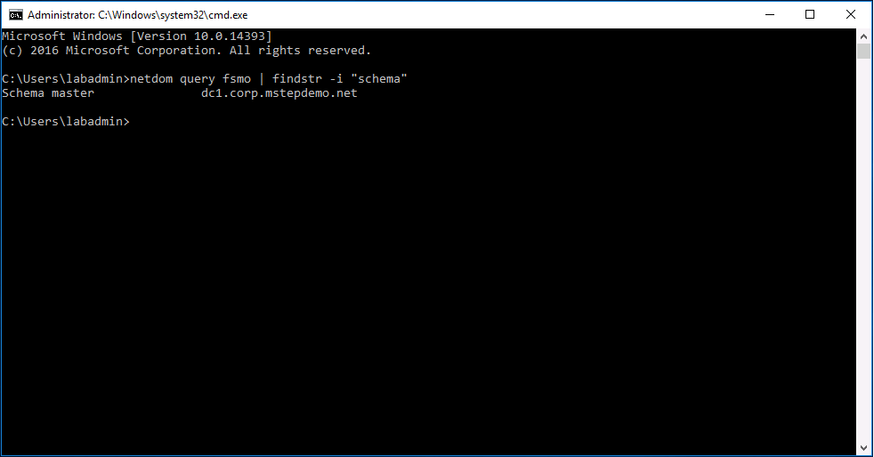
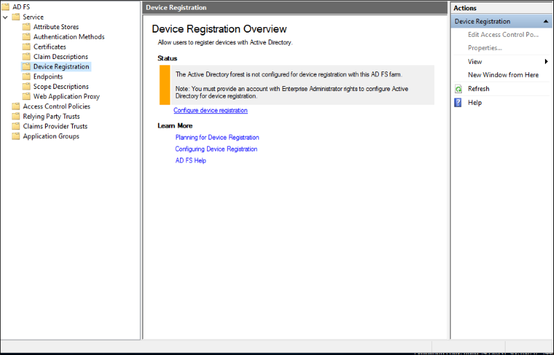
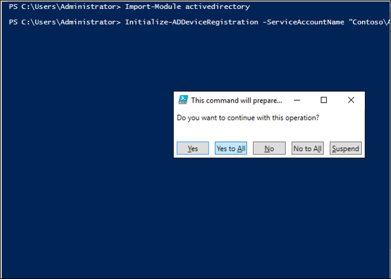
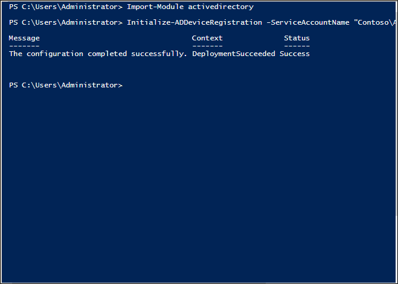
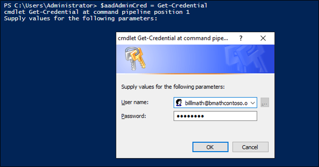
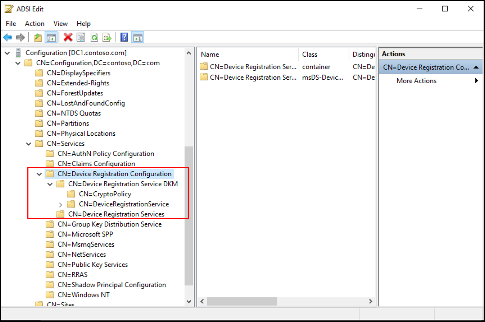

# Configure Device Registration for Hybrid Windows Hello for Business

**Applies to**
-  Windows 10, version 1703 or later
-  Hybrid deployment
-  Certificate trust

 
Your environment is federated and you are ready to configure device registration for your hybrid environment. Hybrid Windows Hello for Business deployment needs device registration and device write-back to enable proper device authentication.  
  
> [!IMPORTANT]
> If your environment is not federated, review the [New Installation baseline](hello-hybrid-cert-new-install.md) section of this deployment document to learn how to federate your environment for your Windows Hello for Business deployment. 

Use this three-phased approach for configuring device registration.
1. [Configure devices to register in Azure](#configure-azure-for-device-registration)
2. [Synchronize devices to on-premises Active Directory](#configure-active-directory-to-support-azure-device-synchronization)
3. [Configure AD FS to use cloud devices](#configure-ad-fs-to-use-azure-registered-devices)

> [!NOTE]
> Before proceeding, you should familiarize yourself with device registration concepts such as:
> * Azure AD registered devices
> * Azure AD joined devices
> * Hybrid Azure AD joined devices
>
> You can learn about this and more by reading [Introduction to Device Management in Azure Active Directory.](https://docs.microsoft.com/azure/active-directory/device-management-introduction)


>[!IMPORTANT]
> To use Hybrid Identity with Azure Active Directory (HIAAD) and device WriteBack features, you must use the built-in GUI with the [latest updates for ADConnect](https://www.microsoft.com/download/details.aspx?id=47594).
## Configure Azure for Device Registration
Begin configuring device registration to support Hybrid Windows Hello for Business by configuring device registration capabilities in Azure AD. 

To do this, follow the **Configure device settings** steps under [Setting up Azure AD Join in your organization](https://azure.microsoft.com/documentation/articles/active-directory-azureadjoin-setup/)  

## Configure Active Directory to support Azure device synchronization

Azure Active Directory is now configured for device registration. Next, you need to configure the on-premises Active Directory to support synchronizing hybrid Azure AD joined devices. Begin with upgrading the Active Directory Schema 

### Upgrading Active Directory to the Windows Server 2016 Schema 

To use Windows Hello for Business with Hybrid Azure AD joined devices, you must first upgrade your Active Directory schema to Windows Server 2016. 

> [!IMPORTANT]
> If you already have a Windows Server 2016 domain controller in your forest, you can skip **Upgrading Active Directory to the Windows Server 2016 Schema** (this section).

#### Identify the schema role domain controller

To locate the schema master role holder, open and command prompt and type:

```Netdom query fsmo | findstr -i schema```



The command should return the name of the domain controller where you need to adprep.exe.  Update the schema locally on the domain controller hosting the Schema master role.

#### Updating the Schema

Windows Hello for Business uses asymmetric keys as user credentials (rather than passwords).  During enrollment, the public key is registered in an attribute on the user object in Active Directory.  The schema update adds this new attribute to Active Directory.  

Manually updating Active Directory uses the command-line utility **adprep.exe** located at **\<drive>:\support\adprep** on the Windows Server 2016 DVD or ISO.  Before running adprep.exe, you must identify the domain controller hosting the schema master role.

Sign-in to the domain controller hosting the schema master operational role using enterprise administrator equivalent credentials.

1.	Open an elevated command prompt.
2.	Type ```cd /d x:\support\adprep``` where *x* is the drive letter of the DVD or mounted ISO.
3.	To update the schema, type ```adprep /forestprep```.
4.	Read the Adprep Warning.  Type the letter **C*** and press **Enter** to update the schema.
5.	Close the Command Prompt and sign-out.

> [!NOTE]
> If you installed Azure AD Connect prior to upgrading the schema, you will need to re-run the Azure AD Connect installation and refresh the on-premises AD schema to ensure the synchronization rule for msDS-KeyCredentialLink is configured.


### Setup Active Directory Federation Services
If you are new to AD FS and federation services, you should review [Understanding Key AD FS Concepts](https://docs.microsoft.com/windows-server/identity/ad-fs/technical-reference/understanding-key-ad-fs-concepts) to prior to designing and deploying your federation service.
Review the [AD FS Design guide](https://docs.microsoft.com/windows-server/identity/ad-fs/design/ad-fs-design-guide-in-windows-server-2012-r2) to plan your federation service.

Once you have your AD FS design ready, review [Deploying a Federation Server farm](https://docs.microsoft.com/windows-server/identity/ad-fs/deployment/deploying-a-federation-server-farm) to configure AD FS in your environment.
> [!IMPORTANT]
> During your AD FS deployment, skip the **Configure a federation server with Device Registration Service** and the **Configure Corporate DNS for the Federation Service and DRS** procedures.      

The AD FS farm used with Windows Hello for Business must be Windows Server 2016 with minimum update of [KB4088889 (14393.2155)](https://support.microsoft.com/help/4088889).  If your AD FS farm is not running the AD FS role with updates from Windows Server 2016, then read [Upgrading to AD FS in Windows Server 2016](https://docs.microsoft.com/windows-server/identity/ad-fs/deployment/upgrading-to-ad-fs-in-windows-server-2016)

#### ADFS Web Proxy ###
Federation server proxies are computers that run AD FS software that have been configured manually to act in the proxy role. You can use federation server proxies in your organization to provide intermediary services between an Internet client and a federation server that is behind a firewall on your corporate network.
Use the [Setting of a Federation Proxy](https://docs.microsoft.com/windows-server/identity/ad-fs/deployment/checklist--setting-up-a-federation-server-proxy) checklist to configure AD FS proxy servers in your environment.

### Deploy Azure AD Connect
Next, you need to synchronize the on-premises Active Directory with Azure Active Directory.  To do this, first review the [Integrating on-prem directories with Azure Active Directory](https://docs.microsoft.com/azure/active-directory/connect/active-directory-aadconnect) and [hardware and prerequisites](https://docs.microsoft.com/azure/active-directory/connect/active-directory-aadconnect-prerequisites) needed and then [download the software](http://go.microsoft.com/fwlink/?LinkId=615771).

When you are ready to install, follow the **Configuring federation with AD FS** section of [Custom installation of Azure AD Connect](https://docs.microsoft.com/azure/active-directory/connect/active-directory-aadconnect-get-started-custom).  Select the **Federation with AD FS** option on the **User sign-in** page.  At the **AD FS Farm** page, select the use an existing option and click **Next**.  

### Create AD objects for AD FS Device Authentication  
If your AD FS farm is not already configured for Device Authentication (you can see this in the AD FS Management console under Service -> Device Registration), use the following steps to create the correct AD DS objects and configuration.  



> [!NOTE]
> The below commands require Active Directory administration tools, so if your federation server is not also a domain controller, first install the tools using step 1 below.  Otherwise you can skip step 1.  

1.  Run the **Add Roles & Features** wizard and select feature **Remote Server Administration Tools** -> **Role Administration Tools** -> **AD DS and AD LDS Tools** -> Choose both the **Active Directory module for Windows PowerShell** and the **AD DS Tools**.


  
2.  On your AD FS primary server, ensure you are logged in as AD DS user with enterprise administrator privileges and open an elevated Windows PowerShell prompt.  Then, run the following commands:  
	
	`Import-module activedirectory`  
	`PS C:\> Initialize-ADDeviceRegistration -ServiceAccountName "<your service account>" ` 
3.  On the pop-up window click **Yes**.

> [!NOTE]
> If your AD FS service is configured to use a GMSA account, enter the account name in the format "domain\accountname$"

  

The above PSH creates the following objects:  


- RegisteredDevices container under the AD domain partition  
- Device Registration Service container and object under Configuration --> Services --> Device Registration Configuration  
- Device Registration Service DKM container and object under Configuration --> Services --> Device Registration Configuration  

  

4.  Once this is done, you will see a successful completion message.

 

### Create Service Connection Point (SCP) in Active Directory  
If you plan to use Windows 10 domain join (with automatic registration to Azure AD) as described here, execute the following commands to create a service connection point in AD DS  
1.  Open Windows PowerShell and execute the following:
	
	`PS C:>Import-Module -Name "C:\Program Files\Microsoft Azure Active Directory Connect\AdPrep\AdSyncPrep.psm1" ` 

> [!NOTE]
> If necessary, copy the AdSyncPrep.psm1 file from your Azure AD Connect server.  This file is located in Program Files\Microsoft Azure Active Directory Connect\AdPrep

   

2. Provide your Azure AD global administrator credentials  

	`PS C:>$aadAdminCred = Get-Credential`

 

3.  Run the following PowerShell command 

	`PS C:>Initialize-ADSyncDomainJoinedComputerSync -AdConnectorAccount [AD connector account name] -AzureADCredentials $aadAdminCred ` 

Where the [AD connector account name] is the name of the account you configured in Azure AD Connect when adding your on-premises AD DS directory.
  
The above commands enable Windows 10 clients to find the correct Azure AD domain to join by creating the serviceConnectionpoint object in AD DS.  

### Prepare AD for Device Write Back   
To ensure AD DS objects and containers are in the correct state for write back of devices from Azure AD, do the following.

1.  Open Windows PowerShell and execute the following:  

	`PS C:>Initialize-ADSyncDeviceWriteBack -DomainName <AD DS domain name> -AdConnectorAccount [AD connector account name] ` 

Where the [AD connector account name] is the name of the account you configured in Azure AD Connect when adding your on-premises AD DS directory in domain\accountname format  

The above command creates the following objects for device write back to AD DS, if they do not exist already, and allows access to the specified AD connector account name  

- RegisteredDevices container in the AD domain partition  
- Device Registration Service container and object under Configuration --> Services --> Device Registration Configuration  

### Enable Device Write Back in Azure AD Connect  
If you have not done so before, enable device write back in Azure AD Connect by running the wizard a second time and selecting **"Customize Synchronization Options"**, then checking the box for device write back and selecting the forest in which you have run the above cmdlets  

## Configure AD FS to use Azure registered devices

### Configure issuance of claims

In a federated Azure AD configuration, devices rely on Active Directory Federation Services (AD FS) or a 3rd party on-premises federation service to authenticate to Azure AD. Devices authenticate to get an access token to register against the Azure Active Directory Device Registration Service (Azure DRS).

Windows current devices authenticate using Integrated Windows Authentication to an active WS-Trust endpoint (either 1.3 or 2005 versions) hosted by the on-premises federation service.

> [!NOTE]
> When using AD FS, either **adfs/services/trust/13/windowstransport** or **adfs/services/trust/2005/windowstransport** must be enabled. If you are using the Web Authentication Proxy, also ensure that this endpoint is published through the proxy. You can see what end-points are enabled through the AD FS management console under **Service > Endpoints**.
>
> If you don't have AD FS as your on-premises federation service, follow the instructions of your vendor to make sure they support WS-Trust 1.3 or 2005 end-points and that these are published through the Metadata Exchange file (MEX).

The following claims must exist in the token received by Azure DRS for device registration to complete. Azure DRS will create a device object in Azure AD with some of this information which is then used by Azure AD Connect to associate the newly created device object with the computer account on-premises.

* `http://schemas.microsoft.com/ws/2012/01/accounttype`
* `http://schemas.microsoft.com/identity/claims/onpremobjectguid`
* `http://schemas.microsoft.com/ws/2008/06/identity/claims/primarysid`

If you have more than one verified domain name, you need to provide the following claim for computers:

* `http://schemas.microsoft.com/ws/2008/06/identity/claims/issuerid`

If you are already issuing an ImmutableID claim (e.g., alternate login ID) you need to provide one corresponding claim for computers:

* `http://schemas.microsoft.com/LiveID/Federation/2008/05/ImmutableID`

In the following sections, you find information about:
 
- The values each claim should have
- How a definition would look like in AD FS

The definition helps you to verify whether the values are present or if you need to create them.

> [!NOTE]
> If you don't use AD FS for your on-premises federation server, follow your vendor's instructions to create the appropriate configuration to issue these claims.

#### Issue account type claim

**`http://schemas.microsoft.com/ws/2012/01/accounttype`** - This claim must contain a value of **DJ**, which identifies the device as a domain-joined computer. In AD FS, you can add an issuance transform rule that looks like this:

	@RuleName = "Issue account type for domain-joined computers"
	c:[
		Type == "http://schemas.microsoft.com/ws/2008/06/identity/claims/groupsid", 
		Value =~ "-515$", 
		Issuer =~ "^(AD AUTHORITY|SELF AUTHORITY|LOCAL AUTHORITY)$"
	]
	=> issue(
		Type = "http://schemas.microsoft.com/ws/2012/01/accounttype", 
		Value = "DJ"
	);

#### Issue objectGUID of the computer account on-premises

**`http://schemas.microsoft.com/identity/claims/onpremobjectguid`** - This claim must contain the **objectGUID** value of the on-premises computer account. In AD FS, you can add an issuance transform rule that looks like this:

	@RuleName = "Issue object GUID for domain-joined computers"
	c1:[
		Type == "http://schemas.microsoft.com/ws/2008/06/identity/claims/groupsid", 
		Value =~ "-515$", 
		Issuer =~ "^(AD AUTHORITY|SELF AUTHORITY|LOCAL AUTHORITY)$"
	]
	&& 
	c2:[
		Type == "http://schemas.microsoft.com/ws/2008/06/identity/claims/windowsaccountname", 
		Issuer =~ "^(AD AUTHORITY|SELF AUTHORITY|LOCAL AUTHORITY)$"
	]
	=> issue(
		store = "Active Directory", 
		types = ("http://schemas.microsoft.com/identity/claims/onpremobjectguid"), 
		query = ";objectguid;{0}", 
		param = c2.Value
	);
 
#### Issue objectSID of the computer account on-premises

**`http://schemas.microsoft.com/ws/2008/06/identity/claims/primarysid`** - This claim must contain the **objectSid** value of the on-premises computer account. In AD FS, you can add an issuance transform rule that looks like this:

	@RuleName = "Issue objectSID for domain-joined computers"
	c1:[
		Type == "http://schemas.microsoft.com/ws/2008/06/identity/claims/groupsid", 
		Value =~ "-515$", 
		Issuer =~ "^(AD AUTHORITY|SELF AUTHORITY|LOCAL AUTHORITY)$"
	]
	&& 
	c2:[
		Type == "http://schemas.microsoft.com/ws/2008/06/identity/claims/primarysid", 
		Issuer =~ "^(AD AUTHORITY|SELF AUTHORITY|LOCAL AUTHORITY)$"
	]
	=> issue(claim = c2);

#### Issue issuerID for computer when multiple verified domain names in Azure AD

**`http://schemas.microsoft.com/ws/2008/06/identity/claims/issuerid`** - This claim must contain the Uniform Resource Identifier (URI) of any of the verified domain names that connect with the on-premises federation service (AD FS or 3rd party) issuing the token. In AD FS, you can add issuance transform rules that look like the ones below in that specific order after the ones above. Please note that one rule to explicitly issue the rule for users is necessary. In the rules below, a first rule identifying user vs. computer authentication is added.

	@RuleName = "Issue account type with the value User when it's not a computer"
	NOT EXISTS(
	[
		Type == "http://schemas.microsoft.com/ws/2012/01/accounttype", 
		Value == "DJ"
	]
	)
	=> add(
		Type = "http://schemas.microsoft.com/ws/2012/01/accounttype", 
		Value = "User"
	);
	
	@RuleName = "Capture UPN when AccountType is User and issue the IssuerID"
	c1:[
		Type == "http://schemas.xmlsoap.org/claims/UPN"
	]
	&& 
	c2:[
		Type == "http://schemas.microsoft.com/ws/2012/01/accounttype", 
		Value == "User"
	]
	=> issue(
		Type = "http://schemas.microsoft.com/ws/2008/06/identity/claims/issuerid", 
		Value = regexreplace(
		c1.Value, 
		".+@(?<domain>.+)", 
		"http://${domain}/adfs/services/trust/"
		)
	);
	
	@RuleName = "Issue issuerID for domain-joined computers"
	c:[
		Type == "http://schemas.microsoft.com/ws/2008/06/identity/claims/groupsid", 
		Value =~ "-515$", 
		Issuer =~ "^(AD AUTHORITY|SELF AUTHORITY|LOCAL AUTHORITY)$"
	]
	=> issue(
		Type = "http://schemas.microsoft.com/ws/2008/06/identity/claims/issuerid", 
		Value = "http://<verified-domain-name>/adfs/services/trust/"
	);


In the claim above,

- `$<domain>` is the AD FS service URL
- `<verified-domain-name>` is a placeholder you need to replace with one of your verified domain names in Azure AD

For more details about verified domain names, see [Add a custom domain name to Azure Active Directory](https://docs.microsoft.com/azure/active-directory/active-directory-add-domain).  
To get a list of your verified company domains, you can use the [Get-MsolDomain](https://docs.microsoft.com/powershell/module/msonline/get-msoldomain?view=azureadps-1.0) cmdlet. 

#### Issue ImmutableID for computer when one for users exist (e.g. alternate login ID is set)

**`http://schemas.microsoft.com/LiveID/Federation/2008/05/ImmutableID`** - This claim must contain a valid value for computers. In AD FS, you can create an issuance transform rule as follows:

	@RuleName = "Issue ImmutableID for computers"
	c1:[
		Type == "http://schemas.microsoft.com/ws/2008/06/identity/claims/groupsid", 
		Value =~ "-515$", 
		Issuer =~ "^(AD AUTHORITY|SELF AUTHORITY|LOCAL AUTHORITY)$"
	] 
	&& 
	c2:[
		Type == "http://schemas.microsoft.com/ws/2008/06/identity/claims/windowsaccountname", 
		Issuer =~ "^(AD AUTHORITY|SELF AUTHORITY|LOCAL AUTHORITY)$"
	]
	=> issue(
		store = "Active Directory", 
		types = ("http://schemas.microsoft.com/LiveID/Federation/2008/05/ImmutableID"), 
		query = ";objectguid;{0}", 
		param = c2.Value
	);

#### Helper script to create the AD FS issuance transform rules

The following script helps you with the creation of the issuance transform rules described above.

	$multipleVerifiedDomainNames = $false
	$immutableIDAlreadyIssuedforUsers = $false
	$oneOfVerifiedDomainNames = 'example.com'   # Replace example.com with one of your verified domains
	
	$rule1 = '@RuleName = "Issue account type for domain-joined computers"
	c:[
		Type == "http://schemas.microsoft.com/ws/2008/06/identity/claims/groupsid", 
		Value =~ "-515$", 
		Issuer =~ "^(AD AUTHORITY|SELF AUTHORITY|LOCAL AUTHORITY)$"
	]
	=> issue(
		Type = "http://schemas.microsoft.com/ws/2012/01/accounttype", 
		Value = "DJ"
	);'

	$rule2 = '@RuleName = "Issue object GUID for domain-joined computers"
	c1:[
		Type == "http://schemas.microsoft.com/ws/2008/06/identity/claims/groupsid", 
		Value =~ "-515$", 
		Issuer =~ "^(AD AUTHORITY|SELF AUTHORITY|LOCAL AUTHORITY)$"
	]
	&& 
	c2:[
		Type == "http://schemas.microsoft.com/ws/2008/06/identity/claims/windowsaccountname", 
		Issuer =~ "^(AD AUTHORITY|SELF AUTHORITY|LOCAL AUTHORITY)$"
	]
	=> issue(
		store = "Active Directory", 
		types = ("http://schemas.microsoft.com/identity/claims/onpremobjectguid"), 
		query = ";objectguid;{0}", 
		param = c2.Value
	);'

	$rule3 = '@RuleName = "Issue objectSID for domain-joined computers"
	c1:[
		Type == "http://schemas.microsoft.com/ws/2008/06/identity/claims/groupsid", 
		Value =~ "-515$", 
		Issuer =~ "^(AD AUTHORITY|SELF AUTHORITY|LOCAL AUTHORITY)$"
	]
	&& 
	c2:[
		Type == "http://schemas.microsoft.com/ws/2008/06/identity/claims/primarysid", 
		Issuer =~ "^(AD AUTHORITY|SELF AUTHORITY|LOCAL AUTHORITY)$"
	]
	=> issue(claim = c2);'

	$rule4 = ''
	if ($multipleVerifiedDomainNames -eq $true) {
	$rule4 = '@RuleName = "Issue account type with the value User when it is not a computer"
	NOT EXISTS(
	[
		Type == "http://schemas.microsoft.com/ws/2012/01/accounttype", 
		Value == "DJ"
	]
	)
	=> add(
		Type = "http://schemas.microsoft.com/ws/2012/01/accounttype", 
		Value = "User"
	);
	
	@RuleName = "Capture UPN when AccountType is User and issue the IssuerID"
	c1:[
		Type == "http://schemas.xmlsoap.org/claims/UPN"
	]
	&& 
	c2:[
		Type == "http://schemas.microsoft.com/ws/2012/01/accounttype", 
		Value == "User"
	]
	=> issue(
		Type = "http://schemas.microsoft.com/ws/2008/06/identity/claims/issuerid", 
		Value = regexreplace(
		c1.Value, 
		".+@(?<domain>.+)", 
		"http://${domain}/adfs/services/trust/"
		)
	);
	
	@RuleName = "Issue issuerID for domain-joined computers"
	c:[
		Type == "http://schemas.microsoft.com/ws/2008/06/identity/claims/groupsid", 
		Value =~ "-515$", 
		Issuer =~ "^(AD AUTHORITY|SELF AUTHORITY|LOCAL AUTHORITY)$"
	]
	=> issue(
		Type = "http://schemas.microsoft.com/ws/2008/06/identity/claims/issuerid", 
		Value = "http://' + $oneOfVerifiedDomainNames + '/adfs/services/trust/"
	);'
	}

	$rule5 = ''
	if ($immutableIDAlreadyIssuedforUsers -eq $true) {
	$rule5 = '@RuleName = "Issue ImmutableID for computers"
	c1:[
		Type == "http://schemas.microsoft.com/ws/2008/06/identity/claims/groupsid", 
		Value =~ "-515$", 
		Issuer =~ "^(AD AUTHORITY|SELF AUTHORITY|LOCAL AUTHORITY)$"
	] 
	&& 
	c2:[
		Type == "http://schemas.microsoft.com/ws/2008/06/identity/claims/windowsaccountname", 
		Issuer =~ "^(AD AUTHORITY|SELF AUTHORITY|LOCAL AUTHORITY)$"
	]
	=> issue(
		store = "Active Directory", 
		types = ("http://schemas.microsoft.com/LiveID/Federation/2008/05/ImmutableID"), 
		query = ";objectguid;{0}", 
		param = c2.Value
	);'
	}

	$existingRules = (Get-ADFSRelyingPartyTrust -Identifier urn:federation:MicrosoftOnline).IssuanceTransformRules 

	$updatedRules = $existingRules + $rule1 + $rule2 + $rule3 + $rule4 + $rule5

	$crSet = New-ADFSClaimRuleSet -ClaimRule $updatedRules 

	Set-AdfsRelyingPartyTrust -TargetIdentifier urn:federation:MicrosoftOnline -IssuanceTransformRules $crSet.ClaimRulesString 

#### Remarks 

- This script appends the rules to the existing rules. Do not run the script twice because the set of rules would be added twice. Make sure that no corresponding rules exist for these claims (under the corresponding conditions) before running the script again.

- If you have multiple verified domain names (as shown in the Azure AD portal or via the Get-MsolDomains cmdlet), set the value of **$multipleVerifiedDomainNames** in the script to **$true**. Also make sure that you remove any existing issuerid claim that might have been created by Azure AD Connect or via other means. Here is an example for this rule:


		c:[Type == "http://schemas.xmlsoap.org/claims/UPN"]
		=> issue(Type = "http://schemas.microsoft.com/ws/2008/06/identity/claims/issuerid", Value = regexreplace(c.Value, ".+@(?<domain>.+)",  "http://${domain}/adfs/services/trust/")); 

- If you have already issued an **ImmutableID** claim  for user accounts, set the value of **$immutableIDAlreadyIssuedforUsers** in the script to **$true**.

#### Configure Device Authentication in AD FS  
Using an elevated PowerShell command window, configure AD FS policy by executing the following command  

`PS C:>Set-AdfsGlobalAuthenticationPolicy -DeviceAuthenticationEnabled $true -DeviceAuthenticationMethod All` 

#### Check your configuration  
For your reference, below is a comprehensive list of the AD DS devices, containers and permissions required for device write-back and authentication to work

- object of type ms-DS-DeviceContainer at CN=RegisteredDevices,DC=&lt;domain&gt;  		
	- read access to the AD FS service account   
	- read/write access to the Azure AD Connect sync AD connector account
- Container CN=Device Registration Configuration,CN=Services,CN=Configuration,DC=&lt;domain&gt;
- Container Device Registration Service DKM under the above container

 
 
- object of type serviceConnectionpoint at CN=&lt;guid&gt;, CN=Device Registration Configuration,CN=Services,CN=Configuration,DC=&lt;domain&gt;  
  - read/write access to the specified AD connector account name on the new object 
- object of type msDS-DeviceRegistrationServiceContainer at CN=Device Registration Services,CN=Device Registration Configuration,CN=Services,CN=Configuration,DC=&lt;domain&gt;
- object of type msDS-DeviceRegistrationService in the above container

>[!div class="nextstepaction"]
[Configure Windows Hello for Business settings](hello-hybrid-cert-whfb-settings.md)

<br><br>

<hr>

## Follow the Windows Hello for Business hybrid certificate trust deployment guide
1. [Overview](hello-hybrid-cert-trust.md)
2. [Prerequisites](hello-hybrid-cert-trust-prereqs.md)
3. [New Installation Baseline](hello-hybrid-cert-new-install.md)
4. Configure Azure Device Registration (*You are here*)
5. [Configure Windows Hello for Business settings](hello-hybrid-cert-whfb-settings.md)
6. [Sign-in and Provision](hello-hybrid-cert-whfb-provision.md)
