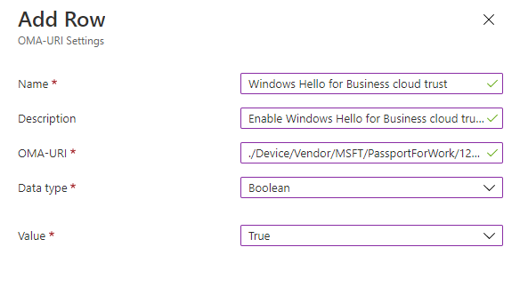

# Hybrid Cloud Trust Deployment (Preview)

Applies to

- Windows 10, version 21H2
- Windows 11 and later

Windows Hello for Business replaces username and password Windows sign in with strong authentication using an asymmetric key pair. The following deployment guide provides the information needed to successfully deploy Windows Hello for Business in a hybrid cloud trust scenario.

## Introduction to Cloud Trust

The goal of the Windows Hello for Business cloud trust is to bring the simplified deployment experience of [on-premises SSO with passwordless security keys](/azure/active-directory/authentication/howto-authentication-passwordless-security-key-on-premises) to Windows Hello for Business. This deployment model can be used for new Windows Hello for Business deployments or existing deployments can move to this model using policy controls.

Windows Hello for Business cloud trust uses Azure Active Directory (AD) Kerberos to address pain points of the key trust deployment model:

- Windows Hello for Business cloud trust provides a simpler deployment experience because it doesn't require the deployment of public key infrastructure (PKI) or changes to existing PKI.
- Cloud trust doesn't require syncing of public keys between Azure AD and on-premises domain controllers (DCs) for users to access on-premises resources and applications. This change means there isn't a delay between the user provisioning and being able to authenticate.
- Deploying Windows Hello for Business cloud trust enables you to also deploy passwordless security keys with minimal extra setup.

> [!NOTE]
> Windows Hello for Business cloud trust is recommended instead of key trust if you meet the prerequisites to deploy cloud trust. Cloud trust is the preferred deployment model if you do not need to support certificate authentication scenarios.

## Azure Active Directory Kerberos and Cloud Trust Authentication

Key trust and certificate trust use certificate authentication based Kerberos for requesting kerberos ticket-granting-tickets (TGTs) for on-premises authentication. This type of authentication requires PKI for DC certificates, and requires end-user certificates for certificate trust. Single sign-on (SSO) to on-premises resources from Azure AD joined devices requires more PKI configuration to publish a certificate revocation list (CRL) to a public endpoint. Cloud trust uses Azure AD Kerberos that doesn't require any of the above PKI to get the user a TGT.

With Azure AD Kerberos, Azure AD can issue TGTs for one or more of your AD domains. Windows can request a TGT from Azure AD when authenticating with Windows Hello for Business and use the returned TGT for logon or to access traditional AD-based resources. Kerberos service tickets and authorization continue to be controlled by your on-premises AD DCs.

When you enable Azure AD Kerberos in a domain, an Azure AD Kerberos Server object is created in your on-premises AD. This object will appear as a Read Only Domain Controller (RODC) object but isn't associated with any physical servers. This resource is only used by Azure Active Directory to generate TGTs for your Active Directory Domain. The same rules and restrictions used for RODCs apply to the Azure AD Kerberos Server object.

More details on how Azure AD Kerberos enables access to on-premises resources are available in our documentation on [enabling passwordless security key sign-in to on-premises resources](/azure/active-directory/authentication/howto-authentication-passwordless-security-key-on-premises). There's more information on how Azure AD Kerberos works with Windows Hello for Business cloud trust in the [Windows Hello for Business authentication technical deep dive](hello-how-it-works-authentication.md#hybrid-azure-ad-join-authentication-using-azure-ad-kerberos-cloud-trust-preview).

## Prerequisites

| Requirement | Notes |
| --- | --- |
| Multi-factor Authentication | This requirement can be met using [Azure AD multi-factor authentication](/azure/active-directory/authentication/howto-mfa-getstarted), multi-factor authentication provided through AD FS, or a comparable solution. |
| Patched Windows 10 version 21H2 or patched Windows 11 and later | If you're using Windows 10 21H2, KB5010415 must be installed. If you're using Windows 11 21H2, KB5010414 must be installed. There's no Windows version support difference between Azure AD joined and Hybrid Azure AD joined devices. |
| Fully patched Windows Server 2016 or later Domain Controllers | Domain controllers should be fully patched to support updates needed for Azure AD Kerberos. If you're using Windows Server 2016, [KB3534307](https://support.microsoft.com/en-us/topic/january-23-2020-kb4534307-os-build-14393-3474-b181594e-2c6a-14ea-e75b-678efea9d27e) must be installed. If you're using Server 2019, [KB4534321](https://support.microsoft.com/en-us/topic/january-23-2020-kb4534321-os-build-17763-1012-023e84c3-f9aa-3b55-8aff-d512911c459f) must be installed. |
| Azure AD Kerberos PowerShell module | This module is used for enabling and managing Azure AD Kerberos. It's available through the [PowerShell Gallery](https://www.powershellgallery.com/packages/AzureADHybridAuthenticationManagement).|
| Device management | Windows Hello for Business cloud trust can be managed with group policy or through mobile device management (MDM) policy. This feature is disabled by default and must be enabled using policy. |

### Unsupported Scenarios

The following scenarios aren't supported using Windows Hello for Business cloud trust.

- On-premises only deployments
- RDP/VDI scenarios using supplied credentials (RDP/VDI can be used with Remote Credential Guard or if a certificate is enrolled into the Windows Hello for Business container)
- Scenarios that require a certificate for authentication
- Using cloud trust for "Run as"
- Signing in with cloud trust on a Hybrid Azure AD joined device without previously signing in with DC connectivity

## Deployment Instructions

Deploying Windows Hello for Business cloud trust consists of two steps:

1. Set up Azure AD Kerberos in your hybrid environment.
1. Configure Windows Hello for Business policy and deploy it to devices.

### Deploy Azure AD Kerberos

If you've already deployed on-premises SSO for passwordless security key sign-in, then you've already deployed Azure AD Kerberos in your hybrid environment. You don't need to redeploy or change your existing Azure AD Kerberos deployment to support Windows Hello for Business and you can skip this section.

If you haven't deployed Azure AD Kerberos, follow the instructions in the [Enable passwordless security key sign-in to on-premises resources by using Azure AD](/azure/active-directory/authentication/howto-authentication-passwordless-security-key-on-premises#install-the-azure-ad-kerberos-powershell-module) documentation. This page includes information on how to install and use the Azure AD Kerberos Powershell module. Use the module to create an Azure AD Kerberos Server object for the domains where you want to use Windows Hello for Business cloud trust.

### Configure Windows Hello for Business Policy

After setting up the Azure AD Kerberos Object, Windows Hello for business cloud trust must be enabled using policy. By default, cloud trust won't be used by Hybrid Azure AD joined or Azure AD joined devices.

#### Configure Using Group Policy

Hybrid Azure AD joined organizations can use Windows Hello for Business Group Policy to manage the feature. Group Policy can be configured to enable users to enroll and use Windows Hello for Business.

The Enable Windows Hello for Business Group Policy setting is used by Windows to determine if a user should attempt to enroll a credential. A user will only attempt enrollment if this policy is configured to enabled.  

You can configure the Enable Windows Hello for Business Group Policy setting for computers or users. Deploying this policy setting to computers results in all users that sign-in that computer to attempt a Windows Hello for Business enrollment. Deploying this policy setting to a user results in only that user attempting a Windows Hello for Business enrollment. Additionally, you can deploy the policy setting to a group of users so only those users attempt a Windows Hello for Business enrollment. If both user and computer policy settings are deployed, the user policy setting has precedence.

Cloud trust requires setting a dedicated policy for it to be enabled. This policy is only available as a computer configuration.

> [!NOTE]
> If you deployed Windows Hello for Business configuration using both Group Policy and Microsoft Intune, Group Policy settings will take precedence and Intune settings will be ignored. For more information about deploying Windows Hello for Business configuration using Microsoft Intune, see [Windows device settings to enable Windows Hello for Business in Intune](/mem/intune/protect/identity-protection-windows-settings) and [PassportForWork CSP](/windows/client-management/mdm/passportforwork-csp). For more information about policy conflicts, see [Policy conflicts from multiple policy sources](hello-manage-in-organization.md#policy-conflicts-from-multiple-policy-sources)

##### Update Group Policy Objects

You may need to update your Group Policy definitions to be able to configure the cloud trust policy. You can copy the ADMX and ADML files from a Windows 10 21H2 or Windows 11 device that supports cloud trust to their respective language folder on your Group Policy management server. Windows Hello for Business settings are in the Passport.admx and Passport.adml files.

You can also create a Group Policy Central Store and copy them their respective language folder. For more information, see [How to create and manage the Central Store for Group Policy Administrative Templates in Windows](/troubleshoot/windows-client/group-policy/create-and-manage-central-store).

##### Create the Windows Hello for Business Group Policy object

Sign-in a domain controller or management workstations with *Domain Admin* equivalent credentials.

1. Start the **Group Policy Management Console** (gpmc.msc).
1. Expand the domain and select the **Group Policy Object** node in the navigation pane.
1. Right-click **Group Policy object** and select **New**.
1. Type *Enable Windows Hello for Business* in the name box and click **OK**.
1. In the content pane, right-click the **Enable Windows Hello for Business** Group Policy object and click **Edit**.
1. In the navigation pane, expand **Policies** under **Device Configuration**.
1. Expand **Administrative Templates > Windows Component**, and select **Windows Hello for Business**.
1. In the content pane, double-click **Use Windows Hello for Business**. Click **Enable** and click **OK**.
1. In the content pane, double-click **Use cloud trust for on-premises authentication**. Click **Enable** and click **OK**.
1. *Optional but recommended*: In the content pane, double-click **Use a hardware security device**. Click **Enable** and click **OK**.

This group policy should be targeted at the computer group that you've created for that you want to use Windows Hello for Business.

> [!Important]
> If the Use certificate for on-premises authentication policy is enabled, we will enforce certificate trust instead of cloud trust on the client. Please make sure that any machines that you want to use Windows Hello for Business cloud trust have this policy not configured or disabled.

#### Configure Using Intune

Windows Hello for Business can be enabled using device enrollment or device configuration policy. Device enrollment policy is only applied at device enrollment time. Any modifications to the configuration in Intune won't apply to already enrolled devices. Device configuration policy is applied after device enrollment. Changes to this policy type in Intune are applied to already enrolled devices.

The cloud trust policy needs to be configured using a custom template and is configured separately from enabling Windows Hello from Business.

##### Create a user Group that will be targeted for Windows Hello for Business

If you have an existing group you want to target with Windows Hello for Business cloud trust policy, you can skip this step.

1. Sign in to the [Microsoft Endpoint Manager admin center](https://endpoint.microsoft.com/).
1. Browse to **Groups** and select **New group**.
1. Configure the following group settings:
    1. Group type: "Security"
    1. Group name: "WHFBCloudTrustUsers" or a group name of your choosing
    1. Membership type: Assigned
1. Select **Members** and add users that you want to target with Windows Hello for Business cloud trust.

You can also create a group through the Azure portal instead of using the Microsoft Endpoint Manager admin center.

##### Enable Windows Hello for Business

If you already enabled Windows Hello for Business for a target set of users or devices, you can skip below to configuring the cloud trust policy. Otherwise, follow the instructions at [Integrate Windows Hello for Business with Microsoft Intune](/mem/intune/protect/windows-hello) to create a Windows Hello for Business device enrollment policy.

You can also follow these steps to create a device configuration policy instead of a device enrollment policy:

1. Sign in to the [Microsoft Endpoint Manager admin center](https://endpoint.microsoft.com/).
1. Browse to Devices > Windows > Configuration Profiles > Create profile.
1. For Platform, select Windows 10 and later.
1. For Profile Type, select **Templates** and select the **Identity Protection** Template.
1. Name the profile with a familiar name. For example, "Windows Hello for Business".
1. In **Configurations settings**, set the **Configure Windows Hello for Business** option to **Enable**.
1. After setting Configure Windows Hello for Business to Enable, multiple policy options become available. These policies are optional to configure. More information on these policies is available in our documentation on managing [Windows Hello for Business in your organization](hello-manage-in-organization.md#mdm-policy-settings-for-windows-hello-for-business). We recommend setting **Use a Trusted Platform Module (TPM)** to **Enable**.

    

1. Select Next to move to **Assignments**.
1. Under Included groups, select **Add groups**.
1. Select the user group you would like to use Windows Hello for Business cloud trust. This group may be WHFBCloudTrustUsers or a group of your choosing.
1. Select Next to move to the Applicability Rules.
1. Select Next again to move to the **Review + create** tab and select the option to create the policy.

Windows Hello for Business settings are also available in the settings catalog. For more information, see [Use the settings catalog to configure settings on Windows and macOS devices - preview](/mem/intune/configuration/settings-catalog).

##### Configure Cloud Trust policy

To configure the cloud trust policy, follow the steps below:

1. Sign in to the [Microsoft Endpoint Manager admin center](https://endpoint.microsoft.com/).
1. Browse to Devices > Windows > Configuration Profiles > Create profile.
1. For Platform, select Windows 10 and later.
1. For Profile Type, select **Templates** and select the **Custom** Template.
1. Name the profile with a familiar name. For example, "Windows Hello for Business cloud trust".
1. In Configuration Settings, add a new configuration with the following settings:

    - Name: "Windows Hello for Business cloud trust" or another familiar name
    - Description: Enable Windows Hello for Business cloud trust for sign-in and on-premises SSO.
    - OMA-URI: ./Device/Vendor/MSFT/PassportForWork/*tenant ID*/Policies/UseCloudTrustForOnPremAuth

        >[!IMPORTANT]
        >*Tenant ID* in the OMA-URI must be replaced with the tenant ID for your Azure AD tenant. See [How to find your Azure AD tenant ID](/azure/active-directory/fundamentals/active-directory-how-to-find-tenant) for instructions on looking up your tenant ID.

    - Data type: Boolean
    - Value: True

    

1. Select Next to navigate to **Assignments**.
1. Under Included groups, select **Add groups**.
1. Select the user group you would like to use Windows Hello for Business cloud trust. This group may be WHFBCloudTrustUsers or a group of your choosing.
1. Select Next to move to the Applicability Rules.
1. Select Next again to move to the **Review + create** tab and select the option to create the policy.

> [!Important]
> If the Use certificate for on-premises authentication policy is enabled, we will enforce certificate trust instead of cloud trust on the client. Please make sure that any machines that you want to use Windows Hello for Business cloud trust have this policy not configured or disabled.

## Provisioning

The Windows Hello for Business provisioning process begins immediately after a user has signed in if certain prerequisite checks are passed. Windows Hello for Business cloud trust adds a prerequisite check for Hybrid Azure AD joined devices when cloud trust is enabled by policy.

You can determine the status of the prerequisite check by viewing the **User Device Registration** admin log under **Applications and Services Logs\Microsoft\Windows**. This information is also available using the [**dsregcmd /status**](/azure/active-directory/devices/troubleshoot-device-dsregcmd) command from a console.  

  

The cloud trust prerequisite check detects whether the user has a partial TGT before allowing provisioning to start. The purpose of this check is to validate whether Azure AD Kerberos is set up for the user's domain and tenant. If Azure AD Kerberos is set up, the user will receive a partial TGT during sign-in with one of their other unlock methods. This check has three states: Yes, No, and Not Tested. The *Not Tested* state is reported if cloud trust is not being enforced by policy or if the device is Azure AD joined.

This prerequisite check isn't done for provisioning on Azure AD joined devices. If Azure AD Kerberos isn't provisioned, a user on an Azure AD joined device will still be able to sign in.

### PIN Setup

When Windows Hello for Business provisioning begins, the user will see a full screen page with the title **Setup a PIN** and button with the same name.  The user clicks **Setup a PIN**.

The provisioning flow proceeds to the multi-factor authentication portion of the enrollment.  Provisioning informs the user that it's actively attempting to contact the user through their configured form of MFA.  The provisioning process doesn't proceed until authentication succeeds, fails or times out. A failed or timeout MFA results in an error and asks the user to retry.
  

After a successful MFA, the provisioning flow asks the user to create and validate a PIN.  This PIN must observe any PIN complexity requirements that you deployed to the environment.

### Sign-in

Once a user has set up a PIN with cloud trust, it can be used immediately for sign-in. On a Hybrid Azure AD joined device, the first use of the PIN requires line of sight to a DC. Once the user has signed in or unlocked with the DC, cached logon can be used for subsequent unlocks without line of sight or network connectivity.

## Troubleshooting

If you encounter issues or want to share feedback about Windows Hello for Business cloud trust, share via the Windows Feedback Hub app by following these steps:

1. Open **Feedback Hub**, and make sure that you're signed in.
1. Submit feedback by selecting the following categories:
    - Category: Security and Privacy
    - Subcategory: Windows Hello PIN

## Frequently Asked Questions

### Does Windows Hello for Business cloud trust work in my on-premises environment?

This feature doesn't work in a pure on-premises AD domain services environment.

### Does Windows Hello for Business cloud trust work in a Windows login with RODC present in the hybrid environment?

Windows Hello for Business cloud trust looks for a writeable DC to exchange the partial TGT. As long as you have at least one writeable DC per site, login with cloud trust will work.

### Do I need line of sight to a domain controller to use Windows Hello for Business cloud trust?

Windows Hello for Business cloud trust requires line of sight to a domain controller for some scenarios:
    - The first sign-in or unlock with Windows Hello for Business after provisioning on a Hybrid Azure AD joined device.
    - When attempting to access an on-premises resource from an Azure AD joined device.

### Can I use RDP/VDI with Windows Hello for Business cloud trust?

Windows Hello for Business cloud trust cannot be used as a supplied credential with RDP/VDI. Similar to key trust, cloud trust can be used for RDP with [remote credential guard](/windows/security/identity-protection/remote-credential-guard) or if a [certificate is enrolled into Windows Hello for Business](hello-deployment-rdp-certs.md) for this purpose.
