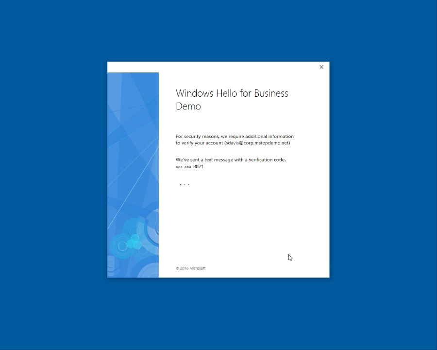
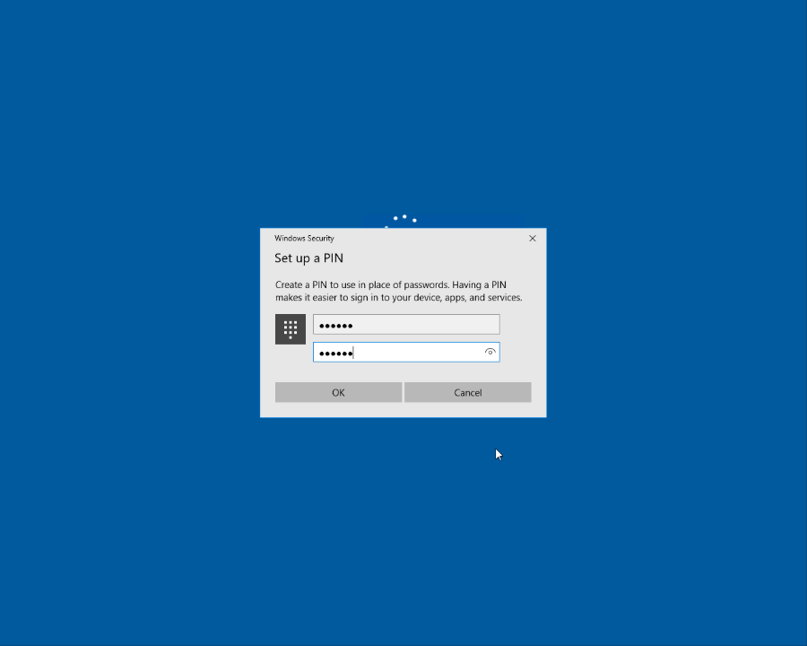

# Hybrid Windows Hello for Business Provisioning

**Applies to**
-   Windows�10, version 1703 or later
-   Hybrid deployment
-   Key trust

## Provisioning
The Windows Hello for Business provisioning begins immediately after the user has signed in, after the user profile is loaded, but before the user receives their desktop.  Windows only launches the provisioning experience if all the prerequisite checks pass. You can determine the status of the prerequisite checks by viewing the **User Device Registration** in the **Event Viewer** under **Applications and Services Logs\Microsoft\Windows**.

The first thing to validate is the computer has processed device registration. You can view this from the User device registration logs where the check **Device is AAD joined (AADJ or DJ++): Yes** appears.  Additionally, you can validate this using the **dsregcmd /status** command from a console prompt where the value for **AzureADJoined** reads **Yes**.

Windows Hello for Business provisioning begins with a full screen page with the title **Setup a PIN** and button with the same name.  The user clicks **Setup a PIN**.

The provisioning flow proceeds to the Multi-Factor authentication portion of the enrollment.  Provisioning informs the user that it is actively attempting to contact the user through their configured form of MFA.  The provisioning process does not proceed until authentication succeeds, fails or times out. A failed or timeout MFA results in an error and asks the user to retry.
  

After a successful MFA, the provisioning flow asks the user to create and validate a PIN.  This PIN must observe any PIN complexity requirements that you deployed to the environment.

The provisioning flow has all the information it needs to complete the Windows Hello for Business enrollment.
* A successful single factor authentication (username and password at sign-in)
* A device that has successfully completed device registration
* A fresh, successful multi-factor authentication
* A validated PIN that meets the PIN complexity requirements

The remainder of the provisioning includes Windows Hello for Business requesting an asymmetric key pair for the user, preferably from the TPM (or required if explicitly set through policy). Once the key pair is acquired, Windows communicates with Azure Active Directory to register the public key.  When key registration completes, Windows Hello for Business provisioning informs the user they can use their PIN to sign-in.  The user may close the provisioning application and see their desktop.  While the user has completed provisioning, Azure AD Connect synchronizes the user's key to Active Directory.   

> [!IMPORTANT]
> The minimum time needed to synchronize the user's public key from Azure Active Directory to the on-premises Active Directory is 30 minutes. The Azure AD Connect scheduler controls the synchronization interval. 
> **This synchronization latency delays the user's ability to authenticate and use on-premises resources until the user's public key has synchronized to Active Directory.** Once synchronized, the user can authenticate and use on-premises resources.
> Read [Azure AD Connect sync: Scheduler](https://docs.microsoft.com/azure/active-directory/connect/active-directory-aadconnectsync-feature-scheduler) to view and adjust the **synchronization cycle** for your organization.

> [!NOTE]
> Microsoft is actively investigating ways to reduce the synchronization latency and delays.  

  

## Follow the Windows Hello for Business hybrid key trust deployment guide
1. [Overview](hello-hybrid-key-trust.md)
2. [Prerequisites](hello-hybrid-key-trust-prereqs.md)
3. [New Installation Baseline](hello-hybrid-key-new-install.md)
4. [Configure Directory Synchronization](hello-hybrid-key-trust-dirsync.md)
5. [Configure Azure Device Registration](hello-hybrid-key-trust-devreg.md)
6. [Configure Windows Hello for Business settings](hello-hybrid-key-whfb-settings.md)
7. Sign-in and Provision(*You are here*)
