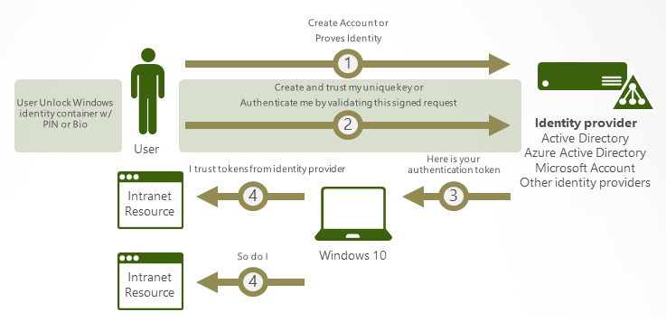

# Windows Hello for Business Overview

**Applies to**
- Windows 10

In Windows 10, Windows Hello for Business replaces passwords with strong two-factor authentication on PCs and mobile devices. This authentication consists of a new type of user credential that is tied to a device and uses a biometric or PIN.

>[!NOTE]
> When Windows 10 first shipped, it included Microsoft Passport and Windows Hello, which worked together to provide multi-factor authentication. To simplify deployment and improve supportability, Microsoft has combined these technologies into a single solution under the Windows Hello name. Customers who have already deployed these technologies will not experience any change in functionality. Customers who have yet to evaluate Windows Hello will find it easier to deploy due to simplified policies, documentation, and semantics. 

Windows Hello addresses the following problems with passwords:
-   Strong passwords can be difficult to remember, and users often reuse passwords on multiple sites.
-   Server breaches can expose symmetric network credentials (passwords).
-   Passwords are subject to [replay attacks](https://go.microsoft.com/fwlink/p/?LinkId=615673).
-   Users can inadvertently expose their passwords due to [phishing attacks](https://go.microsoft.com/fwlink/p/?LinkId=615674).

Windows Hello lets users authenticate to:
-   a Microsoft account.
-   an Active Directory account.
-   a Microsoft Azure Active Directory (Azure AD) account.
-   Identity Provider Services or Relying Party Services that support [Fast ID Online (FIDO) v2.0](https://go.microsoft.com/fwlink/p/?LinkId=533889) authentication (in progress)

After an initial two-step verification of the user during enrollment, Windows Hello is set up on the user's device and Windows asks the user to set a gesture, which can be a biometric, such as a fingerprint, or a PIN. The user provides the gesture to verify their identity. Windows then uses Windows Hello to authenticate users.

As an administrator in an enterprise or educational organization, you can create policies to manage Windows Hello for Business use on Windows 10-based devices that connect to your organization.

## Biometric sign-in
 
 Windows Hello provides reliable, fully integrated biometric authentication based on facial recognition or fingerprint matching. Windows Hello uses a combination of special infrared (IR) cameras and software to increase accuracy and guard against spoofing. Major hardware vendors are shipping devices that have integrated Windows Hello-compatible cameras. Fingerprint reader hardware can be used or added to devices that don’t currently have it. On devices that support Windows Hello, an easy biometric gesture unlocks users’ credentials.
 
- **Facial recognition**. This type of biometric recognition uses special cameras that see in IR light, which allows them to reliably tell the difference between a photograph or scan and a living person. Several vendors are shipping external cameras that incorporate this technology, and major laptop manufacturers are incorporating it into their devices, as well. 
- **Fingerprint recognition**. This type of biometric recognition uses a capacitive fingerprint sensor to scan your fingerprint. Fingerprint readers have been available for Windows computers for years, but the current generation of sensors is significantly more reliable and less error-prone. Most existing fingerprint readers (whether external or integrated into laptops or USB keyboards) work with Windows 10. 

Windows stores biometric data that is used to implement Windows Hello securely on the local device only. The biometric data doesn’t roam and is never sent to external devices or servers. Because Windows Hello only stores biometric identification data on the device, there’s no single collection point an attacker can compromise to steal biometric data. 

## The difference between Windows Hello and Windows Hello for Business

- Individuals can create a PIN or biometric gesture on their personal devices for convenient sign-in. This use of Windows Hello is unique to the device on which it is set up, however it is not backed by asymmetric (public/private key) or certificate-based authentication. 

- Windows Hello for Business, which is configured by Group Policy or mobile device management (MDM) policy, uses key-based or certificate-based authentication.

## Benefits of Windows Hello

Reports of identity theft and large-scale hacking are frequent headlines. Nobody wants to be notified that their user name and password have been exposed.

You may wonder [how a PIN can help protect a device better than a password](hello-why-pin-is-better-than-password.md). Passwords are shared secrets; they are entered on a device and transmitted over the network to the server. An intercepted account name and password can be used by anyone, anywhere. Because they're stored on the server, a server breach can reveal those stored credentials.

In Windows 10, Windows Hello replaces passwords. When the identity provider supports keys, the Windows Hello provisioning process creates a cryptographic key pair bound to the Trusted Platform Module (TPM), if a device has a TPM 2.0, or in software. Access to these keys and obtaining a signature to validate user possession of the private key is enabled only by the PIN or biometric gesture. The two-step verification that takes place during Windows Hello enrollment creates a trusted relationship between the identity provider and the user when the public portion of the public/private key pair is sent to an identity provider and associated with a user account. When a user enters the gesture on the device, the identity provider knows from the combination of Hello keys and gesture that this is a verified identity and provides an authentication token that allows Windows 10 to access resources and services. 

>[!NOTE]
>Windows Hello as a convenience sign-in uses regular user name and password authentication, without the user entering the password.

Imagine that someone is looking over your shoulder as you get money from an ATM and sees the PIN that you enter. Having that PIN won't help them access your account because they don't have your ATM card. In the same way, learning your PIN for your device doesn't allow that attacker to access your account because the PIN is local to your specific device and doesn't enable any type of authentication from any other device.

Windows Hello helps protect user identities and user credentials. Because the user doesn't enter a password (except during provisioning), it helps circumvent phishing and brute force attacks. It also helps prevent server breaches because Windows Hello credentials are an asymmetric key pair, which helps prevent replay attacks when these keys are protected by TPMs.

 
## How Windows Hello for Business works: key points

-   Windows Hello credentials are based on certificate or asymmetrical key pair. Windows Hello credentials can be bound to the device, and the token that is obtained using the credential is also bound to the device.
-   Identity provider (such as Active Directory, Azure AD, or a Microsoft account) validates user identity and maps the Windows Hello public key to a user account during the registration step.
-   Keys can be generated in hardware (TPM 1.2 or 2.0 for enterprises, and TPM 2.0 for consumers) or software, based on the policy.
-   Authentication is the two-factor authentication with the combination of a key or certificate tied to a device and something that the person knows (a PIN) or something that the person is (biometrics). The Windows Hello gesture does not roam between devices and is not shared with the server. Biometrics templates are stored locally on a device.  The PIN is never stored or shared.
-   The private key never leaves a device when using TPM. The authenticating server has a public key that is mapped to the user account during the registration process.
-   PIN entry and biometric gesture both trigger Windows 10 to use the private key to cryptographically sign data that is sent to the identity provider.  The identity provider verifies the user's identity and authenticates the user.
-   Personal (Microsoft account) and corporate (Active Directory or Azure AD) accounts use a single container for keys. All keys are separated by identity providers' domains to help ensure user privacy.
-   Certificate private keys can be protected by the Windows Hello container and the Windows Hello gesture.

For details, see [How Windows Hello for Business works](hello-how-it-works.md).

## Comparing key-based and certificate-based authentication

Windows Hello for Business can use either keys (hardware or software) or certificates in hardware or software. Enterprises that have a public key infrastructure (PKI) for issuing and managing certificates can continue to use PKI in combination with Windows Hello. Enterprises that do not use PKI or want to reduce the effort associated with managing certificates can rely on key-based credentials for Windows Hello but still use certificates on their domain controllers as a root of trust.

## Learn more

[Implementing Windows Hello for Business at Microsoft](https://www.microsoft.com/en-us/itshowcase/implementing-windows-hello-for-business-at-microsoft)

[Introduction to Windows Hello](https://go.microsoft.com/fwlink/p/?LinkId=786649), video presentation on Microsoft Virtual Academy

[Windows Hello face authentication](https://go.microsoft.com/fwlink/p/?LinkId=626024)

[Windows 10: Disrupting the Revolution of Cyber-Threats with Revolutionary Security!](https://go.microsoft.com/fwlink/p/?LinkId=533890)

[Windows 10: The End Game for Passwords and Credential Theft?](https://go.microsoft.com/fwlink/p/?LinkId=533891)

## Related topics

- [How Windows Hello for Business works](hello-how-it-works.md)
- [Manage Windows Hello for Business in your organization](hello-manage-in-organization.md)
- [Why a PIN is better than a password](hello-why-pin-is-better-than-password.md)
- [Prepare people to use Windows Hello](hello-prepare-people-to-use.md)
- [Windows Hello and password changes](hello-and-password-changes.md)
- [Windows Hello errors during PIN creation](hello-errors-during-pin-creation.md)
- [Event ID 300 - Windows Hello successfully created](hello-event-300.md)
- [Windows Hello biometrics in the enterprise](hello-biometrics-in-enterprise.md)
 
