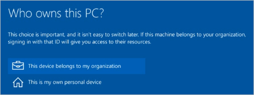
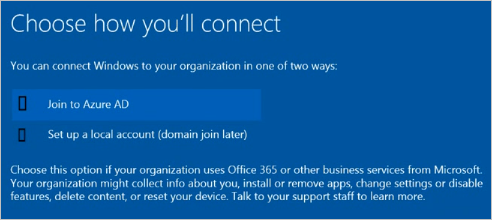
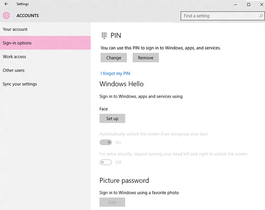

# Prepare people to use Windows Hello

**Applies to**
-   Windows 10

When you set a policy to require Windows Hello for Business in the workplace, you will want to prepare people in your organization by explaining how to use Hello.

After enrollment in Hello, users should use their gesture (such as a PIN or fingerprint) for access to corporate resources. Their gesture is only valid on the enrolled device.

Although the organization may require users to change their Active Directory or Azure Active Directory (AD) account password at regular intervals, changes to their passwords have no effect on Hello.

People who are currently using virtual or physical smart cards for authentication can use their virtual smart card to verify their identity when they set up Hello.

## On devices owned by the organization

When someone sets up a new device, they are prompted to choose who owns the device. For corporate devices, they select **This device belongs to my organization**.

Next, they select a way to connect. Tell the people in your enterprise which option they should pick here.

They sign in, and are then asked to verify their identity. People have options to choose from a text message, phone call, or the authentication application. After verification, they create their PIN. The **Create a PIN** screen displays any complexity requirements that you have set, such as minimum length.

After Hello is set up, people use their PIN to unlock the device, and that will automatically log them on.

## On personal devices

People who want to access work resources on their personal devices can add a work or school account in **Settings** &gt; **Accounts** &gt; **Work or school**, and then sign in with work credentials. The person selects the method for receiving the verification code, such as text message or email. The verification code is sent and the person then enters the verification code. After verification, the person enters and confirms new PIN. The person can access any token-based resource using this device without being asked for credentials. 

People can go to **Settings** &gt; **Accounts** &gt; **Work or school**, select the work account, and then select **Unjoin** to remove the account from their device.

## Using Windows Hello and biometrics

If your policy allows it, people can use biometrics (fingerprint, iris, and facial recognition) with Windows Hello for Business, if the hardware supports it.

## Related topics

- [Windows Hello for Business](hello-identity-verification.md)
- [How Windows Hello for Business works](hello-how-it-works.md)
- [Manage Windows Hello for Business in your organization](hello-manage-in-organization.md)
- [Why a PIN is better than a password](hello-why-pin-is-better-than-password.md)
- [Windows Hello and password changes](hello-and-password-changes.md)
- [Windows Hello errors during PIN creation](hello-errors-during-pin-creation.md)
- [Event ID 300 - Windows Hello successfully created](hello-event-300.md)
- [Windows Hello biometrics in the enterprise](hello-biometrics-in-enterprise.md)

