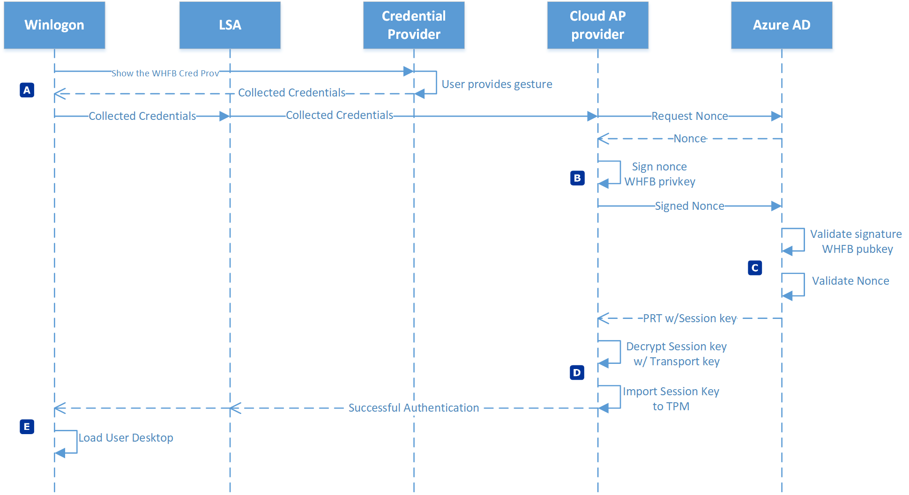
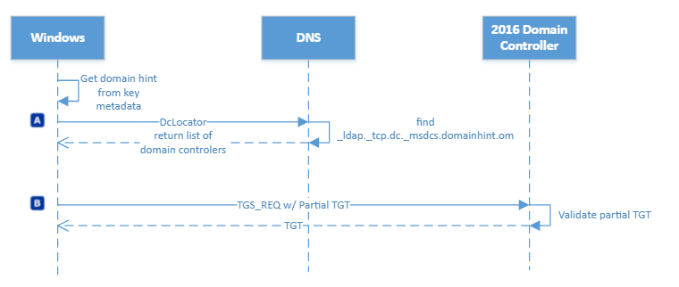
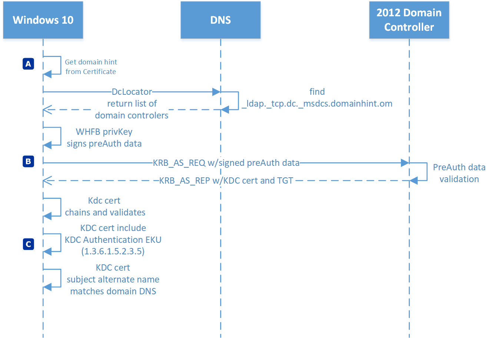
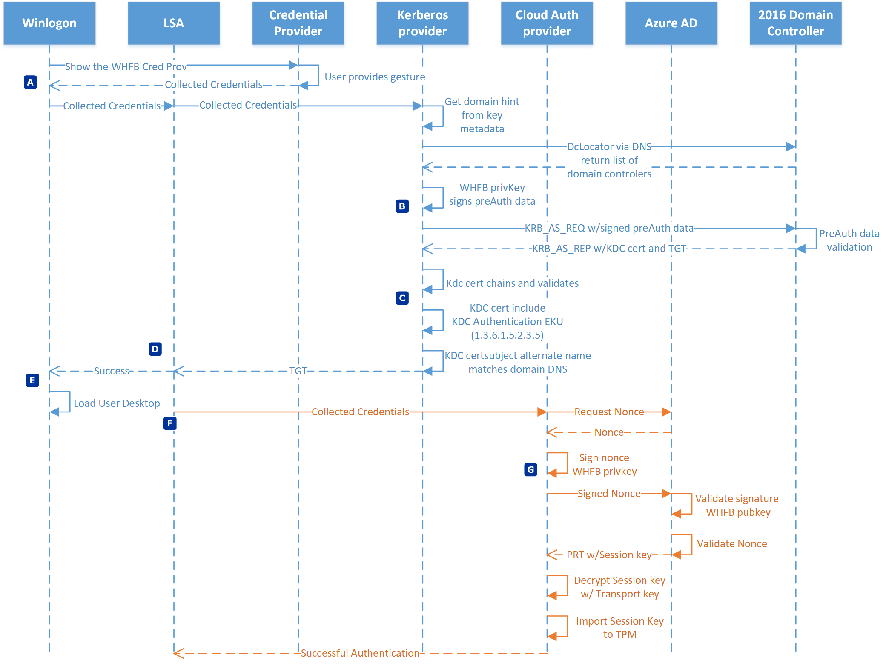

# Windows Hello for Business authentication

Windows Hello for Business authentication is a passwordless, two-factor authentication. Authenticating with Windows Hello for Business provides a convenient sign-in experience that authenticates the user to both Microsoft Entra ID and Active Directory resources.

Microsoft Entra joined devices authenticate to Microsoft Entra ID during sign-in and can, optionally, authenticate to Active Directory. Microsoft Entra hybrid joined devices authenticate to Active Directory during sign-in, and authenticate to Microsoft Entra ID in the background.

## Microsoft Entra join authentication to Microsoft Entra ID

:::image type="content" source="images/howitworks/auth/entra-join-entra.svg" alt-text="Diagram of a Microsoft Entra join device authenticating to Microsoft Entra ID." lightbox="images/howitworks/auth/entra-join-entra.svg" border="false":::

> [!NOTE]
> All Microsoft Entra joined devices authenticate with Windows Hello for Business to Microsoft Entra ID the same way. The Windows Hello for Business trust type only impacts how the device authenticates to on-premises AD.

| Phase  | Description  |
| :----: | :----------- |
|A | Authentication begins when the user dismisses the lock screen, which triggers Winlogon to show the Windows Hello for Business credential provider.  The user provides their Windows Hello gesture (PIN or biometrics).  The credential provider packages these credentials and returns them to Winlogon.  Winlogon passes the collected credentials to lsass. Lsass passes the collected credentials to the Cloud Authentication security support provider, referred to as the Cloud AP provider.| 
|B | The Cloud AP provider requests a nonce from Microsoft Entra ID.  Microsoft Entra ID returns a nonce. The Cloud AP provider signs the nonce using the user's private key and returns the signed nonce to the Microsoft Entra ID.|
|C | Microsoft Entra ID validates the signed nonce using the user's securely registered public key against the nonce signature.  Microsoft Entra ID then validates the returned signed nonce, and creates a PRT with session key that is encrypted to the device's transport key and returns it to the Cloud AP provider.|
|D | The Cloud AP provider receives the encrypted PRT with session key.  Using the device's private transport key, the Cloud AP provider decrypt the session key and protects the session key using the device's TPM.|
|E | The Cloud AP provider returns a successful authentication response to lsass. Lsass caches the PRT, and informs Winlogon of the success authentication.  Winlogon creates a logon session, loads the user's profile, and starts explorer.exe.|

## Microsoft Entra join authentication to Active Directory using cloud Kerberos trust

:::image type="content" source="images/howitworks/auth/entra-join-ad-ckt.svg" alt-text="Diagram of a Microsoft Entra join device authenticating to Active Directory using cloud Kerberos trust." lightbox="images/howitworks/auth/entra-join-ad-ckt.svg" border="false":::

| Phase  | Description  |
| :----: | :----------- |
|A | Authentication to Active Directory from a Microsoft Entra joined device begins with the user first attempts to use a resource that needs Kerberos authentication.  The Kerberos security support provider, hosted in lsass, uses metadata from the Windows Hello for Business key to get a hint of the user's domain.  Using the hint, the provider uses the DClocator service to locate a 2016 domain controller.
|B | After locating a domain controller, the Kerberos provider sends a partial TGT that it received from Microsoft Entra ID from a previous Microsoft Entra authentication to the domain controller. The partial TGT contains only the user SID, and it's signed by Microsoft Entra Kerberos. The domain controller verifies that the partial TGT is valid. On success, the KDC returns a TGT to the client.|

## Microsoft Entra join authentication to Active Directory using a key

:::image type="content" source="images/howitworks/auth/entra-join-ad-kt.svg" alt-text="Diagram of a Microsoft Entra join device authenticating to Active Directory using key trust." lightbox="images/howitworks/auth/entra-join-ad-kt.svg" border="false":::

| Phase  | Description  |
| :----: | :----------- |
|A | Authentication to Active Directory from a Microsoft Entra joined device begins with the user first attempts to use a resource that needs Kerberos authentication.  The Kerberos security support provider, hosted in lsass, uses metadata from the Windows Hello for Business key to get a hint of the user's domain.  Using the hint, the provider uses the DClocator service to locate a 2016 domain controller. After the provider locates a domain controller, the provider uses the private key to sign the Kerberos preauthentication data.|
|B | The Kerberos provider sends the signed preauthentication data and its public key (in the form of a self-signed certificate) to the Key Distribution Center (KDC) service running on the 2016 domain controller in the form of a KERB_AS_REQ. The 2016 domain controller determines the certificate is a self-signed certificate.  It retrieves the public key from the certificate included in the KERB_AS_REQ and searches for the public key in Active Directory.  It validates the UPN for authentication request matches the UPN registered in Active Directory and validates the signed preauthentication data using the public key from Active Directory.  On success, the KDC returns a TGT to the client with its certificate in a KERB_AS_REP.|
|C | The Kerberos provider ensures it can trust the response from the domain controller. First, it ensures the KDC certificate chains to a root certificate that is trusted by the device.  Next, it ensures the certificate is within its validity period and that it hasn't been revoked.  The Kerberos provider then verifies the certificate has the KDC Authentication present and that the subject alternate name listed in the KDC's certificate matches the domain name to which the user is authenticating. After passing this criteria, Kerberos returns the TGT to lsass, where it's cached and used for subsequent service ticket requests.|

> [!NOTE]
> You might have an on-premises domain federated with Microsoft Entra ID. Once you have successfully provisioned Windows Hello for Business PIN/Bio on the Microsoft Entra joined device, any future login of Windows Hello for Business (PIN/Bio) sign-in will directly authenticate against Microsoft Entra ID to get PRT and trigger authenticate against your DC (if LOS to DC is available) to get Kerberos. It no longer uses AD FS to authenticate for Windows Hello for Business sign-ins.

## Microsoft Entra join authentication to Active Directory using a certificate

:::image type="content" source="images/howitworks/auth/entra-join-ad-ct.svg" alt-text="Diagram of a Microsoft Entra join device authenticating to Active Directory using certificate trust." lightbox="images/howitworks/auth/entra-join-ad-ct.svg" border="false":::

| Phase  | Description  |
| :----: | :----------- |
|A | Authentication to Active Directory from a Microsoft Entra joined device begins with the user first attempts to use a resource that needs Kerberos authentication.  The Kerberos security support provider, hosted in lsass, uses information from the certificate to get a hint of the user's domain. Kerberos can use the distinguished name of the user found in the subject of the certificate, or it can use the user principal name of the user found in the subject alternate name of the certificate.  Using the hint, the provider uses the DClocator service to locate a domain controller. After the provider locates an active domain controller, the provider uses the private key to sign the Kerberos preauthentication data.|
|B | The Kerberos provider sends the signed preauthentication data and  user's certificate, which includes the public key, to the Key Distribution Center (KDC) service running on the domain controller in the form of a KERB_AS_REQ. The domain controller determines the certificate isn't self-signed certificate.  The domain controller ensures the certificate chains to trusted root certificate, is within its validity period, can be used for authentication, and hasn't been revoked.  It retrieves the public key and UPN from the certificate included in the KERB_AS_REQ and searches for the UPN in Active Directory.  It validates the signed preauthentication data using the public key from the certificate.  On success, the KDC returns a TGT to the client with its certificate in a KERB_AS_REP.|
|C | The Kerberos provider ensures it can trust the response from the domain controller. First, it ensures the KDC certificate chains to a root certificate that is trusted by the device.  Next, it ensures the certificate is within its validity period and that it hasn't been revoked.  The Kerberos provider then verifies the certificate has the KDC Authentication present and that the subject alternate name listed in the KDC's certificate matches the domain name to which the user is authenticating. After passing this criteria, Kerberos returns the TGT to lsass, where it's cached and used for subsequent service ticket requests.|

> [!NOTE]
> You may have an on-premises domain federated with Microsoft Entra ID. Once you have successfully provisioned Windows Hello for Business PIN/Bio on, any future login of Windows Hello for Business (PIN/Bio) sign-in will directly authenticate against Microsoft Entra ID to get PRT, as well as authenticate against your DC (if LOS to DC is available) to get Kerberos as mentioned previously. AD FS federation is used only when Enterprise PRT calls are placed from the client. You need to have device write-back enabled to get "Enterprise PRT" from your federation.  

## Microsoft Entra hybrid join authentication using cloud Kerberos trust

:::image type="content" source="images/howitworks/auth/hybrid-entra-join-ckt.svg" alt-text="Diagram of a Microsoft Entra hybrid join device authenticating to Active Directory using cloud Kerberos trust." lightbox="images/howitworks/auth/hybrid-entra-join-ckt.svg" border="false":::

| Phase  | Description  |
| :----: | :----------- |
|A | Authentication begins when the user dismisses the lock screen, which triggers Winlogon to show the Windows Hello for Business credential provider.  The user provides their Windows Hello gesture (PIN or biometrics).  The credential provider packages these credentials and returns them to Winlogon.  Winlogon passes the collected credentials to lsass. Lsass queries Windows Hello for Business policy to check if cloud Kerberos trust is enabled. If cloud Kerberos trust is enabled, Lsass passes the collected credentials to the Cloud Authentication security support provider, or Cloud AP. Cloud AP requests a nonce from Microsoft Entra ID. Microsoft Entra ID returns a nonce.
|B | Cloud AP signs the nonce using the user's private key and returns the signed nonce to Microsoft Entra ID.
|C | Microsoft Entra ID validates the signed nonce using the user's securely registered public key against the nonce signature. After validating the signature, Microsoft Entra ID then validates the returned signed nonce. After validating the nonce, Microsoft Entra ID creates a PRT with session key that is encrypted to the device's transport key and creates a Partial TGT from Microsoft Entra Kerberos and returns them to Cloud AP.
|D | Cloud AP  receives the encrypted PRT with session key. Using the device's private transport key, Cloud AP decrypts the session key and protects the session key using the device's TPM (if available). Cloud AP returns a successful authentication response to lsass. Lsass caches the PRT and the Partial TGT.
|E | The Kerberos security support provider, hosted in lsass, uses metadata from the Windows Hello for Business key to get a hint of the user's domain.  Using the hint, the provider uses the DClocator service to locate a 2016 domain controller. After locating an active 2016 domain controller, the Kerberos provider sends the partial TGT that it received from Microsoft Entra ID to the domain controller. The partial TGT contains only the user SID and is signed by Microsoft Entra Kerberos. The domain controller verifies that the partial TGT is valid. On success, the KDC returns a TGT to the client. Kerberos returns the TGT to lsass, where it's cached and used for subsequent service ticket requests. Lsass informs Winlogon of the success authentication. Winlogon creates a logon session, loads the user's profile, and starts explorer.exe.|

## Microsoft Entra hybrid join authentication using a key

:::image type="content" source="images/howitworks/auth/hybrid-entra-join-kt.svg" alt-text="Diagram of a Microsoft Entra hybrid join device authenticating to Active Directory using key trust." lightbox="images/howitworks/auth/hybrid-entra-join-kt.svg" border="false":::

| Phase  | Description  |
| :----: | :----------- |
|A | Authentication begins when the user dismisses the lock screen, which triggers Winlogon to show the Windows Hello for Business credential provider.  The user provides their Windows Hello gesture (PIN or biometrics).  The credential provider packages these credentials and returns them to Winlogon.  Winlogon passes the collected credentials to lsass. Lsass passes the collected credentials to the Kerberos security support provider.  The Kerberos provider gets domain hints from the domain joined workstation to locate a domain controller for the user.|
|B | The Kerberos provider sends the signed preauthentication data and the user's public key (in the form of a self-signed certificate) to the Key Distribution Center (KDC) service running on the 2016 domain controller in the form of a KERB_AS_REQ. The 2016 domain controller determines the certificate is a self-signed certificate.  It retrieves the public key from the certificate included in the KERB_AS_REQ and searches for the public key in Active Directory.  It validates the UPN for authentication request matches the UPN registered in Active Directory and validates the signed preauthentication data using the public key from Active Directory.  On success, the KDC returns a TGT to the client with its certificate in a KERB_AS_REP.|
|C | The Kerberos provider ensures it can trust the response from the domain controller. First, it ensures the KDC certificate chains to a root certificate that is trusted by the device.  Next, it ensures the certificate is within its validity period and that it hasn't been revoked.  The Kerberos provider then verifies the certificate has the KDC Authentication present and that the subject alternate name listed in the KDC's certificate matches the domain name to which the user is authenticating.
|D | After passing this criteria, Kerberos returns the TGT to lsass, where it's cached and used for subsequent service ticket requests.|
|E | Lsass informs Winlogon of the success authentication.  Winlogon creates a logon session, loads the user's profile, and starts explorer.exe.|
|F | While Windows loads the user's desktop, lsass passes the collected credentials to the Cloud Authentication security support provider, referred to as the Cloud AP provider.  The Cloud AP provider requests a nonce from Microsoft Entra ID.  Microsoft Entra ID returns a nonce.|
|G |  The Cloud AP provider signs the nonce using the user's private key and returns the signed nonce to the Microsoft Entra ID.  Microsoft Entra ID validates the signed nonce using the user's securely registered public key against the nonce signature.  After validating the signature, Microsoft Entra ID then validates the returned signed nonce. After validating the nonce, Microsoft Entra ID creates a PRT with session key that is encrypted to the device's transport key and returns it to the Cloud AP provider. The Cloud AP provider receives the encrypted PRT with session key.  Using the device's private transport key, the Cloud AP provider decrypt the session key and protects the session key using the device's TPM. The Cloud AP provider returns a successful authentication response to lsass. Lsass caches the PRT.|

> [!IMPORTANT]
> In the above deployment model, a newly provisioned user will not be able to sign in using Windows Hello for Business until (a) Microsoft Entra Connect successfully synchronizes the public key to the on-premises Active Directory and (b) device has line of sight to the domain controller for the first time.

## Microsoft Entra hybrid join authentication using a certificate

:::image type="content" source="images/howitworks/auth/hybrid-entra-join-ct.svg" alt-text="Diagram of a Microsoft Entra hybrid join device authenticating to Active Directory using certificate trust." lightbox="images/howitworks/auth/hybrid-entra-join-ct.svg" border="false":::

| Phase  | Description  |
| :----: | :----------- |
|A | Authentication begins when the user dismisses the lock screen, which triggers Winlogon to show the Windows Hello for Business credential provider.  The user provides their Windows Hello gesture (PIN or biometrics).  The credential provider packages these credentials and returns them to Winlogon.  Winlogon passes the collected credentials to lsass. Lsass passes the collected credentials to the Kerberos security support provider.  The Kerberos provider gets domain hints from the domain joined workstation to locate a domain controller for the user.|
|B | The Kerberos provider sends the signed preauthentication data and  user's certificate, which includes the public key, to the Key Distribution Center (KDC) service running on the domain controller in the form of a KERB_AS_REQ. The domain controller determines the certificate isn't self-signed certificate.  The domain controller ensures the certificate chains to trusted root certificate, is within its validity period, can be used for authentication, and hasn't been revoked.  It retrieves the public key and UPN from the certificate included in the KERB_AS_REQ and searches for the UPN in Active Directory.  It validates the signed preauthentication data using the public key from the certificate.  On success, the KDC returns a TGT to the client with its certificate in a KERB_AS_REP.|
|C | The Kerberos provider ensures it can trust the response from the domain controller. First, it ensures the KDC certificate chains to a root certificate that is trusted by the device.  Next, it ensures the certificate is within its validity period and that it hasn't been revoked.  The Kerberos provider then verifies the certificate has the KDC Authentication present and that the subject alternate name listed in the KDC's certificate matches the domain name to which the user is authenticating.
|D | After passing this criteria, Kerberos returns the TGT to lsass, where it's cached and used for subsequent service ticket requests.|
|E | Lsass informs Winlogon of the success authentication.  Winlogon creates a logon session, loads the user's profile, and starts explorer.exe.|
|F | While Windows loads the user's desktop, lsass passes the collected credentials to the Cloud Authentication security support provider, referred to as the Cloud AP provider.  The Cloud AP provider requests a nonce from Microsoft Entra ID.  Microsoft Entra ID returns a nonce.|
|G |  The Cloud AP provider signs the nonce using the user's private key and returns the signed nonce to the Microsoft Entra ID.  Microsoft Entra ID validates the signed nonce using the user's securely registered public key against the nonce signature.  After validating the signature, Microsoft Entra ID then validates the returned signed nonce. After validating the nonce, Microsoft Entra ID creates a PRT with session key that is encrypted to the device's transport key and returns it to the Cloud AP provider. The Cloud AP provider receives the encrypted PRT with session key.  Using the device's private transport key, the Cloud AP provider decrypt the session key and protects the session key using the device's TPM. The Cloud AP provider returns a successful authentication response to lsass. Lsass caches the PRT.|

> [!IMPORTANT]
> In the above deployment model, a **newly provisioned** user will not be able to sign in using Windows Hello for Business unless the device has line of sight to the domain controller.
