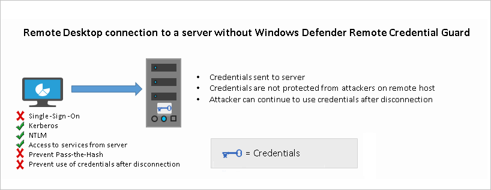
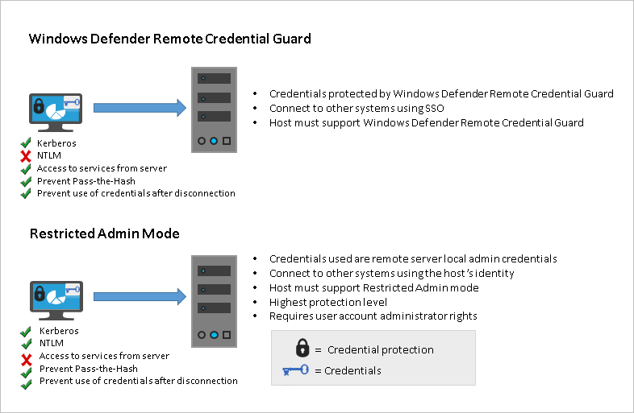

#  Protect Remote Desktop credentials with Windows Defender Remote Credential Guard

**Applies to**
-   Windows 10
-   Windows Server 2016

Introduced in Windows 10, version 1607, Windows Defender Remote Credential Guard helps you protect your credentials over a Remote Desktop connection by redirecting Kerberos requests back to the device that's requesting the connection. It also provides single sign-on experiences for Remote Desktop sessions.

Administrator credentials are highly privileged and must be protected. By using Windows Defender Remote Credential Guard to connect during Remote Desktop sessions, if the target device is compromised, your credentials are not exposed because both credential and credential derivatives are never passed over the network to the target device.

> [!IMPORTANT]
> For information on Remote Desktop connection scenarios involving helpdesk support, see [Remote Desktop connections and helpdesk support scenarios](#helpdesk) in this article.

<a id="comparing-remote-credential-guard-with-other-remote-desktop-connection-options"></a>

## Comparing Windows Defender Remote Credential Guard with other Remote Desktop connection options

The following diagram helps you to understand how a standard Remote Desktop session to a server without Windows Defender Remote Credential Guard works:



<br />

The following diagram helps you to understand how Windows Defender Remote Credential Guard works, what it helps to protect against, and compares it with the [Restricted Admin mode](https://social.technet.microsoft.com/wiki/contents/articles/32905.how-to-enable-restricted-admin-mode-for-remote-desktop.aspx) option:



<br />
As illustrated, Windows Defender Remote Credential Guard blocks NTLM (allowing only Kerberos), prevents Pass-the-Hash (PtH) attacks, and also prevents use of credentials after disconnection.

<br />
<br />
Use the following table to compare different Remote Desktop connection security options:

<br />
<br />

|**Feature** | **Remote Desktop** | **Windows Defender Remote Credential Guard** | **Restricted Admin mode** |
|---|---|---|---|
| **Protection benefits**  | Credentials on the server are not protected from Pass-the-Hash attacks.  |User credentials remain on the client. An attacker can act on behalf of the user *only* when the session is ongoing | User logs on to the server as local administrator, so an attacker cannot act on behalf of the “domain user”. Any attack is local to the server|
| **Version support** | The remote computer can run any Windows operating system|Both the client and the remote computer must be running **at least Windows 10, version 1607, or Windows Server 2016**.|The remote computer must be running **at least patched Windows 7 or patched Windows Server 2008 R2**. <br /><br />For more information about patches (software updates) related to Restricted Admin mode, see [Microsoft Security Advisory 2871997](https://technet.microsoft.com/library/security/2871997.aspx).
|**Helps prevent**   &nbsp;&nbsp;&nbsp;&nbsp;&nbsp;&nbsp;&nbsp;&nbsp;   &nbsp;&nbsp;&nbsp;&nbsp; &nbsp;&nbsp;&nbsp;&nbsp; | &nbsp;&nbsp;&nbsp;&nbsp; N/A &nbsp;&nbsp;&nbsp;&nbsp;&nbsp;&nbsp;&nbsp;&nbsp;|<ul><li> Pass-the-Hash</li> <li>Use of a credential after disconnection </li></ul>|<ul><li> Pass-the-Hash</li> <li>Use of domain identity during connection </li></ul>|
|**Credentials supported from the remote desktop client device**|<ul><li>**Signed on** credentials <li> **Supplied** credentials<li> **Saved** credentials </ul>|<ul><li> **Signed on** credentials only | <ul><li>**Signed on** credentials<li>**Supplied** credentials<li>**Saved** credentials</ul>
|**Access**|**Users allowed**, that is, members of Remote Desktop Users group of remote host.|**Users allowed**, that is, members of Remote Desktop Users of remote host.|**Administrators only**, that is, only members of Administrators group of remote host.
|**Network identity**|Remote Desktop session **connects to other resources as signed-in user**. | Remote Desktop session **connects to other resources as signed-in user**. |Remote Desktop session **connects to other resources as remote host’s identity**.|
|**Multi-hop**|From the remote desktop, **you can connect through Remote Desktop to another computer** | From the remote desktop, you **can connect through Remote Desktop to another computer**.|Not allowed for user as the session is running as a local host account|
|**Supported authentication** |Any negotiable protocol.| Kerberos only.|Any negotiable protocol|
<br />

For further technical information, see [Remote Desktop Protocol](https://msdn.microsoft.com/library/aa383015(v=vs.85).aspx)
and [How Kerberos works](https://technet.microsoft.com/library/cc961963.aspx(d=robot))

<br />

<a id="helpdesk"></a>

## Remote Desktop connections and helpdesk support scenarios

For helpdesk support scenarios in which personnel require administrative access to provide remote assistance to computer users via Remote Desktop sessions, Microsoft recommends that Windows Defender Remote Credential Guard should not be used in that context. This is because if an RDP session is initiated to a compromised client that an attacker already controls, the attacker could use that open channel to create sessions on the user's behalf (without compromising credentials) to access any of the user’s resources for a limited time (a few hours) after the session disconnects.

Therefore, we recommend instead that you use the Restricted Admin mode option. For helpdesk support scenarios, RDP connections should only be initiated using the /RestrictedAdmin switch. This helps ensure that credentials and other user resources are not exposed to compromised remote hosts. For more information, see [Mitigating Pass-the-Hash and Other Credential Theft v2](https://download.microsoft.com/download/7/7/A/77ABC5BD-8320-41AF-863C-6ECFB10CB4B9/Mitigating-Pass-the-Hash-Attacks-and-Other-Credential-Theft-Version-2.pdf).

To further harden security, we also recommend that you implement Local Administrator Password Solution (LAPS), a Group Policy client-side extension (CSE) introduced in Windows 8.1 that automates local administrator password management. LAPS mitigates the risk of lateral escalation and other cyberattacks  facilitated when customers use the same administrative local account and password combination on all their computers. You can download and install LAPS [here](https://www.microsoft.com/en-us/download/details.aspx?id=46899).

For further information on LAPS, see [Microsoft Security Advisory 3062591](https://technet.microsoft.com/library/security/3062591.aspx).


<a id="reqs"></a>

## Remote Credential Guard requirements

To use Windows Defender Remote Credential Guard, the Remote Desktop client and remote host must meet the following requirements:

The Remote Desktop client device:

-  Must be running at least Windows 10, version 1703 to be able to supply credentials, which is sent to the remote device. This allows users to run as different users without having to send credentials to the remote machine. 
-  Must be running at least Windows 10, version 1607 or Windows Server 2016 to use the user’s signed-in credentials. This requires the user’s account be able to sign in to both the client device and the remote host.
-  Must be running the Remote Desktop Classic Windows application. The Remote Desktop Universal Windows Platform application doesn't support Windows Defender Remote Credential Guard.
-  Must use Kerberos authentication to connect to the remote host. If the client cannot connect to a domain controller, then RDP attempts to fall back to NTLM. Windows Defender Remote Credential Guard does not allow NTLM fallback because this would expose credentials to risk.

The Remote Desktop remote host:

-  Must be running at least Windows 10, version 1607 or Windows Server 2016.
-  Must allow Restricted Admin connections.
-  Must allow the client’s domain user to access Remote Desktop connections.
-  Must allow delegation of non-exportable credentials.

There are no hardware requirements for Windows Defender Remote Credential Guard.

> [!NOTE]
> Remote Desktop client devices running earlier versions, at minimum Windows 10 version 1607, only support signed-in credentials, so the client device must also be joined to an Active Directory domain. Both Remote Desktop client and server must either be joined to the same domain, or the Remote Desktop server can be joined to a domain that has a trust relationship to the client device's domain.

- For Windows Defender Remote Credential Guard to be supported, the user must authenticate to the remote host using Kerberos authentication.
- The remote host must be running at least Windows 10 version 1607, or Windows Server 2016.
- The Remote Desktop classic Windows app is required. The Remote Desktop Universal Windows Platform app doesn't support Windows Defender Remote Credential Guard.

## Enable Windows Defender Remote Credential Guard

You must enable Restricted Admin or Windows Defender Remote Credential Guard on the remote host by using the Registry.

1. Open Registry Editor on the remote host.
2. Enable Restricted Admin and Windows Defender Remote Credential Guard:
    - Go to HKEY_LOCAL_MACHINE\System\CurrentControlSet\Control\Lsa.
    - Add a new DWORD value named **DisableRestrictedAdmin**.
    - To turn on Restricted Admin and Windows Defender Remote Credential Guard, set the value of this registry setting to 0 to turn on Windows Defender Remote Credential Guard.
3. Close Registry Editor.

You can add this by running the following command from an elevated command prompt:

```
reg add HKLM\SYSTEM\CurrentControlSet\Control\Lsa /v DisableRestrictedAdmin /d 0 /t REG_DWORD
```

## Using Windows Defender Remote Credential Guard

Beginning with Windows 10 version 1703, you can enable Windows Defender Remote Credential Guard on the client device either by using Group Policy or by using a parameter with the Remote Desktop Connection.

### Turn on Windows Defender Remote Credential Guard by using Group Policy

1. From the Group Policy Management Console, go to **Computer Configuration** -> **Administrative Templates** -> **System** -> **Credentials Delegation**.

2. Double-click **Restrict delegation of credentials to remote servers**.

    

3. Under **Use the following restricted mode**:
    - If you want to require either [Restricted Admin mode](https://social.technet.microsoft.com/wiki/contents/articles/32905.how-to-enable-restricted-admin-mode-for-remote-desktop.aspx) or Windows Defender Remote Credential Guard, choose **Prefer Windows Defender Remote Credential Guard**. In this configuration, Windows Defender Remote Credential Guard is preferred, but it will use Restricted Admin mode (if supported) when Windows Defender Remote Credential Guard cannot be used.

        > **Note:**  Neither Windows Defender Remote Credential Guard nor Restricted Admin mode will send credentials in clear text to the Remote Desktop server.

    - If you want to require Windows Defender Remote Credential Guard, choose **Require Windows Defender Remote Credential Guard**. With this setting, a Remote Desktop connection will succeed only if the remote computer meets the [requirements](#reqs) listed earlier in this topic.

    - If you  want to require Restricted Admin mode, choose **Require Restricted Admin**. For information about Restricted Admin mode, see the table in [Comparing Windows Defender Remote Credential Guard with other Remote Desktop connection options](#comparing-remote-credential-guard-with-other-remote-desktop-connection-options), earlier in this topic.

4. Click **OK**.

5. Close the Group Policy Management Console.

6. From a command prompt, run **gpupdate.exe /force** to ensure that the Group Policy object is applied.


### Use Windows Defender Remote Credential Guard with a parameter to Remote Desktop Connection

If you don't use Group Policy in your organization, or if not all your remote hosts support Remote Credential Guard, you can add the remoteGuard parameter when you start Remote Desktop Connection to turn on Windows Defender Remote Credential Guard for that connection.

```
mstsc.exe /remoteGuard
```

> [!NOTE]
> The user must be part of administrators group.

## Considerations when using Windows Defender Remote Credential Guard

- Windows Defender Remote Credential Guard does not support compound authentication. For example, if you’re trying to access a file server from a remote host that requires a device claim, access will be denied.

- Windows Defender Remote Credential Guard can be used only when connecting to a device that is joined to a Windows Server Active Directory domain, including AD domain-joined servers that run as Azure virtual machines (VMs). Windows Defender Remote Credential Guard cannot be used when connecting to remote devices joined to Azure Active Directory.

- Remote Desktop Credential Guard only works with the RDP protocol.

- No credentials are sent to the target device, but the target device still acquires Kerberos Service Tickets on its own.

- The server and client must authenticate using Kerberos.
