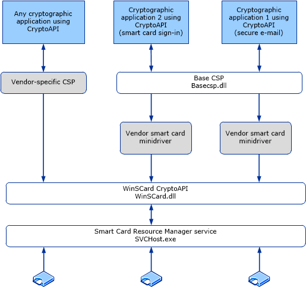
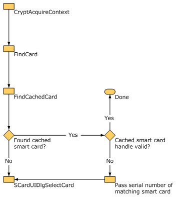
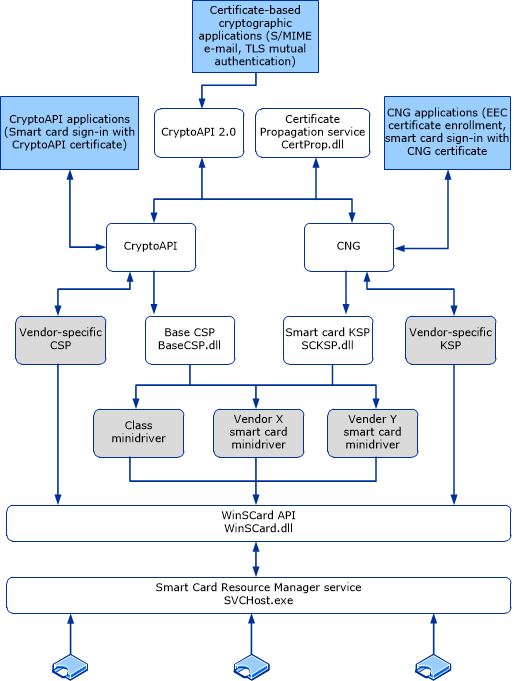

# Smart Card Architecture

Applies To: Windows 10, Windows Server 2016

This topic for the IT professional describes the system architecture that supports smart cards in the Windows operating system, including credential provider architecture and the smart card subsystem architecture.

Authentication is a process for verifying the identity of an object or person. When you authenticate an object, such as a smart card, the goal is to verify that the object is genuine. When you authenticate a person, the goal is to verify that you are not dealing with an imposter.

In a networking context, authentication is the act of proving identity to a network application or resource. Typically, identity is proven by a cryptographic operation that uses a key only the user knows (such as with public key cryptography), or a shared key. The server side of the authentication exchange compares the signed data with a known cryptographic key to validate the authentication attempt. Storing the cryptographic keys in a secure central location makes the authentication process scalable and maintainable.

For smart cards, Windows supports a provider architecture that meets the secure authentication requirements and is extensible so that you can include custom credential providers. This topic includes information about:

-   [Credential provider architecture](#credential-provider-architecture)

-   [Smart card subsystem architecture](#smart-card-subsystem-architecture)

<!-- This link probably won't stay current. If it seems useful, it could be un-commented.
For more information, see [Windows Authentication Architecture](https://technet.microsoft.com/library/dn751044(v=ws.11).aspx). This topic in the Windows Authentication Technical Overview explains the basic architectural scheme for Windows authentication for past and current versions of Windows.
-->

## Credential provider architecture

The following table lists the components that are included in the interactive sign-in architecture of the Windows Server and Windows operating systems.

| **Component**               | **Description**   |
|------------------------------------------------|-----|
| Winlogon | Provides an interactive sign-in infrastructure.         |
| Logon UI | Provides interactive UI rendering.   |
| Credential providers (password and smart card) | Describes credential information and serializing credentials.              |
| Local Security Authority (LSA)                 | Processes sign-in credentials.       |
| Authentication packages     | Includes NTLM and the Kerberos protocol. Communicates with server authentication packages to authenticate users. |

Interactive sign-in in Windows begins when the user presses CTRL+ALT+DEL. The CTRL+ALT+DEL key combination is called a secure attention sequence (SAS). To keep other programs and processes from using it, Winlogon registers this sequence during the boot process.

After receiving the SAS, the UI then generates the sign-in tile from the information received from the registered credential providers. The following graphic shows the architecture for credential providers in the Windows operating system.

**Figure 1**&nbsp;&nbsp;**Credential provider architecture**

Typically, a user who signs in to a computer by using a local account or a domain account must enter a user name and password. These credentials are used to verify the user's identity. For smart card sign-in, a user's credentials are contained on the smart card's security chip. A smart card reader lets the computer interact with the security chip on the smart card. When users sign in with a smart card, they enter a personal identification number (PIN) instead of a user name and password.

Credential providers are in-process COM objects that run on the local system and are used to collect credentials. The Logon UI provides interactive UI rendering, Winlogon provides interactive sign-in infrastructure, and credential providers work with both of these components to help gather and process credentials.

Winlogon instructs the Logon UI to display credential provider tiles after it receives an SAS event. The Logon UI queries each credential provider for the number of credentials it wants to enumerate. Credential providers have the option of specifying one of these tiles as the default. After all providers have enumerated their tiles, the Logon UI displays them to the user. The user interacts with a tile to supply the proper credentials. The Logon UI submits these credentials for authentication.

Combined with supporting hardware, credential providers can extend the Windows operating system to enable users to sign in by using biometrics (for example, fingerprint, retinal, or voice recognition), password, PIN, smart card certificate, or any custom authentication package. Enterprises and IT professionals can develop and deploy custom authentication mechanisms for all domain users, and they may explicitly require users to use this custom sign-in mechanism.

> **Note**&nbsp;&nbsp;Credential providers are not enforcement mechanisms. They are used to gather and serialize credentials. The LSA and authentication packages enforce security.

Credential providers can be designed to support single sign-in (SSO). In this process, they authenticate users to a secure network access point (by using RADIUS and other technologies) for signing in to the computer. Credential providers are also designed to support application-specific credential gathering, and they can be used for authentication to network resources, joining computers to a domain, or to provide administrator consent for User Account Control (UAC).

Multiple credential providers can coexist on a computer.

Credential providers must be registered on a computer running Windows, and they are responsible for:

-   Describing the credential information that is required for authentication.

-   Handling communication and logic with external authentication authorities.

-   Packaging credentials for interactive and network sign-in.

> **Note**&nbsp;&nbsp;The Credential Provider API does not render the UI. It describes what needs to be rendered.  Only the password credential provider is available in safe mode. The smart card credential provider is available in safe mode during networking.

## Smart card subsystem architecture

Vendors provide smart cards and smart card readers, and in many cases the vendors are different for the smart card and the smart card reader. Drivers for smart card readers are written to the [Personal Computer/Smart Card (PC/SC) standard](https://www.pcscworkgroup.com/). Each smart card must have a Cryptographic Service Provider (CSP) that uses the CryptoAPI interfaces to enable cryptographic operations, and the WinSCard APIs to enable communications with smart card hardware.

### Base CSP and smart card minidriver architecture

Figure 2 illustrates the relationship between the CryptoAPI, CSPs, the Smart Card Base Cryptographic Service Provider (Base CSP), and smart card minidrivers.

**Figure 2**&nbsp;&nbsp;**Base CSP and smart card minidriver architecture**

### Caching with Base CSP and smart card KSP

Smart card architecture uses caching mechanisms to assist in streamlining operations and to improve a user’s access to a PIN.

-   [Data caching](#data-caching): The data cache provides for a single process to minimize smart card I/O operations.

-   [PIN caching](#pin-caching): The PIN cache helps the user from having to reenter a PIN each time the smart card is unauthenticated.

#### Data caching

Each CSP implements the current smart card data cache separately. The Base CSP implements a robust caching mechanism that allows a single process to minimize smart card I/O operations.

The existing global cache works as follows:

1.  The application requests a cryptographic operation. For example, a user certificate is to be read from the smart card.

2.  The CSP checks its cache for the item.

3.  If the item is not found in the cache, or if the item is cached but is not up-to-date, the item is read from the smart card.

4.  After any item has been read from the smart card, it is added to the cache. Any existing out-of-date copy of that item is replaced.

Three types of objects or data are cached by the CSP: pins (for more information, see [PIN caching](#pin-caching)), certificates, and files. If any of the cached data changes, the corresponding object is read from the smart card in successive operations. For example, if a file is written to the smart card, the CSP cache becomes out-of-date for the files, and other processes read the smart card at least once to refresh their CSP cache.

The global data cache is hosted in the Smart Cards for Windows service. Windows includes two public smart card API calls, SCardWriteCache and SCardReadCache. These API calls make global data caching functionality available to applications. Every smart card that conforms to the smart card minidriver specification has a 16-byte card identifier. This value is used to uniquely identify cached data that pertains to a given smart card. The standard Windows GUID type is used. These APIs allow an application to add data to and read data from the global cache.

#### PIN caching

The PIN cache protects the user from entering a PIN every time the smart card is unauthenticated. After a smart card is authenticated, it will not differentiate among host-side applications—any application can access private data on the smart card.

To mitigate this, the smart card enters an exclusive state when an application authenticates to the smart card. However, this means that other applications cannot communicate with the smart card and will be blocked. Therefore, such exclusive connections are minimized. The issue is that a protocol (such as the Kerberos protocol) requires multiple signing operations. Therefore, the protocol requires exclusive access to the smart card over an extended period, or it require multiple authentication operations. This is where the PIN cache is used to minimize exclusive use of the smart card without forcing the user to enter a PIN multiple times.

The following example illustrates how this works. In this scenario, there are two applications: Outlook and Internet Explorer. The applications use smart cards for different purposes.

1.  The user starts Outlook and tries to send a signed e-mail. The private key is on the smart card.

2.  Outlook prompts the user for the smart card PIN. The user enters the correct PIN.

3.  E-mail data is sent to the smart card for the signature operation. The Outlook client formats the response and sends the e-mail.

4.  The user opens Internet Explorer and tries to access a protected site that requires Transport Layer Security (TLS) authentication for the client.

5.  Internet Explorer prompts the user for the smart card PIN. The user enters the correct PIN.

6.  The TLS-related private key operation occurs on the smart card, and the user is authenticated and signed in.

7.  The user returns to Outlook to send another signed e-mail. This time, the user is not prompted for a PIN because the PIN is cached from the previous operation. Similarly, if the user uses Internet Explorer again for another operation, Internet Explorer will not prompt the user for a PIN.

The Base CSP internally maintains a per-process cache of the PIN. The PIN is encrypted and stored in memory. The functions that are used to secure the PIN are RtlEncryptMemory, RtlDecryptMemory, and RtlSecureZeroMemory, which will empty buffers that contained the PIN.

### Smart card selection

The following sections in this topic describe how Windows leverages the smart card architecture to select the correct smart card reader software, provider, and credentials for a successful smart card sign-in:

-   [Container specification levels](#container-specification-levels)

-   [Container operations](#container-operations)

-   [Context flags](#context-flags)

-   [Create a new container in silent context](#create-a-new-container-in-silent-context)

-   [Smart card selection behavior](#smart-card-selection-behavior)

-   [Make a smart card reader match](#make-a-smart-card-reader-match)

-   [Make a smart card match](#make-a-smart-card-match)

-   [Open an existing default container (no reader specified)](#open-an-existing-default-container-no-reader-specified)

-   [Open an existing GUID-named container (no reader specified)](#open-an-existing-guid-named-container-no-reader-specified)

-   [Create a new container (no reader specified)](#create-a-new-container-no-reader-specified)

-   [Delete a container](#delete-a-container)

#### Container specification levels

In response to a CryptAcquireContext call in CryptoAPI, the Base CSP tries to match the container that the caller specifies to a specific smart card and reader. The caller can provide a container name with varying levels of specificity, as shown in the following table, and sorted from most-specific to least-specific requests.

Similarly, in response to a NCryptOpenKey call in CNG, the smart card KSP tries to match the container the same way, and it takes the same container format, as shown in the following table.

> **Note**&nbsp;&nbsp;Before opening a key by using the smart card KSP, a call to NCryptOpenStorageProvider (MS\_SMART\_CARD\_KEY\_STORAGE\_PROVIDER) must be made.

| **Type** | **Name** | **Format** |
|----------|----------|------------|
| I | Reader Name and Container Name | \\\\.\\&lt;Reader Name&gt;\\&lt;Container Name&gt; |
| II | Reader Name and Container Name (NULL) | \\\\.\\&lt;Reader Name&gt; |
| III | Container Name Only | &lt;Container Name&gt; |
| IV | Default Container (NULL) Only | NULL |

The Base CSP and smart card KSP cache smart card handle information about the calling process and about the smart cards the process has accessed. When searching for a smart card container, the Base CSP or smart card KSP first checks its cache for the process. If the cached handle is invalid or no match is found, the SCardUIDlg API is called to get the card handle.

#### Container operations

The following three container operations can be requested by using CryptAcquireContext:

1.  Create a new container. (The CNG equivalent of CryptAcquireContext with dwFlags set to CRYPT\_NEWKEYSET is NCryptCreatePersistedKey.)

2.  Open an existing container. (The CNG equivalent of CryptAcquireContext to open the container is NCryptOpenKey.)

3.  Delete a container. (The CNG equivalent of CryptAcquireContext with dwFlags set to CRYPT\_DELETEKEYSET is NCryptDeleteKey.)

The heuristics that are used to associate a cryptographic handle with a particular smart card and reader are based on the container operation requested and the level of container specification used.

The following table shows the restrictions for the container creation operation.

| **Specification**                  | **Restriction**         |
|------------------------------------|-----------|
| No silent context                  | Key container creation must always be able to show UI, such as the PIN prompt.   |
| No overwriting existing containers | If the specified container already exists on the chosen smart card, choose another smart card or cancel the operation. |

#### Context flags

The following table shows the context flags used as restrictions for the container creation operation.

| **Flag**               | **Description**                   |
|------------------------|------------------------------------------------------|
| CRYPT\_SILENT          | No UI can be displayed during this operation.        |
| CRYPT\_MACHINE\_KEYSET | No cached data should be used during this operation. |
| CRYPT\_VERIFYCONTEXT   | Only public data can be accessed on the smart card.  |

In addition to container operations and container specifications, you must consider other user options, such as the CryptAcquireContext flags, during smart card selection.

> **Important**&nbsp;&nbsp;The CRYPT\_SILENT flag cannot be used to create a new container.

#### Create a new container in silent context

Applications can call the Base CSP with CRYPT\_DEFAULT\_CONTAINER\_OPTIONAL, set the PIN in silent context, and then create a new container in silent context. This operation occurs as follows:

1.  Call CryptAcquireContext by passing the smart card reader name in as a type II container specification level, and specifying the CRYPT\_DEFAULT\_CONTAINER\_OPTIONAL flag.

2.  Call CryptSetProvParam by specifying PP\_KEYEXCHANGE\_PIN or PP\_SIGNATURE\_PIN and a null-terminated ASCII PIN.

3.  Release the context acquired in Step 1.

4.  Call CryptAcquireContext with CRYPT\_NEWKEYSET, and specify the type I container specification level.

5.  Call CryptGenKey to create the key.

#### Smart card selection behavior

In some of the following scenarios, the user can be prompted to insert a smart card. If the user context is silent, this operation fails and no UI is displayed. Otherwise, in response to the UI, the user can insert a smart card or click **Cancel**. If the user cancels the operation, the operation fails. The flow chart in Figure 3 shows the selection steps performed by the Windows operating system.

**Figure 3**&nbsp;&nbsp;**Smart card selection behavior**

In general, smart card selection behavior is handled by the SCardUIDlgSelectCard API. The Base CSP interacts with this API by calling it directly. The Base CSP also sends callback functions that have the purpose of filtering and matching candidate smart cards. Callers of CryptAcquireContext provide smart card matching information. Internally, the Base CSP uses a combination of smart card serial numbers, reader names, and container names to find specific smart cards.

Each call to SCardUI \* may result in additional information read from a candidate smart card. The Base CSP smart card selection callbacks cache this information.

#### Make a smart card reader match

For type I and type II container specification levels, the smart card selection process is less complex because only the smart card in the named reader can be considered a match. The process for matching a smart card with a smart card reader is:

1.  Find the requested smart card reader. If it cannot be found, the process fails. (This requires a cache search by reader name.)

2.  If no smart card is in the reader, the user is prompted to insert a smart card. (This is only in non-silent mode; if the call is made in silent mode, it will fail.)

3.  For container specification level II only, the name of the default container on the chosen smart card is determined.

4.  To open an existing container or delete an existing container, find the specified container. If the specified container cannot be found on this smart card, the user is prompted to insert a smart card.

5.  If the system attempts to create a new container, if the specified container already exists on this smart card, the process fails.

#### Make a smart card match

For container specification levels III and IV, a broader method is used to match an appropriate smart card with a user context, because multiple cached smart cards might meet the criteria provided.

#### Open an existing default container (no reader specified)

> **Note**&nbsp;&nbsp;This operation requires that you use the smart card with the Base CSP.

1.  For each smart card that has been accessed by the Base CSP and the handle and container information are cached, the Base CSP looks for a valid default container. An operation is attempted on the cached SCARDHANDLE to verify its validity. If the smart card handle is not valid, the Base CSP continues to search for a new smart card.

2.  If a matching smart card is not found in the Base CSP cache, the Base CSP calls to the smart card subsystem. SCardUIDlgSelectCard() is used with an appropriate callback filter to find a matching smart card with a valid default container.

#### Open an existing GUID-named container (no reader specified)

> **Note**&nbsp;&nbsp;This operation requires that you use the smart card with the Base CSP.

1.  For each smart card that is already registered with the Base CSP, search for the requested container. Attempt an operation on the cached SCARDHANDLE to verify its validity. If the smart card handle is not valid, the smart card's serial number is passed to the SCardUI \* API to continue searching for this specific smart card (rather than only a general match for the container name).

2.  If a matching smart card is not found in the Base CSP cache, a call is made to the smart card subsystem. SCardUIDlgSelectCard() is used with an appropriate callback filter to find a matching smart card with the requested container. Or, if a smart card serial number resulted from the search in Step 1, the callback filter attempts to match the serial number, not the container name.

#### Create a new container (no reader specified)

> **Note**&nbsp;&nbsp;This operation requires that you use the smart card with the Base CSP.

If the PIN is not cached, no CRYPT\_SILENT is allowed for the container creation because the user must be prompted for a PIN, at a minimum.

For other operations, the caller may be able to acquire a "verify" context against the default container (CRYPT\_DEFAULT\_CONTAINER\_OPTIONAL) and then make a call with CryptSetProvParam to cache the user PIN for subsequent operations.

1.  For each smart card already known by the CSP, refresh the stored SCARDHANDLE and make the following checks:

    1.  If the smart card has been removed, continue the search.

    2.  If the smart card is present, but it already has the named container, continue the search.

    3.  If the smart card is available, but a call to CardQueryFreeSpace indicates that the smart card has insufficient storage for an additional key container, continue the search.

    4.  Otherwise, use the first available smart card that meets the above criteria for the container creation.

2.  If a matching smart card is not found in the CSP cache, make a call to the smart card subsystem. The callback that is used to filter enumerated smart cards verifies that a candidate smart card does not already have the named container, and that CardQueryFreeSpace indicates the smart card has sufficient space for an additional container. If no suitable smart card is found, the user is prompted to insert a smart card.

#### Delete a container

1.  If the specified container name is NULL, the default container is deleted. Deleting the default container causes a new default container to be selected arbitrarily. For this reason, this operation is not recommended.

2.  For each smart card already known by the CSP, refresh the stored SCARDHANDLE and make the following checks:

    1.  If the smart card does not have the named container, continue the search.

    2.  If the smart card has the named container, but the smart card handle is no longer valid, store the serial number of the matching smart card and pass it to SCardUI \*.

3.  If a matching smart card is not found in the CSP cache, make a call to the smart card subsystem. The callback that is used to filter enumerated smart cards should verify that a candidate smart card has the named container. If a serial number was provided as a result of the previous cache search, the callback should filter enumerated smart cards on serial number rather than on container matches. If the context is non-silent and no suitable smart card is found, display UI that prompts the user to insert a smart card.

### Base CSP and KSP-based architecture in Windows

Figure 4 shows the Cryptography architecture that is used by the Windows operating system.

**Figure 4**&nbsp;&nbsp;**Cryptography architecture**

### Base CSP and smart card KSP properties in Windows

The following properties are supported in versions of Windows designated in the **Applies To** list at the beginning of this topic.

> **Note**&nbsp;&nbsp;The API definitions are located in WinCrypt.h and WinSCard.h.

| **Property**          | **Description**  |
|-----------------------|------------------|
| PP\_USER\_CERTSTORE   | -   Used to return an HCERTSTORE that contains all user certificates on the smart card - Read-only (used only by CryptGetProvParam) - Caller responsible for closing the certificate store - Certificate encoded using PKCS\_7\_ASN\_ENCODING or X509\_ASN\_ENCODING - CSP should set KEY\_PROV\_INFO on certificates - Certificate store should be assumed to be an in-memory store - Certificates should have a valid CRYPT\_KEY\_PROV\_INFO as a property |
| PP\_ROOT\_CERTSTORE   | -   Read and Write (used by CryptGetProvParam and CryptSetProvParam) - Used to write a collection of root certificates to the smart card or return HCERTSTORE, which contains root certificates from the smart card - Used primarily for joining a domain by using a smart card - Caller responsible for closing the certificate store |
| PP\_SMARTCARD\_READER | -   Read-only (used only by CryptGetProvParam) - Returns the smart card reader name as an ANSI string that is used to construct a fully qualified container name (that is, a smart card reader plus a container)    |
| PP\_SMARTCARD\_GUID   | -   Return smart card GUID (also known as a serial number), which should be unique for each smart card - Used by the certificate propagation service to track the source of a root certificate|
| PP\_UI\_PROMPT        | -   Used to set the search string for the SCardUIDlgSelectCard card insertion dialog box - Persistent for the entire process when it is set - Write-only (used only by CryptSetProvParam) |

### Implications for CSPs in Windows

Cryptographic Service Providers (CSPs), including custom smart card CSPs, continue to be supported but this approach is not recommended. Using the existing Base CSP and smart card KSP with the smart card minidriver model for smart cards provides significant benefits in terms of performance, and PIN and data caching. One minidriver can be configured to work under CryptoAPI and CNG layers. This provides benefits from enhanced cryptographic support, including elliptic curve cryptography and AES.

If a smart card is registered by a CSP and a smart card minidriver, the one that was installed most recently will be used to communicate with the smart card.

### Write a smart card minidriver, CSP, or KSP

CSPs and KSPs are meant to be written only if specific functionality is not available in the current smart card minidriver architecture. For example, the smart card minidriver architecture supports hardware security modules, so a minidriver could be written for a hardware security module, and a CSP or KSP may not be required unless it is needed to support algorithms that are not implemented in the Base CSP or smart card KSP.

For more information about how to write a smart card minidriver, CSP, or KSP, see [Smart Card Minidrivers](https://msdn.microsoft.com/windows/hardware/drivers/smartcard/smart-card-minidrivers).
