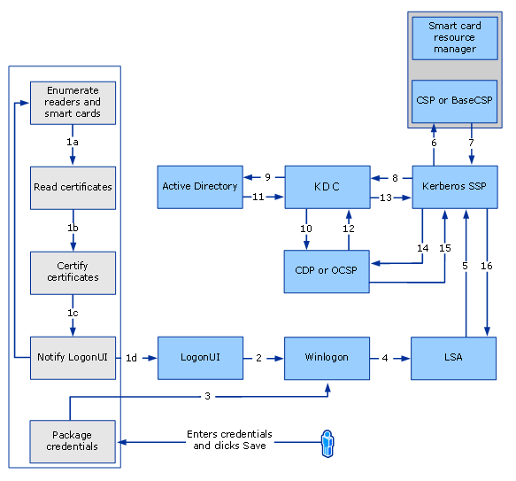
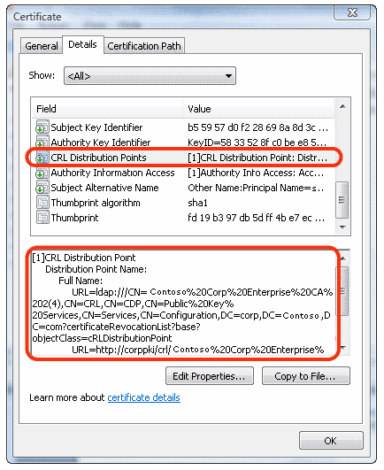
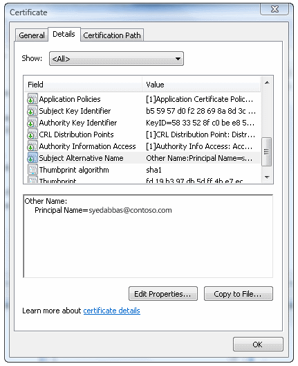
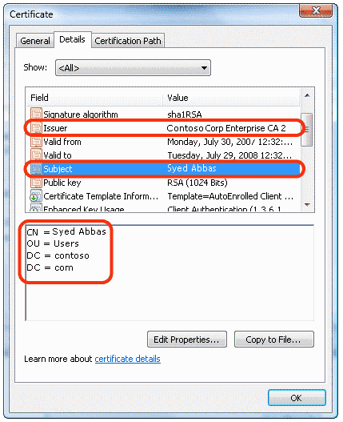

# Certificate Requirements and Enumeration

Applies To: Windows 10, Windows Server 2016

This topic for the IT professional and smart card developers describes how certificates are managed and used for smart card sign-in.

When a smart card is inserted, the following steps are performed.

> **Note**&nbsp;&nbsp;Unless otherwise mentioned, all operations are performed silently (CRYPT\_SILENT is passed to CryptAcquireContext).

1.  The smart card resource manager database searches for the smart card's cryptographic service provider (CSP).

2.  A qualified container name is constructed by using the smart card reader name, and it is passed to the CSP. The format is *\\\\.\\&lt;Reader name&gt;*\\

3.  CryptAcquireContext is called to retrieve a context to the default container. If a failure occurs, the smart card will be unusable for smart card sign-in.

4.  The name of the container is retrieved by using the PP\_CONTAINER parameter with CryptGetProvParam.

5.  Using the context acquired in Step 3, the CSP is queried for the PP\_USER\_CERTSTORE parameter (added in Windows Vista). For more information, see [Smart Card Architecture](smart-card-architecture.md). If the operation is successful, the name of a certificate store is returned, and the program flow skips to Step 8.

6.  If the operation in Step 5 fails, the default container context from Step 3 is queried for the AT\_KEYEXCHANGE key.

7.  The certificate is then queried from the key context by using KP\_CERTIFICATE. The certificate is added to an in-memory certificate store.

8.  For each certificate in the certificate store from Step 5 or Step 7, the following checks are performed:

    1.  The certificate must be valid, based on the computer system clock (not expired or valid with a future date).

    2.  The certificate must not be in the AT\_SIGNATURE part of a container.

    3.  The certificate must have a valid user principal name (UPN).

    4.  The certificate must have the digital signature key usage.

    5.  The certificate must have the smart card logon EKU.

    Any certificate that meets these requirements is displayed to the user with the certificate's UPN (or e-mail address or subject, depending on the presence of the certificate extensions).

    > **Note**&nbsp;&nbsp;These requirements are the same as those in Windows Server 2003, but they are performed before the user enters the PIN. You can override many of them by using Group Policy settings.

9.  The process then chooses a certificate, and the PIN is entered.

10.  LogonUI.exe packages the information and sends it to Lsass.exe to process the sign-in attempt.

11.  If successful, LogonUI.exe closes. This causes the context acquired in Step 3 to be released.

## About Certificate support for compatibility

Although versions of Windows earlier than Windows Vista include support for smart cards, the types of certificates that smart cards can contain are limited. The limitations are:

-   Each certificate must have a user principal name (UPN) and the smart card sign-in object identifier (also known as OID) in the enhanced key usage (EKU) attribute field. There is a Group Policy setting, Allow ECC certificates to be used for logon and authentication, to make the EKU optional.

-   Each certificate must be stored in the AT\_KEYEXCHANGE portion of the default CryptoAPI container, and non-default CryptoAPI containers are not supported.

The following table lists the certificate support in older Windows operating system versions.

| **Operating system**                  | **Certificate support**     |
|---------------------------------------|----------------------------------------------------------------------------------------------------------|
| Windows Server 2008 R2 and Windows 7  | Support for smart card sign-in with ECC-based certificates. ECC smart card sign-in is enabled through Group Policy.  ECDH\_P256 ECDH Curve P-256 from FIPS 186-2  ECDSA\_P256 ECDSA Curve P-256 from FIPS 186-2  ECDH\_P384 ECDH Curve P-384 from FIPS 186-2  ECDH\_P521 ECDH Curve P-521 from FIPS 186-2  ECDSA\_P256 ECDH Curve P-256 from FIPS 186-2  ECDSA\_P384 ECDSA Curve P-384 from FIPS 186-2  ECDSA\_P521 ECDSA Curve P-384 from FIPS 186-2 |
| Windows Server 2008 and Windows Vista | Valid certificates are enumerated and displayed from all smart cards and presented to the user. Keys are no longer restricted to the default container, and certificates in different containers can be chosen. Elliptic curve cryptography (ECC)-based certificates are not supported for smart card sign-in                 |

## Smart card sign-in flow in Windows

Most issues during authentication occur because of session behavior changes. When changes occur, the Local Security Authority (LSA) does not reacquire the session context; it relies instead on the Cryptographic Service Provider to handle the session change.

In the supported versions of Windows designated in the **Applies To** list at the beginning of this topic, client certificates that do not contain a UPN in the **subjectAltName** (SAN) field of the certificate can be enabled for sign-in, which supports a wider variety of certificates and supports multiple sign-in certificates on the same card.

Support for multiple certificates on the same card is enabled by default. New certificate types must be enabled through Group Policy.

If you enable the **Allow signature keys valid for Logon** credential provider policy, any certificates that are available on the smart card with a signature-only key are listed on the sign-in screen. This allows users to select their sign-in experience. If the policy is disabled or not configured, smart card signature-key-based certificates are not listed on the sign-in screen.

The following diagram illustrates how smart card sign-in works in the supported versions of Windows.

**Smart card sign-in flow**

Following are the steps that are performed during a smart card sign-in:

1.  Winlogon requests the sign-in UI credential information.

2.  Asynchronously, smart card resource manager starts, and the smart card credential provider does the following:

    1.  Gets credential information (a list of known credentials, or if no credentials exist, the smart card reader information that Windows detected).

    2.  Gets a list of smart card readers (by using the WinSCard API) and the list of smart cards inserted in each of them.

    3.  Enumerates each card to verify that a sign-in certificate that is controlled by Group Policy is present. If the certificate is present, the smart card credential provider copies it into a temporary, secure cache on the computer or terminal.

    > **Note**&nbsp;&nbsp;Smartcard cache entries are created for certificates with a subject name or with a subject key identifier. If the certificate has a subject name, it is stored with an index that is based on the subject name and certificate issuer. If another certificate with the same subject name and certificate issuer is used, it will replace the existing cached entry. A change in this behavior after Windows Vista, allows for the condition when the certificate does not have a subject name, the cache is created with an index that is based on the subject key identifier and certificate issuer. If another certificate has the same the subject key identifier and certificate issuer, the cache entry is replaced. When certificates have neither a subject name nor subject key identifier, a cached entry is not created.

    4.  Notifies the sign-in UI that it has new credentials.

3.  The sign-in UI requests the new credentials from the smart card credential provider. As a response, the smart card credential provider provides each sign-in certificate to the sign-in UI, and corresponding sign-in tiles are displayed. The user selects a smart card-based sign-in certificate tile, and Windows displays a PIN dialog box.

4.  The user enters the PIN, and then presses ENTER. The smart card credential provider encrypts the PIN.

5.  The credential provider that resides in the LogonUI system collects the PIN. As part of packaging credentials in the smart card credential provider, the data is packaged in a KERB\_CERTIFICATE\_LOGON structure. The main contents of the KERB\_CERTIFICATE\_LOGON structure are the smart card PIN, CSP data (such as reader name and container name), user name, and domain name. User name is required if the sign-in domain is not in the same forest because it enables a certificate to be mapped to multiple user accounts.

6.  The credential provider wraps the data (such as the encrypted PIN, container name, reader name, and card key specification) and sends it back to LogonUI.

7.  Winlogon presents the data from LogonUI to the LSA with the user information in LSALogonUser.

8.  LSA calls the Kerberos authentication package (Kerberos SSP) to create a Kerberos authentication service request (KRB\_AS\_REQ), which containing a preauthenticator (as specified in RFC 4556: [Public Key Cryptography for Initial Authentication in Kerberos (PKINIT)](http://www.ietf.org/rfc/rfc4556.txt)).

    If the authentication is performed by using a certificate that uses a digital signature, the preauthentication data consists of the user's public certificate and the certificate that is digitally signed with the corresponding private key. If the authentication is performed by using a certificate that uses key encipherment, the preauthentication data consists of the user's public certificate and the certificate that is encrypted with the corresponding private key.

9.  To sign the request digitally (as per RFC 4556), a call is made to the corresponding CSP for a private key operation. Because the private key in this case is stored in a smart card, the smart card subsystem is called, and the necessary operation is completed. The result is sent back to the Kerberos security support provider (SSP).

10.  The Kerberos SSP sends an authentication request for a ticket-granting-ticket (TGT) (per RFC 4556) to the Key Distribution Center (KDC) service that runs on a domain controller.

11.  The KDC finds the user's account object in Active Directory Domain Services (AD DS), as detailed in [Client certificate requirements and mappings](#client-certificate-requirements-and-mappings), and uses the user's certificate to verify the signature.

12.  The KDC validates the user's certificate (time, path, and revocation status) to ensure that the certificate is from a trusted source. The KDC uses CryptoAPI to build a certification path from the user's certificate to a root certification authority (CA) certificate that resides in the root store on the domain controller. The KDC then uses CryptoAPI to verify the digital signature on the signed authenticator that was included in the preauthentication data fields. The domain controller verifies the signature and uses the public key from the user's certificate to prove that the request originated from the owner of the private key that corresponds to the public key. The KDC also verifies that the issuer is trusted and appears in the NTAUTH certificate store.

13.  The KDC service retrieves user account information from AD DS. The KDC constructs a TGT, which is based on the user account information that it retrieves from AD DS. The TGT’s authorization data fields include the user's security identifier (SID), the SIDs for universal and global domain groups to which the user belongs, and (in a multidomain environment) the SIDs for any universal groups of which the user is a member.

14.  The domain controller returns the TGT to the client as part of the KRB\_AS\_REP response.

    > **Note**&nbsp;&nbsp;The KRB\_AS\_REP packet consists of:
    >- Privilege attribute certificate (PAC)
    >- User's SID
    >- SIDs of any groups of which the user is a member
    >- A request for ticket-granting service (TGS)
    >- Preauthentication data

    TGT is encrypted with the master key of the KDC, and the session key is encrypted with a temporary key. This temporary key is derived based on RFC 4556. Using CryptoAPI, the temporary key is decrypted. As part of the decryption process, if the private key is on a smart card, a call is made to the smart card subsystem by using the specified CSP to extract the certificate corresponding to the user's public key. (Programmatic calls for the certificate include CryptAcquireContext, CryptSetProvParam with the PIN, CryptgetUserKey, and CryptGetKeyParam.) After the temporary key is obtained, the Kerberos SSP decrypts the session key.

15.  The client validates the reply from the KDC (time, path, and revocation status). It first verifies the KDC's signature by the construction of a certification path from the KDC's certificate to a trusted root CA, and then it uses the KDC's public key to verify the reply signature.

16.  Now that a TGT has been obtained, the client obtains a service ticket, which is used to sign in to the local computer.

17.  With success, LSA stores the tickets and returns a success message to LSALogonUser. After this success message is issued, user profile for the device is selected and set, Group Policy refresh is instantiated, and other actions are performed.

18.  After the user profile is loaded, the Certification Propagation Service (CertPropSvc) detects this event, reads the certificates from the smart card (including the root certificates), and then populates them into the user's certificate store (MYSTORE).

19.  CSP to smart card resource manager communication happens on the LRPC Channel.

20.  On successful authentication, certificates are propagated to the user's store asynchronously by the Certificate Propagation Service (CertPropSvc).

21.  When the card is removed, certificates in the temporary secure cache store are removed. The Certificates are no longer available for sign-in, but they remain in the user's certificate store.

> **Note**&nbsp;&nbsp;A SID is created for each user or group at the time a user account or a group account is created within the local security accounts database or within AD DS. The SID never changes, even if the user or group account is renamed.

For more information about the Kerberos protocol, see [Microsoft Kerberos](https://msdn.microsoft.com/library/windows/desktop/aa378747(v=vs.85).aspx).

By default, the KDC verifies that the client's certificate contains the smart card client authentication EKU szOID\_KP\_SMARTCARD\_LOGON. However, if enabled, the **Allow certificates with no extended key usage certificate attribute** Group Policy setting allows the KDC to not require the SC-LOGON EKU. SC-LOGON EKU is not required for account mappings that are based on the public key.

## KDC certificate

Active Directory Certificate Services provides three kinds of certificate templates:

-   Domain controller

-   Domain controller authentication

-   Kerberos authentication

Depending on the configuration of the domain controller, one of these types of certificates is sent as a part of the AS\_REP packet.

## Client certificate requirements and mappings

Certificate requirements are listed by versions of the Windows operating system. Certificate mapping describes how information from the certificate is mapped to the user account.

### Certificate requirements

The smart card certificate has specific format requirements when it is used with Windows XP and earlier operating systems. You can enable any certificate to be visible for the smart card credential provider.

| **Component**     | **Requirements for Windows 8.1, Windows 8, Windows 7, and Windows Vista**          | **Requirements for Windows XP**  |
|--------------------------------------|--------------------------------|------|
| CRL distribution point location      | Not required              | The location must be specified, online, and available, for example: \[1\]CRL Distribution Point Distribution Point Name: Full Name: URL=http://server1.contoso.com/CertEnroll/caname.crl                   |
| Key usage         | Digital signature         | Digital signature                |
| Basic constraints | Not required              | \[Subject Type=End Entity, Path Length Constraint=None\] (Optional)    |
| Enhanced key usage (EKU)             | The smart card sign-in object identifier is not required.  **Note**&nbsp;&nbsp;If an EKU is present, it must contain the smart card sign-in EKU. Certificates with no EKU can be used for sign-in. | -   Client Authentication (1.3.6.1.5.5.7.3.2) The client authentication object identifier is required only if a certificate is used for SSL authentication.  - Smart Card Sign-in (1.3.6.1.4.1.311.20.2.2)   |
| Subject alternative name             | E-mail ID is not required for smart card sign-in.               | Other Name: Principal Name=(UPN), for example: UPN=user1@contoso.com The UPN OtherName object identifier is 1.3.6.1.4.1.311.20.2.3. The UPN OtherName value must be an ASN1-encoded UTF8 string.                |
| Subject           | Not required              | Distinguished name of user. This field is a mandatory extension, but the population of this field is optional.                  |
| Key exchange (AT\_KEYEXCHANGE field) | Not required for smart card sign-in certificates if a Group Policy setting is enabled. (By default, Group Policy settings are not enabled.) | Not required  |
| CRL               | Not required              | Not required  |
| UPN               | Not required              | Not required  |
| Notes             | You can enable any certificate to be visible for the smart card credential provider.                  | There are two predefined types of private keys. These keys are Signature Only (AT\_SIGNATURE) and Key Exchange (AT\_KEYEXCHANGE). Smart card sign-in certificates must have a Key Exchange (AT\_KEYEXCHANGE) private key type. |

### Client certificate mappings

Certificate mapping is based on the UPN that is contained in the subjectAltName (SAN) field of the certificate. Client certificates that do not contain information in the SAN field are also supported.

SSL/TLS can map certificates that do not have SAN, and the mapping is done by using the AltSecID attributes on client accounts. The X509 AltSecID, which is used by SSL/TLS client authentication is of the form "X509: &lt;I&gt;"*&lt;Issuer Name&gt;*"&lt;S&gt;"*&lt;Subject Name&gt;*. The *&lt;Issuer Name&gt;* and *&lt;Subject Name&gt;* are taken from the client certificate, with '\\r' and '\\n' replaced with ','.

**Certificate revocation list distribution points**

**UPN in Subject Alternative Name field**

**Subject and Issuer fields**

This account mapping is supported by the KDC in addition to six other mapping methods. The following figure demonstrates a flow of user account mapping logic that is used by the KDC.

**High-level flow of certificate processing for sign-in**

The certificate object is parsed to look for content to perform user account mapping.

-   When a user name is provided with the certificate, the user name is used to locate the account object. This operation is the fastest, because string matching occurs.

-   When only the certificate object is provided, a series of operations are performed to locate the user name to map the user name to an account object.

-   When no domain information is available for authentication, the local domain is used by default. If any other domain is to be used for lookup, a domain name hint should be provided to perform the mapping and binding.

Mapping based on generic attributes is not possible because there is no generic API to retrieve attributes from a certificate. Currently, the first method that locates an account successfully stops the search. But a configuration error occurs if two methods map the same certificate to different user accounts when the client does not supply the client name through the mapping hints.

The following figure illustrates the process of mapping user accounts for sign-in in the directory by viewing various entries in the certificate.

**Certificate processing logic**

NT\_AUTH policy is best described in the CERT\_CHAIN\_POLICY\_NT\_AUTH parameter section of the CertVerifyCertificateChainPolicy function. For more information, see [CertVerifyCertificateChainPolicy](https://msdn.microsoft.com/library/aa377163.aspx).

## Smart card sign-in for a single user with one certificate into multiple accounts

A single user certificate can be mapped to multiple accounts. For example, a user might be able to sign in to a user account and also to sign in as a domain administrator. The mapping is done by using the constructed AltSecID based on attributes from client accounts. For information about how this mapping is evaluated, see [Client certificate requirements and mappings](#client-certificate-requirements-and-mappings).

> **Note**&nbsp;&nbsp;Because each account has a different user name, we recommend that you enable the **Allow user name hint** Group Policy setting (**X509HintsNeeded** registry key) to provide the optional fields that allow users to enter their user names and domain information to sign in.

Based on the information that is available in the certificate, the sign-in conditions are:

1.  If no UPN is present in the certificate:

    1.  Sign-in can occur in the local forest or in another forest if a single user with one certificate needs to sign in to different accounts.

    2.  A hint must be supplied if mapping is not unique (for example, if multiple users are mapped to the same certificate).

2.  If a UPN is present in the certificate:

    1.  The certificate cannot be mapped to multiple users in the same forest.

    2.  The certificate can be mapped to multiple users in different forests. For a user to sign in to other forests, an X509 hint must be supplied to the user.

## Smart card sign-in for multiple users into a single account

A group of users might sign in to a single account (for example, an administrator account). For that account, user certificates are mapped so that they are enabled for sign-in.

Several distinct certificates can be mapped to a single account. For this to work properly, the certificate cannot have UPNs.

For example, if Certificate1 has CN=CNName1, Certificate2 has CN=User1, and Certificate3 has CN=User2, the AltSecID of these certificates can be mapped to a single account by using the Active Directory Users and Computers name mapping.

## Smart card sign-in across forests

For account mapping to work across forests, particularly in cases where there is not enough information available on the certificate, the user might enter a hint in the form of a user name, such as *domain\\user*, or a fully qualified UPN such as *user@contoso.com*.

> **Note**&nbsp;&nbsp;For the hint field to appear during smart card sign-in, the **Allow user name hint** Group Policy setting (**X509HintsNeeded** registry key) must be enabled on the client.

## OCSP support for PKINIT

Online Certificate Status Protocol (OCSP), which is defined in RFC 2560, enables applications to obtain timely information about the revocation status of a certificate. Because OCSP responses are small and well bound, constrained clients might want to use OCSP to check the validity of the certificates for Kerberos on the KDC, to avoid transmission of large CRLs, and to save bandwidth on constrained networks. For information about CRL registry keys, see [Smart Card Group Policy and Registry Settings](smart-card-group-policy-and-registry-settings.md).

The KDCs in Windows attempt to get OCSP responses and use them when available. This behavior cannot be disabled. CryptoAPI for OCSP caches OCSP responses and the status of the responses. The KDC supports only OCSP responses for the signer certificate.

Windows client computers attempt to request the OCSP responses and use them in the reply when they are available. This behavior cannot be disabled.

## Smart card root certificate requirements for use with domain sign-in

For sign-in to work in a smart card-based domain, the smart card certificate must meet the following conditions:

-   The KDC root certificate on the smart card must have an HTTP CRL distribution point listed in its certificate.

-   The smart card sign-in certificate must have the HTTP CRL distribution point listed in its certificate.

-   The CRL distribution point must have a valid CRL published and a delta CRL, if applicable, even if the CRL distribution point is empty.

-   The smart card certificate must contain one of the following:

    -   A subject field that contains the DNS domain name in the distinguished name. If it does not, resolution to an appropriate domain fails, so Remote Desktop Services and the domain sign-in with the smart card fail.

    -   A UPN where the domain name resolves to the actual domain. For example, if the domain name is Engineering.Corp.Contoso, the UPN is username@engineering.corp.contoso.com. If any part of the domain name is omitted, the Kerberos client cannot find the appropriate domain.

Although the HTTP CRL distribution points are on by default in Windows Server 2008, subsequent versions of the Windows Server operating system do not include HTTP CRL distribution points. To allow smart card sign-in to a domain in these versions, do the following:

1.  Enable HTTP CRL distribution points on the CA.

2.  Restart the CA.

3.  Reissue the KDC certificate.

4.  Issue or reissue the smart card sign-in certificate.

5.  Propagate the updated root certificate to the smart card that you want to use for the domain sign-in.

The workaround is to enable the **Allow user name hint** Group Policy setting (**X509HintsNeeded** registry key), which allows the user to supply a hint in the credentials user interface for domain sign-in.

If the client computer is not joined to the domain or if it is joined to a different domain, the client computer can resolve the server domain only by looking at the distinguished name on the certificate, not the UPN. For this scenario to work, the certificate requires a full subject, including DC=*&lt;DomainControllerName&gt;*, for domain name resolution.

To deploy root certificates on a smart card for the currently joined domain, you can use the following command:

**certutil -scroots update**

For more information about this option for the command-line tool, see [-SCRoots](https://technet.microsoft.com/library/cc732443(v=ws.11).aspx#BKMK_SCRoots).

## See also

[How Smart Card Sign-in Works in Windows](smart-card-how-smart-card-sign-in-works-in-windows.md)

