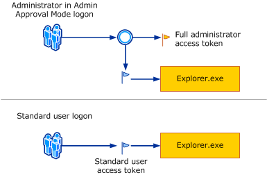
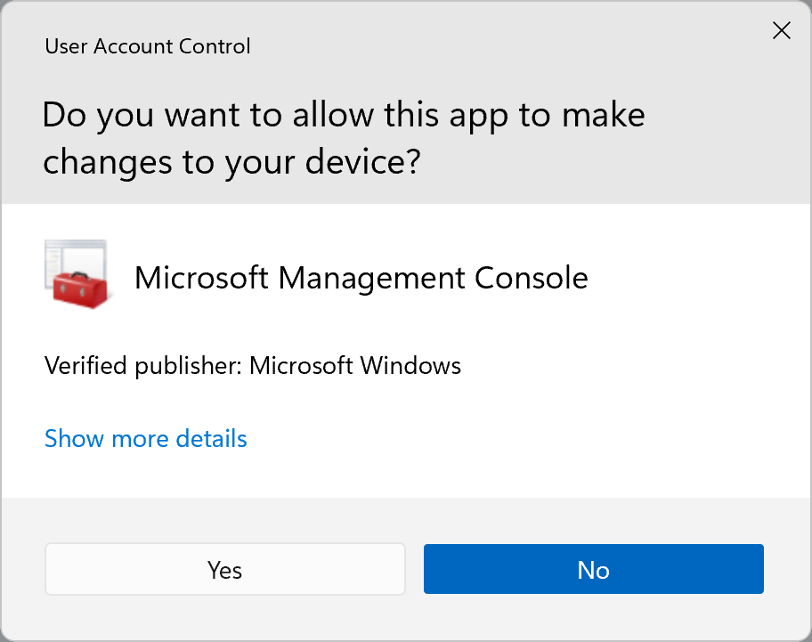
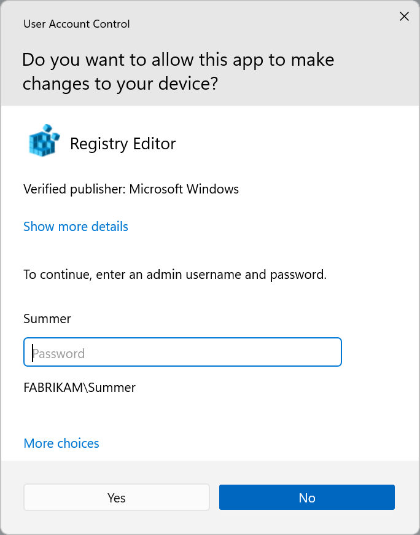
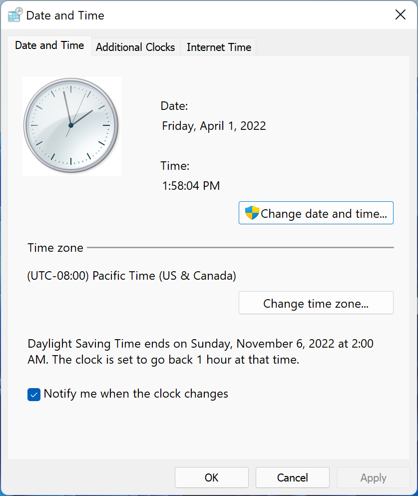

# How User Account Control works

**Applies to**
-   Windows 10
-   Windows 11
-   Windows Server 2016 and above

User Account Control (UAC) is a fundamental component of Microsoft's overall security vision. UAC helps mitigate the impact of malware.

## UAC process and interactions

Each app that requires the administrator access token must prompt for consent. The one exception is the relationship that exists between parent and child processes. Child processes inherit the user's access token from the parent process. Both the parent and child processes, however, must have the same integrity level. Windows protects processes by marking their integrity levels. Integrity levels are measurements of trust. A "high" integrity application is one that performs tasks that modify system data, such as a disk partitioning application, while a "low" integrity application is one that performs tasks that could potentially compromise the operating system, such as a Web browser. Apps with lower integrity levels cannot modify data in applications with higher integrity levels. When a standard user attempts to run an app that requires an administrator access token, UAC requires that the user provide valid administrator credentials.

To better understand how this process happens, let's look at the Windows logon process.

### Logon process

The following shows how the logon process for an administrator differs from the logon process for a standard user.

By default, standard users and administrators access resources and run apps in the security context of standard users. When a user logs on to a computer, the system creates an access token for that user. The access token contains information about the level of access that the user is granted, including specific security identifiers (SIDs) and Windows privileges.

When an administrator logs on, two separate access tokens are created for the user: a standard user access token and an administrator access token. The standard user access token contains the same user-specific information as the administrator access token, but the administrative Windows privileges and SIDs are removed. The standard user access token is used to start apps that do not perform administrative tasks (standard user apps). The standard user access token is then used to display the desktop (explorer.exe). Explorer.exe is the parent process from which all other user-initiated processes inherit their access token. As a result, all apps run as a standard user unless a user provides consent or credentials to approve an app to use a full administrative access token.

A user that is a member of the Administrators group can log on, browse the Web, and read e-mail while using a standard user access token. When the administrator needs to perform a task that requires the administrator access token, Windows 10 or Windows 11 automatically prompts the user for approval. This prompt is called an elevation prompt, and its behavior can be configured by using the Local Security Policy snap-in (Secpol.msc) or Group Policy. For more info, see [User Account Control security policy settings](user-account-control-security-policy-settings.md).

### The UAC User Experience

When UAC is enabled, the user experience for standard users is different from that of administrators in Admin Approval Mode. The recommended and more secure method of running Windows 10 or Windows 11 is to make your primary user account a standard user account. Running as a standard user helps to maximize security for a managed environment. With the built-in UAC elevation component, standard users can easily perform an administrative task by entering valid credentials for a local administrator account. The default, built-in UAC elevation component for standard users is the credential prompt.

The alternative to running as a standard user is to run as an administrator in Admin Approval Mode. With the built-in UAC elevation component, members of the local Administrators group can easily perform an administrative task by providing approval. The default, built-in UAC elevation component for an administrator account in Admin Approval Mode is called the consent prompt.

**The consent and credential prompts**

With UAC enabled, Windows 10 or Windows 11 prompts for consent or prompts for credentials of a valid local administrator account before starting a program or task that requires a full administrator access token. This prompt ensures that no malicious software can be silently installed.

**The consent prompt**

The consent prompt is presented when a user attempts to perform a task that requires a user's administrative access token. The following is an example of the UAC consent prompt.

**The credential prompt**

The credential prompt is presented when a standard user attempts to perform a task that requires a user's administrative access token. Administrators can also be required to provide their credentials by setting the **User Account Control: Behavior of the elevation prompt for administrators in Admin Approval Mode** policy setting value to **Prompt for credentials**.

The following is an example of the UAC credential prompt.

**UAC elevation prompts**

The UAC elevation prompts are color-coded to be app-specific, enabling for immediate identification of an application's potential security risk. When an app attempts to run with an administrator's full access token, Windows 10 or Windows 11 first analyzes the executable file to determine its publisher. Apps are first separated into three categories based on the file's publisher: Windows 10 or Windows 11, publisher verified (signed), and publisher not verified (unsigned). The following diagram illustrates how Windows determines which color elevation prompt to present to the user.

The elevation prompt color-coding is as follows:

-   Red background with a red shield icon: The app is blocked by Group Policy or is from a publisher that is blocked.
-   Blue background with a blue and gold shield icon: The application is a Windows 10 and Windows 11 administrative app, such as a Control Panel item.
-   Blue background with a blue shield icon: The application is signed by using Authenticode and is trusted by the local computer.
-   Yellow background with a yellow shield icon: The application is unsigned or signed but is not yet trusted by the local computer.

**Shield icon**

Some Control Panel items, such as **Date and Time Properties**, contain a combination of administrator and standard user operations. Standard users can view the clock and change the time zone, but a full administrator access token is required to change the local system time. The following is a screen shot of the **Date and Time Properties** Control Panel item.

The shield icon on the **Change date and time** button indicates that the process requires a full administrator access token and will display a UAC elevation prompt.

**Securing the elevation prompt**

The elevation process is further secured by directing the prompt to the secure desktop. The consent and credential prompts are displayed on the secure desktop by default in Windows 10 and Windows 11. Only Windows processes can access the secure desktop. For higher levels of security, we recommend keeping the **User Account Control: Switch to the secure desktop when prompting for elevation** policy setting enabled.

When an executable file requests elevation, the interactive desktop, also called the user desktop, is switched to the secure desktop. The secure desktop dims the user desktop and displays an elevation prompt that must be responded to before continuing. When the user clicks **Yes** or **No**, the desktop switches back to the user desktop.

Malware can present an imitation of the secure desktop, but when the **User Account Control: Behavior of the elevation prompt for administrators in Admin Approval Mode** policy setting is set to **Prompt for consent**, the malware does not gain elevation if the user clicks **Yes** on the imitation. If the policy setting is set to **Prompt for credentials**, malware imitating the credential prompt may be able to gather the credentials from the user. However, the malware does not gain elevated privilege and the system has other protections that mitigate malware from taking control of the user interface even with a harvested password.

While malware could present an imitation of the secure desktop, this issue cannot occur unless a user previously installed the malware on the PC. Because processes requiring an administrator access token cannot silently install when UAC is enabled, the user must explicitly provide consent by clicking **Yes** or by providing administrator credentials. The specific behavior of the UAC elevation prompt is dependent upon Group Policy.

## UAC Architecture

The following diagram details the UAC architecture.

To better understand each component, review the table below:

### User

|Component|Description|
|--- |--- |
|
User performs operation requiring privilege|
If the operation changes the file system or registry, Virtualization is called. All other operations call ShellExecute.|
|
ShellExecute|
ShellExecute calls CreateProcess. ShellExecute looks for the ERROR_ELEVATION_REQUIRED error from CreateProcess. If it receives the error, ShellExecute calls the Application Information service to attempt to perform the requested task with the elevated prompt.|
|
CreateProcess|
If the application requires elevation, CreateProcess rejects the call with ERROR_ELEVATION_REQUIRED.|

### System

|Component|Description|
|--- |--- |
|
Application Information service|
A system service that helps start apps that require one or more elevated privileges or user rights to run, such as local administrative tasks, and apps that require higher integrity levels. The Application Information service helps start such apps by creating a new process for the application with an administrative user's full access token when elevation is required and (depending on Group Policy) consent is given by the user to do so.|
|
Elevating an ActiveX install|
If ActiveX is not installed, the system checks the UAC slider level. If ActiveX is installed, the **User Account Control: Switch to the secure desktop when prompting for elevation** Group Policy setting is checked.|
|
Check UAC slider level|
UAC has a slider to select from four levels of notification.<ul><li>
**Always notify** will:<ul><li>Notify you when programs try to install software or make changes to your computer.</li><li>Notify you when you make changes to Windows settings.</li><li>Freeze other tasks until you respond.</li></ul>
Recommended if you often install new software or visit unfamiliar websites. </li><li>
**Notify me only when programs try to make changes to my computer** will:<ul><li>Notify you when programs try to install software or make changes to your computer.</li><li>Not notify you when you make changes to Windows settings.</li><li>Freeze other tasks until you respond.</li></ul>
Recommended if you do not often install apps or visit unfamiliar websites. </li><li>
**Notify me only when programs try to make changes to my computer (do not dim my desktop)** will:<ul><li>Notify you when programs try to install software or make changes to your computer.</li><li>Not notify you when you make changes to Windows settings.</li><li>Not freeze other tasks until you respond.</li></ul>
Not recommended. Choose this only if it takes a long time to dim the desktop on your computer. </li><li>
**Never notify (Disable UAC prompts)** will:<ul><li>Not notify you when programs try to install software or make changes to your computer.</li><li>Not notify you when you make changes to Windows settings.</li><li>Not freeze other tasks until you respond.</li></ul>
Not recommended due to security concerns.|
|
Secure desktop enabled|
The **User Account Control: Switch to the secure desktop when prompting for elevation** policy setting is checked: <ul><li>
If the secure desktop is enabled, all elevation requests go to the secure desktop regardless of prompt behavior policy settings for administrators and standard users.</li><li>
If the secure desktop is not enabled, all elevation requests go to the interactive user&#39;s desktop, and the per-user settings for administrators and standard users are used.|
|
CreateProcess|
CreateProcess calls AppCompat, Fusion, and Installer detection to assess if the app requires elevation. The file is then inspected to determine its requested execution level, which is stored in the application manifest for the file. CreateProcess fails if the requested execution level specified in the manifest does not match the access token and returns an error (ERROR_ELEVATION_REQUIRED) to ShellExecute.|
|
AppCompat|
The AppCompat database stores information in the application compatibility fix entries for an application.|
|
Fusion|
The Fusion database stores information from application manifests that describe the applications. The manifest schema is updated to add a new requested execution level field.|
|
Installer detection|
Installer detection detects setup files, which helps prevent installations from being run without the user&#39;s knowledge and consent.|

### Kernel

|Component|Description|
|--- |--- |
|
Virtualization|
Virtualization technology ensures that non-compliant apps do not silently fail to run or fail in a way that the cause cannot be determined. UAC also provides file and registry virtualization and logging for applications that write to protected areas.|
|
File system and registry|
The per-user file and registry virtualization redirects per-computer registry and file write requests to equivalent per-user locations. Read requests are redirected to the virtualized per-user location first and to the per-computer location second.|
 
The slider will never turn UAC completely off. If you set it to **Never notify**, it will:

-   Keep the UAC service running.
-   Cause all elevation request initiated by administrators to be auto-approved without showing a UAC prompt.
-   Automatically deny all elevation requests for standard users.

> [!IMPORTANT]
> In order to fully disable UAC you must disable the policy **User Account Control: Run all administrators in Admin Approval Mode**.

> [!WARNING]
> Some Universal Windows Platform apps may not work when UAC is disabled.
 
### Virtualization

Because system administrators in enterprise environments attempt to secure systems, many line-of-business (LOB) applications are designed to use only a standard user access token. As a result, you do not need to replace the majority of apps when UAC is turned on.

Windows 10 and Windows 11 include file and registry virtualization technology for apps that are not UAC-compliant and that require an administrator's access token to run correctly. When an administrative apps that is not UAC-compliant attempts to write to a protected folder, such as Program Files, UAC gives the app its own virtualized view of the resource it is attempting to change. The virtualized copy is maintained in the user's profile. This strategy creates a separate copy of the virtualized file for each user that runs the non-compliant app.

Most app tasks operate properly by using virtualization features. Although virtualization allows a majority of applications to run, it is a short-term fix and not a long-term solution. App developers should modify their apps to be compliant as soon as possible, rather than relying on file, folder, and registry virtualization.

Virtualization is not an option in the following scenarios:

-   Virtualization does not apply to apps that are elevated and run with a full administrative access token.

-   Virtualization supports only 32-bit apps. Non-elevated 64-bit apps simply receive an access denied message when they attempt to acquire a handle (a unique identifier) to a Windows object. Native Windows 64-bit apps are required to be compatible with UAC and to write data into the correct locations.

-   Virtualization is disabled if the app includes an app manifest with a requested execution level attribute.

### Request execution levels

An app manifest is an XML file that describes and identifies the shared and private side-by-side assemblies that an app should bind to at run time. The app manifest includes entries for UAC app compatibility purposes. Administrative apps that include an entry in the app manifest prompt the user for permission to access the user's access token. Although they lack an entry in the app manifest, most administrative app can run without modification by using app compatibility fixes. App compatibility fixes are database entries that enable applications that are not UAC-compliant to work properly.

All UAC-compliant apps should have a requested execution level added to the application manifest. If the application requires administrative access to the system, then marking the app with a requested execution level of "require administrator" ensures that the system identifies this program as an administrative app and performs the necessary elevation steps. Requested execution levels specify the privileges required for an app.

### Installer detection technology

Installation programs are apps designed to deploy software. Most installation programs write to system directories and registry keys. These protected system locations are typically writeable only by an administrator in Installer detection technology, which means that standard users do not have sufficient access to install programs. Windows 10 and Windows 11 heuristically detect installation programs and requests administrator credentials or approval from the administrator user in order to run with access privileges. Windows 10 and Windows 11 also heuristically detect updates and programs that uninstall applications. One of the design goals of UAC is to prevent installations from being run without the user's knowledge and consent because installation programs write to protected areas of the file system and registry.

Installer detection only applies to:

-   32-bit executable files.
-   Applications without a requested execution level attribute.
-   Interactive processes running as a standard user with UAC enabled.

Before a 32-bit process is created, the following attributes are checked to determine whether it is an installer:

-   The file name includes keywords such as "install," "setup," or "update."
-   Versioning Resource fields contain the following keywords: Vendor, Company Name, Product Name, File Description, Original Filename, Internal Name, and Export Name.
-   Keywords in the side-by-side manifest are embedded in the executable file.
-   Keywords in specific StringTable entries are linked in the executable file.
-   Key attributes in the resource script data are linked in the executable file.
-   There are targeted sequences of bytes within the executable file.

> [!NOTE]
> The keywords and sequences of bytes were derived from common characteristics observed from various installer technologies.

> [!NOTE]
> The User Account Control: Detect application installations and prompt for elevation policy setting must be enabled for installer detection to detect installation programs. For more info, see [User Account Control security policy settings](user-account-control-security-policy-settings.md).
