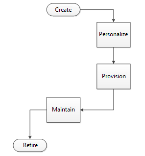

# Deploy Virtual Smart Cards

Applies To: Windows 10, Windows Server 2016

This topic for the IT professional discusses the factors to consider when you deploy a virtual smart card authentication solution.

Traditional identity devices, such as physical smart cards, follow a predictable lifecycle in any deployment, as shown in the following diagram.

Physical devices are created by a dedicated manufacturer and then purchased by the corporation that will ultimately deploy it. The device passes through the personalization stage, where its unique properties are set. In smart cards, these properties are the administrator key, Personal Identification Number (PIN), PIN Unlock Key (PUK), and its physical appearance. To provision the device, it is loaded with the required certificates, such as a sign-in certificate. After you provision the device, it is ready for use. The device must simply be maintained. For example, you must replace cards when they are lost or stolen and reset PINs when users forget them. Finally, you’ll retire devices when they exceed their intended lifetime or when employees leave the company.

This topic contains information about the following phases in a virtual smart card lifecycle:

-   [Create and personalize virtual smart cards](#create-and-personalize-virtual-smart-cards)

-   [Provision virtual smart cards](#provision-virtual-smart-cards)

-   [Maintain virtual smart cards](#maintain-virtual-smart-cards)

## Create and personalize virtual smart cards

A corporation purchases the devices to deploy then. The device passes through the personalization stage, where its unique properties are set. In smart cards, these properties are the administrator key, Personal Identification Number (PIN), PIN Unlock Key (PUK), and its physical appearance. The security that is provided for a TPM virtual smart card is fully provisioned in the host TPM.

### Trusted Platform Module readiness

The TPM Provisioning Wizard, which is launched from the **TPM Management Console**, takes the user through all the steps to prepare the TPM for use.

When you create virtual smart cards, consider the following actions in the TPM:

-   **Enable and Activate**: TPMs are built in to many industry ready computers, but they often are not enabled and activated by default. In some cases, the TPM must be enabled and activated through the BIOS. For more information, see Initialize and Configure Ownership of the TPM.

-   **Take ownership**: When you provision the TPM, you set an owner password for managing the TPM in the future, and you establish the storage root key. To provide anti-hammering protection for virtual smart cards, the user or a domain administrator must be able to reset the TPM owner password.
    For corporate use of TPM virtual smart cards, we recommend that the corporate domain administrator restrict access to the TPM owner password by storing it in Active Directory, not in the local registry. When TPM ownership is set in Windows Vista, the TPM needs to be cleared and reinitialized. For more information, see Trusted Platform Module Technology Overview.

-   **Manage**: You can manage ownership of a virtual smart card by changing the owner password, and you can manage anti-hammering logic by resetting the lockout time. For more information, see Manage TPM Lockout.

A TPM might operate in reduced functionality mode. This could occur, for example, if the operating system cannot determine if the owner password is available to the user. In those cases, the TPM can be used to create a virtual smart card, but it is strongly recommended to bring the TPM to a fully ready state so that any unexpected circumstances will not leave the user blocked from using the computer.

Those smart card deployment management tools that require a status check of a TPM before attempting to create a TPM virtual smart card can do so using the TPM WMI interface.

Depending on the setup of the computer that is designated for installing TPM virtual smart cards, it might be necessary to provision the TPM before continuing with the virtual smart card deployment. For more information about provisioning, see [Use Virtual Smart Cards](virtual-smart-card-use-virtual-smart-cards.md).

For more information about managing TPMs by using built-in tools, see Trusted Platform Module Services Group Policy Settings.

### Creation

A TPM virtual smart card simulates a physical smart card, and it uses the TPM to provide the same functionality as physical smart card hardware. A virtual smart card appears within the operating system as a physical smart card that is always inserted. Supported versions of the Windows operating system present a virtual smart card reader and virtual smart card to applications with the same interface as physical smart cards, but messages to and from the virtual smart card are translated to TPM commands. This process ensures the integrity of the virtual smart card through the three properties of smart card security:

-   **Non-exportability**: Because all private information on the virtual smart card is encrypted by using the TPM on the host computer, it cannot be used on a different computer with a different TPM. Additionally, TPMs are designed to be tamper-resistant and non-exportable, so a malicious user cannot reverse engineer an identical TPM or install the same TPM on a different computer.
    For more information, see [Evaluate Virtual Smart Card Security](virtual-smart-card-evaluate-security.md).

-   **Isolated cryptography**: TPMs provide the same properties of isolated cryptography that is offered by physical smart cards, and this is utilized by virtual smart cards. Unencrypted copies of private keys are loaded only within the TPM and never into memory that is accessible by the operating system. All cryptographic operations with these private keys occur inside the TPM.

-   **Anti-hammering**: If a user enters a PIN incorrectly, the virtual smart card responds by using the anti-hammering logic of the TPM, which rejects further attempts for a period of time instead of blocking the card. This is also known as lockout.
    For more information, see [Blocked virtual smart card](#blocked-virtual-smart-card) and [Evaluate Virtual Smart Card Security](virtual-smart-card-evaluate-security.md). 

There are several options for creating virtual smart cards, depending on the size of the deployment and budget of the organization. The lowest cost option is using Tpmvscmgr.exe to create cards individually on users’ computers. Alternatively, a virtual smart card management solution can be purchased to more easily accomplish virtual smart card creation on a larger scale and aid in further phases of deployment. Virtual smart cards can be created on computers that are to be provisioned for an employee or on those that are already in an employee’s possession. In either approach, there should be some central control over personalization and provisioning. If a computer is intended for use by multiple employees, multiple virtual smart cards can be created on a computer.

For information about the TPM Virtual Smart Card command-line tool, see [Tpmvscmgr](virtual-smart-card-tpmvscmgr.md).

### Personalization

During virtual smart card personalization, the values for the administrator key, PIN, and PUK are assigned. As with a physical card, knowing the administrator key is important for resetting the PIN or for deleting the card in the future. (If a PUK is set, the administrator key can no longer be used to reset the PIN.)

Because the administrator key is critical to the security of the card, it is important to consider the deployment environment and decide on the proper administrator key setting strategy. Options for these strategies include:

-   **Uniform**: Administrator keys for all the virtual smart cards that are deployed in the organization are the same. Although this makes the maintenance infrastructure easy (only one key needs to be stored), it is highly insecure. This strategy might be sufficient for very small organizations, but if the administrator key is compromised, all virtual smart cards that use this key must be reissued.

-   **Random, not stored**: Administrator keys are assigned randomly for all virtual smart cards, and they are not recorded. This is a valid option if the deployment administrators do not require the ability to reset PINs, and instead prefer to delete and reissue virtual smart cards. This could also be a viable strategy if the administrator prefers to set PUK values for the virtual smart cards and then use this value to reset PINs, if necessary.

-   **Random, stored**: Administrator keys are assigned randomly and stored in a central location. Each card’s security is independent of the others. This is secure on a large scale unless the administrator key database is compromised.

-   **Deterministic**: Administrator keys are the result of some function or known information. For example, the user ID could be used to randomly generate data that can be further processed through a symmetric encryption algorithm by using a secret. This administrator key can be similarly regenerated when needed, and it does not need to be stored. The security of this method relies on the security of the secret used.

Although the PUK and the administrator key methodologies provide unlocking and resetting functionality, they do so in different ways. The PUK is a PIN that is simply entered on the computer to enable a user PIN reset.

The administrator key methodology takes a challenge-response approach. The card provides a set of random data after users verify their identity to the deployment administrator. The administrator then encrypts the data with the administrator key and gives the encrypted data back to the user. If the encrypted data matches that produced by the card during verification, the card will allow PIN reset. Because the administrator key is never accessible by anyone other than the deployment administrator, it cannot be intercepted or recorded by any other party (including employees). This provides significant security benefits beyond using a PUK, an important consideration during the personalization process.

TPM virtual smart cards can be personalized on an individual basis when they are created with the Tpmvscmgr command-line tool. Or organizations can purchase a management solution that can incorporate personalization into an automated routine. An additional advantage of such a solution is the automated creation of administrator keys. Tpmvscmgr.exe allows users to create their own administrator keys, which can be detrimental to the security of the virtual smart cards.

## Provision virtual smart cards

Provisioning is the process of loading specific credentials onto a TPM virtual smart card. These credentials consist of certificates that are created to give users access to a specific service, such as domain sign in. A maximum of 30 certificates is allowed on each virtual smart card. As with physical smart cards, several decisions must be made regarding the provisioning strategy, based on the environment of the deployment and the desired level of security.

A high-assurance level of secure provisioning requires absolute certainty about the identity of the individual who is receiving the certificate. Therefore, one method of high-assurance provisioning is utilizing previously provisioned strong credentials, such as a physical smart card, to validate identity during provisioning. In-person proofing at enrollment stations is another option, because an individual can easily and securely prove his or her identity with a passport or driver’s license, although this can become infeasible on a larger scale. To achieve a similar level of assurance, a large organization can implement an “enroll-on-behalf-of” strategy, in which employees are enrolled with their credentials by a superior who can personally verify their identities. This creates a chain of trust that ensures individuals are checked in person against their proposed identities, but without the administrative strain of provisioning all virtual smart cards from a single central enrollment station.

For deployments in which a high-assurance level is not a primary concern, you can use self-service solutions. These can include using an online portal to obtain credentials or simply enrolling for certificates by using Certificate Manager, depending on the deployment. Consider that virtual smart card authentication is only as strong as the method of provisioning. For example, if weak domain credentials (such as a password alone) are used to request the authentication certificate, virtual smart card authentication will be equivalent to using only the password, and the benefits of two-factor authentication are lost.

For information about using Certificate Manager to configure virtual smart cards, see [Get Started with Virtual Smart Cards: Walkthrough Guide](virtual-smart-card-get-started.md).

High-assurance and self-service solutions approach virtual smart card provisioning by assuming that the user’s computer has been issued prior to the virtual smart card deployment, but this is not always the case. If virtual smart cards are being deployed with new computers, they can be created, personalized, and provisioned on the computer before the user has contact with that computer.

In this situation, provisioning becomes relatively simple, but identity checks must be put in place to ensure that the recipient of the computer is the individual who was expected during provisioning. This can be accomplished by requiring the employee to set the initial PIN under the supervision of the deployment administrator or manager.

When you are provisioning your computers, you should also consider the longevity of credentials that are supplied for virtual smart cards. This choice must be based on the risk threshold of the organization. Although longer lived credentials are more convenient, they are also more likely to become compromised during their lifetime. To decide on the appropriate lifetime for credentials, the deployment strategy must take into account the vulnerability of their cryptography (how long it could take to crack the credentials), and the likelihood of attack.

If a virtual smart card is compromised, administrators should be able to revoke the associated credentials, like they would with a lost or stolen laptop. This requires a record of which credentials match which user and computer, which is functionality that does not exist natively in Windows. Deployment administrators might want to consider add-on solutions to maintain such a record.

### Virtual smart cards on consumer devices used for corporate access

There are techniques that allow employees to provision virtual smart cards and enroll for certificates that can be used to authenticate the users. This is useful when employees attempt to access corporate resources from devices that are not joined to the corporate domain. Those devices can be further defined to not allow users to download and run applications from sources other than the Windows Store (for example, devices running Windows RT).

You can use APIs that were introduced in Windows Server 2012 R2 and Windows 8.1 to build Windows Store apps that you can use to manage the full lifecycle of virtual smart cards. For more information, see [Create and delete virtual smart cards programmatically](virtual-smart-card-use-virtual-smart-cards.md#create-and-delete-virtual-smart-cards-programmatically).

#### TPM ownerAuth in the registry

When a device or computer is not joined to a domain, the TPM ownerAuth is stored in the registry under HKEY\_LOCAL\_MACHINE. This exposes some threats. Most of the threat vectors are protected by BitLocker, but threats that are not protected include:

-   A malicious user possesses a device that has an active local sign-in session before the device locks. The malicious user could attempt a brute-force attack on the virtual smart card PIN, and then access the corporate secrets.

-   A malicious user possesses a device that has an active virtual private network (VPN) session. The device is then compromised.

The proposed mitigation for the previous scenarios is to use Exchange ActiveSync (EAS) policies to reduce the automatic lockout time from five minutes to 30 seconds of inactivity. Policies for automatic lockout can be set while provisioning virtual smart cards. If an organization wants more security, they can also configure a setting to remove the ownerAuth from the local device.

For configuration information about the TPM ownerAuth registry key, see the Group Policy setting Configure the level of TPM owner authorization information available to the operating system.

<!-- Replace following link if a newer one becomes available for similar content. -->

For information about EAS policies, see [Exchange ActiveSync Policy Engine Overview](https://technet.microsoft.com/library/dn282287(v=ws.11).aspx).

#### Managed and unmanaged cards

The following table describes the important differences between managed and unmanaged virtual smart cards that exist on consumer devices:

<!-- Check on whether the middle column header is correct - it probably should be [Managed cards](#managed-cards)    -->

| Operation                          | [Managed and unmanaged cards](virtual-smart-card-deploy-virtual-smart-cards.md#managed-and-unmanaged-cards) | [Unmanaged cards](virtual-smart-card-deploy-virtual-smart-cards.md#unmanaged-cards) |
|-----------------------------------------|--------------|----|
| Reset PIN when the user forgets the PIN | Yes      | No, the card has to be deleted and created again.     |
| Allow user to change the PIN            | Yes      | No, the card has to be deleted and created again.     |

## Managed cards

A managed virtual smart card can be serviced by the IT administrator or another person in that designated role. It allows the IT administrator to have influence or complete control over specific aspects of the virtual smart card from its creation to deletion. To manage these cards, a virtual smart card deployment management tool is often required.

### Managed card creation

A user can create blank virtual smart card by using the Tpmvscmgr command-line tool, which is a built-in tool that is run with administrative credentials through an elevated command prompt. This virtual smart card needs to be created with well-known parameters (such as default values), and it should be left unformatted (specifically, the **/generate** option should not be specified).

The following command creates a virtual smart card that can later be managed by a smart card management tool launched from another computer (as explained in the next section):

`tpmvscmgr.exe create /name "VirtualSmartCardForCorpAccess" /AdminKey DEFAULT /PIN PROMPT`

Alternatively, instead of using a default administrator key, a user can enter an administrator key at the command line:

`tpmvscmgr.exe create /name "VirtualSmartCardForCorpAccess" /AdminKey PROMPT /PIN PROMPT`

In either case, the card management system needs to be aware of the initial administrator key that is used so that it can take ownership of the virtual smart card and change the administrator key to a value that is only accessible through the card management tool operated by the IT administrator. For example, when the default value is used, the administrator key is set to:

`10203040506070801020304050607080102030405060708`

For information about using this command-line tool, see [Tpmvscmgr](virtual-smart-card-tpmvscmgr.md).

### Managed card management

After the virtual smart card is created, the user needs to open a remote desktop connection to an enrollment station, for example, in a computer that is joined to the domain. Virtual smart cards that are associated with a client computer are available for use in the remote desktop connection. The user can open a card management tool inside the remote session that can take ownership of the card and provision it for use by the user. This requires that a user is allowed to establish a remote desktop connection from a non-domain-joined computer to a domain-joined computer. This might require a specific network configuration, such as through IPsec policies.

When users need to reset or change a PIN, they need to use the remote desktop connection to complete these operations. They can use the built-in tools for PIN unlock and PIN change or the smart card management tool.

### Certificate management for managed cards

Similar to physical smart cards, virtual smart cards require certificate enrollment.

#### Certificate issuance

Users can enroll for certificates from within a remote desktop session that is established to provision the card. This process can also be managed by the smart card management tool that the user runs through the remote desktop connection. This model works for deployments that require the user to sign a request for enrollment by using a physical smart card. The driver for the physical smart card does not need to be installed on the client computer if it is installed on the remote computer. This is made possible by smart card redirection functionality that was introduced in Windows Server 2003, which ensures that smart cards that are connected to the client computer are available for use during a remote session.

Alternatively, without establishing a remote desktop connection, users can enroll for certificates from the Certificate Management console (certmgr.msc) on a client computer. Users can also create a request and submit it to a server from within a custom certificate enrollment application (for example, a registration authority) that has controlled access to the certification authority (CA). This requires specific enterprise configuration and deployments for Certificate Enrollment Policies (CEP) and Certificate Enrollment Services (CES).

#### Certificate lifecycle management

You can renew certificates through remote desktop connections, certificate enrollment policies, or certificate enrollment services. Renewal requirements could be different from the initial issuance requirements, based on the renewal policy.

Certificate revocation requires careful planning. When information about the certificate to be revoked is reliably available, the specific certificate can be easily revoked. When information about the certificate to be revoked is not easy to determine, all certificates that are issued to the user under the policy that was used to issue the certificate might need to be revoked. For example, this could occur if an employee reports a lost or compromised device, and information that associates the device with a certificate is not available.

## Unmanaged cards

Unmanaged virtual smart cards are not serviceable by an IT administrator. Unmanaged cards might be suitable if an organzation does not have an elaborate smart card deployment management tool and using remote desktop connections to manage the card is not desirable. Because unmanaged cards are not serviceable by the IT administrator, when a user needs help with a virtual smart card (for example, resetting or unlocking a PIN), the only option available to the user is to delete the card and create it again. This results in loss of the user’s credentials and he or she must re-enroll.

### Unmanaged card creation

A user can create a virtual smart card by using the Tpmvscmgr command-line tool, which is run with administrative credentials through an elevated command prompt. The following command creates an unmanaged card that can be used to enroll certificates:

`tpmvscmgr.exe create /name "VirtualSmartCardForCorpAccess" /AdminKey RANDOM /PIN PROMPT /generate`

This command creates a card with a randomized administrator key. The key is automatically discarded after the creation of the card. If users forget or want to change their PIN, they need to delete the card and create it again. To delete the card, a user can run the following command:

`tpmvscmgr.exe destroy /instance <instance ID>`

where &lt;instance ID&gt; is the value that is printed on the screen when the user creates the card. Specifically, for the first card created, the instance ID is ROOT\\SMARTCARDREADER\\0000).

### Certificate management for unmanaged cards

Depending on the security requirements that are unique to an organization, users can initially enroll for certificates from the certificate management console (certmgr.msc) or from within custom certificate enrollment applications. The latter method can create a request and submit it to a server that has access to the Certification Authority. This requires specific organizational configurations and deployments for certificate enrollment policies and certificate enrollment services. Windows has built-in tools, specifically Certreq.exe and Certutil.exe, which can be used by scripts to perform the enrollment from the command line.

#### Requesting the certificate by providing domain credentials only

The simplest way for users to request certificates is to provide their domain credentials through a script that can perform the enrollment through built-in components you have in place for certificate requests.

Alternatively, an application (such as a line-of-business app) can be installed on the computer to perform enrollment by generating a request on the client. The request is submitted to an HTTP server, which can forward it to a registration authority.

Another option is to have the user access an enrollment portal that is available through Internet Explorer. The webpage can use the scripting APIs to perform certificate enrollment.

#### Signing the request with another certificate

You can provide users with a short-term certificate through a Personal Information Exchange (.pfx) file. You can generate the .pfx file by initiating a request from a domain-joined computer. Additional policy constraints can be enforced on the .pfx file to assert the identity of the user.

The user can import the certificate into the **MY** store (which is the user’s certificate store). And your organization can present the user with a script that can be used to sign the request for the short-term certificate and to request a virtual smart card.

For deployments that require users to use a physical smart card to sign the certificate request, you can use the procedure:

1.  Users initiate a request on a domain-joined computer.

2.  Users complete the request by using a physical smart card to sign the request.

3.  Users download the request to the virtual smart card on their client computer.

#### Using one-time password for enrollment

Another option to ensure that users are strongly authenticated before virtual smart card certificates are issued is to send a user a one-time password through SMS, email, or phone. The user then types the one-time password during the certificate enrollment from an application or a script on a desktop that invokes built-in command-line tools.

#### Certificate lifecycle management

Certificate renewal can be done from the same tools that are used for the initial certificate enrollment. Certificate enrollment policies and certificate enrollment services can also be used to perform automatic renewal.

Certificate revocation requires careful planning. When information about the certificate to be revoked is reliably available, the specific certificate can be easily revoked. When information about the certificate to be revoked is not easy to determine, all certificates that are issued to the user under the policy that was used to issue the certificate might need to be revoked. For example, this could occur if an employee reports a lost or compromised device, and information that associates the device with a certificate is not available.

## Maintain virtual smart cards

Maintenance is a significant portion of the virtual smart card lifecycle and one of the most important considerations from a management perspective. After virtual smart cards are created, personalized, and provisioned, they can be used for convenient two-factor authentication. Deployment administrators must be aware of several common administrative scenarios, which can be approached by using a purchased virtual smart card solution or on a case-by-case basis with in-house methods.

**Renewal**: Renewing virtual smart card credentials is a regular task that is necessary to preserve the security of a virtual smart card deployment. Renewal is the result of a signed request from a user who specifies the key pair desired for the new credentials. Depending on user’s choice or deployment specification, the user can request credentials with the same key pair as previously used, or choose a newly generated key pair.

When renewing with a previously used key, no extra steps are required because a strong certificate with this key was issued during the initial provisioning. However, when the user requests a new key pair, you must take the same steps that were used during provisioning to assure the strength of the credentials. Renewal with new keys should occur periodically to counter sophisticated long-term attempts by malicious users to infiltrate the system. When new keys are assigned, you must ensure that the new keys are being used by the expected individuals on the same virtual smart cards.

**Resetting PINs**: Resetting virtual smart card PINs is also a frequent necessity, because employees forget their PINs. There are two ways to accomplish this, depending on choices made earlier in the deployment: Use a PUK (if the PUK is set), or use a challenge-response approach with the administration key. Before resetting the PIN, the user’s identity must be verified by using some means other than the card—most likely the verification method that you used during initial provisioning (for example, in-person proofing). This is necessary in user-error scenarios when users forget their PINs. However, you should never reset a PIN if it has been compromised because the level of vulnerability after the PIN is exposed is difficult to identify. The entire card should be reissued.

**Lockout reset**: A frequent precursor to resetting a PIN is the necessity of resetting the TPM lockout time because the TPM anti-hammering logic will be engaged with multiple PIN entry failures for a virtual smart card. This is currently device specific.

**Retiring cards**: The final aspect of virtual smart card management is retiring cards when they are no longer needed. When an employee leaves the company, it is desirable to revoke domain access. Revoking sign-in credentials from the certification authority (CA) accomplishes this goal.

The card should be reissued if the same computer is used by other employees without reinstalling the operating system. Reusing the former card can allow the former employee to change the PIN after leaving the organization, and then hijack certificates that belong to the new user to obtain unauthorized domain access. However, if the employee takes the virtual smart card-enabled computer, it is only necessary to revoke the certificates that are stored on the virtual smart card.

### Emergency preparedness

#### Card reissuance

The most common scenario in an organization is reissuing virtual smart cards, which can be necessary if the operating system is reinstalled or if the virtual smart card is compromised in some manner. Reissuance is essentially the recreation of the card, which involves establishing a new PIN and administrator key and provisioning a new set of associated certificates. This is an immediate necessity when a card is compromised, for example, if the virtual smart card-protected computer is exposed to an adversary who might have access to the correct PIN. Reissuance is the most secure response to an unknown exposure of a card’s privacy. Additionally, reissuance is necessary after an operating system is reinstalled because the virtual smart card device profile is removed with all other user data when the operating system is reinstalled.

#### Blocked virtual smart card

The anti-hammering behavior of a TPM virtual smart card is different from that of a physical smart card. A physical smart card blocks itself after the user enters the wrong PIN a few times. A TPM virtual smart card enters a timed delay after the user enters the wrong PIN a few times. If the TPM is in the timed-delay mode, when the user attempts to use the TPM virtual smart card, the user is notified that the card is blocked. Furthermore, if you enable the integrated unlock functionality, the user can see the user interface to unlock the virtual smart card and change the PIN. Unlocking the virtual smart card does not reset the TPM lockout. The user needs to perform an extra step to reset the TPM lockout or wait for the timed delay to expire.

For more information about setting the Allow Integrated Unblock policy, see [Allow Integrated Unblock screen to be displayed at the time of logon](https://docs.microsoft.com/windows/security/identity-protection/smart-cards/smart-card-group-policy-and-registry-settings#allow-integrated-unblock-screen-to-be-displayed-at-the-time-of-logon).

## See also

[Understanding and Evaluating Virtual Smart Cards](virtual-smart-card-understanding-and-evaluating.md)

[Get Started with Virtual Smart Cards: Walkthrough Guide](virtual-smart-card-get-started.md)

[Use Virtual Smart Cards](virtual-smart-card-use-virtual-smart-cards.md)

[Evaluate Virtual Smart Card Security](virtual-smart-card-evaluate-security.md)

[Tpmvscmgr](virtual-smart-card-tpmvscmgr.md)
