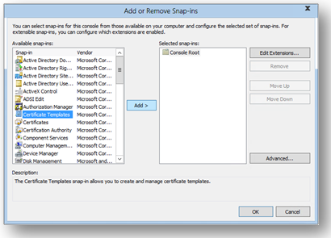
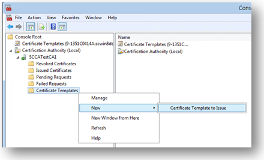
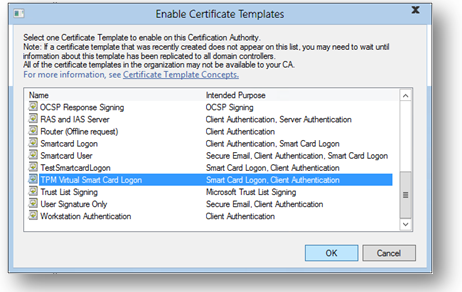
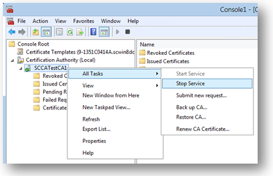
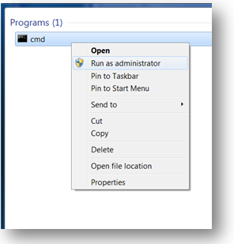

# Get Started with Virtual Smart Cards: Walkthrough Guide

Applies To: Windows 10, Windows Server 2016

This topic for the IT professional describes how to set up a basic test environment for using TPM virtual smart cards.

Virtual smart cards are a technology from Microsoft, which offer comparable security benefits in two-factor authentication to physical smart cards. They also offer more convenience for users and lower cost for organizations to deploy. By utilizing Trusted Platform Module (TPM) devices that provide the same cryptographic capabilities as physical smart cards, virtual smart cards accomplish the three key properties that are desired by smart cards: non-exportability, isolated cryptography, and anti-hammering.

This step-by-step walkthrough shows you how to set up a basic test environment for using TPM virtual smart cards. After you complete this walkthrough, you will have a functional virtual smart card installed on the Windows computer.

**Time requirements**

You should be able to complete this walkthrough in less than one hour, excluding installing software and setting up the test domain.

**Walkthrough steps**

-   [Prerequisites](#prerequisites)

-   [Step 1: Create the certificate template](#step-1-create-the-certificate-template)

-   [Step 2: Create the TPM virtual smart card](#step-2-create-the-tpm-virtual-smart-card)

-   [Step 3: Enroll for the certificate on the TPM Virtual Smart Card](#step-3-enroll-for-the-certificate-on-the-tpm-virtual-smart-card)

> **Important**&nbsp;&nbsp;This basic configuration is for test purposes only. It is not intended for use in a production environment.

## Prerequisites

You will need:

-   A computer running Windows 10 with an installed and fully functional TPM (version 1.2 or version 2.0).

-   A test domain to which the computer listed above can be joined.

-   Access to a server in that domain with a fully installed and running certification authority (CA).

## Step 1: Create the certificate template

On your domain server, you need to create a template for the certificate that you will request for the virtual smart card.

### To create the certificate template

1.  On your server, open the Microsoft Management Console (MMC). One way to do this is to type **mmc.exe** from the **Start** menu, right-click **mmc.exe**, and click **Run as administrator**.

2.  Click **File**, and then click **Add/Remove Snap-in**.

    

3.  In the available snap-ins list, click **Certificate Templates**, and then click **Add**.

    

4.  Certificate Templates is now located under **Console Root** in the MMC. Double-click it to view all the available certificate templates.

5.  Right-click the **Smartcard Logon** template, and click **Duplicate Template**.

    

6.  On the **Compatibility** tab, under **Certification Authority**, review the selection, and change it if needed.

    

7.  On the **General** tab:

    1.  Specify a name, such as **TPM Virtual Smart Card Logon**.

    2.  Set the validity period to the desired value.

8.  On the **Request Handling** tab:

    1.  Set the **Purpose** to **Signature and smartcard logon**.

    2.  Click **Prompt the user during enrollment**.

9.  On the **Cryptography** tab:

    1.  Set the minimum key size to 2048.

    2.  Click **Requests must use one of the following providers**, and then select **Microsoft Base Smart Card Crypto Provider**.

10.  On the **Security** tab, add the security group that you want to give **Enroll** access to. For example, if you want to give access to all users, select the **Authenticated users** group, and then select **Enroll** permissions for them.

11.  Click **OK** to finalize your changes and create the new template. Your new template should now appear in the list of Certificate Templates.

12.  Select **File**, then click **Add/Remove Snap-in** to add the Certification Authority snap-in to your MMC console. When asked which computer you want to manage, select the computer on which the CA is located, probably **Local Computer**.

    

13.  In the left pane of the MMC, expand **Certification Authority (Local)**, and then expand your CA within the Certification Authority list.

14.  Right-click **Certificate Templates**, click **New**, and then click **Certificate Template to Issue**.

    

15.  From the list, select the new template that you just created (**TPM Virtual Smart Card Logon**), and then click **OK**.

    > **Note**&nbsp;&nbsp;It can take some time for your template to replicate to all servers and become available in this list.

    

16.  After the template replicates, in the MMC, right-click in the Certification Authority list, click **All Tasks**, and then click **Stop Service**. Then, right-click the name of the CA again, click **All Tasks**, and then click **Start Service**.

    

## Step 2: Create the TPM virtual smart card

In this step, you will create the virtual smart card on the client computer by using the command-line tool, [Tpmvscmgr.exe](virtual-smart-card-tpmvscmgr.md).

### To create the TPM virtual smart card

1.  On a domain-joined computer, open a Command Prompt window with Administrative credentials.

    

2.  At the command prompt, type the following, and then press ENTER:

    `tpmvscmgr.exe create /name TestVSC /pin default /adminkey random /generate`

    This will create a virtual smart card with the name **TestVSC**, omit the unlock key, and generate the file system on the card. The PIN will be set to the default, 12345678. To be prompted for a PIN, instead of **/pin default** you can type **/pin prompt**.

    For more information about the Tpmvscmgr command-line tool, see [Use Virtual Smart Cards](virtual-smart-card-use-virtual-smart-cards.md) and [Tpmvscmgr](virtual-smart-card-tpmvscmgr.md).

4.  Wait several seconds for the process to finish. Upon completion, Tpmvscmgr.exe will provide you with the device instance ID for the TPM Virtual Smart Card. Store this ID for later reference because you will need it to manage or remove the virtual smart card.

## Step 3: Enroll for the certificate on the TPM Virtual Smart Card

The virtual smart card must be provisioned with a sign-in certificate for it to be fully functional.

### To enroll the certificate

1.  Open the Certificates console by typing **certmgr.msc** on the **Start** menu.

2.  Right-click **Personal**, click **All Tasks**, and then click **Request New Certificate**.

    

3.  Follow the prompts and when offered a list of templates, select the **TPM Virtual Smart Card Logon** check box (or whatever you named the template in Step 1).

    

4.  If prompted for a device, select the Microsoft virtual smart card that corresponds to the one you created in the previous section. It displays as **Identity Device (Microsoft Profile)**.

5.  Enter the PIN that was established when you created the TPM virtual smart card, and then click **OK**.

6.  Wait for the enrollment to finish, and then click **Finish**.

The virtual smart card can now be used as an alternative credential to sign in to your domain. To verify that your virtual smart card configuration and certificate enrollment were successful, sign out of your current session, and then sign in. When you sign in, you will see the icon for the new TPM virtual smart card on the Secure Desktop (sign in) screen or you will be automatically directed to the TPM smart card sign-in dialog box. Click the icon, enter your PIN (if necessary), and then click **OK**. You should be signed in to your domain account.

## See also

-   [Understanding and Evaluating Virtual Smart Cards](virtual-smart-card-understanding-and-evaluating.md)

-   [Use Virtual Smart Cards](virtual-smart-card-use-virtual-smart-cards.md)

-   [Deploy Virtual Smart Cards](virtual-smart-card-deploy-virtual-smart-cards.md)
