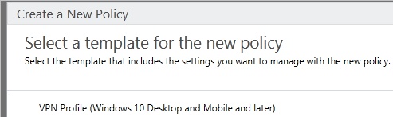

# Windows 10 VPN technical guide

**Applies to**

- Windows 10
- Windows 10 Mobile

This guide will walk you through the decisions you will make for Windows 10 clients in your enterprise VPN solution and how to configure your deployment. This guide references the [VPNv2 Configuration Service Provider (CSP)](https://msdn.microsoft.com/library/windows/hardware/dn914776.aspx) and provides mobile device management (MDM) configuration instructions using Microsoft Intune and the VPN Profile template for Windows 10.

>[!NOTE]
>This guide does not explain server deployment.  

## In this guide

| Topic | Description  |
| --- | --- |
| [VPN connection types](vpn-connection-type.md) | Select a VPN client and tunneling protocol |
| [VPN routing decisions](vpn-routing.md)  | Choose between split tunnel and force tunnel configuration |
| [VPN authentication options](vpn-authentication.md)  | Select a method for Extensible Authentication Protocol (EAP) authentication. |
| [VPN and conditional access](vpn-conditional-access.md)  | Use Azure Active Directory policy evaluation to set access policies for VPN connections. |
| [VPN name resolution](vpn-name-resolution.md)  | Decide how name resolution should work |
| [VPN auto-triggered profile options](vpn-auto-trigger-profile.md)  | Set a VPN profile to connect automatically by app or by name, to be "always on", and to not trigger VPN on trusted networks |
| [VPN security features](vpn-security-features.md)  | Set a LockDown VPN profile, configure traffic filtering, and connect VPN profile to Windows Information Protection (WIP) |
| [VPN profile options](vpn-profile-options.md)  | Combine settings into single VPN profile using XML |

## Learn more

- [VPN connections in Microsoft Intune](https://docs.microsoft.com/intune/deploy-use/vpn-connections-in-microsoft-intune)

