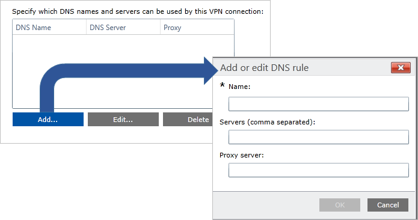

# VPN name resolution

**Applies to**
-   Windows 10
-   Windows 10 Mobile

When the VPN client connects to the VPN server, the VPN client receives the client IP address. The client may also receive the IP address of the Domain Name System (DNS) server and the IP address of the Windows Internet Name Service (WINS) server.

The name resolution setting in the VPN profile configures how name resolution should work on the system when VPN is connected. The networking stack first looks at the Name Resolution Policy table (NRPT) for any matches and tries a resolution in the case of a match. If no match is found, the DNS suffix on the most preferred interface based on the interface metric is appended to the name (in the case of a short name) and a DNS query is sent out on the preferred interface. If the query times out, the DNS suffix search list is used in order and DNS queries are sent on all interfaces. 

## Name Resolution Policy table (NRPT)
 
The NRPT is a table of namespaces that determines the DNS client’s behavior when issuing name resolution queries and processing responses. It is the first place that the stack will look after the DNSCache.

There are 3 types of name matches that can  set up for NRPT:

- Fully qualified domain name (FQDN) that can be used for direct matching to a name

- Suffix match results in either a comparison of suffixes (for FQDN resolution) or the appending of the suffix (in case of a short name)

- Any resolution should attempt to first resolve with the proxy server/DNS server with this entry

NRPT is set using the **VPNv2/*ProfileName*/DomainNameInformationList** node of the [VPNv2 CSP](https://msdn.microsoft.com/library/windows/hardware/dn914776.aspx). This node also configures Web proxy server or domain name servers. 

[Learn more about NRPT](https://technet.microsoft.com/library/ee649207%28v=ws.10%29.aspx)

 
## DNS suffix

This setting is used to configure the primary DNS suffix for the VPN interface and the suffix search list after the VPN connection is established.

Primary DNS suffix is set using the **VPNv2/*ProfileName*/DnsSuffix** node.

[Learn more about primaryDNS suffix](https://technet.microsoft.com/library/cc959611.aspx)

## Persistent

You can also configure *persistent* name resolution rules. Name resolution for specified items will only  performed over VPN.

Persistent name resolution is set using the **VPNv2/*ProfileName*/DomainNameInformationList//*dniRowId*/Persistent** node.

## Configure name resolution

See [VPN profile options](vpn-profile-options.md) and [VPNv2 CSP](https://msdn.microsoft.com/library/windows/hardware/dn914776.aspx) for XML configuration. 

The following image shows name resolution options in a VPN Profile configuration policy using Microsoft Intune.

The fields in **Add or edit DNS rule** in the Intune profile correspond to the XML settings shown in the following table.

| Field | XML |
| --- | --- |
| **Name** | **VPNv2/*ProfileName*/DomainNameInformationList/*dniRowId*/DomainName**  |
| **Servers (comma separated)** | **VPNv2/*ProfileName*/DomainNameInformationList/*dniRowId*/DnsServers**  |
| **Proxy server** |  **VPNv2/*ProfileName*/DomainNameInformationList/*dniRowId*/WebServers**  |

## Related topics

- [VPN technical guide](vpn-guide.md)
- [VPN connection types](vpn-connection-type.md)
- [VPN routing decisions](vpn-routing.md)
- [VPN authentication options](vpn-authentication.md)
- [VPN and conditional access](vpn-conditional-access.md)
- [VPN auto-triggered profile options](vpn-auto-trigger-profile.md)
- [VPN security features](vpn-security-features.md)
- [VPN profile options](vpn-profile-options.md)
