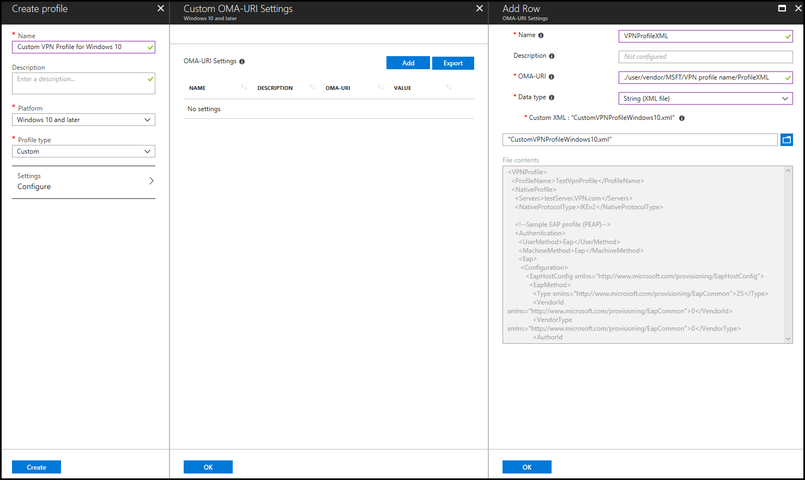

# VPN profile options

**Applies to**
-   Windows 10
-   Windows 10 Mobile

Most of the VPN settings in Windows 10 can be configured in VPN profiles using Microsoft Intune or System Center Configuration Manager. All VPN settings in Windows 10 can be configued using the **ProfileXML** node in the [VPNv2 configuration service provider (CSP)](https://msdn.microsoft.com/library/windows/hardware/dn914776.aspx). 

>[!NOTE]
>If you're not familiar with CSPs, read [Introduction to configuration service providers (CSPs)](https://technet.microsoft.com/itpro/windows/manage/how-it-pros-can-use-configuration-service-providers) first.

The following table lists the VPN settings and whether the setting can be configured in Intune and Configuration Manager, or can only be configured using **ProfileXML**.

| Profile setting | Can be configured in Intune and Configuration Manager | 
| --- | --- | 
| Connection type | yes | 
| Routing: split-tunnel routes | yes, except exclusion routes |
| Routing: forced-tunnel | yes |
| Authentication (EAP) | yes, if connection type is built-in |
| Conditional access | yes |
| Proxy settings | yes, by PAC/WPAD file or server and port |
| Name resolution: NRPT | yes |
| Name resolution: DNS suffix | no |
| Name resolution: persistent | no |
| Auto-trigger: app trigger | yes |
| Auto-trigger: name trigger | yes |
| Auto-trigger: Always On | yes |
| Auto-trigger: trusted network detection | no |
| LockDown | no |
| Windows Information Protection (WIP) | yes |
| Traffic filters | yes |

The ProfileXML node was added to the VPNv2 CSP to allow users to deploy VPN profile as a single blob. This is particularly useful for deploying profiles with features that are not yet supported by MDMs. You can get additional examples in the [ProfileXML XSD](https://msdn.microsoft.com/library/windows/hardware/mt755930.aspx) topic.


## Sample Native VPN profile

The following is a sample Native VPN profile. This blob would fall under the ProfileXML node. 

```
<VPNProfile>  
  <ProfileName>TestVpnProfile</ProfileName>  
  <NativeProfile>  
    <Servers>testServer.VPN.com</Servers>  
    <NativeProtocolType>IKEv2</NativeProtocolType> 
    
    <!--Sample EAP profile (PEAP)--> 
    <Authentication>  
      <UserMethod>Eap</UserMethod>  
      <MachineMethod>Eap</MachineMethod>  
      <Eap>  
       <Configuration>
          <EapHostConfig xmlns="http://www.microsoft.com/provisioning/EapHostConfig">
            <EapMethod>
              <Type xmlns="http://www.microsoft.com/provisioning/EapCommon">25</Type>
              <VendorId xmlns="http://www.microsoft.com/provisioning/EapCommon">0</VendorId>
              <VendorType xmlns="http://www.microsoft.com/provisioning/EapCommon">0</VendorType>
              <AuthorId xmlns="http://www.microsoft.com/provisioning/EapCommon">0</AuthorId>
            </EapMethod>
            <Config xmlns="http://www.microsoft.com/provisioning/EapHostConfig">
              <Eap xmlns="http://www.microsoft.com/provisioning/BaseEapConnectionPropertiesV1">
                <Type>25</Type>
                <EapType xmlns="http://www.microsoft.com/provisioning/MsPeapConnectionPropertiesV1">
                  <ServerValidation>
                    <DisableUserPromptForServerValidation>true</DisableUserPromptForServerValidation>
                    <ServerNames></ServerNames>
                    <TrustedRootCA>d2 d3 8e ba 60 ca a1 c1 20 55 a2 e1 c8 3b 15 ad 45 01 10 c2 </TrustedRootCA>
                    <TrustedRootCA>d1 76 97 cc 20 6e d2 6e 1a 51 f5 bb 96 e9 35 6d 6d 61 0b 74 </TrustedRootCA>
                  </ServerValidation>
                  <FastReconnect>true</FastReconnect>
                  <InnerEapOptional>false</InnerEapOptional>
                  <Eap xmlns="http://www.microsoft.com/provisioning/BaseEapConnectionPropertiesV1">
                    <Type>13</Type>
                    <EapType xmlns="http://www.microsoft.com/provisioning/EapTlsConnectionPropertiesV1">
                      <CredentialsSource>
                        <CertificateStore>
                          <SimpleCertSelection>true</SimpleCertSelection>
                        </CertificateStore>
                      </CredentialsSource>
                      <ServerValidation>
                        <DisableUserPromptForServerValidation>true</DisableUserPromptForServerValidation>
                        <ServerNames></ServerNames>
                        <TrustedRootCA>d2 d3 8e ba 60 ca a1 c1 20 55 a2 e1 c8 3b 15 ad 45 01 10 c2 </TrustedRootCA>
                        <TrustedRootCA>d1 76 97 cc 20 6e d2 6e 1a 51 f5 bb 96 e9 35 6d 6d 61 0b 74 </TrustedRootCA>
                      </ServerValidation>
                      <DifferentUsername>false</DifferentUsername>
                      <PerformServerValidation xmlns="http://www.microsoft.com/provisioning/EapTlsConnectionPropertiesV2">true</PerformServerValidation>
                      <AcceptServerName xmlns="http://www.microsoft.com/provisioning/EapTlsConnectionPropertiesV2">false</AcceptServerName>
                      <TLSExtensions xmlns="http://www.microsoft.com/provisioning/EapTlsConnectionPropertiesV2">
                        <FilteringInfo xmlns="http://www.microsoft.com/provisioning/EapTlsConnectionPropertiesV3">
                          <EKUMapping>
                            <EKUMap>
                              <EKUName>AAD Conditional Access</EKUName>
                              <EKUOID>1.3.6.1.4.1.311.87</EKUOID>
                            </EKUMap>
                          </EKUMapping>
                          <ClientAuthEKUList Enabled="true">
                            <EKUMapInList>
                              <EKUName>AAD Conditional Access</EKUName>
                            </EKUMapInList>
                          </ClientAuthEKUList>
                        </FilteringInfo>
                      </TLSExtensions>
                    </EapType>
                  </Eap>
                  <EnableQuarantineChecks>false</EnableQuarantineChecks>
                  <RequireCryptoBinding>true</RequireCryptoBinding>
                  <PeapExtensions>
                    <PerformServerValidation xmlns="http://www.microsoft.com/provisioning/MsPeapConnectionPropertiesV2">true</PerformServerValidation>
                    <AcceptServerName xmlns="http://www.microsoft.com/provisioning/MsPeapConnectionPropertiesV2">false</AcceptServerName>
                  </PeapExtensions>
                </EapType>
              </Eap>
            </Config>
          </EapHostConfig>
        </Configuration>
      </Eap>  
    </Authentication>  
    
    <!--Sample routing policy: in this case, this is a split tunnel configuration with two routes configured-->
    <RoutingPolicyType>SplitTunnel</RoutingPolicyType>  
    <DisableClassBasedDefaultRoute>true</DisableClassBasedDefaultRoute>  
  </NativeProfile>  
    <Route>  
    <Address>192.168.0.0</Address>  
    <PrefixSize>24</PrefixSize>  
  </Route>  
  <Route>  
    <Address>10.10.0.0</Address>  
    <PrefixSize>16</PrefixSize>  
  </Route>  
  
  <!--VPN will be triggered for the two apps specified here-->
  <AppTrigger>  
    <App>  
      <Id>Microsoft.MicrosoftEdge_8wekyb3d8bbwe</Id>  
    </App>  
  </AppTrigger>  
  <AppTrigger>  
    <App>  
      <Id>C:\windows\system32\ping.exe</Id>  
    </App>  
  </AppTrigger>  
  
  <!--Example of per-app VPN. This configures traffic filtering rules for two apps. Internet Explorer is configured for force tunnel, meaning that all traffic allowed through this app must go over VPN. Microsoft Edge is configured as split tunnel, so whether data goes over VPN or the physical interface is dictated by the routing configuration.-->
  <TrafficFilter>  
    <App>  
      <Id>%ProgramFiles%\Internet Explorer\iexplore.exe</Id>  
    </App>  
    <Protocol>6</Protocol>  
    <LocalPortRanges>10,20-50,100-200</LocalPortRanges>  
    <RemotePortRanges>20-50,100-200,300</RemotePortRanges>  
    <RemoteAddressRanges>30.30.0.0/16,10.10.10.10-20.20.20.20</RemoteAddressRanges>  
    <RoutingPolicyType>ForceTunnel</RoutingPolicyType>  
  </TrafficFilter>  
  <TrafficFilter>  
    <App>  
      <Id>Microsoft.MicrosoftEdge_8wekyb3d8bbwe</Id>  
    </App>  
    <LocalAddressRanges>3.3.3.3/32,1.1.1.1-2.2.2.2</LocalAddressRanges>  
  </TrafficFilter>  
  
  <!--Name resolution configuration. The AutoTrigger node configures name-based triggering. In this profile, the domain "hrsite.corporate.contoso.com" triggers VPN.-->
  <DomainNameInformation>  
    <DomainName>hrsite.corporate.contoso.com</DomainName>  
    <DnsServers>1.2.3.4,5.6.7.8</DnsServers>  
    <WebProxyServers>5.5.5.5</WebProxyServers>  
    <AutoTrigger>true</AutoTrigger>  
  </DomainNameInformation>  
  <DomainNameInformation>  
    <DomainName>.corp.contoso.com</DomainName>  
    <DnsServers>10.10.10.10,20.20.20.20</DnsServers>  
    <WebProxyServers>100.100.100.100</WebProxyServers>  
  </DomainNameInformation>  
  
  <!--EDPMode is turned on for the enterprise ID "corp.contoso.com". When a user accesses an app with that ID, VPN will be triggered.-->
  <EdpModeId>corp.contoso.com</EdpModeId>  
  <RememberCredentials>true</RememberCredentials>  
  
  <!--Always On is turned off, and triggering VPN for the apps and domain name specified earlier in the profile will not occur if the user is connected to the trusted network "contoso.com".-->
  <AlwaysOn>false</AlwaysOn>  
  <DnsSuffix>corp.contoso.com</DnsSuffix>  
  <TrustedNetworkDetection>contoso.com</TrustedNetworkDetection>  
  <Proxy>  
    <Manual>  
      <Server>HelloServer</Server>  
    </Manual>  
    <AutoConfigUrl>Helloworld.Com</AutoConfigUrl>  
  </Proxy>  
  
  <!--Device compliance is enabled and an alternate certificate is specified for domain resource authentication.-->
  <DeviceCompliance>  
        <Enabled>true</Enabled>  
        <Sso>  
            <Enabled>true</Enabled>  
            <Eku>This is my Eku</Eku>  
            <IssuerHash>This is my issuer hash</IssuerHash>  
        </Sso>  
    </DeviceCompliance>  
</VPNProfile> 
```

## Sample plug-in VPN profile

The following is a sample plug-in VPN profile. This blob would fall under the ProfileXML node. 

```
<VPNProfile>
	<ProfileName>TestVpnProfile</ProfileName>
	<PluginProfile>
		<ServerUrlList>testserver1.contoso.com;testserver2.contoso..com</ServerUrlList>
		<PluginPackageFamilyName>JuniperNetworks.JunosPulseVpn_cw5n1h2txyewy</PluginPackageFamilyName>
		<CustomConfiguration>&lt;pulse-schema&gt;&lt;isSingleSignOnCredential&gt;true&lt;/isSingleSignOnCredential&gt;&lt;/pulse-schema&gt;</CustomConfiguration>
	</PluginProfile>
	<Route>
		<Address>192.168.0.0</Address>
		<PrefixSize>24</PrefixSize>
	</Route>
	<Route>
		<Address>10.10.0.0</Address>
		<PrefixSize>16</PrefixSize>
	</Route>
	<AppTrigger>
		<App>
			<Id>Microsoft.MicrosoftEdge_8wekyb3d8bbwe</Id>
		</App>
	</AppTrigger>
	<AppTrigger>
		<App>
			<Id>%ProgramFiles%\Internet Explorer\iexplore.exe</Id>
		</App>
	</AppTrigger>
	<TrafficFilter>
		<App>
			<Id>%ProgramFiles%\Internet Explorer\iexplore.exe</Id>
		</App>
		<Protocol>6</Protocol>
		<LocalPortRanges>10,20-50,100-200</LocalPortRanges>
		<RemotePortRanges>20-50,100-200,300</RemotePortRanges>
		<RemoteAddressRanges>30.30.0.0/16,10.10.10.10-20.20.20.20</RemoteAddressRanges>
		<!--<RoutingPolicyType>ForceTunnel</RoutingPolicyType>-->
	</TrafficFilter>
	<TrafficFilter>
		<App>
			<Id>Microsoft.MicrosoftEdge_8wekyb3d8bbwe</Id>
		</App>
		<LocalAddressRanges>3.3.3.3/32,1.1.1.1-2.2.2.2</LocalAddressRanges>
	</TrafficFilter>
	<TrafficFilter>
		<App>
			<Id>Microsoft.MicrosoftEdge_8wekyb3d8bbwe</Id>
		</App>
		<Claims>O:SYG:SYD:(A;;CC;;;AU)</Claims>
		<!--<RoutingPolicyType>SplitTunnel</RoutingPolicyType>-->
	</TrafficFilter>
	<DomainNameInformation>
		<DomainName>corp.contoso.com</DomainName>
		<DnsServers>1.2.3.4,5.6.7.8</DnsServers>
		<WebProxyServers>5.5.5.5</WebProxyServers>
		<AutoTrigger>false</AutoTrigger>
	</DomainNameInformation>
	<DomainNameInformation>
		<DomainName>corp.contoso.com</DomainName>
		<DnsServers>10.10.10.10,20.20.20.20</DnsServers>
		<WebProxyServers>100.100.100.100</WebProxyServers>
	</DomainNameInformation>
	<!--<EdpModeId>corp.contoso.com</EdpModeId>-->
	<RememberCredentials>true</RememberCredentials>
	<AlwaysOn>false</AlwaysOn>
	<DnsSuffix>corp.contoso.com</DnsSuffix>
	<TrustedNetworkDetection>contoso.com,test.corp.contoso.com</TrustedNetworkDetection>
	<Proxy>
		<Manual>
			<Server>HelloServer</Server>
		</Manual>
		<AutoConfigUrl>Helloworld.Com</AutoConfigUrl>
	</Proxy>
</VPNProfile>  

```

## Apply ProfileXML using Intune

After you configure the settings that you want using ProfileXML, you can apply it using Intune and a **Custom Configuration (Windows 10 Desktop and Mobile and later)** policy.

1. Sign into the [Azure portal](https://portal.azure.com).
2. Go to **Intune** > **Device Configuration** > **Properties**.
3. Click **Create Profile**.
4. Enter a name and (optionally) a description.
5. Choose **Windows 10 and later** as the platform.
6. Choose **Custom** as the profile type and click **Add**.
8. Enter a name and (optionally) a description.
9. Enter the OMA-URI **./user/vendor/MSFT/VPNv2/_VPN profile name_/ProfileXML**.
10. Set Data type to **String (XML file)**.
11. Upload the profile XML file.
12. Click **OK**.
    
13. Click **OK**, then **Create**.
14. Assign the profile.


## Learn more

- [Learn how to configure VPN connections in Microsoft Intune](https://docs.microsoft.com/intune/deploy-use/vpn-connections-in-microsoft-intune)
- [VPNv2 configuration service provider (CSP) reference](https://go.microsoft.com/fwlink/p/?LinkId=617588)
- [How to Create VPN Profiles in Configuration Manager](https://go.microsoft.com/fwlink/p/?LinkId=618028)

## Related topics

- [VPN technical guide](vpn-guide.md)
- [VPN connection types](vpn-connection-type.md)
- [VPN routing decisions](vpn-routing.md)
- [VPN authentication options](vpn-authentication.md)
- [VPN and conditional access](vpn-conditional-access.md)
- [VPN name resolution](vpn-name-resolution.md)
- [VPN auto-triggered profile options](vpn-auto-trigger-profile.md)
- [VPN security features](vpn-security-features.md)
