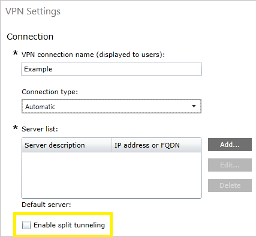
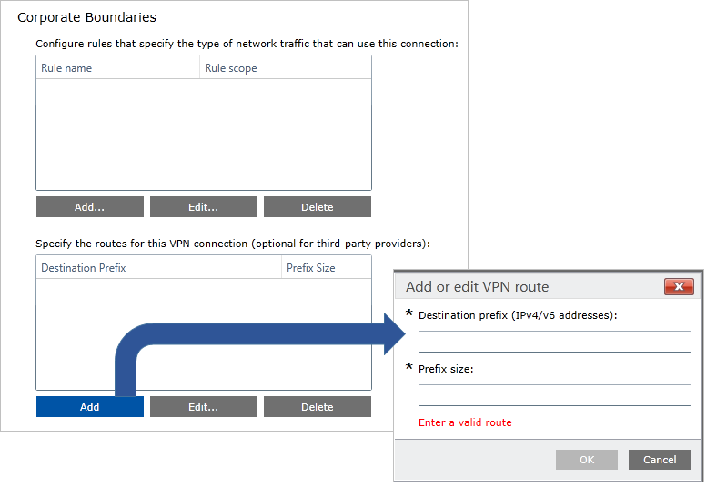

# VPN routing decisions

**Applies to**
-   Windows 10
-   Windows 10 Mobile

Network routes are required for the stack to understand which interface to use for outbound traffic. One of the most important decision points for VPN configuration is whether you want to send all the data through VPN (*force tunnel*) or only some data through the VPN (*split tunnel*). This decision impacts the configuration and the capacity planning, as well as security expectations from the connection. 

## Split tunnel configuration

In a split tunnel configuration, routes can be specified to go over VPN and all other traffic will go over the physical interface. 

Routes can be configured using the VPNv2/*ProfileName*/RouteList setting in the [VPNv2 Configuration Service Provider (CSP)](https://msdn.microsoft.com/library/windows/hardware/dn914776.aspx).
 
For each route item in the list, the following can be specified: 

- **Address**: VPNv2/*ProfileName*/RouteList/*routeRowId*/Address
- **Prefix size**: VPNv2/*ProfileName*/RouteList/*routeRowId*/Prefix
- **Exclusion route**: VPNv2/*ProfileName*/RouteList/*routeRowId*/ExclusionRoute
   
   Windows VPN platform now supports the ability to specify exclusion routes that specifically should not go over the physical interface. 

Routes can also be added at connect time through the server for UWP VPN apps.  

## Force tunnel configuration

In a force tunnel configuration, all traffic will go over VPN. This is the default configuration and takes effect if no routes are specified. 

The only implication of this setting is the manipulation of routing entries. In the case of a force tunnel, VPN V4 and V6 default routes (for example. 0.0.0.0/0) are added to the routing table with a lower metric than ones for other interfaces. This sends traffic through the VPN as long as there isn’t a specific route on the physical interface itself. 

For built-in VPN, this decision is controlled using the MDM setting **VPNv2/ProfileName/NativeProfile/RoutingPolicyType**.

For a UWP VPN plug-in, this property is directly controlled by the app. If the VPN plug-in indicates the default route for IPv4 and IPv6 as the only two Inclusion routes, the VPN platform marks the connection as Force Tunneled. 

## Configure routing

See [VPN profile options](vpn-profile-options.md) and [VPNv2 CSP](https://msdn.microsoft.com/library/windows/hardware/dn914776.aspx) for XML configuration. 

When you configure a VPN profile in Microsoft Intune, you select a checkbox to enable split tunnel configuration.

Next, in **Corporate Boundaries**, you add the routes that should use the VPN connection.   
  

## Related topics

- [VPN technical guide](vpn-guide.md)
- [VPN connection types](vpn-connection-type.md)
- [VPN authentication options](vpn-authentication.md)
- [VPN and conditional access](vpn-conditional-access.md)
- [VPN name resolution](vpn-name-resolution.md)
- [VPN auto-triggered profile options](vpn-auto-trigger-profile.md)
- [VPN security features](vpn-security-features.md)
- [VPN profile options](vpn-profile-options.md)
