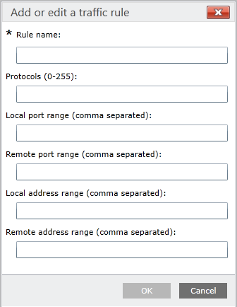

# VPN security features

**Applies to**
-   Windows 10
-   Windows 10 Mobile

## LockDown VPN

A VPN profile configured with LockDown secures the device to only allow network traffic over the VPN interface. It has the following features:

- The system attempts to keep the VPN connected at all times.
- The user cannot disconnect the VPN connection.
- The user cannot delete or modify the VPN profile.
- The VPN LockDown profile uses forced tunnel connection.
- If the VPN connection is not available, outbound network traffic is blocked.
- Only one VPN LockDown profile is allowed on a device. 

>[!NOTE]
>For built-in VPN, Lockdown VPN is only available for the Internet Key Exchange version 2 (IKEv2) connection type.

Deploy this feature with caution as the resultant connection will not be able to send or receive any network traffic without the VPN being connected. 

## Windows Information Protection (WIP) integration with VPN

Windows Information Protection provides capabilities allowing the separation and protection of enterprise data against disclosure across both company and personally owned devices without requiring additional changes to the environments or the apps themselves. Additionally, when used with Rights Management Services (RMS), WIP can help to protect enterprise data locally.

The **EdpModeId** node in the [VPNv2 Configuration Service Provider (CSP)](https://msdn.microsoft.com/library/windows/hardware/dn914776.aspx) allows a Windows 10 VPN client to integrate with WIP, extending its functionality to remote devices. Use case scenarios for WIP include:

- Core functionality: File encryption and file access blocking
- UX policy enforcement: Restricting copy/paste, drag/drop, and sharing operations
- WIP network policy enforcement: Protecting intranet resources over the corporate network and VPN
- Network policy enforcement: Protecting SMB and Internet cloud resources over the corporate network and VPN

The value of the **EdpModeId** is an Enterprise ID. The networking stack will look for this ID in the app token to determine whether VPN should be triggered for that particular app. 

Additionally, when connecting with WIP, the admin does not have to specify AppTriggerList and TrafficFilterList rules separately in this profile (unless more advanced configuration is needed) because the WIP policies and App lists automatically take effect.

[Learn more about Windows Information Protection](/windows/threat-protection/windows-information-protection/protect-enterprise-data-using-wip)

## Traffic filters

Traffic Filters give enterprises the ability to decide what traffic is allowed into the corporate network based on policy. Network admins to effectively add interface specific firewall rules on the VPN Interface.There are two types of Traffic Filter rules:

- App-based rules. With app-based rules, a list of applications can be marked such that only traffic originating from these apps is allowed to go over the VPN interface.
- Traffic-based rules. Traffic-based rules are 5-tuple policies (ports, addresses, protocol) that can be specified such that only traffic matching these rules is allowed to go over the VPN interface.

There can be many sets of rules which are linked by OR. Within each set, there can be app-based rules and traffic-based rules; all the properties within the set will be linked by AND. In addition, these rules can be applied at a per-app level or a per-device level. 

For example, an admin could define rules that specify: 

- The Contoso HR App must be allowed to go through the VPN and only access port 4545. 
- The Contoso finance apps is allowed to go over the VPN and only access the Remote IP ranges of 10.10.0.40 - 10.10.0.201 on port 5889.
- All other apps on the device should be able to access only ports 80 or 443.  

## Configure traffic filters

See [VPN profile options](vpn-profile-options.md) and [VPNv2 CSP](https://msdn.microsoft.com/library/windows/hardware/dn914776.aspx) for XML configuration. 

The following image shows the interface to configure traffic rules in a VPN Profile configuration policy using Microsoft Intune.

## Related topics

- [VPN technical guide](vpn-guide.md)
- [VPN connection types](vpn-connection-type.md)
- [VPN routing decisions](vpn-routing.md)
- [VPN authentication options](vpn-authentication.md)
- [VPN and conditional access](vpn-conditional-access.md)
- [VPN name resolution](vpn-name-resolution.md)
- [VPN auto-triggered profile options](vpn-auto-trigger-profile.md)
- [VPN profile options](vpn-profile-options.md)
