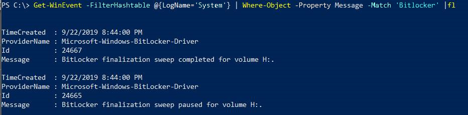
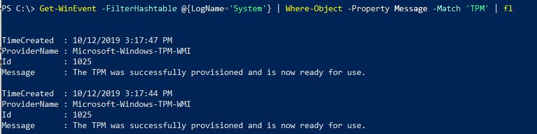

# Guidelines for troubleshooting BitLocker

This article addresses common issues in BitLocker and provides guidelines to troubleshoot these issues. This article also provides information such as what data to collect and what settings to check. This information makes your troubleshooting process much easier.

## Review the event logs

Open Event Viewer and review the following logs under Applications and Services logs\\Microsoft\\Windows:

- **BitLocker-API**. Review the management log, the operational log, and any other logs that are generated in this folder. The default logs have the following unique names:
   - Microsoft-Windows-BitLocker-API/BitLocker Operational
   - Microsoft-Windows-BitLocker-API/BitLocker Management

- **BitLocker-DrivePreparationTool**. Review the admin log,  the operational log, and any other logs that are generated in this folder. The default logs have the following unique names:
   - Microsoft-Windows-BitLocker-DrivePreparationTool/Operational
   - Microsoft-Windows-BitLocker-DrivePreparationTool/Admin

Additionally, review the Windows logs\\System log for events that were produced by the TPM and TPM-WMI event sources.

To filter and display or export logs, you can use the [wevtutil.exe](/windows-server/administration/windows-commands/wevtutil) command-line tool or the [Get-WinEvent](/powershell/module/microsoft.powershell.diagnostics/get-winevent?view=powershell-6) cmdlet.


For example, to use wevtutil to export the contents of the operational log from the BitLocker-API folder to a text file that is named BitLockerAPIOpsLog.txt, open a Command Prompt window, and run the following command:

```cmd
wevtutil qe "Microsoft-Windows-BitLocker/BitLocker Operational" /f:text > BitLockerAPIOpsLog.txt
```

To use the **Get-WinEvent** cmdlet to export the same log to a comma-separated text file, open a Windows Powershell window and run the following command:

```ps
Get-WinEvent -logname "Microsoft-Windows-BitLocker/BitLocker Operational"  | Export-Csv -Path Bitlocker-Operational.csv
```

You can use Get-WinEvent in an elevated PowerShell window to display filtered information from the system or application log by using the following syntax:

- To display BitLocker-related information:
   ```ps
   Get-WinEvent -FilterHashtable @{LogName='System'} | Where-Object -Property Message -Match 'BitLocker' | fl
   ```

   The output of such a command resembles the following.

   

- To export BitLocker-related information:
   ```ps
   Get-WinEvent -FilterHashtable @{LogName='System'} | Where-Object -Property Message -Match 'BitLocker' | Export-Csv -Path System-BitLocker.csv
   ```

- To display TPM-related information:
   ```ps
   Get-WinEvent -FilterHashtable @{LogName='System'} | Where-Object -Property Message -Match 'TPM' | fl
   ```

- To export TPM-related information:
   ```ps
   Get-WinEvent -FilterHashtable @{LogName='System'} | Where-Object -Property Message -Match 'TPM' | Export-Csv -Path System-TPM.csv
   ```

   The output of such a command resembles the following.

   

> [!NOTE]
> If you intend to contact Microsoft Support, we recommend that you export the logs listed in this section.

## Gather status information from the BitLocker technologies

Open an elevated Windows PowerShell window, and run each of the following commands.

|Command |Notes |
| --- | --- |
|[**get-tpm \> C:\\TPM.txt**](/powershell/module/trustedplatformmodule/get-tpm?view=win10-ps) |Exports information about the local computer's Trusted Platform Module (TPM). This cmdlet shows different values depending on whether the TPM chip is version 1.2 or 2.0. This cmdlet is not supported in Windows 7. |
|[**manage-bde –status \>&nbsp;C:\\BDEStatus.txt**](/windows-server/administration/windows-commands/manage-bde-status) |Exports information about the general encryption status of all drives on the computer. |
|[**manage-bde c: <br />-protectors -get \>&nbsp;C:\\Protectors**](/windows-server/administration/windows-commands/manage-bde-protectors) |Exports information about the protection methods that are used for the BitLocker encryption key.  |
|[**reagentc&nbsp;/info&nbsp;\>&nbsp;C:\\reagent.txt**](/windows-hardware/manufacture/desktop/reagentc-command-line-options) |Exports information about an online or offline image about the current status of the Windows Recovery Environment (WindowsRE) and any available recovery image. |
|[**get-BitLockerVolume \| fl**](/powershell/module/bitlocker/get-bitlockervolume?view=win10-ps) |Gets information about volumes that BitLocker Drive Encryption can protect. |

## Review the configuration information

1. Open an elevated Command Prompt window, and run the following commands.

   |Command |Notes |
   | --- | --- |
   |[**gpresult /h \<Filename>**](/windows-server/administration/windows-commands/gpresult) |Exports the Resultant Set of Policy information, and saves the information as an HTML file. |
   |[**msinfo /report \<Path> /computer&nbsp;\<ComputerName>**](/windows-server/administration/windows-commands/msinfo32) |Exports comprehensive information about the hardware, system components, and software environment on the local computer. The **/report** option saves the information as a .txt file. |

1. Open Registry Editor, and export the entries in the following subkeys:

   - **HKLM\\SOFTWARE\\Policies\\Microsoft\\FVE**
   - **HKLM\\SYSTEM\\CurrentControlSet\\Services\\TPM\\**

## Check the BitLocker prerequisites

Common settings that can cause issues for BitLocker include the following scenarios:

- The TPM must be unlocked. You can check the output of the **get-tpm** command for the status of the TPM.
- Windows RE must be enabled. You can check the output of the **reagentc** command for the status of WindowsRE.
- The system-reserved partition must use the correct format.
  - On Unified Extensible Firmware Interface (UEFI) computers, the system-reserved partition must be formatted as FAT32.
  - On legacy computers, the system-reserved partition must be formatted as NTFS.
- If the device that you are troubleshooting is a slate or tablet PC, use <https://gpsearch.azurewebsites.net/#8153> to verify the status of the **Enable use of BitLocker authentication requiring preboot keyboard input on slates** option.

For more information about the BitLocker prerequisites, see [BitLocker basic deployment: Using BitLocker to encrypt volumes](./bitlocker-basic-deployment.md#using-bitlocker-to-encrypt-volumes)

## Next steps

If the information that you have examined so far indicates a specific issue (for example, WindowsRE is not enabled), the issue may have a straightforward fix.

Resolving issues that do not have obvious causes depends on exactly which components are involved and what behavior you see. The information that you have gathered helps you narrow down the areas to investigate.

- If you are working on a device that is managed by Microsoft Intune, see [Enforcing BitLocker policies by using Intune: known issues](ts-bitlocker-intune-issues.md).
- If BitLocker does not start or cannot encrypt a drive and you notice errors or events that are related to the TPM, see [BitLocker cannot encrypt a drive: known TPM issues](ts-bitlocker-cannot-encrypt-tpm-issues.md).
- If BitLocker does not start or cannot encrypt a drive, see [BitLocker cannot encrypt a drive: known issues](ts-bitlocker-cannot-encrypt-issues.md).
- If BitLocker Network Unlock does not behave as expected, see [BitLocker Network Unlock: known issues](ts-bitlocker-network-unlock-issues.md).
- If BitLocker does not behave as expected when you recover an encrypted drive, or if you did not expect BitLocker to recover the drive, see [BitLocker recovery: known issues](ts-bitlocker-recovery-issues.md).
- If BitLocker or the encrypted drive does not behave as expected, and you notice errors or events that are related to the TPM, see [BitLocker and TPM: other known issues](ts-bitlocker-tpm-issues.md).
- If BitLocker or the encrypted drive does not behave as expected, see [BitLocker configuration: known issues](ts-bitlocker-config-issues.md).

We recommend that you keep the information that you have gathered handy in case you decide to contact Microsoft Support for help to resolve your issue.
