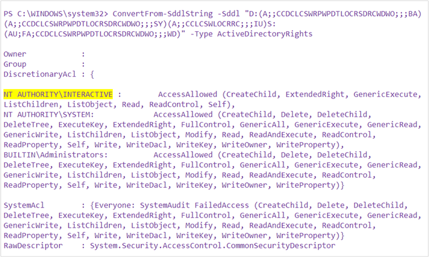
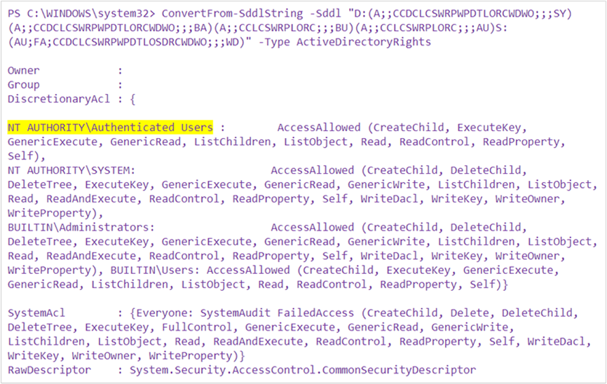

# BitLocker cannot encrypt a drive: known issues

This article describes common issues that may prevent BitLocker from encrypting a drive. This article also provides guidance to address these issues.

> [!NOTE]
> If you have determined that your BitLocker issue involves the Trusted Platform Module (TPM), see [BitLocker cannot encrypt a drive: known TPM issues](ts-bitlocker-cannot-encrypt-tpm-issues.md).

## Error 0x80310059: BitLocker Drive Encryption is already performing an operation on this drive

When you turn on BitLocker Drive Encryption on a computer that is running Windows 10 Professional, you receive a message that resembles the following:

> **ERROR:** An error occurred (code 0x80310059):BitLocker Drive Encryption is already performing an operation on this drive. Please complete all operations before continuing.NOTE: If the -on switch has failed to add key protectors or start encryption,you may need to call manage-bde -off before attempting -on again.

### Cause

This issue may be caused by settings that are controlled by Group Policy Objects (GPOs).

### Resolution

> [!IMPORTANT]
> Follow the steps in this section carefully. Serious problems might occur if you modify the registry incorrectly. Before you modify it, [back up the registry for restoration](https://support.microsoft.com/help/322756) in case problems occur.

To resolve this issue, follow these steps:

1. Start Registry Editor, and navigate to the following subkey:
   **HKEY\_LOCAL\_MACHINE\\SOFTWARE\\Policies\\Microsoft\\FVE**

1. Delete the following entries:
   - **OSPlatformValidation\_BIOS**
   - **OSPlatformValidation\_UEFI**
   - **PlatformValidation**

1. Exit Registry Editor, and turn on BitLocker Drive Encryption again.

## "Access is denied" message when you try to encrypt removable drives

You have a computer that is running Windows 10, version 1709 or version 1607. You try to encrypt a USB drive by following these steps:

1. In Windows Explorer, right-click the USB drive and select **Turn on BitLocker**.
1. On the **Choose how you want to unlock this drive** page, select **Use a password to unlock the drive**.
1. Follow the instructions on the page to enter your password.
1. On the **Are you ready to encrypt this drive?** page, select **Start encrypting**.
1. The **Starting encryption** page displays the message "Access is denied."

You receive this message on any computer that runs Windows 10 version 1709 or version 1607, when you use any USB drive.

### Cause

The security descriptor of the BitLocker Drive Encryption service (BDESvc) has an incorrect entry. Instead of NT AUTHORITY\Authenticated Users, the security descriptor uses NT AUTHORITY\INTERACTIVE.

To verify that this issue has occurred, follow these steps:

1. On an affected computer, open an elevated Command Prompt window and an elevated PowerShell window.

1. At the command prompt, enter the following command:

   ```cmd
   C:\>sc sdshow bdesvc
   ```

   The output of this command resembles the following:

   > D:(A;;CCDCLCSWRPWPDTLORCWDWO;;;SY)(A;;CCDCLCSWRPWPDTLORCWDWO;;;BA)(A;;CCLCSWRPLORC;;;BU)(A;;CCLCSWRPLORC;;;AU)S:(AU;FA;CCDCLCSWRPWPDTLOSDRCWDWO;;;WD)

1. Copy this output, and use it as part of the [**ConvertFrom-SddlString**](https://docs.microsoft.com/powershell/module/microsoft.powershell.utility/convertfrom-sddlstring?view=powershell-6) command in the PowerShell window, as follows.

   

   If you see NT AUTHORITY\INTERACTIVE (as highlighted), in the output of this command, this is the cause of the issue. Under typical conditions, the output should resemble the following:

   

> [!NOTE]
> GPOs that change the security descriptors of services have been known to cause this issue.

### Resolution

1. To repair the security descriptor of BDESvc, open an elevated PowerShell window and enter the following command:

   ```ps
   sc sdset bdesvc D:(A;;CCDCLCSWRPWPDTLORCWDWO;;;SY)(A;;CCDCLCSWRPWPDTLORCWDWO;;;BA)(A;;CCLCSWRPLORC;;;BU)(A;;CCLCSWRPLORC;;;AU)S:(AU;FA;CCDCLCSWRPWPDTLOSDRCWDWO;;;WD)
   ```

1. Restart the computer.

The issue should now be resolved.
