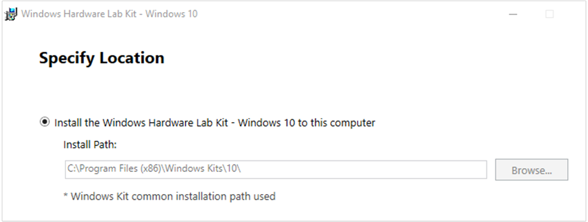
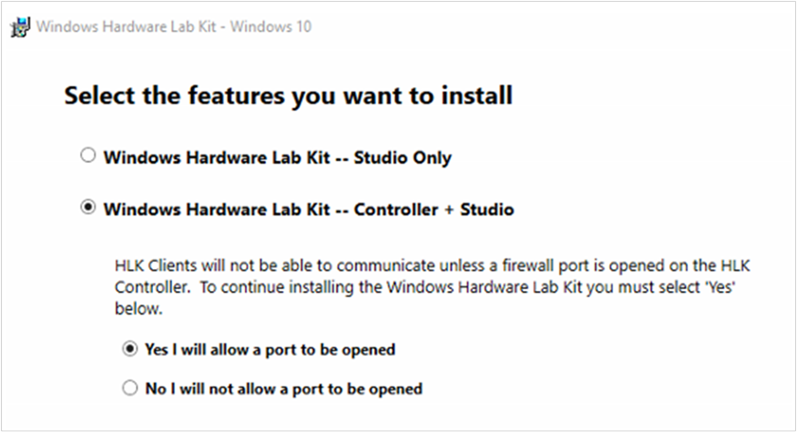
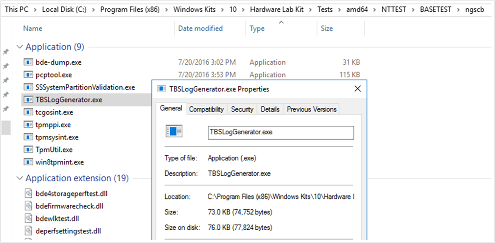
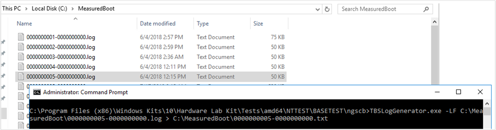
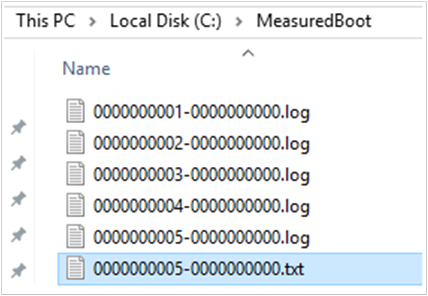
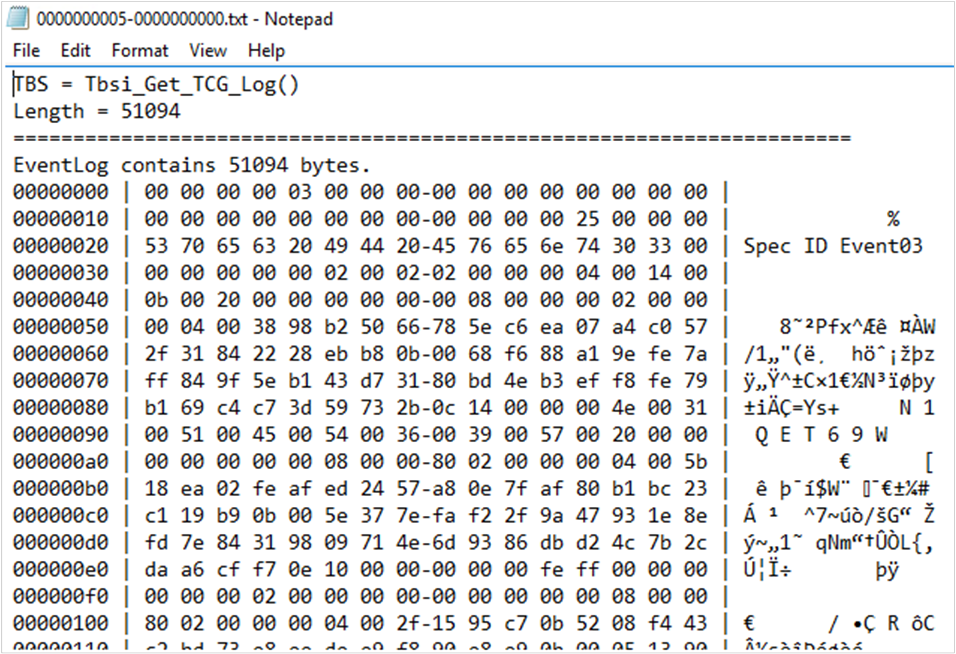
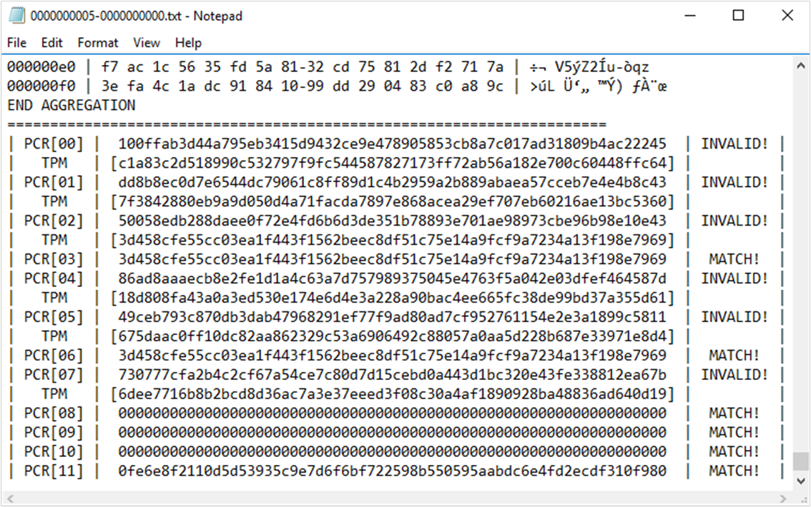
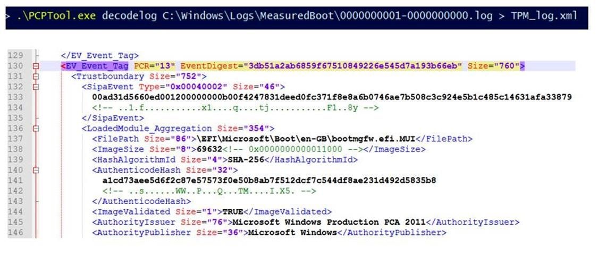

# Decode measured boot logs to track PCR changes

Platform configuration registers (PCRs) are memory locations in the trusted platform module (TPM). BitLocker and its related technologies depend on specific PCR configurations. Additionally, specific changes in PCRs can cause a device or computer to enter BitLocker recovery mode.  

By tracking changes in the PCRs, and identifying when they changed, you can gain insight into issues that occur or can learn why a device or computer entered BitLocker recovery mode. The measured boot logs record PCR changes and other information. These logs are located in the C:\\Windows\\Logs\\MeasuredBoot\\ folder.

This article describes tools that you can use to decode these logs: TBSLogGenerator and PCPTool.

For more information about MeasuredBoot and PCRs, see the following articles:

- [TPM fundamentals: MeasuredBoot with support for attestation](https://docs.microsoft.com/windows/security/information-protection/tpm/tpm-fundamentals#measured-boot-with-support-for-attestation)  
- [Understanding PCR banks on TPM 2.0 devices](https://docs.microsoft.com/windows/security/information-protection/tpm/switch-pcr-banks-on-tpm-2-0-devices)

## Use TBSLogGenerator to decode MeasureBoot logs

Use TBSLogGenerator to decode measured boot logs that you have collected from Windows 10 and earlier versions. You can install this tool on the following systems:

- A computer that is running Windows Server 2016 and that has a TPM enabled
- A gen-2 virtual machine (running on Hyper-V) that is running Windows Server 2016 (you can use the virtual TPM)

To install the tool, follow these steps:

1. Download the Windows Hardware Lab Kit from one of the following locations:

   - [Windows Hardware Lab Kit](https://docs.microsoft.com/windows-hardware/test/hlk/)
   - Direct download link for Windows Server 2016: [Windows HLK, version 1607](https://go.microsoft.com/fwlink/p/?LinkID=404112)

2. Accept the default installation path.

   

3. Under **Select the features you want to install**, select **Windows Hardware Lab Kit&mdash;Controller + Studio**.

   

4. Finish the installation.

To use TBSLogGenerator, follow these steps:

1. After the installation finishes, open an elevated Command Prompt window and navigate to the following folder:  
   **C:\\Program Files (x86)\\Windows Kits\\10\\Hardware Lab Kit\\Tests\\amd64\\NTTEST\\BASETEST\\ngscb**

   This folder contains the TBSLogGenerator.exe file.

   

1. Run the following command:
   ```cmd
   TBSLogGenerator.exe -LF <LogFolderName>\<LogFileName>.log > <DestinationFolderName>\<DecodedFileName>.txt
   ```
   where the variables represent the following values:
   - \<*LogFolderName*> = The name of the folder that contains the file to be decoded
   - \<*LogFileName*> = The name of the file to be decoded
   - \<*DestinationFolderName*> = The name of the folder for the decoded text file
   - \<*DecodedFileName*> = The name of the decoded text file

   For example, the following figure shows MeasuredBoot logs that were collected from a Windows 10 computer and put into the C:\\MeasuredBoot\\ folder. The figure also shows a Command Prompt window and the command to decode the **0000000005-0000000000.log** file:

    ```cmd
    TBSLogGenerator.exe -LF C:\MeasuredBoot\0000000005-0000000000.log > C:\MeasuredBoot\0000000005-0000000000.txt
    ```

   

   The command produces a text file that uses the specified name. In the case of the example, the file is **0000000005-0000000000.txt**. The file is located in the same folder as the original .log file.

   

The content of this text file resembles the following.



To find the PCR information, go to the end of the file.

   

## Use PCPTool to decode MeasuredBoot logs

PCPTool is part of the [TPM Platform Crypto-Provider Toolkit](https://www.microsoft.com/download/details.aspx?id=52487). The tool decodes a MeasuredBoot log file and converts it into an XML file.

To download and install PCPTool, go to the Toolkit page, select **Download**, and follow the instructions.

To decode a log, run the following command:
```cmd
PCPTool.exe decodelog <LogFolderPath>\<LogFileName>.log > <DestinationFolderName>\<DecodedFileName>.xml
```  

where the variables represent the following values:
- \<*LogFolderPath*> = The path to the folder that contains the file to be decoded
- \<*LogFileName*> = The name of the file to be decoded
- \<*DestinationFolderName*> = The name of the folder for the decoded text file
- \<*DecodedFileName*> = The name of the decoded text file

The content of the XML file resembles the following.


