# Enforcing BitLocker policies by using Intune: known issues

This article helps you troubleshoot issues that you may experience if you use Microsoft Intune policy to manage silent BitLocker encryption on devices. The Intune portal indicates whether BitLocker has failed to encrypt one or more managed devices.

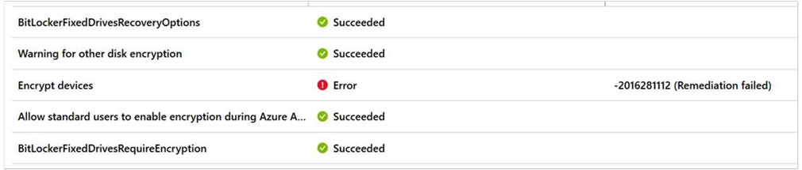

To start narrowing down the cause of the problem, review the event logs as described in [Troubleshoot BitLocker](troubleshoot-bitlocker.md). Concentrate on the Management and Operations logs in the **Applications and Services logs\\Microsoft\\Windows\\BitLocker-API** folder. The following sections provide more information about how to resolve the indicated events and error messages:

- [Event ID 853: Error: A compatible Trusted Platform Module (TPM) Security Device cannot be found on this computer](#issue-1)
- [Event ID 853: Error: BitLocker Drive Encryption detected bootable media (CD or DVD) in the computer](#issue-2)
- [Event ID 854: WinRE is not configured](#issue-3)
- [Event ID 851: Contact manufacturer for BIOS upgrade](#issue-4)
- [Error message: The UEFI variable 'SecureBoot' could not be read](#issue-6)
- [Event ID 846, 778, and 851: Error 0x80072f9a](#issue-7)
- [Error message: Conflicting Group Policy settings for recovery options on operating system drives](#issue-5)

If you do not have a clear trail of events or error messages to follow, other areas to investigate include the following:

- [Review the hardware requirements for using Intune to manage BitLocker on devices](https://docs.microsoft.com/windows-hardware/design/device-experiences/oem-bitlocker#bitlocker-automatic-device-encryption-hardware-requirements)
- [Review your BitLocker policy configuration](#policy)

For information about how to verify that Intune policies are enforcing BitLocker correctly, see [Verifying that BitLocker is operating correctly](#verifying-that-bitlocker-is-operating-correctly).

## <a id="issue-1"></a>Event ID 853: Error: A compatible Trusted Platform Module (TPM) Security Device cannot be found on this computer

Event ID 853 can carry different error messages, depending on the context. In this case, the Event ID 853 error message indicates that the device does not appear to have a TPM. The event information resembles the following:


### Cause

The device that you are trying to secure may not have a TPM chip, or the device BIOS might be configured to disable the TPM.

### Resolution

To resolve this issue, verify the following:

- The TPM is enabled in the device BIOS.  
- The TPM status in the TPM management console resembles the following:
   - Ready (TPM 2.0)
   - Initialized (TPM 1.2)

For more information, see [Troubleshoot the TPM](https://docs.microsoft.com/windows/security/information-protection/tpm/initialize-and-configure-ownership-of-the-tpm).

## <a id="issue-2"></a>Event ID 853: Error: BitLocker Drive Encryption detected bootable media (CD or DVD) in the computer

In this case, you see event ID 853, and the error message in the event indicates that bootable media is available to the device. The event information resembles the following.

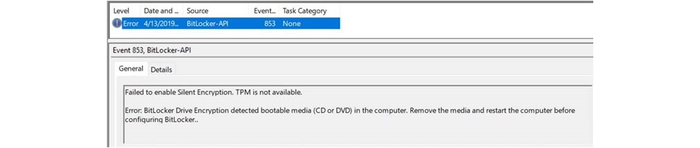

### Cause

During the provisioning process, BitLocker Drive Encryption records the configuration of the device to establish a baseline. If the device configuration changes later (for example, if you remove the media), BitLocker recovery mode automatically starts.

To avoid this situation, the provisioning process stops if it detects removable bootable media.

### Resolution

Remove the bootable media, and restart the device. After the device restarts, verify the encryption status.

## <a id="issue-3"></a>Event ID 854: WinRE is not configured

The event information resembles the following:

> Failed to enable Silent Encryption. WinRe is not configured.
>  
> Error: This PC cannot support device encryption because WinRE is not properly configured.

### Cause

Windows Recovery Environment (WinRE) is a minimal Windows operating system that is based on Windows Preinstallation Environment (Windows PE). WinRE includes several tools that an administrator can use to recover or reset Windows and diagnose Windows issues. If a device cannot start the regular Windows operating system, the device tries to start WinRE.

The provisioning process enables BitLocker Drive Encryption on the operating system drive during the Windows PE phase of provisioning. This action makes sure that the drive is protected before the full operating system is installed. The provisioning process also creates a system partition for WinRE to use if the system crashes.

If WinRE is not available on the device, provisioning stops.

### Resolution

You can resolve this issue by verifying the configuration of the disk partitions, the status of WinRE, and the Windows Boot Loader configuration. To do this, follow these steps.

#### Step 1: Verify the configuration of the disk partitions

The procedures described in this section depend on the default disk partitions that Windows configures during installation. Windows 10 automatically creates a recovery partition that contains the Winre.wim file. The partition configuration resembles the following.

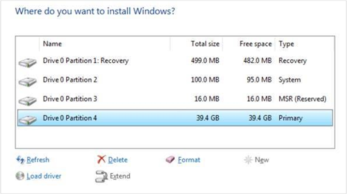

To verify the configuration of the disk partitions, open an elevated Command Prompt window, and run the following commands:

```
diskpart 
list volume
```
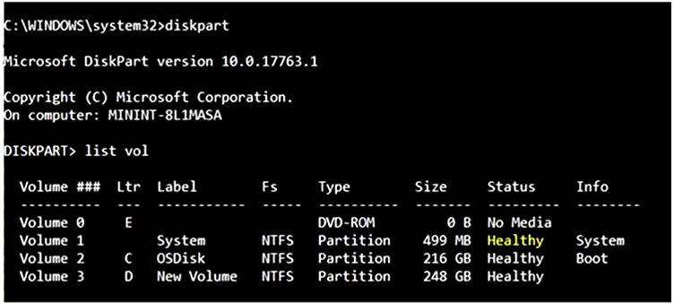

If the status of any of the volumes is not healthy or if the recovery partition is missing, you may have to reinstall Windows. Before you do this, check the configuration of the Windows image that you are using for provisioning. Make sure that the image uses the correct disk configuration. The image configuration should resemble the following (this example is from Microsoft Endpoint Configuration Manager).


#### Step 2: Verify the status of WinRE

To verify the status of WinRE on the device, open an elevated Command Prompt window and run the following command:

```cmd
reagentc /info
```
The output of this command resembles the following.

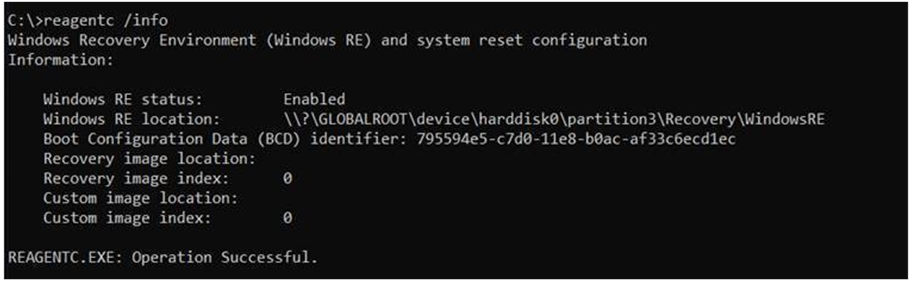

If the **Windows RE status** is not **Enabled**, run the following command to enable it:

```cmd
reagentc /enable
```

#### Step 3: Verify the Windows Boot Loader configuration

If the partition status is healthy, but the **reagentc /enable** command results in an error, verify that Windows Boot Loader contains the recovery sequence GUID. To do this, run the following command in an elevated Command Prompt window:

```cmd
bcdedit /enum all
```

The output of this command resembles the following.

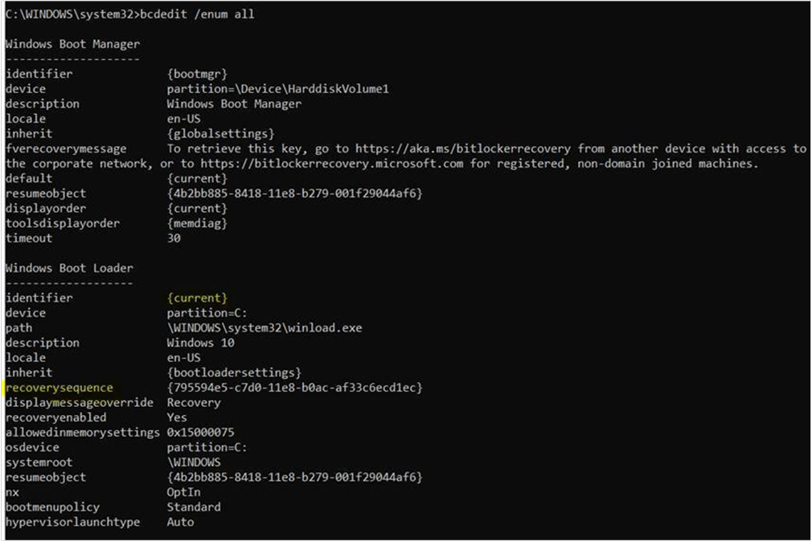

In the output, locate the **Windows Boot Loader** section that includes the line **identifier={current}**. In that section, locate the **recoverysequence** attribute. The value of this attribute should be a GUID value, not a string of zeros.

## <a id="issue-4"></a>Event ID 851: Contact the manufacturer for BIOS upgrade instructions

The event information resembles the following:

> Failed to enable Silent Encryption.
>  
> Error: BitLocker Drive Encryption cannot be enabled on the operating system drive. Contact the computer manufacturer for BIOS upgrade instructions.

### Cause

The device must have Unified Extensible Firmware Interface (UEFI) BIOS. Silent BitLocker Drive Encryption does not support legacy BIOS.

### Resolution

To verify the BIOS mode, use the System Information app. To do this, follow these steps:

1. Select **Start**, and enter **msinfo32** in the **Search** box.
1. Verify that the **BIOS Mode** setting is **UEFI** and not **Legacy**.  
   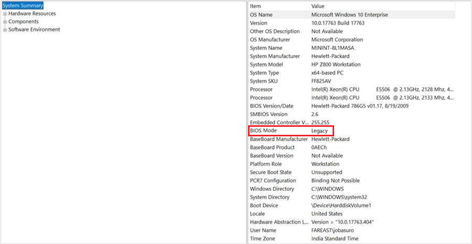
1. If the **BIOS Mode** setting is **Legacy**, you have to switch the BIOS into **UEFI** or **EFI** mode. The steps for doing this are specific to the device.
   > [!NOTE]
   > If the device supports only Legacy mode, you cannot use Intune to manage BitLocker Device Encryption on the device.

## <a id="issue-6"></a>Error message: The UEFI variable 'SecureBoot' could not be read

You receive an error message that resembles the following:

> **Error:** BitLocker cannot use Secure Boot for integrity because the UEFI variable 'SecureBoot' could not be read. A required privilege is not held by the client.

### Cause

A Platform Configuration Register (PCR) is a memory location in the TPM. In particular, PCR 7 measures the state of Secure Boot. Silent BitLocker Drive Encryption requires that Secure Boot is turned on.

### Resolution

You can resolve this issue by verifying the PCR validation profile of the TPM and the Secure Boot state. To do this, follow these steps:

#### Step 1: Verify the PCR validation profile of the TPM

To verify that PCR 7 is in use, open an elevated Command Prompt window and run the following command:

```cmd
Manage-bde -protectors -get %systemdrive%
```

In the TPM section of the output of this command, verify that the **PCR Validation Profile** setting includes **7**, as follows.

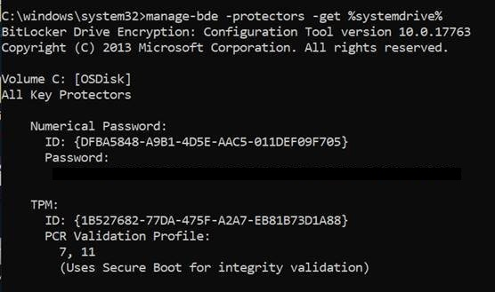

If **PCR Validation Profile** doesn't include **7** (for example, the values include **0**, **2**, **4**, and **11**, but not **7**), then Secure Boot is not turned on.

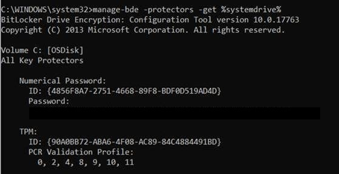

#### 2. Verify the Secure Boot state

To verify the Secure Boot state, use the System Information app. To do this, follow these steps:

1. Select **Start**, and enter **msinfo32** in the **Search** box.
1. Verify that the **Secure Boot State** setting is **On**, as follows:  
   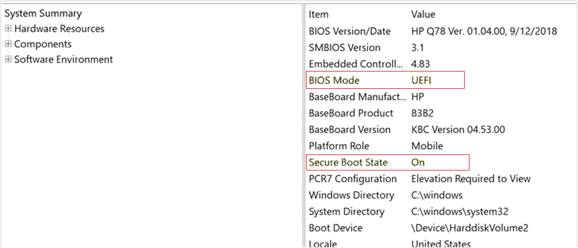
1. If the **Secure Boot State** setting is **Unsupported**, you cannot use Silent BitLocker Encryption on this device.  
   

> [!NOTE]
> You can also use the [Confirm-SecureBootUEFI](https://docs.microsoft.com/powershell/module/secureboot/confirm-securebootuefi?view=win10-ps) cmdlet to verify the Secure Boot state. To do this, open an elevated PowerShell window and run the following command:
> ```ps
> PS C:\> Confirm-SecureBootUEFI
> ```
> If the computer supports Secure Boot and Secure Boot is enabled, this cmdlet returns "True."  
>  
> If the computer supports Secure Boot and Secure Boot is disabled, this cmdlet returns "False."  
>  
> If the computer does not support Secure Boot or is a BIOS (non-UEFI) computer, this cmdlet returns "Cmdlet not supported on this platform."  

## <a id="issue-7"></a>Event ID 846, 778, and 851: Error 0x80072f9a

In this case, you are deploying Intune policy to encrypt a Windows 10, version 1809 device and store the recovery password in Azure Active Directory (Azure AD). As part of the policy configuration, you have selected the **Allow standard users to enable encryption during Azure AD Join** option.

The policy deployment fails and generates the following events (visible in Event Viewer in the **Applications and Services Logs\\Microsoft\\Windows\\BitLocker API** folder):

> Event ID:846
> 
> Event:
> Failed to backup BitLocker Drive Encryption recovery information for volume C: to your Azure AD.
> 
> TraceId: {cbac2b6f-1434-4faa-a9c3-597b17c1dfa3}
> Error: Unknown HResult Error code: 0x80072f9a

> Event ID:778
> 
> Event: The BitLocker volume C: was reverted to an unprotected state.

> Event ID: 851
> 
> Event:
> Failed to enable Silent Encryption.
> 
> Error: Unknown HResult Error code: 0x80072f9a.

These events refer to Error code 0x80072f9a.

### Cause

These events indicate that the signed-in user does not have permission to read the private key on the certificate that is generated as part of the provisioning and enrollment process. Therefore, the BitLocker MDM policy refresh fails.

The issue affects Windows 10 version 1809.

### Resolution

To resolve this issue, install the [May 21, 2019](https://support.microsoft.com/help/4497934/windows-10-update-kb4497934) update.

## <a id="issue-5"></a>Error message: There are conflicting Group Policy settings for recovery options on operating system drives

You receive a message that resembles the following:

> **Error:** BitLocker Drive Encryption cannot be applied to this drive because there are conflicting Group Policy settings for recovery options on operating system drives. Storing recovery information to Active Directory Domain Services cannot be required when the generation of recovery passwords is not permitted. Please have your system administrator resolve these policy conflicts before attempting to enable BitLocker…

### Resolution

To resolve this issue, review your Group Policy Object (GPO) settings for conflicts. For further guidance, see the next section, [Review your BitLocker policy configuration](#policy).

For more information about GPOs and BitLocker, see [BitLocker Group Policy Reference](https://docs.microsoft.com/previous-versions/windows/it-pro/windows-7/ee706521(v=ws.10)?redirectedfrom=MSDN).

## <a id="policy"></a>Review your BitLocker policy configuration

For information about how to use policy together with BitLocker and Intune, see the following resources:

- [BitLocker management for enterprises: Managing devices joined to Azure Active Directory](https://docs.microsoft.com/windows/security/information-protection/bitlocker/bitlocker-management-for-enterprises#managing-devices-joined-to-azure-active-directory)
- [BitLocker Group Policy Reference](https://docs.microsoft.com/previous-versions/windows/it-pro/windows-7/ee706521(v=ws.10)?redirectedfrom=MSDN)
- [Configuration service provider reference](https://docs.microsoft.com/windows/client-management/mdm/configuration-service-provider-reference)
- [Policy CSP &ndash; BitLocker](https://docs.microsoft.com/windows/client-management/mdm/policy-csp-bitlocker)
- [BitLocker CSP](https://docs.microsoft.com/windows/client-management/mdm/bitlocker-csp)
- [Enable ADMX-backed policies in MDM](https://docs.microsoft.com/windows/client-management/mdm/enable-admx-backed-policies-in-mdm)
- [gpresult](https://docs.microsoft.com/windows-server/administration/windows-commands/gpresult)

Intune offers the following enforcement types for BitLocker:

- **Automatic** (Enforced when the device joins Azure AD during the provisioning process. This option is available in Windows 10 version 1703 and later.)
- **Silent** (Endpoint protection policy. This option is available in Windows 10 version 1803 and later.)
- **Interactive** (Endpoint policy for Windows versions that are older than Windows 10 version 1803.)

If your device runs Windows 10 version 1703 or later, supports Modern Standby (also known as Instant Go) and is HSTI-compliant, joining the device to Azure AD triggers automatic device encryption. A separate endpoint protection policy is not required to enforce device encryption.

If your device is HSTI-compliant but does not support Modern Standby, you have to configure an endpoint protection policy to enforce silent BitLocker Drive Encryption. The settings for this policy should resemble the following:

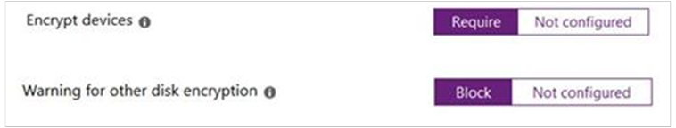

The OMA-URI references for these settings are as follows:

- OMA-URI: **./Device/Vendor/MSFT/BitLocker/RequireDeviceEncryption**  
   Value Type: **Integer**  
   Value: **1**  (1 = Require, 0 = Not Configured)

- OMA-URI: **./Device/Vendor/MSFT/BitLocker/AllowWarningForOtherDiskEncryption**  
   Value Type: **Integer**  
   Value: **0** (0 = Blocked, 1 = Allowed)  

> [!NOTE]
> Because of an update to the BitLocker Policy CSP, if the device uses Windows 10 version 1809 or later, you can use an endpoint protection policy to enforce silent BitLocker Device Encryption even if the device is not HSTI-compliant.

> [!NOTE]
> If the **Warning for other disk encryption** setting is set to **Not configured**, you have to manually start the BitLocker Drive Encryption wizard.  

If the device does not support Modern Standby but is HSTI-compliant, and it uses a version of Windows that is earlier than Windows 10, version 1803, an endpoint protection policy that has the settings that are described in this article delivers the policy configuration to the device. However, Windows then notifies the user to manually enable BitLocker Drive Encryption. To do this, the user selects the notification. This action starts the BitLocker Drive Encryption wizard.  

The Intune 1901 release provides settings that you can use to configure automatic device encryption for Autopilot devices for standard users. Each device must meet the following requirements:

- Be HSTI-compliant
- Support Modern Standby
- Use Windows 10 version 1803 or later


The OMA-URI references for these settings are as follows:

- OMA-URI: **./Device/Vendor/MSFT/BitLocker/AllowStandardUserEncryption**  
   Value Type: **Integer**
   Value: **1**  

> [!NOTE]
> This node works together with the **RequireDeviceEncryption** and **AllowWarningForOtherDiskEncryption** nodes. For this reason, when you set **RequireDeviceEncryption** to **1**, **AllowStandardUserEncryption** to **1**, and **AllowWarningForOtherDiskEncryption** to **0**. Intune can enforce silent BitLocker encryption for Autopilot devices that have standard user profiles.

## Verifying that BitLocker is operating correctly

During regular operations, BitLocker Drive Encryption generates events such as Event ID 796 and Event ID 845.

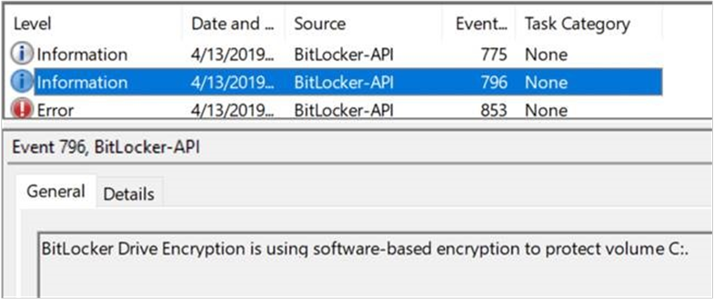


You can also determine whether the BitLocker recovery password has been uploaded to Azure AD by checking the device details in the Azure AD Devices section.

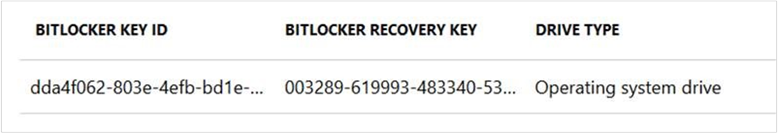

On the device, check the Registry Editor to verify the policy settings on the device. Verify the entries under the following subkeys:

- **HKEY\_LOCAL\_MACHINE\\SOFTWARE\\Microsoft\\PolicyManager\\current\\device\\BitLocker**
- **HKEY\_LOCAL\_MACHINE\\SOFTWARE\\Microsoft\\PolicyManager\\current\\device**  

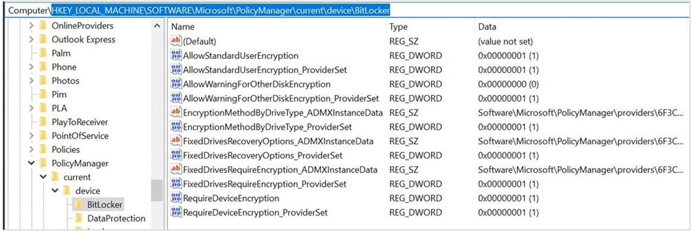
