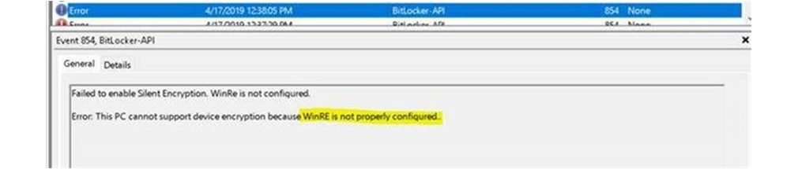
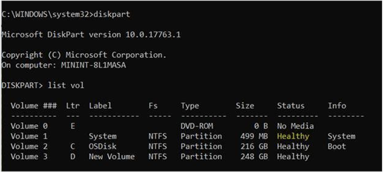
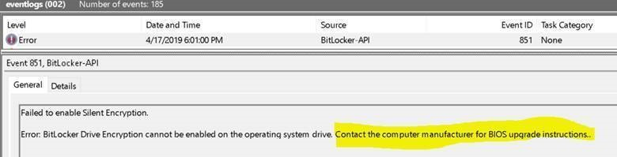
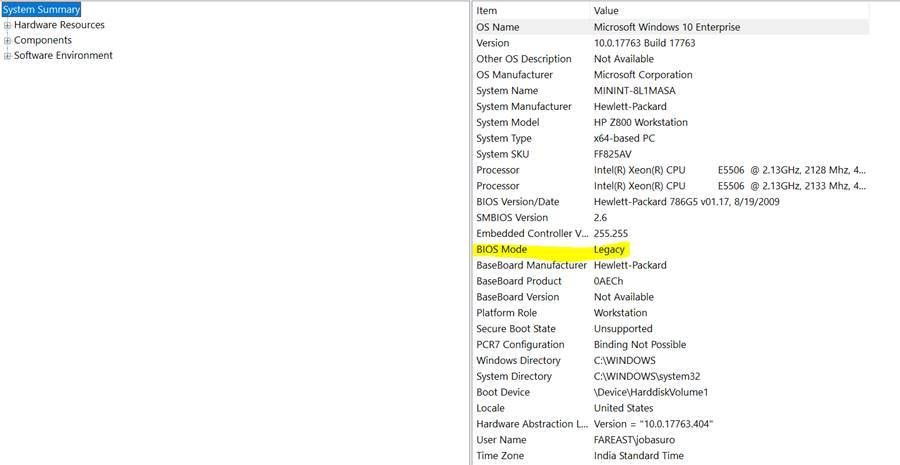
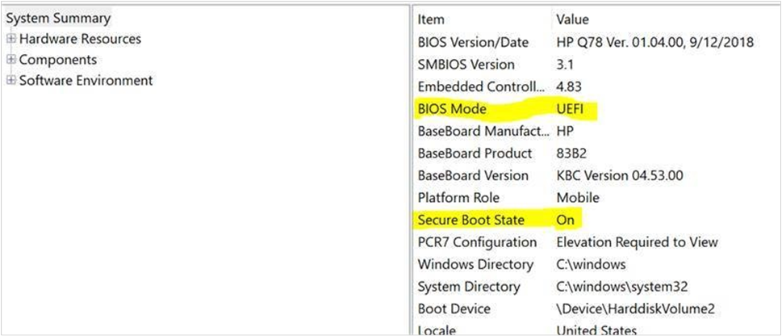
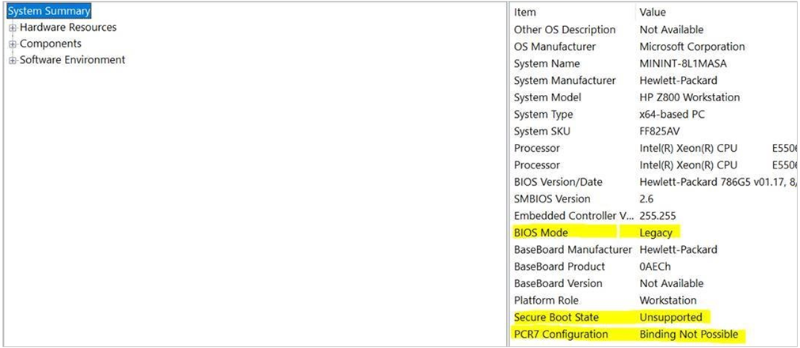
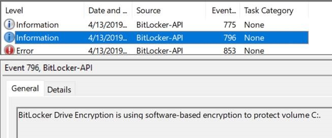
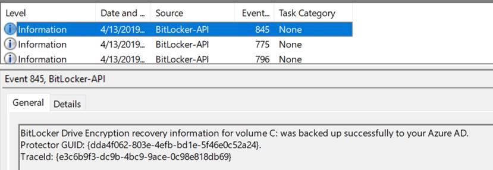

# Enforcing BitLocker policies by using Intune--known issues

Reference: <https://internal.support.services.microsoft.com/help/4502051>

On the portal, you should see the BitLocker encryption failing as shown here:

Reasons for failure can be many. The best place to start looking for error reason is the event viewer **Applications and Services log** > **Windows** > **BitLocker API**.

The following sections provide more information about resolving the following events and error messages:

- [Event ID 853: TPM not available](#issue-1)
- [Event ID 853: Bootable media detected](#issue-2)
- [Event ID 854: WinRE not configured](#issue-3)
- [Event ID 851: Contact manufacturer for BIOS upgrade](#issue-4)
- [Error message: Conflicting Group Policy settings for recovery options on operating system drives](#issue-5)
- [Error message: The UEFI variable 'SecureBoot' could not be read](#issue-6)
- [Event ID 846, 778, and 851: Error 0x80072f9a](#issue-7)

For information about how to verify that Intune policies are enforcing BitLocker correctly, see [Verifying that BitLocker is operating correctly](#verifying-that-bitlocker-is-operating-correctly).

## Event ID 853: TPM not available

### Cause

Device may not have a TPM chip or it might be disabled from BIOS

### Resolution

TPM needs to be enabled in BIOS and you can check the TPM status running tpm.msc from Run. TPM needs to be in ready state (TPM version 2.0)

## Event ID 853: Bootable media detected

### Cause

During BitLocker and TPM provisioning, the platform takes into account any additional removable media connected to the system as the normal platform verification parameters.

As such if BitLocker provisioning continues with removable media being attached to the device, on absence of those media drives, it would prompt for the BitLocker Recovery as the platform verification will detect changes in parameters.

Windows 10 takes care of this situation and does not starts the BitLocker provisioning if it detects that additional removable media is connected.

### Resolution

Remove the bootable media and restart. Check the encryption status post restart.

## Event ID 854: WinRE not configured

### Cause

Windows Recovery Environment (WinRE) is the minimal OS based on Windows Preinstallation Environment (WinPE) which includes a number of tools to recover, reset and diagnose Windows.

If the main OS doesn’t boot on some reason, the computer tries to run WinRE.

In case of Silent BitLocker Encryption, BitLocker encryption is enabled on OS drive while Windows is still in Pre Boot Environment (Win PE). This is to protect the OS drive contents.

As such it is necessary to have WinRE (Recovery Environment) enabled so that Windows can be recovered in any system crash issues.

During Windows 10 installation, Windows automatically creates a system partition for recovery.

### Resolution

Check if WinRE is enabled. Run the command **reagentc /info** on an elevated command prompt:

If disabled, to fix this issue or configure WinRE, you need to run command **reagentc /enable** in administrative command prompt.

> [!IMPORTANT]
> This command will work only if you did not made any changes to the system partitions as created by Windows in default. Windows 10 during installation by default creates a recovery partition (499MB) which will contain the Winre.wim file:
> 

Running the **diskpart \> list volume** command will show you the volumes as created on the hard drive. If you see that Volume 1 status is not healthy, you are out of luck and would require to re-install Windows:

If the partition status is heathy, but running the **reagentc /enable** command gives you an error, you can go and check the BCD entry if Windows Boot Loader contains the recovery sequence GUID by running **bcdedit /enum all**.

In the list of boot variants, find the Windows Boot Loader section with **identifier={current}**. The GUID value of the **recoverysequence** attribute should be unique and not a string of zeros.

BCD config is out of Intune scope so I will not dig into it.

## Event ID 851: Contact manufacturer for BIOS upgrade

### Cause

Silent BitLocker Encryption requires UEFI BIOS as it does not supports BIOS in legacy mode. Check the BIOS mode by using msinfo32.

### Resolution

You need to enable UEFI BIOS by booting to BIOS if your device supports EFI/UEFI. If your device only supports legacy BIOS, then you are out of luck.

## Error message: Conflicting Group Policy settings for recovery options on operating system drives

You receive a message that resembles the following:

> Error: BitLocker Drive Encryption cannot be applied to this drive because there are conflicting Group Policy settings for recovery options on operating system drives. Storing recovery information to Active Directory Domain Services cannot be required when the generation of recovery passwords is not permitted. Please have your system administrator resolve these policy conflicts before attempting to enable BitLocker…

### Resolution

You need to get rid of the conflicting GPO.

## Error message: The UEFI variable 'SecureBoot' could not be read

You receive a message that resembles the following:

> Error: BitLocker cannot use Secure Boot for integrity because the UEFI variable ‘SecureBoot’ could not be read. A required privilege is not held by the client.

### Cause

Check to see if the system TPM supports PCR \[7\] and is used by BitLocker/Device Encryption. Run the command **Manage-bde -protectors -get %systemdrive%**.

If PCR validation profile doesn't show that BitLocker uses Secure Boot for integrity validation (for example, PCR validation profile says PCR 0, 2, 4, 11), this indicates that BitLocker cannot use PCR \[7\] which is a requirement for silent encryption.

### Resolution

Ensure Secure Boot is enabled in UEFI settings. Run **msinfo32** to check:

However if you see something like below, your device does not have support:

## Verifying that BitLocker is operating correctly

You can also verify if the BitLocker Recovery Key has been uploaded to Azure by checking the device details from under Azure AD devices section.

Registry path to verify the BitLocker policy as delivered to the device: **HKEY\_LOCAL\_MACHINE\\SOFTWARE\\Microsoft\\PolicyManager\\current\\device\\BitLocker**

The registry path **HKEY\_LOCAL\_MACHINE\\SOFTWARE\\Microsoft\\PolicyManager\\current\\device** will contain all the policy as received/enforced by the MDM

## Event ID 846, 778, and 851: Error 0x80072f9a

When deploying Intune Policy to encrypt the device and store the recovery key into Azure Active Directory might fail with Error 0x80072f9a on Windows 10 1809, after enabling the option **Allow standard users to enable encryption during Azure AD Join**.

Checking the event viewer, BitLocker API Log, you will see the following events:

> Event ID:846
> 
> Event:
> 
> Failed to backup BitLocker Drive Encryption recovery information for volume C: to your Azure AD.
> 
> TraceId: {cbac2b6f-1434-4faa-a9c3-597b17c1dfa3}
> 
> Error: Unknown HResult Error code: 0x80072f9a
> 
> \------------------------------------------------------------------------------

> Event ID:778
> 
> Event: The BitLocker volume C: was reverted to an unprotected state.
> 
> \------------------------------------------------------------------------

> Event ID: 851
> 
> Event:
> 
> Failed to enable Silent Encryption.
> 
> Error: Unknown HResult Error code: 0x80072f9a.
> 
The issue affects Windows v1809, and this is because the BitLocker MDM policy Refresh fails with an access denied when impersonating the logged on Azure AD user on the PCPKEY file i.e. Private Key for the cert used for Azure AD Communication.

### Cause

The logged on user does not have permission to read the private key on the certificate that is generated during joining the Azure AD

### Resolution

In order to resolve this issue please install [kb4497934](https://support.microsoft.com/help/4497934/windows-10-update-kb4497934)
