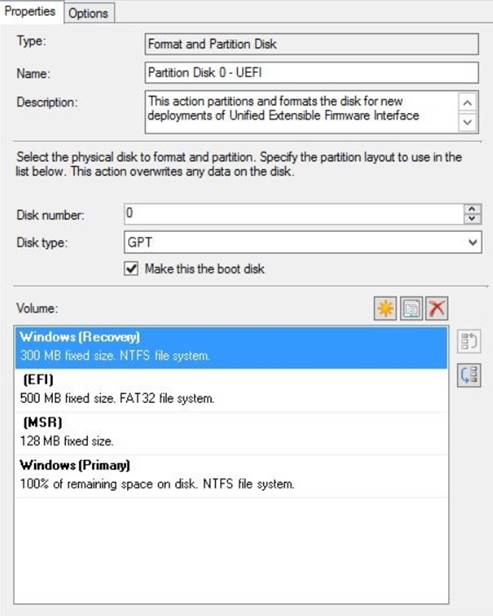
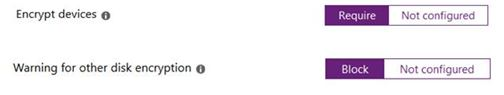
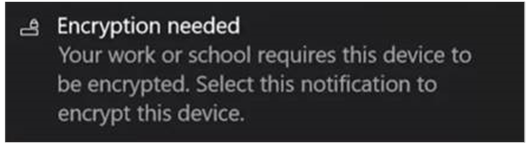

# Enforcing BitLocker policies by using Intune: known issues

This article provides assistance for issues that you may see if you use Microsoft Intune policy to manage silent BitLocker encryption on devices. The Intune portal indicates whether BitLocker has failed to encrypt on or more managed devices.


To start narrowing down the cause of the problem, review the event logs as described in [Troubleshoot BitLocker](troubleshoot-bitlocker.md). Concentrate on the Management and Operations logs in the **Applications and Services logs\\Microsoft\\Windows\\BitLocker-API** folder. The following sections provide more information about resolving the following events and error messages:

- [Event ID 853: Error: A compatible Trusted Platform Module (TPM) Security Device cannot be found on this computer](#issue-1)
- [Event ID 853: Error: BitLocker Drive Encryption detected bootable media (CD or DVD) in the computer](#issue-2)
- [Event ID 854: WinRE is not configured](#issue-3)
- [Event ID 851: Contact manufacturer for BIOS upgrade](#issue-4)
- [Error message: The UEFI variable 'SecureBoot' could not be read](#issue-6)
- [Event ID 846, 778, and 851: Error 0x80072f9a](#issue-7)
- [Error message: Conflicting Group Policy settings for recovery options on operating system drives](#issue-5)

If you do not have a clear trail of events or error messages to follow, other areas to investigate include the following:

- [Review the hardware requirements for using Intune to manage BitLocker on devices](https://docs.microsoft.com/windows-hardware/design/device-experiences/oem-bitlocker#bitlocker-automatic-device-encryption-hardware-requirements)
- [Review your BitLocker policy configuration](#policy)

For information about how to verify that Intune policies are enforcing BitLocker correctly, see [Verifying that BitLocker is operating correctly](#verifying-that-bitlocker-is-operating-correctly).

> [!NOTE]
> - For some of the procedures in this article, you have to use the TPM management console (tpm.msc). To open the TPM management console, select **Start**, and in the **Search** box, type **tpm.msc**, and then press **Enter**.
> - For some of the procedures in this article, you have to use an elevated Command Prompt window. To open and elevated Command Prompt window, select **Start**, and in the **Search** box, type **cmd**. Right-click **Command Prompt**, and select **Run as administrator**.

## <a id="issue-1"></a>Event ID 853: Error: A compatible Trusted Platform Module (TPM) Security Device cannot be found on this computer

Event ID 853 can carry different error messages, depending on context. In this case, you see event ID 853, and the error message in the event indicates that the device does not appear to have a TPM. The event information resembles the following:


### Cause

The device that you are trying to secure may not have a TPM chip, or the device BIOS might be configured to disable the TPM.

### Resolution

To resolve this issue, verify the following:

- The TPM is enabled in the device BIOS.  
- The TPM status in the TPM management console resembles the following:
   - Ready (TPM 2.0)
   - Initialized (TPM 1.2)

For more information, see [Troubleshoot the TPM](https://docs.microsoft.com/windows/security/information-protection/tpm/initialize-and-configure-ownership-of-the-tpm).

## <a id="issue-2"></a>Event ID 853: Error: BitLocker Drive Encryption detected bootable media (CD or DVD) in the computer

In this case, you see event ID 853, and the error message in the event indicates that bootable media is available to the device. The event information resembles the following:


### Cause

During the provisioning process, BitLocker Drive Encryption records the configuration of the device to establish a baseline. If the device configuration changes at a later time, BitLocker recovery mode automatically starts. If the device has removable bootable media on board during the provisioning process, removing that media triggers BitLocker recovery mode.

To avoid this situation, the provisioning process stops if it detects removable bootable media.

### Resolution

Remove the bootable media and then restart the device. After the device restarts, verify the encryption status.

## <a id="issue-3"></a>Event ID 854: WinRE is not configured

The event information resembles the following:


### Cause

Windows Recovery Environment (WindowsRE, or WinRE) is a minimal Windows operating system that is based on Windows Preinstallation Environment (WindowsPE). WindowsRE includes a number of tools that an administrator can use to recover or reset Windows and diagnose Windows issues. If a device cannot start the regular Windows operating system, the device tries to start Windows RE.

The provisioning process enables BitLocker Drive Encryption on the operating system drive during the WindowsPE phase of provisioning. This action makes sure that the drive is protected before the full operating system is installed. The provisioning process also creates a system partition for WindowsRE to use, in case of any system crashes.

If WindowsRE is not available on the device, provisioning stops.

### Resolution

I would add suggestion to ensure that WinRE is configured in the SCCM/MDT/other image provisioning system. Problem is that sometimes SCCM/MDT admins forget to properly configure disk layout
Below is example (pic form internet as I don’t have SCCM lab):

#### 1. Verify the configuration of the disk partitions

The procedures described in this section depend on the default disk partitions that Windows configures during installation. Windows 10 automatically creates a recovery partition that contains the Winre.wim file. The partition configuration resembles the following:


To verify the configuration of the disk partitions, open an elevated Command Prompt window and run the following commands:

```
diskpart 
list volume
```


If the status of any of the volumes is not healthy or if the recovery partition is missing, you may have to reinstall Windows. Before you do so, check the configuration of the Windows image that you are using for provisioning. Make sure that the image uses the correct disk configuration. The image configuration should resemble the following (the example is from System Center Configuration Manager):



#### 2. Verify the status of WindowsRE

To verify the status of WindowsRE on the device, open an elevated Command Prompt window and run the following command:

```cmd
reagentc /info
```
The output of this command resembles the following:


If the **Windows RE status** is not **Enabled**, run the following command to enable it:

```cmd
reagentc /enable
```

#### 3. Verify the Windows Boot Loader configuration

If the partition status is heathy, but the **reagentc /enable** command results in an error, verify that Windows Boot Loader contains the recovery sequence GUID. To do so, run the following command in an elevated Command Prompt window:

```cmd
bcdedit /enum all
```

The output of this command resembles the following:


In the output, locate the **Windows Boot Loader** section that includes the line **identifier={current}**. In that section, locate the **recoverysequence** attribute. The value of this attribute should be a GUID value, and not a string of zeros.

## <a id="issue-4"></a>Event ID 851: Contact the manufacturer for BIOS upgrade instructions

The event information resembles the following:


### Cause

The device must have Unified Extensible Firmware Interface (UEFI) BIOS. Silent BitLocker Drive Encryption does not support legacy BIOS.

### Resolution

To verify the BIOS mode, use the System Information app. To do this, follow these steps:

1. Select **Start**, and in the **Search** box, type **msinfo32**, and then press **Enter**.
1. Verify that the **BIOS Mode** setting is **UEFI** and not **Legacy**.  
   
1. If the **BIOS Mode** setting is **Legacy**, you have to switch the BIOS into **UEFI** or **EFI** mode. The steps for doing this are specific to the device.
   > [!NOTE]
   > If the device supports only Legacy mode, you cannot use Intune to manage BitLocker Device Encryption on the device.

## <a id="issue-6"></a>Error message: The UEFI variable 'SecureBoot' could not be read

You receive a message that resembles the following:

> **Error:** BitLocker cannot use Secure Boot for integrity because the UEFI variable ‘SecureBoot’ could not be read. A required privilege is not held by the client.

### Cause

A Platform Configuration Register (PCR) is a memory location in the TPM. PCR 7, in particular, measures the state of Secure Boot. Silent BitLocker Drive Encryption requires that Secure Boot be turned on.

### Resolution

#### 1. Verify the PCR validation profile of the TPM

To verify that PCR 7 is in use, open an elevated Command Prompt window and run the following command:

```cmd
Manage-bde -protectors -get %systemdrive%
```

In the TPM section of the output of this command, verify that the **PCR Validation Profile** setting includes **7**, as follows:


If **PCR Validation Profile** doesn't include **7** (for example, the values include **0**, **2**, **4**, **11**, but not **7**), then Secure Boot is not turned on.


#### 2. Verify the Secure Boot State

To verify the Secure Boot State, use the System Information app. To do this, follow these steps:

1. Select **Start**, and in the **Search** box, type **msinfo32**, and then press **Enter**.
1. Verify that the **Secure Boot State** setting is **On**, as follows:  
   
1. If the **Secure Boot State** setting is **Unsupported**, you will not be able to use Silent BitLocker Encryption on this device.  
   

## <a id="issue-7"></a>Event ID 846, 778, and 851: Error 0x80072f9a

In this case, you are deploying Intune policy to encrypt a Windows 10, version 1809 device and store the recovery key in Azure Active Directory. As part of the policy configuration, you have enabled the **Allow standard users to enable encryption during Azure AD Join** option.

The policy deployment fails and generates the following events (visible in the **Applications and Services logs\\Microsoft\\Windows\\BitLocker API Log**):

> Event ID:846
> 
> Event:
> Failed to backup BitLocker Drive Encryption recovery information for volume C: to your Azure AD.
> 
> TraceId: {cbac2b6f-1434-4faa-a9c3-597b17c1dfa3}
> Error: Unknown HResult Error code: 0x80072f9a

> Event ID:778
> 
> Event: The BitLocker volume C: was reverted to an unprotected state.

> Event ID: 851
> 
> Event:
> Failed to enable Silent Encryption.
> 
> Error: Unknown HResult Error code: 0x80072f9a.

These events refer to Error code 0x80072f9a.

### Cause

These events indicate that the logged-on user does not have permission to read the private key on the certificate that is generated as part of the provisioning and enrollment process. As a result, the BitLocker MDM policy refresh fails.

The issue affects Windows 10 version 1809.

### Resolution

In order to resolve this issue, install the [May 21, 2019](https://support.microsoft.com/help/4497934/windows-10-update-kb4497934) update.

## <a id="issue-5"></a>Error message: There are conflicting Group Policy settings for recovery options on operating system drives

You receive a message that resembles the following:

> **Error:** BitLocker Drive Encryption cannot be applied to this drive because there are conflicting Group Policy settings for recovery options on operating system drives. Storing recovery information to Active Directory Domain Services cannot be required when the generation of recovery passwords is not permitted. Please have your system administrator resolve these policy conflicts before attempting to enable BitLocker…

### Resolution

To resolve this issue, review your Group Policy Object (GPO) settings for conflicts. For further guidance, see the next section, [Reivew your BitLocker policy configuration](#policy).

For more information about GPOs and BitLocker, see [BitLocker Group Policy Reference](https://docs.microsoft.com/previous-versions/windows/it-pro/windows-7/ee706521(v=ws.10)?redirectedfrom=MSDN).

## <a id="policy"></a>Review your BitLocker policy configuration

For information about using policy with BitLocker and Intune, see the following resources:

- [BitLocker management for enterprises: Managing devices joined to Azure Active Directory](https://docs.microsoft.com/en-us/windows/security/information-protection/bitlocker/bitlocker-management-for-enterprises#managing-devices-joined-to-azure-active-directory)
- [BitLocker Group Policy Reference](https://docs.microsoft.com/previous-versions/windows/it-pro/windows-7/ee706521(v=ws.10)?redirectedfrom=MSDN)
- [Configuration service provider reference](https://docs.microsoft.com/windows/client-management/mdm/configuration-service-provider-reference)
- [Policy CSP &ndash; BitLocker](https://docs.microsoft.com/windows/client-management/mdm/policy-csp-bitlocker)
- [BitLocker CSP](https://docs.microsoft.com/windows/client-management/mdm/bitlocker-csp)
- [Enable ADMX-backed policies in MDM](https://docs.microsoft.com/windows/client-management/mdm/enable-admx-backed-policies-in-mdm)
- [gpresult](https://docs.microsoft.com/windows-server/administration/windows-commands/gpresult)

Intune offers three types of enforcement for BitLocker:

- **Automatic** (Enforced when the device joins Azure Active Directory during the provisioning process. This option is available in Windows 10 version 1703 and later.)
- **Silent** (Endpoint protection policy. This option is available in Windows 10 version 1803 and later.)
- **Interactive** (Endpoint policy for Windows versions older than Windows 10 version 1803.)

If your device runs Windows 10 version 1703 or later, supports Modern Standby (also known as Instant Go) and is HSTI-compliant, joining the device to Azure Active Directory triggers automatic device encryption. A separate endpoint protection policy is not needed to enforce device encryption.

If your device is HSTI-compliant but does not support Modern Standby, you have to configure an endpoint protection policy to enforce silent BitLocker Drive Encryption. The settings for this policy should resemble the following:



The OMA-URI references for these settings are the following:

- OMA-URI: **./Device/Vendor/MSFT/BitLocker/RequireDeviceEncryption**  
   Value Type: **Integer**  
   Value: **1**  (1 = Require, 0 = Not Configured)

- OMA-URI: **./Device/Vendor/MSFT/BitLocker/AllowWarningForOtherDiskEncryption**  
   Value Type: **Integer**  
   Value: **0** (0 = Blocked, 1 = Allowed)  

> [!NOTE]
> Because of an update to the BitLocker Policy CSP, if the device uses Windows 10 version 1809 or later, you can use an endpoint protection policy to enforce silent BitLocker Device Encryption even if the device is not HSTI-compliant.

> [!NOTE]
> If the setting **Waiting for other disk encryption** is set to **Not configured**, then you need to manually start the BitLocker Drive Encryption wizard.  
>  
> 

If the device does not support Modern Standby but is HSTI-compliant, and it uses a version of Windows older than Windows 10 version 1803, an endpoint protection policy that has the settings that are described previously delivers the policy configuration to the device. However, Windows then notifies the user to manually enable BitLocker Drive Encryption. To do this, the user selects the notification. This action starts the BitLocker Drive Encryption wizard.  

The Intune 1901 release provides settings that you can use to configure automatic device encryption for Autopilot devices for standard users. The devices must meet the following requirements:

- HSTI compliant
- Support Modern Standby
- Use Windows 10 version 1803 or later


The OMA-URI references for these settings are the following:

- OMA-URI: **./Device/Vendor/MSFT/BitLocker/AllowStandardUserEncryption**  
   Value Type: **Integer**
   Value: **1**  

> [!NOTE]
> This node works in tandem with the **RequireDeviceEncryption** and **AllowWarningForOtherDiskEncryption** nodes. Because of this, when you set **RequireDeviceEncryption** to **1**, **AllowStandardUserEncryption** to **1**, and **AllowWarningForOtherDiskEncryption** to **0**. Intune can enforce silent BitLocker encryption for Autopilot devices that have standard user profiles.

## Verifying that BitLocker is operating correctly

During regular operations, BitLocker Drive Encryption generates events such as event ID 796 and event ID 845.


You can also verify if the BitLocker recovery Key has been uploaded to Azure by checking the device details in the Azure AD Devices section.


On the device, check the Registry Editor to verify the policy settings on the device. Verify the entries under the following subkeys:

- **HKEY\_LOCAL\_MACHINE\\SOFTWARE\\Microsoft\\PolicyManager\\current\\device\\BitLocker**
- **HKEY\_LOCAL\_MACHINE\\SOFTWARE\\Microsoft\\PolicyManager\\current\\device**  


