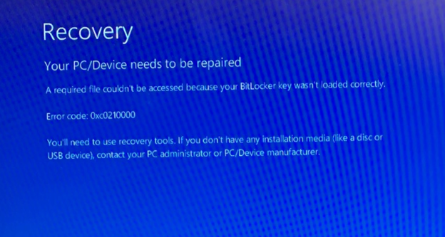
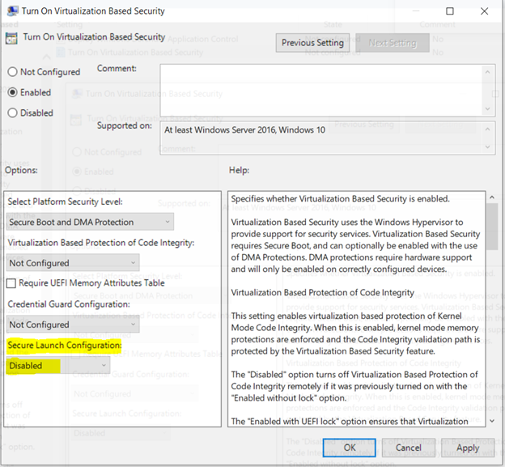

# BitLocker recovery: known issues

This article describes common issues that can occur that prevent BitLocker from behaving as expected when recovering a drive, or may cause BitLocker to start recovery unexpectedly. The article provides guidance for addressing those issues.

## Windows 10 asks for a BitLocker recovery key even though you did not set up a recovery key

Windows 10 prompts you for a BitLocker recovery key. However, you have not configured a BitLocker recovery key.

### Resolution

The BitLocker and Active Directory Domain Services (AD DS) FAQ addresses two situations that may produce this symptom, and provides information about how to resolve the issue:

- [What if BitLocker is enabled on a computer before the computer has joined the domain?](https://docs.microsoft.com/windows/security/information-protection/bitlocker/bitlocker-and-adds-faq#what-if-bitlocker-is-enabled-on-a-computer-before-the-computer-has-joined-the-domain)
- [What happens if the backup initially fails? Will BitLocker retry the backup?](https://docs.microsoft.com/windows/security/information-protection/bitlocker/bitlocker-and-adds-faq#what-happens-if-the-backup-initially-fails-will-bitlocker-retry-the-backup)

## The recovery key for a laptop was not backed up, and the laptop is locked

You have a Windows 10 Home laptop, and you need to recover its hard drive. The drive was encrypted by using BitLocker Driver Encryption. However, the BitLocker recovery key was not backed up, and the usual user of the laptop is not available to provide the key.

### Resolution

You can use either of the following approaches to manually back up or synchronize an online client's existing recovery information:

- Create a Windows Management Instrumentation (WMI) script that backs up the information. For more information, see [BitLocker Drive Encryption Provider](https://docs.microsoft.com/windows/win32/secprov/bitlocker-drive-encryption-provider).

- In an elevated Command Prompt window, use the [manage-bde](https://docs.microsoft.com/windows-server/administration/windows-commands/manage-bde) command to back up the information.

   For example, to back up all of the recovery information for the C: drive to AD DS, open an elevated Command Prompt window and run the following command:

   ```cmd
   manage-bde -protectors -adbackup C:
   ```

BitLocker does not automatically manage this backup process. 

## Tablet devices do not support Manage-bde -forcerecovery to test recovery mode

You have a tablet or slate device, and you try to test BitLocker Recovery by running the following command:

```cmd
Manage-bde -forcerecovery
```

However, when you enter the recovery password, the device goes into state in which it cannot start.

### Cause

> [!IMPORTANT]
> Tablet devices do not support the **manage-bde -forcerecovery** command.

This issue occurs because the Windows Boot Manager cannot process touch input during the pre-boot phase of startup. If Boot Manager detects that the device is a tablet device, it redirects the startup process to the Windows Recovery Environment (WindowsRE), which can process touch input.

If WindowsRE detects the TPM protector on the hard drive, it performs a PCR reseal. However, the **manage-bde -forcerecovery** command deletes the TPM protectors on the hard drive, so WindowsRE cannot reseal the PCRs. This failure triggers an infinite BitLocker recovery cycle, and therefore you can't boot to Windows.

This behavior is by design for all versions of Windows.

### Workaround

To resolve the restart loop, follow these steps:

1. On the BitLocker Recovery screen, select **Skip this drive**.
1. Select **Troubleshoot** \> **Advanced Options** \> **Command Prompt**.
1. In the Command Prompt window, run the following commands :
   ```cmd
   manage-bde –unlock C: -rp <48-digit BitLocker recovery key>
   manage-bde -protectors -disable C:
   ```
1. Close the Command Prompt window.
1. Shut down the device.
1. Start the device. Windows should start as usual.

## After you install updates to the UEFI or TPM firmware on a Surface device, BitLocker prompts for the recovery key

You have a Surface device that has BitLocker Drive Encryption turned on. You install a firmware update that updates the firmware of the device TPM or changes the signature of the system firmware. For example, you install the Surface dTPM (IFX) update.

You encounter one or more of the following symptoms on your Surface device:

- At startup, you are prompted for your BitLocker recovery key. You enter the correct recovery key, but Windows doesn’t start up.
- Startup progresses directly into the Surface Unified Extensible Firmware Interface (UEFI) settings.
- Your Surface device appears to be in an infinite restart loop.

### Cause

This issue occurs if the Surface device TPM is configured to use Platform Configuration Register (PCR) values other than the default values of PCR 7 and PCR 11. Such a configuration results when, for example,

- Secure Boot is turned off.
- PCR values have been explicitly defined, such as by Group Policy.

Devices that support Connected Standby (also known as InstantGO or Always On, Always Connected PCs), including Surface devices, must use PCR 7 of the TPM. In its default configuration on such systems, BitLocker binds to PCR 7 and PCR 11 if PCR 7 and Secure Boot are correctly configured. For more information, see "About the Platform Configuration Register (PCR)" at [BitLocker Group Policy Settings](https://technet.microsoft.com/library/jj679890\(v=ws.11\).aspx?#About%20the%20Platform%20Configuration%20Register%20\(PCR\)).

### Resolution

To verify the PCR values that are in use on a device, open and elevated Command Prompt window and run the following command:

```cmd
manage-bde.exe -protectors -get \<OSDriveLetter\>:
```

To resolve this issue and repair the device, follow these steps:

1. If your device is unable to start, even when you enter the correct BitLocker Recovery key, restore the ability to start by [disabling the TPM protectors on the boot drive](#step-1).
1. If you cannot recover the device by using step 1, [use Surface Bare Metal Recovery (BMR) to recover data and reset your device](#step-2).
1. To prevent the issue from occurring again, [restore the default PCR values](#3-restore-the-default-pcr-values).
   > [!NOTE]
   > If for some reason you have to use a different PCR configuration, you have to [suspend BitLocker during TPM or UEFI firmware updates](#suspend-bitlocker-during-tpm-or-uefi-firmware-updates).
1. To re-enable BitLocker Drive Encryption, select **Start**, type **Manage BitLocker**, and then press Enter. Follow the steps to encrypt your drive.

#### <a id="step-1"></a>1. Disable the TPM protectors on the boot drive

If you have installed a TPM or UEFI update and your device is unable to boot, even when you enter the correct BitLocker Recovery key, you can restore the ability to boot by using the BitLocker recovery key and a Surface recovery image to remove the TPM protectors from the boot drive.

To do this, follow these steps:

1. Obtain your BitLocker recovery key from [go.microsoft.com/fwlink/p/?LinkId=237614](http://go.microsoft.com/fwlink/p/?LinkId=237614), or if BitLocker is managed by other means such as Microsoft BitLocker Administration and Monitoring (MBAM), contact your administrator.
1. Use another computer to download the Surface recovery image from [Download a recovery image for your Surface](https://support.microsoft.com/surfacerecoveryimage). Use the downloaded image to create a USB recovery drive.
1. Insert the USB Surface recovery image drive into the Surface device, and start the device.
1. When prompted, select the following:
   1. Your operating system language.
   1. Your keyboard layout.
1. Select **Troubleshoot** > **Advanced Options** > **Command Prompt**.
1. In the Command Prompt window, run the following commands:  
   ```cmd
   manage-bde -unlock -recoverypassword <Password> <DriveLetter>:  
   manage-bde -protectors -disable <DriveLetter>:  
   ```
   where \<*Password*\> is your BitLocker recovery key as obtained in step 1, and \<*DriveLetter*> is the drive letter assigned to your operating system drive.  
   > [!NOTE]
   > For more information about using this command, see [manage-bde: unlock](https://docs.microsoft.com/windows-server/administration/windows-commands/manage-bde-unlock).
1. Restart the computer.
1. When prompted, enter your BitLocker recovery key as obtained in step 1.

> [!NOTE]
> After you disable the TPM protectors, BitLocker Drive Encryption no longer protects your device. To re-enable BitLocker Drive Encryption, select **Start**, type **Manage BitLocker**, and then press Enter. Follow the steps to encrypt your drive.

#### <a id="step-2"></a>2. Use Surface BMR to recover data and reset your device

To recover data from your Surface device if you are unable to start Windows, follow steps 1 through 5 of [step 1](#step-1) to return to the Command Prompt window, and then follow these steps:

1. In the Command Prompt window, run the following command:  
   ```cmd
   manage-bde -unlock -recoverypassword <Password> <DriveLetter>:  
   ```
   where \<*Password*\> is your BitLocker recovery key as obtained in step 1, and \<*DriveLetter*> is the drive letter assigned to your operating system drive.  
1. After the drive is unlocked, use **copy** or **xcopy** commands to copy the user data to another drive.  
   > [!NOTE]
   > For more information about the these commands, see the [Windows commands](https://docs.microsoft.com/windows-server/administration/windows-commands/windows-commands).
  
1. To reset your device by using a Surface recovery image: Follow the instructions in  "How to reset your Surface using your USB recovery drive" at [Creating and using a USB recovery drive](https://support.microsoft.com/help/4023512).  

#### 3. Restore the default PCR values

To prevent this issue from recurring, we strongly recommend that you restore the default configuration of Secure Boot and the PCR values.

To enable Secure Boot on a Surface device:

1. Suspend BitLocker by opening an elevated Windows PowerShell window, and running the following cmdlet:
   ```ps
   Suspend-BitLocker -MountPoint "<DriveLetter>:" -RebootCount 0  
   ```
   where <*DriveLetter*> is the letter assigned to your drive.
1. Restart the device and then edit the BIOS to set the **Secure Boot** option to **Microsoft Only**.
1. Restart the device and then open an elevated PowerShell window. Run the following cmdlet:  
   ```ps
   Resume-BitLocker -MountPoint "<DriveLetter>:"
   ```

To reset the PCR settings on the TPM:

1. Disable any Group Policies that configure the PCR settings, or remove the device from any groups that enforce such policies.  
   For more information, see [BitLocker Group Policy settings](https://docs.microsoft.com/windows/security/information-protection/bitlocker/bitlocker-group-policy-settings).
1. Suspend BitLocker by opening an elevated Windows PowerShell window, and running the following cmdlet:
   ```ps
   Suspend-BitLocker -MountPoint "<DriveLetter>:" -RebootCount 0  
   ```
   
   where <*DriveLetter*> is the letter assigned to your drive.
1. Run the following cmdlet:  
   ```ps
   Resume-BitLocker -MountPoint "<DriveLetter>:"

#### Suspend BitLocker during TPM or UEFI firmware updates

You can avoid this scenario when installing updates to system firmware or TPM firmware by temporarily suspending BitLocker before applying such updates.

> [!IMPORTANT]
> TPM and UEFI firmware updates may require multiple restarts while they install. To keep BitLocker suspended during this process, you must use [Suspend-BitLocker](https://docs.microsoft.com/powershell/module/bitlocker/suspend-bitlocker?view=winserver2012r2-ps) and set the **Reboot Count** parameter to either of the following values:
> - **2** or greater. This value sets the number of times the device can restart before BitLocker Device Encryption resumes.
> - **0**. This value suspends BitLocker Drive Encryption indefinitely, until you use [Resume-BitLocker](https://docs.microsoft.com/en-us/powershell/module/bitlocker/resume-bitlocker?view=winserver2012r2-ps) or another mechanism to resume protection.

To suspend BitLocker while you install TPM or UEFI firmware updates:

1. Open an elevated Windows PowerShell window, and run the following cmdlet:
   ```ps
   Suspend-BitLocker -MountPoint "<DriveLetter>:" -RebootCount 0  
   ```
   where <*DriveLetter*> is the letter assigned to your drive.
1. Install the Surface device driver and firmware updates.
1. After you install the firmware updates, restart the computer and then open an elevated PowerShell window. Run the following cmdlet:  
   ```ps
   Resume-BitLocker -MountPoint "<DriveLetter>:"
   ```

## After you install an update to a Hyper V-enabled computer, BitLocker prompts for the recovery password and gives error 0xC0210000

You have a device that runs Windows 10, version 1703, Windows 10, version 1607, or Windows Server 2016, and Hyper-V is enabled on the device. After you install an affected update and restart the computer, it enters BitLocker recovery mode and you see error code 0xC0210000.

### Workaround

If your device is already in this state, follow these steps:

you can successfully start Windows after suspending BitLocker from the Windows Recovery Environment (WindowsRE)

1. Retrieve the 48-digit BitLocker recovery password for the operating system drive from your organization's portal or from wherever the key was stored when BitLocker Drive Encryption was first turned on.
1. On the Recovery screen, press Enter. When prompted, enter the recovery password.
1. If your device starts in the Windows Recovery Environment (WindowsRE) and prompts for the recovery key again, select **Skip the drive**.
1. Select **Advanced options** > **Troubleshoot** > **Advanced options** > **Command Prompt**.
1. In the Command Prompt window, run the following commands:
   ```cmd
   Manage-bde -unlock c: -rp <48 digit numerical recovery password separated by “-“ in 6 digit group>
   Manage-bde -protectors -disable c:
   exit
   ```
   
   These commands unlock the drive and then suspend BitLocker by disabling the TPM protectors on the drive. The final command closes the Command Prompt window.
   > [!NOTE]
   > These commands suspend BitLocker for one restart of the device. The **-rc 1** option only works inside the operating system and does not work in the recovery environment.
1. Select **Continue**. Windows should start.
1. After Windows has started, open an elevated Command Prompt (i.e. run Command Prompt as administrator) and run the following command:
   ```cmd
   Manage-bde -protectors -enable c:
   ```

> [!IMPORTANT]
> Unless you suspend BitLocker before you start the device, this issue recurs.

To temporarily suspend BitLocker just before restarting the device, open an elevated Command Prompt window and run the following command:
```cmd
Manage-bde -protectors -disable c: -rc 1
```
### Resolution

To resolve this issue, install the appropriate update on the affected device:  

- For Windows 10, version 1703: [July 9, 2019—KB4507450 (OS Build 15063.1928)](https://support.microsoft.com/help/4507450/windows-10-update-kb4507450)
- For Windows 10, version 1607 and Windows Server 2016: [July 9, 2019—KB4507460 (OS Build 14393.3085)](https://support.microsoft.com/en-us/help/4507450/windows-10-update-kb4507450)

## Credential Guard/Device Guard on TPM 1.2: At every restart, BitLocker prompts for the recovery key and gives error 0xC0210000

You have a device that has TPM 1.2 and Windows 10 1809, and uses [Virtualization-based Security](https://docs.microsoft.com/en-us/windows-hardware/design/device-experiences/oem-vbs) features such as [Device Guard and Credential Guard](https://docs.microsoft.com/en-us/windows-hardware/drivers/bringup/device-guard-and-credential-guard). Every time you start the device, it enters BitLocker Recovery mode and you see error code 0xc0210000.



### Cause

TPM 1.2 does not support Secure Launch. For more information, see [System Guard Secure Launch and SMM protection: Requirements Met by System Guard Enabled Machines](https://docs.microsoft.com/en-us/windows/security/threat-protection/windows-defender-system-guard/system-guard-secure-launch-and-smm-protection\#requirements-met-by-system-guard-enabled-machines)

For more information about this technology, see [Windows Defender System Guard: How a hardware-based root of trust helps protect Windows 10](https://docs.microsoft.com/en-us/windows/security/threat-protection/windows-defender-system-guard/system-guard-how-hardware-based-root-of-trust-helps-protect-windows)

### Resolution

To resolve this issue, do one of the following:

- Remove any device that uses TPM 1.2 from any group that is subject to Group Policy Objects (GPOs) that enforce Secure Launch.
- Modify the **Turn On Virtualization Based Security** GPO to set **Secure Launch Configuration** to **Disabled**.

   
