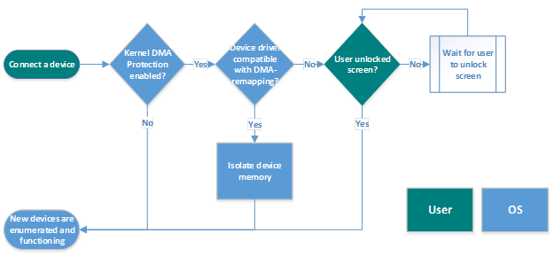
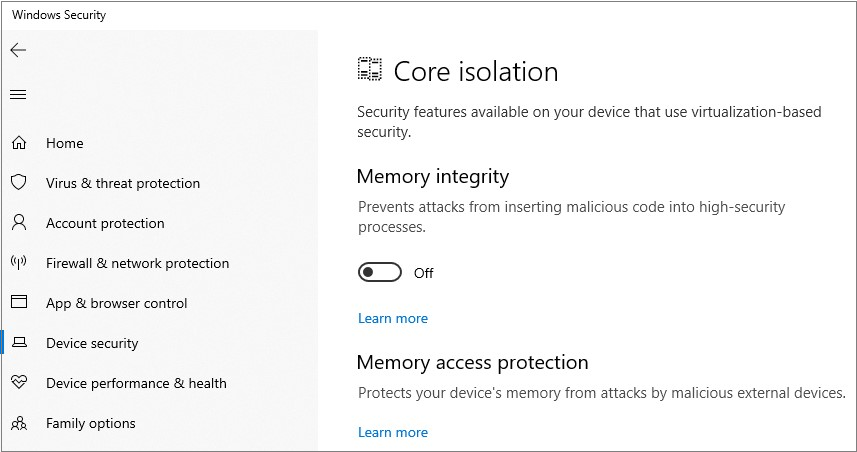
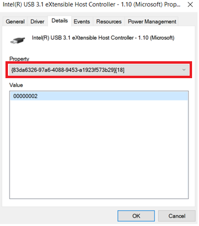

# Kernel DMA Protection for Thunderbolt™ 3 

**Applies to**
-   Windows 10

In Windows 10 version 1803, Microsoft introduced a new feature called Kernel DMA Protection to protect PCs against drive-by Direct Memory Access (DMA) attacks using PCI hot plug devices connected to Thunderbolt™ 3 ports. 
Drive-by DMA attacks can lead to disclosure of sensitive information residing on a PC, or even injection of malware that allows attackers to bypass the lock screen or control PCs remotely.

This feature does not protect against DMA attacks via 1394/FireWire, PCMCIA, CardBus, ExpressCard, and so on.

For Thunderbolt DMA protection on earlier Windows versions and other platforms that lack support for Kernel DMA Protection, please refer to [Intel Thunderbolt™ 3 Security documentation](https://thunderbolttechnology.net/security/Thunderbolt%203%20and%20Security.pdf).

## Background

PCI devices are DMA-capable, which allows them to read and write to system memory at will, without having to engage the system processor in these operations. 
The DMA capability is what makes PCI devices the highest performing devices available today. 
These devices have historically existed only inside the PC chassis, either connected as a card or soldered on the motherboard. 
Access to these devices required the user to turn off power to the system and disassemble the chassis. 
Today, this is no longer the case with Thunderbolt™. 

Thunderbolt™ technology has provided modern PCs with extensibility that was not available before for PCs. 
It allows users to attach new classes of external peripherals, such as graphics cards or other PCI devices, to their PCs with a hot plug experience identical to USB. 
Having PCI hot plug ports externally and easily accessible makes PCs susceptible to drive-by DMA attacks.

Drive-by DMA attacks are attacks that occur while the owner of the system is not present and usually take less than 10 minutes, with simple to moderate attacking tools (affordable, off-the-shelf hardware and software) that do not require the disassembly of the PC. 
A simple example would be a PC owner leaves the PC for a quick coffee break, and within the break, and attacker steps in, plugs in a USB-like device and walks away with all the secrets on the machine, or injects a malware that allows them to have full control over the PC remotely.

## How Windows protects against DMA drive-by attacks

Windows leverages the system Input/Output Memory Management Unit (IOMMU) to block external peripherals from starting and performing DMA unless the drivers for these peripherals support memory isolation (such as DMA-remapping). 
Peripherals with compatible drivers will be automatically enumerated, started and allowed to perform DMA to their assigned memory regions. 
By default, peripherals with incompatible drivers will be blocked from starting and performing DMA until an authorized user signs into the system or unlocks the screen.

## User experience

A peripheral that is incompatible with DMA-remapping will be blocked from starting if the peripheral was plugged in before an authorized user logs in, or while the screen is locked. 
Once the system is unlocked, the peripheral driver will be started by the OS, and the peripheral will continue to function normally until the system is rebooted, or the peripheral is unplugged. 
The peripheral will continue to function normally if the user locks the screen or logs out of the system.

## System compatibility

Kernel DMA Protection requires new UEFI firmware support. 
This support is anticipated only on newly-introduced, Intel-based systems shipping with Windows 10 version 1803 (not all systems). Virtualization-based Security (VBS) is not required.

To see if a system supports Kernel DMA Protection, check the System Information desktop app (MSINFO32). 
Systems released prior to Windows 10 version 1803 do not support Kernel DMA Protection, but they can leverage other DMA attack mitigations as described in [BitLocker countermeasures](bitlocker/bitlocker-countermeasures.md).

>[!NOTE]
>Kernel DMA Protection is not compatible with other BitLocker DMA attacks countermeasures. It is recommended to disable the BitLocker DMA attacks countermeasures if the system supports Kernel DMA Protection. Kernel DMA Protection provides higher security bar for the system over the BitLocker DMA attack countermeasures, while maintaining usability of external peripherals.

## How to check if Kernel DMA Protection is enabled

Systems running Windows 10 version 1803 that do support Kernel DMA Protection do have this security feature enabled automatically by the OS with no user or IT admin configuration required.

### Using Security Center

Beginning with Wndows 10 version 1809, you can use Security Center to check if Kernel DMA Protection is enabled. Click **Start** > **Settings** > **Update & Security** > **Windows Security** > **Open Windows Security** > **Device security** > **Core isolation details** > **Memory access protection**.

### Using System information

1. Launch MSINFO32.exe in a command prompt, or in the Windows search bar.
2. Check the value of **Kernel DMA Protection**.
   
3. If the current state of **Kernel DMA Protection** is OFF and **Virtualization Technology in Firmware** is NO:
   - Reboot into BIOS settings
   - Turn on Intel Virtualization Technology.
   - Turn on Intel Virtualization Technology for I/O (VT-d). In Windows 10 version 1803, only Intel VT-d is supported. Other platforms can use DMA attack mitigations described in [BitLocker countermeasures](bitlocker/bitlocker-countermeasures.md).
   - Reboot system into Windows 10.
4. If the state of **Kernel DMA Protection** remains Off, then the system does not support this feature. 

For systems that do not support Kernel DMA Protection, please refer to the [BitLocker countermeasures](bitlocker/bitlocker-countermeasures.md) or [Thunderbolt™ 3 and Security on Microsoft Windows® 10 Operating system](https://thunderbolttechnology.net/security/Thunderbolt%203%20and%20Security.pdf) for other means of DMA protection.

## Frequently asked questions

### Do in-market systems support Kernel DMA Protection for Thunderbolt™ 3?
In-market systems, released with Windows 10 version 1709 or earlier, will not support Kernel DMA Protection for Thunderbolt™ 3 after upgrading to Windows 10 version 1803, as this feature requires the BIOS/platform firmware changes and guarantees that cannot be backported to previously released devices. For these systems, please refer to the [BitLocker countermeasures](bitlocker/bitlocker-countermeasures.md) or [Thunderbolt™ 3 and Security on Microsoft Windows® 10 Operating system](https://thunderbolttechnology.net/security/Thunderbolt%203%20and%20Security.pdf) for other means of DMA protection.

### Does Kernel DMA Protection prevent drive-by DMA attacks during Boot?
No, Kernel DMA Protection only protects against drive-by DMA attacks after the OS is loaded. It is the responsibility of the system firmware/BIOS to protect against attacks via the Thunderbolt™ 3 ports during boot. 

### How can I check if a certain driver supports DMA-remapping?
DMA-remapping is supported for specific device drivers, and is not universally supported by all devices and drivers on a platform. To check if a specific driver is opted into DMA-remapping, check the values corresponding to the DMA Remapping Policy property in the Details tab of a device in Device Manager*. A value of 0 or 1 means that the device driver does not support DMA-remapping. A value of 2 means that the device driver supports DMA-remapping. If the property is not available, then the policy is not set by the device driver (i.e. the device driver does not support DMA-remapping).
Please check the driver instance for the device you are testing. Some drivers may have varying values depending on the location of the device (internal vs. external).

*For Windows 10 versions 1803 and 1809, the property field in Device Manager uses a GUID, as highlighted in the following image. 

### What should I do if the drivers for my Thunderbolt™ 3 peripherals do not support DMA-remapping?
If the peripherals do have class drivers provided by Windows 10, please use these drivers on your systems. If there are no class drivers provided by Windows for your peripherals, please contact your peripheral vendor/driver vendor to update the driver to support this functionality. Details for driver compatibility requirements can be found at the [Microsoft Partner Center](https://partner.microsoft.com/dashboard/collaborate/packages/4142).

### Do Microsoft drivers support DMA-remapping?
In Windows 10 1803 and beyond, the Microsoft inbox drivers for USB XHCI (3.x) Controllers, Storage AHCI/SATA Controllers and Storage NVMe Controllers support DMA-remapping.

### Do drivers for non-PCI devices need to be compatible with DMA-remapping?
No. Devices for non-PCI peripherals, such as USB devices, do not perform DMA, thus no need for the driver to be compatible with DMA-remapping.

### How can an enterprise enable the External device enumeration policy?
The External device enumeration policy controls whether to enumerate external peripherals that are not compatible with DMA-remapping. Peripherals that are compatible with DMA-remapping are always enumerated. Peripherals that don't can be blocked, allowed, or allowed only after the user signs in (default).

The policy can be enabled by using: 

- Group Policy: Administrative Templates\System\Kernel DMA Protection\Enumeration policy for external devices incompatible with Kernel DMA Protection
- Mobile Device Management (MDM): [DmaGuard policies](https://docs.microsoft.com/windows/client-management/mdm/policy-csp-dmaguard#dmaguard-policies) 

## Related topics

- [BitLocker countermeasures](bitlocker/bitlocker-countermeasures.md)
- [DmaGuard MDM policies](https://docs.microsoft.com/windows/client-management/mdm/policy-csp-dmaguard#dmaguard-policies) 
