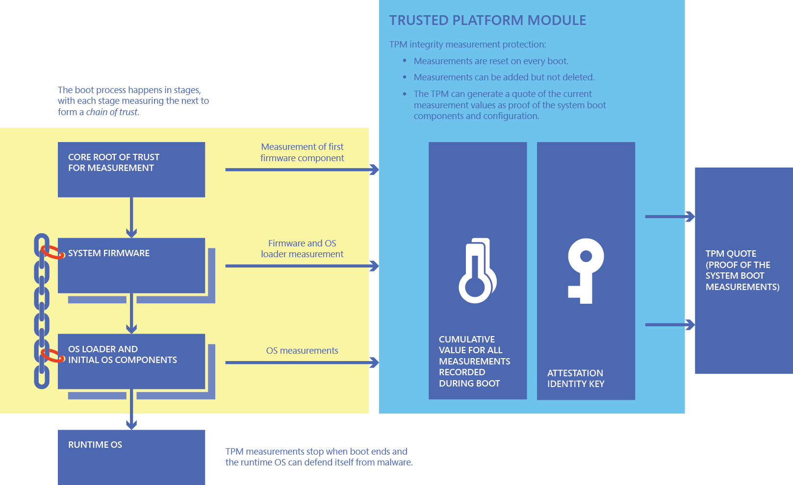

# How Windows 10 uses the Trusted Platform Module

The Windows 10 operating system improves most existing security features in the operating system and adds groundbreaking new security features such as Device Guard and Windows Hello for Business. It places hardware-based security deeper inside the operating system than previous Windows versions had done, maximizing platform security while increasing usability. To achieve many of these security enhancements, Windows 10 makes extensive use of the Trusted Platform Module (TPM). This article offers a brief overview of the TPM, describes how it works, and discusses the benefits that TPM brings to Windows 10—as well as the cumulative security impact of running Windows 10 on a PC that contains a TPM.

**See also:**

   - [Windows 10 Specifications](https://www.microsoft.com/windows/windows-10-specifications)

   - [TPM Fundamentals](tpm-fundamentals.md)

   - [TPM Recommendations](tpm-recommendations.md) 

## TPM Overview

The TPM is a cryptographic module that enhances computer security and privacy. Protecting data through encryption and decryption, protecting authentication credentials, and proving which software is running on a system are basic functionalities associated with computer security. The TPM helps with all these scenarios and more.

Historically, TPMs have been discrete chips soldered to a computer’s motherboard. Such implementations allow the computer’s original equipment manufacturer (OEM) to evaluate and certify the TPM separate from the rest of the system. Although discrete TPM implementations are still common, they can be problematic for integrated devices that are small or have low power consumption. Some newer TPM implementations integrate TPM functionality into the same chipset as other platform components while still providing logical separation similar to discrete TPM chips.

TPMs are passive: they receive commands and return responses. To realize the full benefit of a TPM, the OEM must carefully integrate system hardware and firmware with the TPM to send it commands and react to its responses. TPMs were originally designed to provide security and privacy benefits to a platform’s owner and users, but newer versions can provide security and privacy benefits to the system hardware itself. Before it can be used for advanced scenarios, a TPM must be provisioned. Windows 10 automatically provisions a TPM, but if the user reinstalls the operating system, he or she may need to tell the operating system to explicitly provision the TPM again before it can use all the TPM’s features.

The Trusted Computing Group (TCG) is the nonprofit organization that publishes and maintains the TPM specification. The TCG exists to develop, define, and promote vendor-neutral, global industry standards that support a hardware-based root of trust for interoperable trusted computing platforms. The TCG also publishes the TPM specification as the international standard ISO/IEC 11889, using the Publicly Available Specification Submission Process that the Joint Technical Committee 1 defines between the International Organization for Standardization (ISO) and the International Electrotechnical Commission (IEC).

OEMs implement the TPM as a component in a trusted computing platform, such as a PC, tablet, or phone. Trusted computing platforms use the TPM to support privacy and security scenarios that software alone cannot achieve. For example, software alone cannot reliably report whether malware is present during the system startup process. The close integration between TPM and platform increases the transparency of the startup process and supports evaluating device health by enabling reliable measuring and reporting of the software that starts the device. Implementation of a TPM as part of a trusted computing platform provides a hardware root of trust—that is, it behaves in a trusted way. For example, if a key stored in a TPM has properties that disallow exporting the key, that key *truly cannot leave the TPM*.

The TCG designed the TPM as a low-cost, mass-market security solution that addresses the requirements of different customer segments. There are variations in the security properties of different TPM implementations just as there are variations in customer and regulatory requirements for different sectors. In public-sector procurement, for example, some governments have clearly defined security requirements for TPMs, whereas others do not.

Certification programs for TPMs—and technology in general—continue to evolve as the speed of innovation increases. Although having a TPM is clearly better than not having a TPM, Microsoft’s best advice is to determine your organization’s security needs and research any regulatory requirements associated with procurement for your industry. The result is a balance between scenarios used, assurance level, cost, convenience, and availability.

## TPM in Windows 10

The security features of Windows 10 combined with the benefits of a TPM offer practical security and privacy benefits. The following sections start with major TPM-related security features in Windows 10 and go on to describe how key technologies use the TPM to enable or increase security.

## Platform Crypto Provider

Windows includes a cryptography framework called *Cryptographic API: Next Generation* (CNG), the basic approach of which is to implement cryptographic algorithms in different ways but with a common application programming interface (API). Applications that use cryptography can use the common API without knowing the details of how an algorithm is implemented much less the algorithm itself.

Although CNG sounds like a mundane starting point, it illustrates some of the advantages that a TPM provides. Underneath the CNG interface, Windows or third parties supply a cryptographic provider (that is, an implementation of an algorithm) implemented as software libraries alone or in a combination of software and available system hardware or third-party hardware. If implemented through hardware, the cryptographic provider communicates with the hardware behind the software interface of CNG.

The Platform Crypto Provider, introduced in the Windows 8 operating system, exposes the following special TPM properties, which software-only CNG providers cannot offer or cannot offer as effectively:

•	**Key protection**. The Platform Crypto Provider can create keys in the TPM with restrictions on their use. The operating system can load and use the keys in the TPM without copying the keys to system memory, where they are vulnerable to malware. The Platform Crypto Provider can also configure keys that a TPM protects so that they are not removable. If a TPM creates a key, the key is unique and resides only in that TPM. If the TPM imports a key, the Platform Crypto Provider can use the key in that TPM, but that TPM is not a source for making additional copies of the key or enabling the use of copies elsewhere. In sharp contrast, software solutions that protect keys from copying are subject to reverse-engineering attacks, in which someone figures out how the solution stores keys or makes copies of keys while they are in memory during use.

•	**Dictionary attack protection**. Keys that a TPM protects can require an authorization value such as a PIN. With dictionary attack protection, the TPM can prevent attacks that attempt a large number of guesses to determine the PIN. After too many guesses, the TPM simply returns an error saying no more guesses are allowed for a period of time. Software solutions might provide similar features, but they cannot provide the same level of protection, especially if the system restarts, the system clock changes, or files on the hard disk that count failed guesses are rolled back. In addition, with dictionary attack protection, authorization values such as PINs can be shorter and easier to remember while still providing the same level of protection as more complex values when using software solutions.

These TPM features give Platform Crypto Provider distinct advantages over software-based solutions. A practical way to see these benefits in action is when using certificates on a Windows 10 device. On platforms that include a TPM, Windows can use the Platform Crypto Provider to provide certificate storage. Certificate templates can specify that a TPM use the Platform Crypto Provider to protect the key associated with a certificate. In mixed environments, where some computers might not have a TPM, the certificate template could simply prefer the Platform Crypto Provider over the standard Windows software provider. If a certificate is configured as not able to be exported, the private key for the certificate is restricted and cannot be exported from the TPM. If the certificate requires a PIN, the PIN gains the TPM’s dictionary attack protection automatically.

## Virtual Smart Card

Smart cards are highly secure physical devices that typically store a single certificate and the corresponding private key. Users insert a smart card into a built-in or USB card reader and enter a PIN to unlock it. Windows can then access the card’s certificate and use the private key for authentication or to unlock BitLocker protected data volumes. Smart cards are popular because they provide two-factor authentication that requires both something the user has (that is, the smart card) and something the user knows (such as the smart card PIN). Smart cards are difficult to use, however, because they require purchase and deployment of both smart cards and smart card readers.

In Windows, the Virtual Smart Card feature allows the TPM to mimic a permanently inserted smart card. The TPM becomes “something the user has” but still requires a PIN. Although physical smart cards limit the number of PIN attempts before locking the card and requiring a reset, a virtual smart card relies on the TPM’s dictionary attack protection to prevent too many PIN guesses.

For TPM-based virtual smart cards, the TPM protects the use and storage of the certificate private key so that it cannot be copied when it is in use or stored and used elsewhere. Using a component that is part of the system rather than a separate physical smart card can reduce total cost of ownership because it eliminates “lost card” and “card left at home” scenarios while still delivering the benefits of smart card–based multifactor authentication. For users, virtual smart cards are simple to use, requiring only a PIN to unlock. Virtual smart cards support the same scenarios that physical smart cards support, including signing in to Windows or authenticating for resource access.

## Windows Hello for Business

Windows Hello for Business provides authentication methods intended to replace passwords, which can be difficult to remember and easily compromised. In addition, user name - password solutions for authentication often reuse the same user name – password combinations on multiple devices and services; if those credentials are compromised, they are compromised in many places. Windows Hello for Business provisions devices one by one and combines the information provisioned on each device (i.e., the cryptographic key) with additional information to authenticate users. On a system that has a TPM, the TPM can protect the key. If a system does not have a TPM, software-based techniques protect the key. The additional information the user supplies can be a PIN value or, if the system has the necessary hardware, biometric information, such as fingerprint or facial recognition. To protect privacy, the biometric information is used only on the provisioned device to access the provisioned key: it is not shared across devices.

The adoption of new authentication technology requires that identity providers and organizations deploy and use that technology. Windows Hello for Business lets users authenticate with their existing Microsoft account, an Active Directory account, a Microsoft Azure Active Directory account, or even non-Microsoft Identity Provider Services or Relying Party Services that support [Fast ID Online V2.0 authentication](https://go.microsoft.com/fwlink/p/?LinkId=533889).

Identity providers have flexibility in how they provision credentials on client devices. For example, an organization might provision only those devices that have a TPM so that the organization knows that a TPM protects the credentials. The ability to distinguish a TPM from malware acting like a TPM requires the following TPM capabilities (see Figure 1):

•	**Endorsement key**. The TPM manufacturer can create a special key in the TPM called an *endorsement key*. An endorsement key certificate, signed by the manufacturer, says that the endorsement key is present in a TPM that the manufacturer made. Solutions can use the certificate with the TPM containing the endorsement key to confirm a scenario really involves a TPM from a specific TPM manufacturer (instead of malware acting like a TPM.

•	**Attestation identity key**. To protect privacy, most TPM scenarios do not directly use an actual endorsement key. Instead, they use attestation identity keys, and an identity certificate authority (CA) uses the endorsement key and its certificate to prove that one or more attestation identity keys actually exist in a real TPM. The identity CA issues attestation identity key certificates. More than one identity CA will generally see the same endorsement key certificate that can uniquely identify the TPM, but any number of attestation identity key certificates can be created to limit the information shared in other scenarios.

*Figure 1:  TPM Cryptographic Key Management*

For Windows Hello for Business, Microsoft can fill the role of the identity CA. Microsoft services can issue an attestation identity key certificate for each device, user, and identify provider to ensure that privacy is protected and to help identity providers ensure that device TPM requirements are met before Windows Hello for Business credentials are provisioned.

## BitLocker Drive Encryption

BitLocker provides full-volume encryption to protect data at rest. The most common device configuration splits the hard drive into several volumes. The operating system and user data reside on one volume that holds confidential information, and other volumes hold public information such as boot components, system information and recovery tools. (These other volumes are used infrequently enough that they do not need to be visible to users.) Without additional protections in place, if the volume containing the operating system and user data is not encrypted, someone can boot another operating system and easily bypass the intended operating system’s enforcement of file permissions to read any user data.

In the most common configuration, BitLocker encrypts the operating system volume so that if the computer or hard disk is lost or stolen when powered off, the data on the volume remains confidential. When the computer is turned on, starts normally, and proceeds to the Windows logon prompt, the only path forward is for the user to log on with his or her credentials, allowing the operating system to enforce its normal file permissions. If something about the boot process changes, however—for example, a different operating system is booted from a USB device—the operating system volume and user data cannot be read and are not accessible. The TPM and system firmware collaborate to record measurements of how the system started, including loaded software and configuration details such as whether boot occurred from the hard drive or a USB device. BitLocker relies on the TPM to allow the use of a key only when startup occurs in an expected way. The system firmware and TPM are carefully designed to work together to provide the following capabilities:

•	**Hardware root of trust for measurement**. A TPM allows software to send it commands that record measurements of software or configuration information. This information can be calculated using a hash algorithm that essentially transforms a lot of data into a small, statistically unique hash value. The system firmware has a component called the Core Root of Trust for Measurement (CRTM) that is implicitly trusted. The CRTM unconditionally hashes the next software component and records the measurement value by sending a command to the TPM. Successive components, whether system firmware or operating system loaders, continue the process by measuring any software components they load before running them. Because each component’s measurement is sent to the TPM before it runs, a component cannot erase its measurement from the TPM. (However, measurements are erased when the system is restarted.) The result is that at each step of the system startup process, the TPM holds measurements of boot software and configuration information. Any changes in boot software or configuration yield different TPM measurements at that step and later steps. Because the system firmware unconditionally starts the measurement chain, it provides a hardware-based root of trust for the TPM measurements. At some point in the startup process, the value of recording all loaded software and configuration information diminishes and the chain of measurements stops. The TPM allows for the creation of keys that can be used only when the platform configuration registers that hold the measurements have specific values.

•	**Key used only when boot measurements are accurate**. BitLocker creates a key in the TPM that can be used only when the boot measurements match an expected value. The expected value is calculated for the step in the startup process when Windows Boot Manager runs from the operating system volume on the system hard drive. Windows Boot Manager, which is stored unencrypted on the boot volume, needs to use the TPM key so that it can decrypt data read into memory from the operating system volume and startup can proceed using the encrypted operating system volume. If a different operating system is booted or the configuration is changed, the measurement values in the TPM will be different, the TPM will not let Windows Boot Manager use the key, and the startup process cannot proceed normally because the data on the operating system cannot be decrypted. If someone tries to boot the system with a different operating system or a different device, the software or configuration measurements in the TPM will be wrong and the TPM will not allow use of the key needed to decrypt the operating system volume. As a failsafe, if measurement values change unexpectedly, the user can always use the BitLocker recovery key to access volume data. Organizations can configure BitLocker to store the recovery key in Active Directory Domain Services (AD DS).

Device hardware characteristics are important to BitLocker and its ability to protect data. One consideration is whether the device provides attack vectors when the system is at the logon screen. For example, if the Windows device has a port that allows direct memory access so that someone can plug in hardware and read memory, an attacker can read the operating system volume’s decryption key from memory while at the Windows logon screen. To mitigate this risk, organizations can configure BitLocker so that the TPM key requires both the correct software measurements and an authorization value. The system startup process stops at Windows Boot Manager, and the user is prompted to enter the authorization value for the TPM key or insert a USB device with the value. This process stops BitLocker from automatically loading the key into memory where it might be vulnerable, but has a less desirable user experience.

Newer hardware and Windows 10 work better together to disable direct memory access through ports and reduce attack vectors. The result is that organizations can deploy more systems without requiring users to enter additional authorization information during the startup process. The right hardware allows BitLocker to be used with the “TPM-only” configuration giving users a single sign-on experience without having to enter a PIN or USB key during boot.

## Device Encryption

Device Encryption is the consumer version of BitLocker, and it uses the same underlying technology. How it works is if a customer logs on with a Microsoft account and the system meets Modern Standby hardware requirements, BitLocker Drive Encryption is enabled automatically in Windows 10. The recovery key is backed up in the Microsoft cloud and is accessible to the consumer through his or her Microsoft account. The Modern Standby hardware requirements inform Windows 10 that the hardware is appropriate for deploying Device Encryption and allows use of the “TPM-only” configuration for a simple consumer experience. In addition, Modern Standby hardware is designed to reduce the likelihood that measurement values change and prompt the customer for the recovery key.

For software measurements, Device Encryption relies on measurements of the authority providing software components (based on code signing from manufacturers such as OEMs or Microsoft) instead of the precise hashes of the software components themselves. This permits servicing of components without changing the resulting measurement values. For configuration measurements, the values used are based on the boot security policy instead of the numerous other configuration settings recorded during startup. These values also change less frequently. The result is that Device Encryption is enabled on appropriate hardware in a user-friendly way while also protecting data.

## Measured Boot

Windows 8 introduced Measured Boot as a way for the operating system to record the chain of measurements of software components and configuration information in the TPM through the initialization of the Windows operating system. In previous Windows versions, the measurement chain stopped at the Windows Boot Manager component itself, and the measurements in the TPM were not helpful for understanding the starting state of Windows.

The Windows boot process happens in stages and often involves third-party drivers to communicate with vendor-specific hardware or implement antimalware solutions. For software, Measured Boot records measurements of the Windows kernel, Early-Launch Anti-Malware drivers, and boot drivers in the TPM. For configuration settings, Measured Boot records security-relevant information such as signature data that antimalware drivers use and configuration data about Windows security features (e.g., whether BitLocker is on or off).

Measured Boot ensures that TPM measurements fully reflect the starting state of Windows software and configuration settings. If security settings and other protections are set up correctly, they can be trusted to maintain the security of the running operating system thereafter. Other scenarios can use the operating system’s starting state to determine whether the running operating system should be trusted.

TPM measurements are designed to avoid recording any privacy-sensitive information as a measurement. As an additional privacy protection, Measured Boot stops the measurement chain at the initial starting state of Windows. Therefore, the set of measurements does not include details about which applications are in use or how Windows is being used. Measurement information can be shared with external entities to show that the device is enforcing adequate security policies and did not start with malware.

The TPM provides the following way for scenarios to use the measurements recorded in the TPM during boot:

•	**Remote Attestation**.  Using an attestation identity key, the TPM can generate and cryptographically sign a statement (or*quote*) of the current measurements in the TPM. Windows 10 can create unique attestation identity keys for various scenarios to prevent separate evaluators from collaborating to track the same device. Additional information in the quote is cryptographically scrambled to limit information sharing and better protect privacy. By sending the quote to a remote entity, a device can attest which software and configuration settings were used to boot the device and initialize the operating system. An attestation identity key certificate can provide further assurance that the quote is coming from a real TPM. Remote attestation is the process of recording measurements in the TPM, generating a quote, and sending the quote information to another system that evaluates the measurements to establish trust in a device. Figure 2 illustrates this process.

When new security features are added to Windows, Measured Boot adds security-relevant configuration information to the measurements recorded in the TPM. Measured Boot enables remote attestation scenarios that reflect the system firmware and the Windows initialization state.

*Figure 2:  Process used to create evidence of boot software and configuration using a TPM*

## Health Attestation

Some Windows 10 improvements help security solutions implement remote attestation scenarios. Microsoft provides a Health Attestation service, which can create attestation identity key certificates for TPMs from different manufacturers as well as parse measured boot information to extract simple security assertions, such as whether BitLocker is on or off. The simple security assertions can be used to evaluate device health.

Mobile device management (MDM) solutions can receive simple security assertions from the Microsoft Health Attestation service for a client without having to deal with the complexity of the quote or the detailed TPM measurements. MDM solutions can act on the security information by quarantining unhealthy devices or blocking access to cloud services such as Microsoft Office 365.

## Credential Guard

Credential Guard is a new feature in Windows 10 that helps protect Windows credentials in organizations that have deployed AD DS. Historically, a user’s credentials (e.g., logon password) were hashed to generate an authorization token. The user employed the token to access resources that he or she was permitted to use. One weakness of the token model is that malware that had access to the operating system kernel could look through the computer’s memory and harvest all the access tokens currently in use. The attacker could then use harvested tokens to log on to other machines and collect more credentials. This kind of attack is called a “pass the hash” attack, a malware technique that infects one machine to infect many machines across an organization.

Similar to the way Microsoft Hyper-V keeps virtual machines (VMs) separate from one another, Credential Guard uses virtualization to isolate the process that hashes credentials in a memory area that the operating system kernel cannot access. This isolated memory area is initialized and protected during the boot process so that components in the larger operating system environment cannot tamper with it. Credential Guard uses the TPM to protect its keys with TPM measurements, so they are accessible only during the boot process step when the separate region is initialized; they are not available for the normal operating system kernel. The local security authority code in the Windows kernel interacts with the isolated memory area by passing in credentials and receiving single-use authorization tokens in return.

The resulting solution provides defense in depth, because even if malware runs in the operating system kernel, it cannot access the secrets inside the isolated memory area that actually generates authorization tokens. The solution does not solve the problem of key loggers because the passwords such loggers capture actually pass through the normal Windows kernel, but when combined with other solutions, such as smart cards for authentication, Credential Guard greatly enhances the protection of credentials in Windows 10.

## Conclusion

The TPM adds hardware-based security benefits to Windows 10. When installed on hardware that includes a TPM, Window 10 delivers remarkably improved security benefits. The following table summarizes the key benefits of the TPM’s major features.

|Feature | Benefits when used on a system with a TPM|
|---|---|
| Platform Crypto Provider |  •  &nbsp; &nbsp; If the machine is compromised, the private key associated with the certificate cannot be copied off the device. •	   &nbsp; &nbsp;  The TPM’s dictionary attack mechanism protects PIN values to use a certificate.
| Virtual Smart Card | 	•  &nbsp; &nbsp; Achieve security similar to that of physical smart cards without deploying physical smart cards or card readers.|
| Windows Hello for Business | 	•  &nbsp; &nbsp; Credentials provisioned on a device cannot be copied elsewhere.    •	     &nbsp; &nbsp; Confirm a device’s TPM before credentials are provisioned. |
| BitLocker Drive Encryption | 	•  &nbsp; &nbsp; Multiple options are available for enterprises to protect data at rest while balancing security requirements with different device hardware.
|Device Encryption | 	• &nbsp; &nbsp; With a Microsoft account and the right hardware, consumers’ devices seamlessly benefit from data-at-rest protection.
| Measured Boot | 	•  &nbsp; &nbsp; A hardware root of trust contains boot measurements that help detect malware during remote attestation.
| Health Attestation | 	•  &nbsp; &nbsp; MDM solutions can easily perform remote attestation and evaluate client health before granting access to resources or cloud services such as Office 365.
| Credential Guard | 	•  &nbsp; &nbsp; Defense in depth increases so that even if malware has administrative rights on one machine, it is significantly more difficult to compromise additional machines in an organization.

 

Although some of the aforementioned features have additional hardware requirements (e.g., virtualization support), the TPM is a cornerstone of Windows 10 security. Microsoft and other industry stakeholders continue to improve the global standards associated with TPM and find more and more applications that use it to provide tangible benefits to customers. Microsoft has included support for most TPM features in its version of Windows for the Internet of Things (IoT) called [Windows 10 IoT Core](https://developer.microsoft.com/windows/iot/iotcore).  IoT devices that might be deployed in insecure physical locations and connected to cloud services like [Azure IoT Hub](https://azure.microsoft.com/documentation/services/iot-hub/) for management can use the TPM in innovative ways to address their emerging security requirements.
