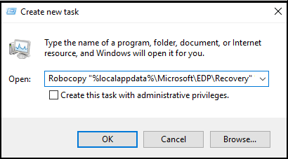

# Create and verify an Encrypting File System (EFS) Data Recovery Agent (DRA) certificate
**Applies to:**

- Windows 10, version 1607 and later
- Windows 10 Mobile, version 1607 and later

If you don’t already have an EFS DRA certificate, you’ll need to create and extract one from your system before you can use Windows Information Protection (WIP), formerly known as enterprise data protection (EDP), in your organization. For the purposes of this section, we’ll use the file name EFSDRA; however, this name can be replaced with anything that makes sense to you.

The recovery process included in this topic only works for desktop devices. WIP deletes the data on Windows 10 Mobile devices.   

>[!IMPORTANT]
>If you already have an EFS DRA certificate for your organization, you can skip creating a new one. Just use your current EFS DRA certificate in your policy. For more info about when to use a PKI and the general strategy you should use to deploy DRA certificates, see the [Security Watch Deploying EFS: Part 1](https://technet.microsoft.com/magazine/2007.02.securitywatch.aspx) article on TechNet. For more general info about EFS protection, see [Protecting Data by Using EFS to Encrypt Hard Drives](https://msdn.microsoft.com/library/cc875821.aspx).  If your DRA certificate has expired, you won’t be able to encrypt your files with it. To fix this, you'll need to create a new certificate, using the steps in this topic, and then deploy it through policy.

## Manually create an EFS DRA certificate

1. On a computer without an EFS DRA certificate installed, open a command prompt with elevated rights, and then navigate to where you want to store the certificate.

2. Run this command:
    
    <code>cipher /r:<i>EFSRA</i></code>
    
    Where *EFSRA* is the name of the .cer and .pfx files that you want to create.

3. When prompted, type and confirm a password to help protect your new Personal Information Exchange (.pfx) file.

    The EFSDRA.cer and EFSDRA.pfx files are created in the location you specified in Step 1.

    >[!Important]
    >Because the private keys in your DRA .pfx files can be used to decrypt any WIP file, you must protect them accordingly. We highly recommend storing these files offline, keeping copies on a smart card with strong protection for normal use and master copies in a secured physical location.

4. Add your EFS DRA certificate to your WIP policy using a deployment tool, such as [Microsoft Intune](create-wip-policy-using-intune-azure.md) or [System Center Configuration Manager](create-wip-policy-using-sccm.md).

## Verify your data recovery certificate is correctly set up on a WIP client computer

1. Find or create a file that's encrypted using Windows Information Protection. For example, you could open an app on your allowed app list, and then create and save a file so it’s encrypted by WIP. 

2. Open an app on your protected app list, and then create and save a file so that it’s encrypted by WIP.

3. Open a command prompt with elevated rights, navigate to where you stored the file you just created, and then run this command:

    <code>cipher /c <i>filename</i></code>

    Where *filename* is the name of the file you created in Step 1.

4. Make sure that your data recovery certificate is listed in the **Recovery Certificates** list.

## Recover your data using the EFS DRA certificate in a test environment

1. Copy your WIP-encrypted file to a location where you have admin access.

2. Install the EFSDRA.pfx file, using its password.

3. Open a command prompt with elevated rights, navigate to the encrypted file, and then run this command:

    <code>cipher /d <i>encryptedfile.extension</i></code>
    
    Where *encryptedfile.extension* is the name of your encrypted file. For example, corporatedata.docx.

## Recover WIP-protected after unenrollment

It's possible that you might revoke data from an unenrolled device only to later want to restore it all. This can happen in the case of a missing device being returned or if an unenrolled employee enrolls again. If the employee enrolls again using the original user profile, and the revoked key store is still on the device, all of the revoked data can be restored at once.

>[!IMPORTANT]
>To maintain control over your enterprise data, and to be able to revoke again in the future, you must only perform this process after the employee has re-enrolled the device. 

1. Have the employee sign in to the unenrolled device, open an elevated command prompt, and type:
   
   <code>Robocopy "%localappdata%\Microsoft\EDP\Recovery" "<i>new_location</i>" * /EFSRAW</code>

   Where "*new_location*" is in a different directory. This can be on the employee’s device or on a shared folder on a computer that runs Windows 8 or Windows Server 2012 or newer and can be accessed while you're logged in as a data recovery agent.

   To start Robocopy in S mode, open Task Manager. Click **File** > **Run new task**, type the command, and click **Create this task with administrative privileges**.
   
   

   If the employee performed a clean installation and there is no user profile, you need to recover the keys from the System Volume folder in each drive. Type: 
    
   <code>Robocopy "<i>drive_letter</i>:\System Volume Information\EDP\Recovery\" "<i>new_location</i>" * /EFSRAW</code>

2. Sign in to a different device with administrator credentials that have access to your organization's DRA certificate, and perform the file decryption and recovery by typing:

   <code>cipher.exe /D "<i>new_location</i>"</code>

3. Have your employee sign in to the unenrolled device, and type:

   <code>Robocopy "<i>new_location</i>" "%localappdata%\Microsoft\EDP\Recovery\Input"</code>

4. Ask the employee to lock and unlock the device.

   The Windows Credential service automatically recovers the employee’s previously revoked keys from the `Recovery\Input` location.

## Auto-recovery of encryption keys
Starting with Windows 10, version 1709, WIP includes a data recovery feature that lets your employees auto-recover access to work files if the encryption key is lost and the files are no longer accessible. This typically happens if an employee reimages the operating system partition, removing the WIP key info, or if a device is reported as lost and you mistakenly target the wrong device for unenrollment.

To help make sure employees can always access files, WIP creates an auto-recovery key that’s backed up to their Azure Active Directory (Azure AD) identity.

The employee experience is based on sign in with an Azure AD work account. The employee can either:

- Add a work account through the **Windows Settings > Accounts > Access work or school > Connect** menu.

    -OR-

- Open **Windows Settings > Accounts > Access work or school > Connect** and choose the **Join this device to Azure Active Directory** link, under **Alternate actions**.

    >[!Note]
    >To perform an Azure AD Domain Join from the Settings page, the employee must have administrator privileges to the device.

After signing in, the necessary WIP key info is automatically downloaded and employees are able to access the files again.

**To test what the employee sees during the WIP key recovery process**
1. Attempt to open a work file on an unenrolled device.

    The **Connect to Work to access work files** box appears.

2. Click **Connect**.

    The **Access work or school settings** page appears.

3. Sign-in to Azure AD as the employee and verify that the files now open

## Related topics
- [Security Watch Deploying EFS: Part 1](https://technet.microsoft.com/magazine/2007.02.securitywatch.aspx)

- [Protecting Data by Using EFS to Encrypt Hard Drives](https://msdn.microsoft.com/library/cc875821.aspx)

- [Create a Windows Information Protection (WIP) policy using Microsoft Intune](create-wip-policy-using-intune-azure.md)

- [Create a Windows Information Protection (WIP) policy using System Center Configuration Manager](create-wip-policy-using-sccm.md)

- [Creating a Domain-Based Recovery Agent](https://msdn.microsoft.com/library/cc875821.aspx#EJAA)

>[!Note]
>Help to make this topic better by providing us with edits, additions, and feedback. For info about how to contribute to this topic, see [Contributing to this article](https://github.com/Microsoft/windows-itpro-docs/blob/master/CONTRIBUTING.md).
