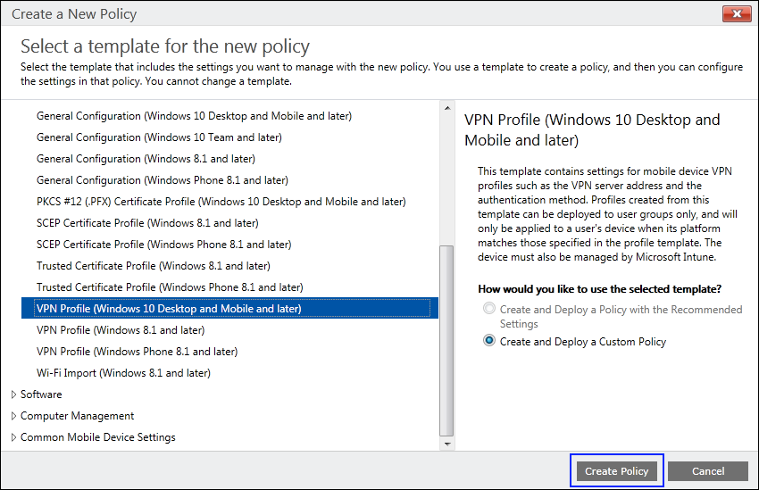
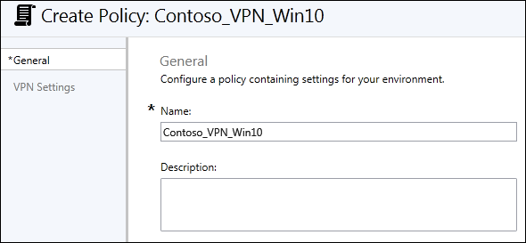
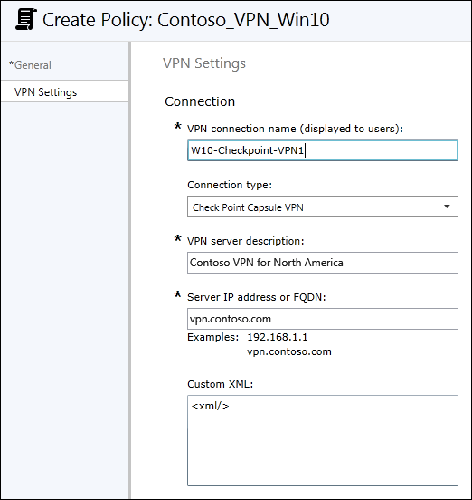
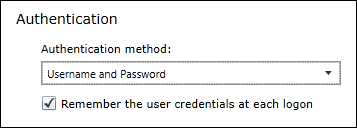
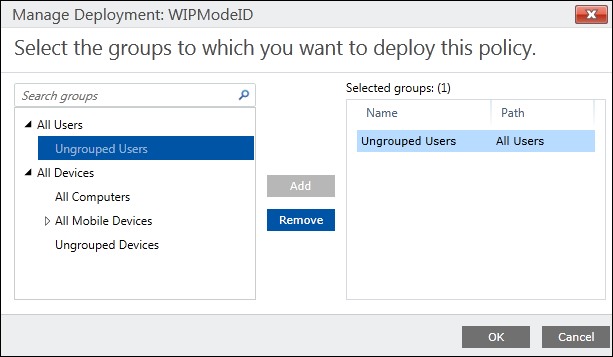

# Associate and deploy a VPN policy for Windows Information Protection (WIP) using the classic console for Microsoft Intune
**Applies to:**

- Windows 10, version 1607 and later
- Windows 10 Mobile, version 1607 and later

After you've created and deployed your Windows Information Protection (WIP) policy, you can use Microsoft Intune to create and deploy your Virtual Private Network (VPN) policy, linking it to your WIP policy.

## Create your VPN policy using Microsoft Intune
Follow these steps to create the VPN policy you want to use with WIP.

**To create your VPN policy**

1.  Open the Intune administration console, and go to the **Policy** node, and then click **Add Policy**.

2.  Go to **Windows**, click the **VPN Profile (Windows 10 Desktop and Mobile and later)**, click **Create and Deploy a Custom Policy**, and then click **Create Policy**.

    

3.  Type *Contoso_VPN_Win10* into the **Name** box, along with an optional description for your policy into the **Description** box.

    

4.  In the **VPN Settings** area, type the following info:

    -   **VPN connection name.** This name is also what appears to your employees, so it's important that it be clear and understandable.

    -   **Connection type.** Pick the connection type that matches your infrastructure. The options are **Pulse Secure**, **F5 Edge Client**, **Dell SonicWALL Mobile Connect**, or **Check Point Capsule VPN**.

    -   **VPN server description.** A descriptive name for this connection. Only you will see it, but it should be unique and readable.

    -   **Server IP address or FQDN.** The server's IP address or fully-qualified domain name (FQDN).

        

5.  In the **Authentication** area, choose the authentication method that matches your VPN infrastructure, either **Username and Password** or **Certificates**.

It's your choice whether you check the box to **Remember the user credentials at each logon**.

    

6.  You can leave the rest of the default or blank settings, and then click **Save Policy**.

## Deploy your VPN policy using Microsoft Intune
After you’ve created your VPN policy, you'll need to deploy it to the same group you deployed your Windows Information Protection (WIP) policy.

**To deploy your VPN policy**

1.  On the **Configuration policies** page, locate your newly-created policy, click to select it, and then click the **Manage Deployment** button.

2.  In the left pane of the **Manage Deployment** box, click the employees or groups that should get the policy, and then click **Add**.

The added people move to the **Selected Groups** list on the right-hand pane.

    

3.  After you've picked all of the employees and groups that should get the policy, click **OK**.

The policy is deployed to the selected users' devices.

## Link your WIP and VPN policies and deploy the custom configuration policy
The final step to making your VPN configuration work with WIP, is to link your two policies together. To do this, you must first create a custom configuration policy, setting it to use your **EDPModeID** setting, and then deploying the policy to the same group you deployed your WIP and VPN policies

**To link your VPN policy**

1.  Open the Intune administration console, and go to the **Policy** node, and then click **Add Policy**.

2.  Go to **Windows**, click the **Custom Configuration (Windows 10 Desktop and Mobile and later)**, click **Create and Deploy a Custom Policy**, and then click **Create Policy**.

    

3.  Type a name (required) and an optional description for your policy into the **Name** and **Description** boxes.

    

4.  In the **OMA-URI Settings** area, click **Add** to add your **EDPModeID** info.

5.  In the **OMA-URI Settings** area, type the following info:

    -   **Setting name.** Type **EDPModeID** as the name.

    -   **Data type.** Pick the **String** data type.

    -   **OMA-URI.** Type `./Vendor/MSFT/VPNv2/<VPNProfileName>/EDPModeId`, replacing &lt;*VPNProfileName*&gt; with the name you gave to your VPN policy. For example, `./Vendor/MSFT/VPNv2/W10-Checkpoint-VPN1/EDPModeId`.

    -   **Value.** Your fully-qualified domain that should be used by the OMA-URI setting.

        

6.  Click **OK** to save your new OMA-URI setting, and then click **Save Policy.**

 **To deploy your linked policy**

1.  On the **Configuration policies** page, locate your newly-created policy, click to select it, and then click the **Manage Deployment** button.

2.  In the left pane of the **Manage Deployment** box, click the employees or groups that should get the policy, and then click **Add**. The added people move to the **Selected Groups** list on the right-hand pane.

    

3.  After you've picked all of the employees and groups that should get the policy, click **OK**. The policy is deployed to the selected users' devices.

>[!NOTE]
>Help to make this topic better by providing us with edits, additions, and feedback. For info about how to contribute to this topic, see [Editing Windows IT professional documentation](https://github.com/Microsoft/windows-itpro-docs/blob/master/CONTRIBUTING.md).

