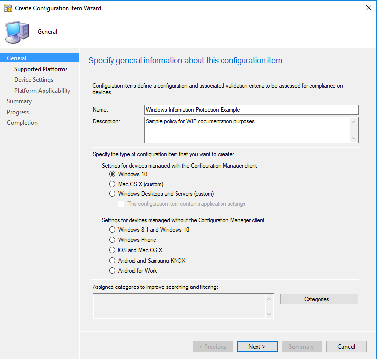
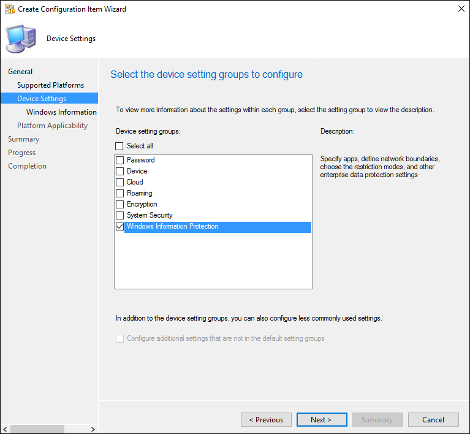
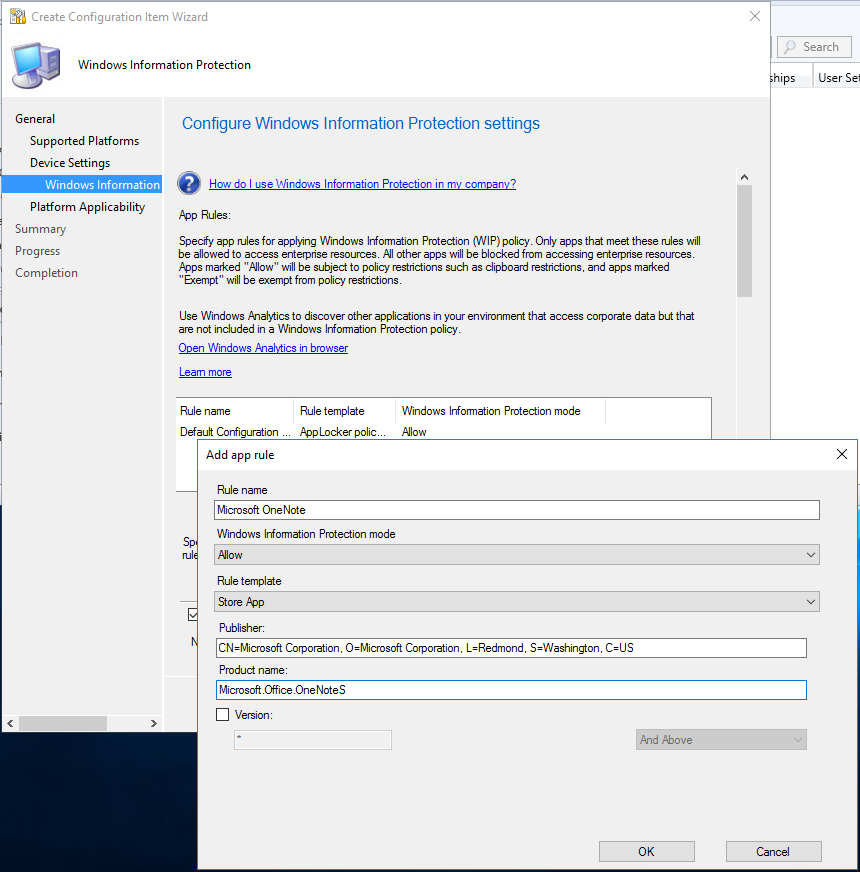
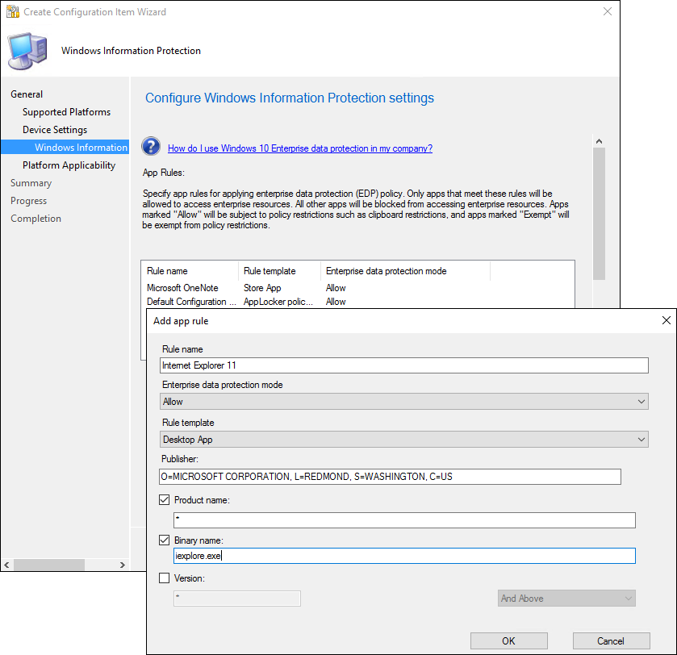
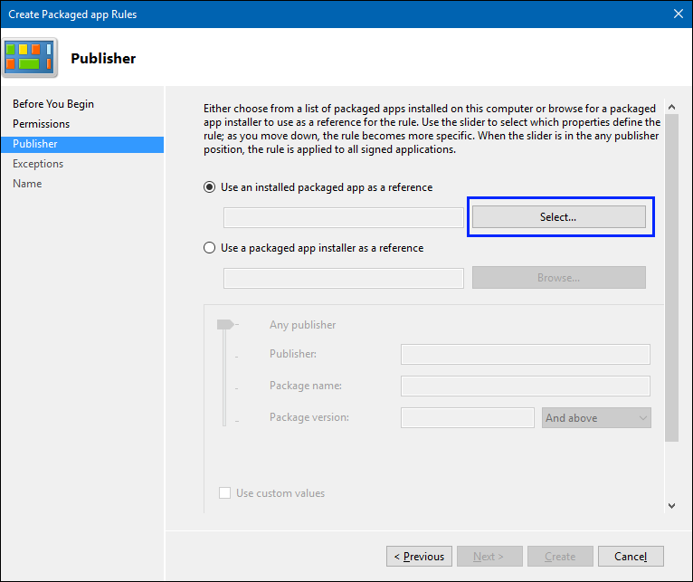
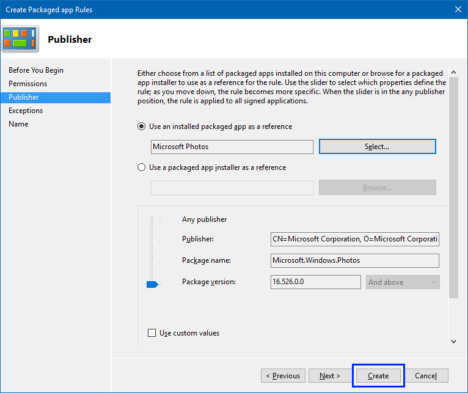
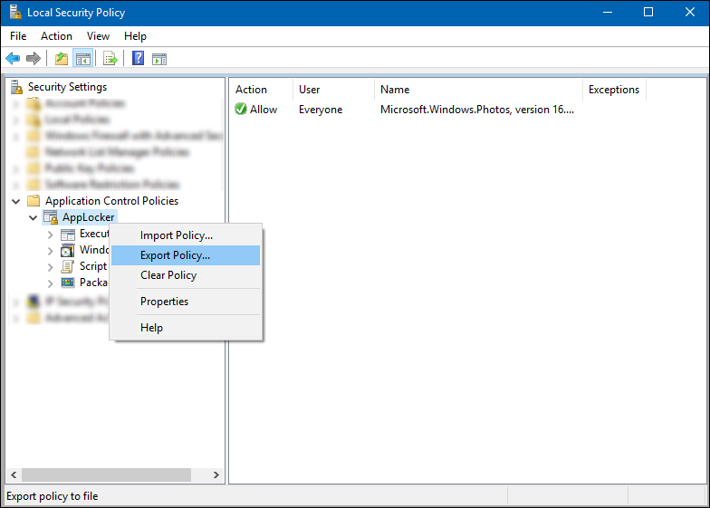
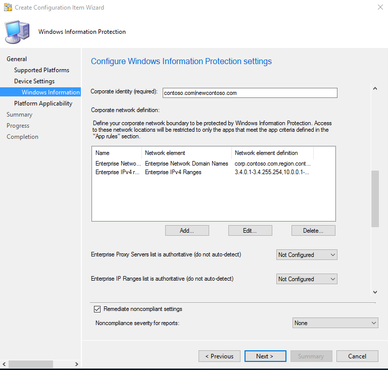

# Create and deploy a Windows Information Protection (WIP) policy using System Center Configuration Manager
**Applies to:**

- Windows 10, version 1607 and later
- Windows 10 Mobile, version 1607 and later
- System Center Configuration Manager

System Center Configuration Manager helps you create and deploy your Windows Information Protection (WIP) policy, including letting you choose your protected apps, your WIP-protection mode, and how to find enterprise data on the network.

## Add a WIP policy
After you’ve installed and set up System Center Configuration Manager for your organization, you must create a configuration item for WIP, which in turn becomes your WIP policy.

**To create a configuration item for WIP**

1.  Open the System Center Configuration Manager console, click the **Assets and Compliance** node, expand the **Overview** node, expand the **Compliance Settings** node, and then expand the **Configuration Items** node.

    

2.  Click the **Create Configuration Item** button.<p>
The **Create Configuration Item Wizard** starts.

    

3.  On the **General Information screen**, type a name (required) and an optional description for your policy into the **Name** and **Description** boxes.

4.  In the **Specify the type of configuration item you want to create** area, pick the option that represents whether you use System Center Configuration Manager for device management, and then click **Next**.

    -   **Settings for devices managed with the Configuration Manager client:** Windows 10

        -OR-

    -   **Settings for devices managed without the Configuration Manager client:** Windows 8.1 and Windows 10

5.  On the **Supported Platforms** screen, click the **Windows 10** box, and then click **Next**.

    

6.  On the **Device Settings** screen, click **Windows Information Protection**, and then click **Next**.

    

The **Configure Windows Information Protection settings** page appears, where you'll configure your policy for your organization.

## Add app rules to your policy
During the policy-creation process in System Center Configuration Manager, you can choose the apps you want to give access to your enterprise data through WIP. Apps included in this list can protect data on behalf of the enterprise and are restricted from copying or moving enterprise data to unprotected apps.

The steps to add your app rules are based on the type of rule template being applied. You can add a store app (also known as a Universal Windows Platform (UWP) app), a signed Windows desktop app, or an AppLocker policy file.

>[!IMPORTANT]
>Enlightened apps are expected to prevent enterprise data from going to unprotected network locations and to avoid encrypting personal data. On the other hand, WIP-unaware apps might not respect the corporate network boundary, and WIP-unaware apps will encrypt all files they create or modify. This means that they could encrypt personal data and cause data loss during the revocation process.<p>Care must be taken to get a support statement from the software provider that their app is safe with WIP before adding it to your **App rules** list. If you don’t get this statement, it’s possible that you could experience app compat issues due to an app losing the ability to access a necessary file after revocation.

### Add a store app rule to your policy
For this example, we’re going to add Microsoft OneNote, a store app, to the **App Rules** list.

**To add a store app**

1.  From the **App rules** area, click **Add**.

    The **Add app rule** box appears.

    

2.  Add a friendly name for your app into the **Title** box. In this example, it’s *Microsoft OneNote*.

3.  Click **Allow** from the **Windows Information Protection mode** drop-down list.

    Allow turns on WIP, helping to protect that app’s corporate data through the enforcement of WIP restrictions. If you want to exempt an app, you can follow the steps in the [Exempt apps from WIP restrictions](#exempt-apps-from-wip-restrictions) section.

4.  Pick **Store App** from the **Rule template** drop-down list.

    The box changes to show the store app rule options.

5.  Type the name of the app and the name of its publisher, and then click **OK**. For this UWP app example, the **Publisher** is `CN=Microsoft Corporation, O=Microsoft Corporation, L=Redmond, S=Washington, C=US` and the **Product name** is `Microsoft.Office.OneNote`.

If you don't know the publisher or product name, you can find them for both desktop devices and Windows 10 Mobile phones by following these steps.

**To find the Publisher and Product Name values for Store apps without installing them**

1. Go to the [Microsoft Store for Business](https://businessstore.microsoft.com/store) website, and find your app. For example, Microsoft OneNote.

   > [!NOTE]
   > 
   > If your app is already installed on desktop devices, you can use the AppLocker local security policy MMC snap-in to gather the info for adding the app to the protected apps list. For info about how to do this, see the steps in the [Add an AppLocker policy file](#add-an-applocker-policy-file) section.

2. Copy the ID value from the app URL. For example, Microsoft OneNote's ID URL is https://www.microsoft.com/store/apps/onenote/9wzdncrfhvjl, and you'd copy the ID value, `9wzdncrfhvjl`.

3. In a browser, run the Store for Business portal web API, to return a JavaScript Object Notation (JSON) file that includes the publisher and product name values. For example, run https://bspmts.mp.microsoft.com/v1/public/catalog/Retail/Products/9wzdncrfhvjl/applockerdata, where `9wzdncrfhvjl` is replaced with your ID value.

   The API runs and opens a text editor with the app details.

   ``` json
       {
       "packageIdentityName": "Microsoft.Office.OneNote",
       "publisherCertificateName": "CN=Microsoft Corporation, O=Microsoft Corporation, L=Redmond, S=Washington, C=US"
       }
   ```

4. Copy the `publisherCertificateName` value and paste them into the **Publisher Name** box, copy the `packageIdentityName` value into the **Product Name** box of Intune.

   > [!IMPORTANT]
   > The JSON file might also return a `windowsPhoneLegacyId` value for both the **Publisher Name** and **Product Name** boxes. This means that you have an app that’s using a XAP package and that you must set the **Product Name** as `windowsPhoneLegacyId`, and set the **Publisher Name** as “CN=” followed by the `windowsPhoneLegacyId`.<p>For example:<p>
   > ```json
   >     {
   >         "windowsPhoneLegacyId": "ca05b3ab-f157-450c-8c49-a1f127f5e71d",
   >     }
   > ```

**To find the Publisher and Product Name values for apps installed on Windows 10 mobile phones**
1. If you need to add mobile apps that aren't distributed through the Store for Business, you must use the **Windows Device Portal** feature.

   >[!NOTE]
   >Your PC and phone must be on the same wireless network.

2. On the Windows Phone, go to **Settings**, choose **Update & security**, and then choose **For developers**.

3. On the **For developers** screen, turn on **Developer mode**, turn on **Device Discovery**, and then turn on **Device Portal**.

4. Copy the URL in the **Device Portal** area into your device's browser, and then accept the SSL certificate.

5. In the **Device discovery** area, press **Pair**, and then enter the PIN into the website from the previous step.

6. On the **Apps** tab of the website, you can see details for the running apps, including the publisher and product names.

7. Start the app for which you're looking for the publisher and product name values.

8. Copy the `publisherCertificateName` value and paste it into the **Publisher Name** box and the `packageIdentityName` value into the **Product Name** box of Intune.

   > [!IMPORTANT]
   > The JSON file might also return a `windowsPhoneLegacyId` value for both the **Publisher Name** and **Product Name** boxes. This means that you have an app that’s using a XAP package and that you must set the **Product Name** as `windowsPhoneLegacyId`, and set the **Publisher Name** as “CN=” followed by the `windowsPhoneLegacyId`.
   > For example:<p>
   > ```json
   >     {
   >         "windowsPhoneLegacyId": "ca05b3ab-f157-450c-8c49-a1f127f5e71d",
   >     }
   > ```

### Add a desktop app rule to your policy
For this example, we’re going to add Internet Explorer, a desktop app, to the **App Rules** list.

**To add a desktop app to your policy**
1.  From the **App rules** area, click **Add**.

    The **Add app rule** box appears.

    

2.  Add a friendly name for your app into the **Title** box. In this example, it’s *Internet Explorer*.

3.  Click **Allow** from the **Windows Information Protection mode** drop-down list.

    Allow turns on WIP, helping to protect that app’s corporate data through the enforcement of WIP restrictions. If you want to exempt an app, you can follow the steps in the [Exempt apps from WIP restrictions](#exempt-apps-from-wip-restrictions) section.

4.  Pick **Desktop App** from the **Rule template** drop-down list.

    The box changes to show the desktop app rule options.

5.  Pick the options you want to include for the app rule (see table), and then click **OK**.

    <table>
        <tr>
            <th>Option</th>
            <th>Manages</th>
        </tr>
        <tr>
            <td>All fields left as “*”</td>
            <td>All files signed by any publisher. (Not recommended.)</td>
        </tr>
        <tr>
            <td><strong>Publisher</strong> selected</td>
            <td>All files signed by the named publisher.<p>This might be useful if your company is the publisher and signer of internal line-of-business apps.</td>
        </tr>
        <tr>
            <td><strong>Publisher</strong> and <strong>Product Name</strong> selected</td>
            <td>All files for the specified product, signed by the named publisher.</td>
        </tr>
        <tr>
            <td><strong>Publisher</strong>, <strong>Product Name</strong>, and <strong>Binary name</strong> selected</td>
            <td>Any version of the named file or package for the specified product, signed by the named publisher.</td>
        </tr>
        <tr>
            <td><strong>Publisher</strong>, <strong>Product Name</strong>, <strong>Binary name</strong>, and <strong>File Version, and above</strong>, selected</td>
            <td>Specified version or newer releases of the named file or package for the specified product, signed by the named publisher.<p>This option is recommended for enlightened apps that weren't previously enlightened.</td>
        </tr>
        <tr>
            <td><strong>Publisher</strong>, <strong>Product Name</strong>, <strong>Binary name</strong>, and <strong>File Version, And below</strong> selected</td>
            <td>Specified version or older releases of the named file or package for the specified product, signed by the named publisher.</td>
        </tr>
        <tr>
            <td><strong>Publisher</strong>, <strong>Product Name</strong>, <strong>Binary name</strong>, and <strong>File Version, Exactly</strong> selected</td>
            <td>Specified version of the named file or package for the specified product, signed by the named publisher.</td>
        </tr>
    </table>

If you’re unsure about what to include for the publisher, you can run this PowerShell command:

```ps1
Get-AppLockerFileInformation -Path "<path of the exe>"
```
Where `"<path of the exe>"` goes to the location of the app on the device. For example, `Get-AppLockerFileInformation -Path "C:\Program Files\Internet Explorer\iexplore.exe"`.

In this example, you'd get the following info:

``` json
Path                   Publisher
----                   ---------
%PROGRAMFILES%\INTERNET EXPLORER\IEXPLORE.EXE O=MICROSOFT CORPORATION, L=REDMOND, S=WASHINGTON, C=US\INTERNET EXPLOR...
```
Where the text, `O=MICROSOFT CORPORATION, L=REDMOND, S=WASHINGTON, C=US` is the publisher name to enter in the **Publisher Name** box.

### Add an AppLocker policy file
For this example, we’re going to add an AppLocker XML file to the **App Rules** list. You’ll use this option if you want to add multiple apps at the same time. For more info about AppLocker, see the [AppLocker](https://technet.microsoft.com/itpro/windows/keep-secure/applocker-overview) content.

**To create an app rule and xml file using the AppLocker tool**
1.  Open the Local Security Policy snap-in (SecPol.msc).

2.  In the left pane, expand **Application Control Policies**, expand **AppLocker**, and then click **Packaged App Rules**.

    

3.  Right-click in the right-hand pane, and then click **Create New Rule**.

    The **Create Packaged app Rules** wizard appears.

4. On the **Before You Begin** page, click **Next**.

    

5. On the **Permissions** page, make sure the **Action** is set to **Allow** and the **User or group** is set to **Everyone**, and then click **Next**.

    

6.  On the **Publisher** page, click **Select** from the **Use an installed packaged app as a reference** area.

    

7. In the **Select applications** box, pick the app that you want to use as the reference for your rule, and then click **OK**. For this example, we’re using Microsoft Photos.

    

8. On the updated **Publisher** page, click **Create**.

    

9. Review the Local Security Policy snap-in to make sure your rule is correct.

    

10. In the left pane, right-click on **AppLocker**, and then click **Export policy**.

    The **Export policy** box opens, letting you export and save your new policy as XML.

    

11. In the **Export policy** box, browse to where the policy should be stored, give the policy a name, and then click **Save**.

    The policy is saved and you’ll see a message that says 1 rule was exported from the policy.

    **Example XML file**<br>
    This is the XML file that AppLocker creates for Microsoft Photos.

    ```xml
     <AppLockerPolicy Version="1">
        <RuleCollection Type="Exe" EnforcementMode="NotConfigured" />
        <RuleCollection Type ="Msi" EnforcementMode="NotConfigured" />
        <RuleCollection Type ="Script" EnforcementMode="NotConfigured" />
        <RuleCollection Type ="Dll" EnforcementMode="NotConfigured" />
        <RuleCollection Type ="Appx" EnforcementMode="NotConfigured">
            <FilePublisherRule Id="5e0c752b-5921-4f72-8146-80ad5f582110" Name="Microsoft.Windows.Photos, version 16.526.0.0 and above, from Microsoft Corporation" Description="" UserOrGroupSid="S-1-1-0" Action="Allow">
                <Conditions>
                    <FilePublisherCondition PublisherName="CN=Microsoft Corporation, O=Microsoft Corporation, L=Redmond, S=Washington, C=US" ProductName="Microsoft.Windows.Photos" BinaryName="*">
                        <BinaryVersionRange LowSection="16.526.0.0" HighSection="*" />
                    </FilePublisherCondition>
                </Conditions>
            </FilePublisherRule>
        </RuleCollection>
    </AppLockerPolicy>
    ```
12. After you’ve created your XML file, you need to import it by using System Center Configuration Manager.

**To import your Applocker policy file app rule using System Center Configuration Manager**
1.  From the **App rules** area, click **Add**.

    The **Add app rule** box appears.

    

2.  Add a friendly name for your app into the **Title** box. In this example, it’s *Allowed app list*.

3.  Click **Allow** from the **Windows Information Protection mode** drop-down list.

    Allow turns on WIP, helping to protect that app’s corporate data through the enforcement of WIP restrictions. If you want to exempt an app, you can follow the steps in the [Exempt apps from WIP restrictions](#exempt-apps-from-wip-restrictions) section.

4.  Pick the **AppLocker policy file** from the **Rule template** drop-down list.

    The box changes to let you import your AppLocker XML policy file.

5. Click the ellipsis (...) to browse for your AppLocker XML file, click **Open**, and then click **OK** to close the **Add app rule** box.

    The file is imported and the apps are added to your **App Rules** list.

### Exempt apps from WIP restrictions
If you're running into compatibility issues where your app is incompatible with WIP, but still needs to be used with enterprise data, you can exempt the app from the WIP restrictions. This means that your apps won't include auto-encryption or tagging and won't honor your network restrictions. It also means that your exempted apps might leak.

**To exempt a store app, a desktop app, or an AppLocker policy file app rule**

1.  From the **App rules** area, click **Add**.

    The **Add app rule** box appears.

2.  Add a friendly name for your app into the **Title** box. In this example, it’s *Exempt apps list*.

3.  Click **Exempt** from the **Windows Information Protection mode** drop-down list.

    Be aware that when you exempt apps, they’re allowed to bypass the WIP restrictions and access your corporate data. To allow apps, see the [Add app rules to your policy](#add-app-rules-to-your-policy) section of this topic.

4.  Fill out the rest of the app rule info, based on the type of rule you’re adding:

    - **Store app.** Follow the **Publisher** and **Product name** instructions in the [Add a store app rule to your policy](#add-a-store-app-rule-to-your-policy) section of this topic.

    - **Desktop app.** Follow the **Publisher**, **Product name**, **Binary name**, and **Version** instructions in the [Add a desktop app rule to your policy](#add-a-desktop-app-rule-to-your-policy) section of this topic.

    - **AppLocker policy file.** Follow the **Import** instructions in the [Add an AppLocker policy file](#add-an-applocker-policy-file) section of this topic, using a list of exempted apps.

5.  Click **OK**.

## Manage the WIP-protection level for your enterprise data
After you've added the apps you want to protect with WIP, you'll need to apply a management and protection mode.

We recommend that you start with **Silent** or **Override** while verifying with a small group that you have the right apps on your protected apps list. After you're done, you can change to your final enforcement policy, either **Override** or **Block**.

>[!NOTE]
>For info about how to collect your audit log files, see [How to collect Windows Information Protection (WIP) audit event logs](collect-wip-audit-event-logs.md).

|Mode |Description |
|-----|------------|
|Block |WIP looks for inappropriate data sharing practices and stops the employee from completing the action. This can include sharing info across non-enterprise-protected apps in addition to sharing enterprise data between other people and devices outside of your enterprise.|
|Override |WIP looks for inappropriate data sharing, warning employees if they do something deemed potentially unsafe. However, this management mode lets the employee override the policy and share the data, logging the action to your audit log. |
|Silent |WIP runs silently, logging inappropriate data sharing, without blocking anything that would’ve been prompted for employee interaction while in Override mode. Unallowed actions, like apps inappropriately trying to access a network resource or WIP-protected data, are still blocked.|
|Off (not recommended) |WIP is turned off and doesn't help to protect or audit your data.<p>After you turn off WIP, an attempt is made to decrypt any WIP-tagged files on the locally attached drives. Be aware that your previous decryption and policy info isn’t automatically reapplied if you turn WIP protection back on.|


## Define your enterprise-managed identity domains
Corporate identity, usually expressed as your primary internet domain (for example, contoso.com), helps to identify and tag your corporate data from apps you’ve marked as protected by WIP. For example, emails using contoso.com are identified as being corporate and are restricted by your Windows Information Protection policies.

You can specify multiple domains owned by your enterprise by separating them with the "|" character. For example, (contoso.com|newcontoso.com). With multiple domains, the first one is designated as your corporate identity and all of the additional ones as being owned by the first one. We strongly recommend that you include all of your email address domains in this list.

**To add your corporate identity**

- Type the name of your corporate identity into the **Corporate identity** field. For example, `contoso.com` or `contoso.com|newcontoso.com`.

    

## Choose where apps can access enterprise data
After you've added a protection mode to your apps, you'll need to decide where those apps can access enterprise data on your network.

There are no default locations included with WIP, you must add each of your network locations. This area applies to any network endpoint device that gets an IP address in your enterprise’s range and is also bound to one of your enterprise domains, including SMB shares. Local file system locations should just maintain encryption (for example, on local NTFS, FAT, ExFAT).

>[!IMPORTANT]
>Every WIP policy should include policy that defines your enterprise network locations.<br>
>Classless Inter-Domain Routing (CIDR) notation isn’t supported for WIP configurations.

**To define where your protected apps can find and send enterprise data on you network**

1. Add additional network locations your apps can access by clicking **Add**.

    The **Add or edit corporate network definition** box appears.

2. Type a name for your corporate network element into the **Name** box, and then pick what type of network element it is, from the **Network element** drop-down box. This can include any of the options in the following table.

   

   <table>
       <tr>
           <th>Network location type</th>
           <th>Format</th>
           <th>Description</th>
       </tr>
       <tr>
           <td>Enterprise Cloud Resources</td>
           <td><strong>With proxy:</strong> contoso.sharepoint.com,contoso.internalproxy1.com|<br>contoso.visualstudio.com,contoso.internalproxy2.com<p><strong>Without proxy:</strong> contoso.sharepoint.com|contoso.visualstudio.com</td>
           <td>Specify the cloud resources to be treated as corporate and protected by WIP.<p>For each cloud resource, you may also optionally specify a proxy server from your Internal proxy servers list to route traffic for this cloud resource. Be aware that all traffic routed through your Internal proxy servers is considered enterprise.<p>If you have multiple resources, you must separate them using the &quot;|&quot; delimiter. If you don’t use proxy servers, you must also include the &quot;,&quot; delimiter just before the &quot;|&quot;. For example: <code>URL &lt;,proxy&gt;|URL &lt;,proxy&gt;</code>.<p><strong>Important</strong><br>In some cases, such as when an app connects directly to a cloud resource through an IP address, Windows can’t tell whether it’s attempting to connect to an enterprise cloud resource or to a personal site. In this case, Windows blocks the connection by default. To stop Windows from automatically blocking these connections, you can add the <code>/&#42;AppCompat&#42;/</code> string to the setting. For example: <code>URL &lt;,proxy&gt;|URL &lt;,proxy&gt;|/&#42;AppCompat&#42;/</code>.</td>
       </tr>
       <tr>
           <td>Enterprise Network Domain Names (Required)</td>
           <td>corp.contoso.com,region.contoso.com</td>
           <td>Specify the DNS suffixes used in your environment. All traffic to the fully-qualified domains appearing in this list will be protected.<p>This setting works with the IP ranges settings to detect whether a network endpoint is enterprise or personal on private networks.<p>If you have multiple resources, you must separate them using the &quot;,&quot; delimiter.</td>
       </tr>
       <tr>
           <td>Proxy servers</td>
           <td>proxy.contoso.com:80;proxy2.contoso.com:443</td>
           <td>Specify the proxy servers your devices will go through to reach your cloud resources. Using this server type indicates that the cloud resources you’re connecting to are enterprise resources.<br><br>This list shouldn’t include any servers listed in your Internal proxy servers list. Internal proxy servers must be used only for WIP-protected (enterprise) traffic.<br><br>If you have multiple resources, you must separate them using the &quot;;&quot; delimiter.</td>
       </tr>
       <tr>
           <td>Internal proxy servers</td>
           <td>contoso.internalproxy1.com;contoso.internalproxy2.com</td>
           <td>Specify the internal proxy servers your devices will go through to reach your cloud resources. Using this server type indicates that the cloud resources you’re connecting to are enterprise resources.<br><br>This list shouldn’t include any servers listed in your Proxy servers list. Proxy servers must be used only for non-WIP-protected (non-enterprise) traffic.<br><br>If you have multiple resources, you must separate them using the &quot;;&quot; delimiter.</td><br/>    </tr>
       <tr>
           <td>Enterprise IPv4 Range (Required)</td>
           <td><strong>Starting IPv4 Address:</strong> 3.4.0.1<br><strong>Ending IPv4 Address:</strong> 3.4.255.254<br><strong>Custom URI:</strong> 3.4.0.1-3.4.255.254,<br>10.0.0.1-10.255.255.254</td>
           <td>Specify the addresses for a valid IPv4 value range within your intranet. These addresses, used with your Enterprise Network Domain Names, define your corporate network boundaries.<p>If you have multiple ranges, you must separate them using the &quot;,&quot; delimiter.</td>
       </tr>
       <tr>
           <td>Enterprise IPv6 Range</td>
           <td><strong>Starting IPv6 Address:</strong> 2a01:110::<br><strong>Ending IPv6 Address:</strong> 2a01:110:7fff:ffff:ffff:ffff:ffff:ffff<br><strong>Custom URI:</strong> 2a01:110:7fff:ffff:ffff:ffff:ffff:ffff,<br>fd00::-fdff:ffff:ffff:ffff:ffff:ffff:ffff:ffff</td>
           <td>Specify the addresses for a valid IPv6 value range within your intranet. These addresses, used with your Enterprise Network Domain Names, define your corporate network boundaries.<p>If you have multiple ranges, you must separate them using the &quot;,&quot; delimiter.</td>
       </tr>
       <tr>
           <td>Neutral Resources</td>
           <td>sts.contoso.com,sts.contoso2.com</td>
           <td>Specify your authentication redirection endpoints for your company.<p>These locations are considered enterprise or personal, based on the context of the connection before the redirection.<p>If you have multiple resources, you must separate them using the &quot;,&quot; delimiter.</td>
       </tr><br/></table>

3. Add as many locations as you need, and then click **OK**.

   The **Add or edit corporate network definition** box closes.

4. Decide if you want to Windows to look for additional network settings and if you want to show the WIP icon on your corporate files while in File Explorer.

   

   - **Enterprise Proxy Servers list is authoritative (do not auto-detect).** Click this box if you want Windows to treat the proxy servers you specified in the network boundary definition as the complete list of proxy servers available on your network. If you clear this box, Windows will search for additional proxy servers in your immediate network. Not configured is the default option.

   - **Enterprise IP Ranges list is authoritative (do not auto-detect).** Click this box if you want Windows to treat the IP ranges you specified in the network boundary definition as the complete list of IP ranges available on your network. If you clear this box, Windows will search for additional IP ranges on any domain-joined devices connected to your network. Not configured is the default option.

   - **Show the Windows Information Protection icon overlay on your allowed apps that are WIP-unaware on corporate files in the File Explorer.** Click this box if you want the Windows Information Protection icon overlay to appear on corporate files in the Save As and File Explorer views. Additionally, for unenlightened but allowed apps, the icon overlay also appears on the app tile and with *Managed* text on the app name in the **Start** menu. Not configured is the default option.

5. In the required **Upload a Data Recovery Agent (DRA) certificate to allow recovery of encrypted data** box, click **Browse** to add a data recovery certificate for your policy.

   

   After you create and deploy your WIP policy to your employees, Windows will begin to encrypt your corporate data on the employees’ local device drive. If somehow the employees’ local encryption keys get lost or revoked, the encrypted data can become unrecoverable. To help avoid this possibility, the DRA certificate lets Windows use an included public key to encrypt the local data, while you maintain the private key that can unencrypt the data. 

   For more info about how to find and export your data recovery certificate, see the [Data Recovery and Encrypting File System (EFS)](https://go.microsoft.com/fwlink/p/?LinkId=761462) topic. For more info about creating and verifying your EFS DRA certificate, see the [Create and verify an Encrypting File System (EFS) Data Recovery Agent (DRA) certificate](create-and-verify-an-efs-dra-certificate.md).

## Choose your optional WIP-related settings
After you've decided where your protected apps can access enterprise data on your network, you’ll be asked to decide if you want to add any optional WIP settings.


**To set your optional settings**
1.  Choose to set any or all of the optional settings:

    - **Prevent corporate data from being accessed by apps when the device is locked. Applies only to Windows 10 Mobile**. Determines whether to encrypt enterprise data using a key that's protected by an employee's PIN code on a locked device. Apps won't be able to read corporate data when the device is locked. The options are:

        - **Yes (recommended).** Turns on the feature and provides the additional protection.

        - **No, or not configured.**  Doesn't enable this feature.

    - **Allow Windows Search to search encrypted corporate data and Store apps.** Determines whether Windows Search can search and index encrypted corporate data and Store apps. The options are:

        - **Yes.** Allows Windows Search to search and index encrypted corporate data and Store apps.

        - **No, or not configured (recommended).** Stops Windows Search from searching and indexing encrypted corporate data and Store apps.

    - **Revoke local encryption keys during the unenrollment process.** Determines whether to revoke a user’s local encryption keys from a device when it’s unenrolled from Windows Information Protection. If the encryption keys are revoked, a user no longer has access to encrypted corporate data. The options are:

        - **Yes, or not configured (recommended).** Revokes local encryption keys from a device during unenrollment.

        - **No.** Stop local encryption keys from being revoked from a device during unenrollment. For example, if you’re migrating between Mobile Device Management (MDM) solutions.

    - **Allow Azure RMS.** Enables secure sharing of files by using removable media such as USB drives. For more information about how RMS works with WIP, see [Create a WIP policy using Intune](create-wip-policy-using-intune-azure.md). To confirm what templates your tenant has, run [Get-AadrmTemplate](https://docs.microsoft.com/powershell/module/aadrm/get-aadrmtemplate) from the [AADRM PowerShell module](https://docs.microsoft.com/azure/information-protection/administer-powershell). If you don’t specify a template, WIP uses a key from a default RMS template that everyone in the tenant will have access to.

2. After you pick all of the settings you want to include, click **Summary**.

## Review your configuration choices in the Summary screen
After you've finished configuring your policy, you can review all of your info on the **Summary** screen.

**To view the Summary screen**
- Click the **Summary** button to review your policy choices, and then click **Next** to finish and to save your policy.

    

    A progress bar appears, showing you progress for your policy. After it's done, click **Close** to return to the **Configuration Items** page.

## Deploy the WIP policy
After you’ve created your WIP policy, you'll need to deploy it to your organization's devices. For info about your deployment options, see these topics:
- [Operations and Maintenance for Compliance Settings in Configuration Manager](https://go.microsoft.com/fwlink/p/?LinkId=708224)

- [How to Create Configuration Baselines for Compliance Settings in Configuration Manager](https://go.microsoft.com/fwlink/p/?LinkId=708225)

- [How to Deploy Configuration Baselines in Configuration Manager](https://go.microsoft.com/fwlink/p/?LinkId=708226)

## Related topics

- [How to collect Windows Information Protection (WIP) audit event logs](collect-wip-audit-event-logs.md)

- [General guidance and best practices for Windows Information Protection (WIP)](guidance-and-best-practices-wip.md)
