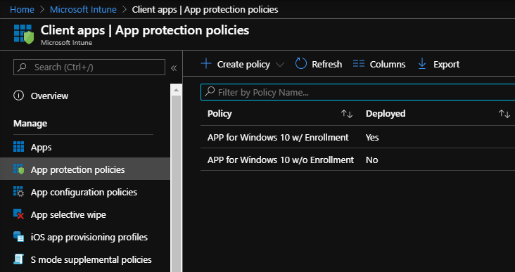

# Deploy your Windows Information Protection (WIP) policy using the Azure portal for Microsoft Intune

**Applies to:**

- Windows 10, version 1607 and later
- Windows 10 Mobile, version 1607 and later (except Microsoft Azure Rights Management, which is only available on the desktop)

After you’ve created your Windows Information Protection (WIP) policy, you'll need to deploy it to your organization's enrolled devices. Enrollment can be done for business or personal devices, allowing the devices to use your managed apps and to sync with your managed content and information.

**To deploy your WIP policy**

1. On the **App protection policies** pane, click your newly-created policy, click **Assignments**, and then select groups to include or exclude from the policy.

2. Choose the group you want your policy to apply to, and then click **Select** to deploy the policy.

   The policy is deployed to the selected users' devices.

   

>[!NOTE]
>Help to make this topic better by providing us with edits, additions, and feedback. For info about how to contribute to this topic, see [Editing Windows IT professional documentation](https://github.com/Microsoft/windows-itpro-docs/blob/master/CONTRIBUTING.md).

## Related topics

- [General guidance and best practices for Windows Information Protection (WIP)](guidance-and-best-practices-wip.md)
