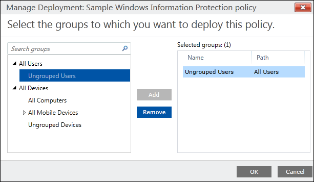

# Deploy your Windows Information Protection (WIP) policy using the classic console for Microsoft Intune
**Applies to:**

- Windows 10, version 1607 and later
- Windows 10 Mobile, version 1607 and later

After you’ve created your Windows Information Protection (WIP) policy, you'll need to deploy it to your organization's enrolled devices. Enrollment can be done for business or personal devices, allowing the devices to use your managed apps and to sync with your managed content and information.

**To deploy your WIP policy**

1.  On the **Configuration policies** page, locate your newly-created policy, click to select it, and then click the **Manage Deployment** button.

    

2.  In the left pane of the **Manage Deployment** box, click the employees or groups that should get the policy, and then click **Add**.

The added people move to the **Selected Groups** list on the right-hand pane.

    

3.  After you've picked all of the employees and groups that should get the policy, click **OK**.

The policy is deployed to the selected users' devices.

>[!NOTE]
>Help to make this topic better by providing us with edits, additions, and feedback. For info about how to contribute to this topic, see [Editing Windows IT professional documentation](https://github.com/Microsoft/windows-itpro-docs/blob/master/CONTRIBUTING.md).

## Related topics
- [Create a Windows Information Protection (WIP) policy using Microsoft Intune](create-wip-policy-using-intune.md)

- [Create and deploy a VPN policy for Windows Information Protection (WIP) using Microsoft Intune](create-vpn-and-wip-policy-using-intune.md)

- [General guidance and best practices for Windows Information Protection (WIP)](guidance-and-best-practices-wip.md)