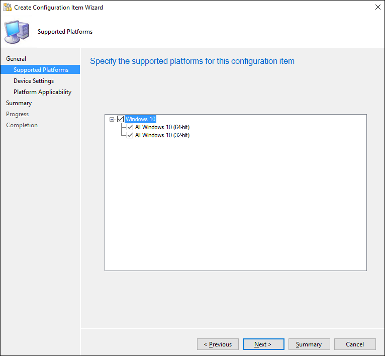
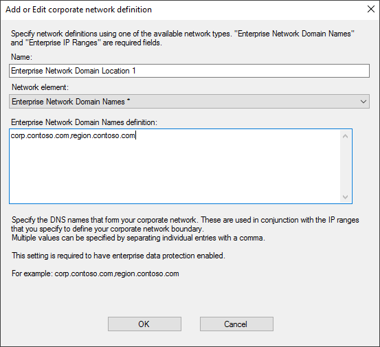
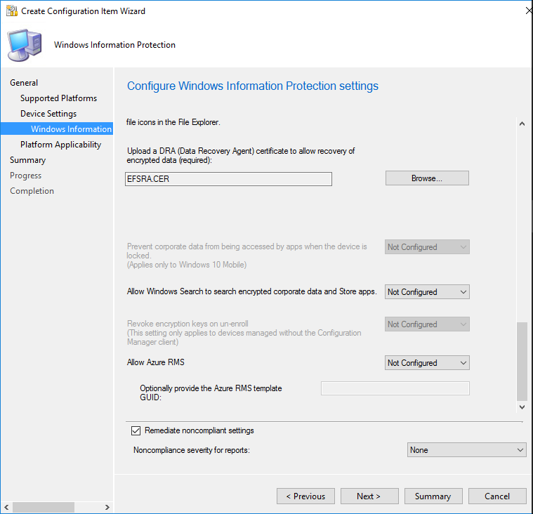

# How to disable Windows Information Protection (WIP)

_Applies to:_

- Windows 10
- Windows 11

  > [!NOTE]
   > **liz add blurb about disable**

## Use Intune to disable WIP

To remove Windows Information Protection (WIP) using Intune, you have the following options:

#### Option 1 - Remove the WIP Policy (Unassign) - preferred

Removing an existing enable policy will remove the intent to deploy WIP from those devices. When that intent is removed, a device will remove protection for files and the configuration for WIP.

#### Option 2 - Change current WIP policy to off

If you’re currently deploying a WIP policy for enrolled or unenrolled devices, you switch the WIP policy to Off. When devices check-in after this change, the devices will proceed to unprotect files previously protected by WIP.

1. Sign in to the Microsoft Endpoint Manager.
1. Open Microsoft Intune and select Apps > App protection policies > 
In Client apps - App protection policies, select <> apps. Select the existing policy to turn off.
1. From App protection policy, select the name of your policy, and then select the name of your properties.
1. Edit required settings.
:::image type="content" alt-text="Create Configuration Item wizard, choose your WIP-protection level" source="images/wip-configmgr-disable-wip.png":::
1. Set Windows Information Protection mode to off.
1. After making this change, select review and save.
1. Select save.

   > [!Note]
   > **Another option is to create a disable policy.** 
        You can create a separate disable policy for WIP (both enrolled and unenrolled) and deploy that to your organization. You then stage the rollout by complimenting your existing enablement policy and moving entities slowly from being targeted with enable to the disable policy.

## Use Configuration Manager to disable WIP

To remove Windows Information Protection (WIP) using Configuration Manager
## Add a WIP policy
After you've installed and set up Configuration Manager for your organization, you must create a configuration item for WIP, which in turn becomes your WIP policy.

>[!WARNING]
>Don't just delete your existing WIP policy.

**To create a configuration item for WIP**

1.  Open the Configuration Manager console, click the **Assets and Compliance** node, expand the **Overview** node, expand the **Compliance Settings** node, and then expand the **Configuration Items** node.

    

2.  Click the **Create Configuration Item** button.

The **Create Configuration Item Wizard** starts.

    

3.  On the **General Information screen**, type a name (required) and an optional description for your policy into the **Name** and **Description** boxes.

4.  In the **Specify the type of configuration item you want to create** area, pick the option that represents whether you use Configuration Manager for device management, and then click **Next**.

    -   **Settings for devices managed with the Configuration Manager client:** Windows 10

        -OR-

    -   **Settings for devices managed without the Configuration Manager client:** Windows 8.1 and Windows 10

5.  On the **Supported Platforms** screen, click the **Windows 10** box, and then click **Next**.

    

6.  On the **Device Settings** screen, click **Windows Information Protection**, and then click **Next**.

    

The **Configure Windows Information Protection settings** page appears, where you'll configure your policy for your organization.

## Manage the WIP-protection level for your enterprise data

Set the Windows Information Protection mode to Off.

:::image type="content" alt-text="Create Configuration Item wizard, choose your WIP-protection level" source="images/wip-configmgr-disable-wip.png":::

## Define your enterprise-managed identity domains

**Add your corporate identity**

- Type the name of your corporate identity into the **Corporate identity** field. For example, `contoso.com` or `contoso.com|newcontoso.com`.

    

## Choose where apps can access enterprise data
After you've added a protection mode to your apps, you'll need to decide where those apps can access enterprise data on your network.

**To define where your protected apps can find and send enterprise data on you network**

1. Add additional network locations your apps can access by clicking **Add**.

    The **Add or edit corporate network definition** box appears.

2. Type a name for your corporate network element into the **Name** box, and then pick what type of network element it is, from the **Network element** drop-down box. This can include any of the options in the following table.

   

     - **Enterprise Cloud Resources**: Specify the cloud resources to be treated as corporate and protected by WIP.

         For each cloud resource, you may also optionally specify a proxy server from your Internal proxy servers list to route traffic for this cloud resource. Be aware that all traffic routed through your Internal proxy servers is considered enterprise.

         If you have multiple resources, you must separate them using the `|` delimiter. If you don't use proxy servers, you must also include the `,` delimiter just before the `|`. For example: URL `<,proxy>|URL <,proxy>`.

         **Format examples**:

         - **With proxy**: `contoso.sharepoint.com,contoso.internalproxy1.com|contoso.visualstudio.com,contoso.internalproxy2.com`

         - **Without proxy**: `contoso.sharepoint.com|contoso.visualstudio.com`

         >[!Important]
         > In some cases, such as when an app connects directly to a cloud resource through an IP address, Windows can't tell whether it's attempting to connect to an enterprise cloud resource or to a personal site. In this case, Windows blocks the connection by default. To stop Windows from automatically blocking these connections, you can add the /*AppCompat*/ string to the setting. For example: URL <,proxy>|URL <,proxy>|/*AppCompat*/.

     - **Enterprise Network Domain Names (Required)**: Specify the DNS suffixes used in your environment. All traffic to the fully-qualified domains appearing in this list will be protected.

         This setting works with the IP ranges settings to detect whether a network endpoint is enterprise or personal on private networks.

         If you have multiple resources, you must separate them using the "," delimiter.

         **Format examples**: `corp.contoso.com,region.contoso.com`

     - **Proxy servers**: Specify the proxy servers your devices will go through to reach your cloud resources. Using this server type indicates that the cloud resources you're connecting to are enterprise resources.

         This list shouldn't include any servers listed in your Internal proxy servers list. Internal proxy servers must be used only for WIP-protected (enterprise) traffic.

         If you have multiple resources, you must separate them using the ";" delimiter.

         **Format examples**: `proxy.contoso.com:80;proxy2.contoso.com:443`

     - **Internal proxy servers**: Specify the internal proxy servers your devices will go through to reach your cloud resources. Using this server type indicates that the cloud resources you're connecting to are enterprise resources.

         This list shouldn't include any servers listed in your Proxy servers list. Proxy servers must be used only for non-WIP-protected (non-enterprise) traffic.

         If you have multiple resources, you must separate them using the ";" delimiter.

         **Format examples**: `contoso.internalproxy1.com;contoso.internalproxy2.com`

     - **Enterprise IPv4 Range (Required)**: Specify the addresses for a valid IPv4 value range within your intranet. These addresses, used with your Enterprise Network Domain Names, define your corporate network boundaries.

         If you have multiple ranges, you must separate them using the "," delimiter.

         **Format examples**:

         - **Starting IPv4 Address:** `3.4.0.1`
         - **Ending IPv4 Address:** `3.4.255.254`
         - **Custom URI:** `3.4.0.1-3.4.255.254, 10.0.0.1-10.255.255.254`

     - **Enterprise IPv6 Range**: Specify the addresses for a valid IPv6 value range within your intranet. These addresses, used with your Enterprise Network Domain Names, define your corporate network boundaries.

         If you have multiple ranges, you must separate them using the "," delimiter.

         **Format examples**:

         - **Starting IPv6 Address:** `2a01:110::`
         - **Ending IPv6 Address:** `2a01:110:7fff:ffff:ffff:ffff:ffff:ffff`
         - **Custom URI:** `2a01:110:7fff:ffff:ffff:ffff:ffff:ffff,fd00::-fdff:ffff:ffff:ffff:ffff:ffff:ffff:ffff`

     - **Neutral Resources**: Specify your authentication redirection endpoints for your company. These locations are considered enterprise or personal, based on the context of the connection before the redirection.

         If you have multiple resources, you must separate them using the "," delimiter.

         **Format examples**: `sts.contoso.com,sts.contoso2.com`

3. Add as many locations as you need, and then click **OK**.

   The **Add or edit corporate network definition** box closes.

4. Decide if you want to Windows to look for additional network settings and if you want to show the WIP icon on your corporate files while in File Explorer.

   :::image type="content" alt-text="Create Configuration Item wizard, Add whether to search for additional network settings" source="images/wip-configmgr-optsettings.png":::

   - **Enterprise Proxy Servers list is authoritative (do not auto-detect).** Click this box if you want Windows to treat the proxy servers you specified in the network boundary definition as the complete list of proxy servers available on your network. If you clear this box, Windows will search for additional proxy servers in your immediate network. Not configured is the default option.

   - **Enterprise IP Ranges list is authoritative (do not auto-detect).** Click this box if you want Windows to treat the IP ranges you specified in the network boundary definition as the complete list of IP ranges available on your network. If you clear this box, Windows will search for additional IP ranges on any domain-joined devices connected to your network. Not configured is the default option.

   - **Show the Windows Information Protection icon overlay on your allowed apps that are WIP-unaware on corporate files in the File Explorer.** Click this box if you want the Windows Information Protection icon overlay to appear on corporate files in the Save As and File Explorer views. Additionally, for unenlightened but allowed apps, the icon overlay also appears on the app tile and with *Managed* text on the app name in the **Start** menu. Not configured is the default option.

5. In the required **Upload a Data Recovery Agent (DRA) certificate to allow recovery of encrypted data** box, click **Browse** to add a data recovery certificate for your policy.

   

   After you create and deploy your WIP policy to your employees, Windows will begin to encrypt your corporate data on the employees' local device drive. If somehow the employees' local encryption keys get lost or revoked, the encrypted data can become unrecoverable. To help avoid this possibility, the DRA certificate lets Windows use an included public key to encrypt the local data, while you maintain the private key that can unencrypt the data. 

   For more info about how to find and export your data recovery certificate, see [Data Recovery and Encrypting File System (EFS)](/previous-versions/tn-archive/cc512680(v=technet.10)). For more info about creating and verifying your EFS DRA certificate, see [Create and verify an Encrypting File System (EFS) Data Recovery Agent (DRA) certificate](create-and-verify-an-efs-dra-certificate.md).

## Choose your optional WIP-related settings
After you've decided where your protected apps can access enterprise data on your network, you'll be asked to decide if you want to add any optional WIP settings.

**To set your optional settings**
1.  Choose to set any or all of the optional settings:

    - **Allow Windows Search to search encrypted corporate data and Store apps.** Determines whether Windows Search can search and index encrypted corporate data and Store apps. The options are:

        - **Yes.** Allows Windows Search to search and index encrypted corporate data and Store apps.

        - **No, or not configured (recommended).** Stops Windows Search from searching and indexing encrypted corporate data and Store apps.

    - **Revoke local encryption keys during the unenrollment process.** Determines whether to revoke a user's local encryption keys from a device when it's unenrolled from Windows Information Protection. If the encryption keys are revoked, a user no longer has access to encrypted corporate data. The options are:

        - **Yes, or not configured (recommended).** Revokes local encryption keys from a device during unenrollment.

        - **No.** Stop local encryption keys from being revoked from a device during unenrollment. For example, if you're migrating between Mobile Device Management (MDM) solutions.

    - **Allow Azure RMS.** Enables secure sharing of files by using removable media such as USB drives. For more information about how RMS works with WIP, see [Create a WIP policy using Intune](create-wip-policy-using-intune-azure.md). To confirm what templates your tenant has, run [Get-AadrmTemplate](/powershell/module/aadrm/get-aadrmtemplate) from the [AADRM PowerShell module](/azure/information-protection/administer-powershell). If you don't specify a template, WIP uses a key from a default RMS template that everyone in the tenant will have access to.

2. After you pick all of the settings you want to include, click **Summary**.

## Review your configuration choices in the Summary screen
After you've finished configuring your policy, you can review all of your info on the **Summary** screen.

**To view the Summary screen**
- Click the **Summary** button to review your policy choices, and then click **Next** to finish and to save your policy.

    

    A progress bar appears, showing you progress for your policy. After it's done, click **Close** to return to the **Configuration Items** page.

## Deploy the WIP policy
After you've created your WIP policy, you'll need to deploy it to your organization's devices. For info about your deployment options, see these topics:
- [Operations and Maintenance for Compliance Settings in Configuration Manager](/previous-versions/system-center/system-center-2012-R2/gg699357(v=technet.10))

- [How to Create Configuration Baselines for Compliance Settings in Configuration Manager](/previous-versions/system-center/system-center-2012-R2/gg712268(v=technet.10))

- [How to Deploy Configuration Baselines in Configuration Manager](/previous-versions/system-center/system-center-2012-R2/hh219289(v=technet.10))

## Related topics

- [How to collect Windows Information Protection (WIP) audit event logs](collect-wip-audit-event-logs.md)

- [General guidance and best practices for Windows Information Protection (WIP)](guidance-and-best-practices-wip.md)

- [Limitations while using Windows Information Protection (WIP)](limitations-with-wip.md)

-   **[Create a configuration baseline that includes the new configuration item](/mem/configmgr/compliance/deploy-use/create-configuration-baselines)**

-   **[Create a new collection](/mem/configmgr/core/clients/manage/collections/create-collections)**

-   **[Deploy the baseline to the collection](/mem/configmgr/compliance/deploy-use/deploy-configuration-baselines)**

-   **Move devices from old collection to new collection**