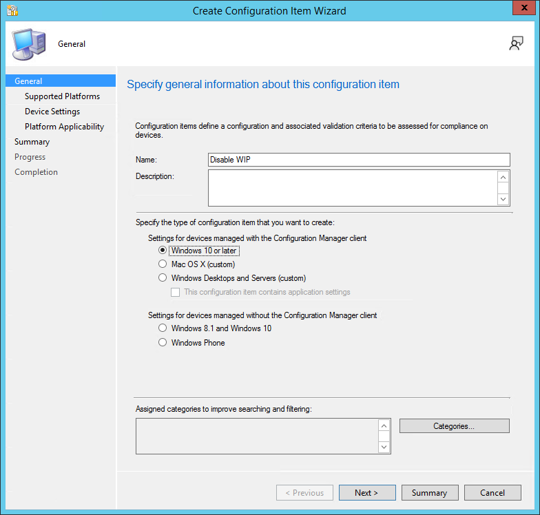

# How to disable Windows Information Protection (WIP)

[!INCLUDE [wip-deprecation](includes/wip-deprecation.md)]
<!-- 6010051 -->

_Applies to:_

- Windows 10
- Windows 11

## Use Intune to disable WIP

To disable Windows Information Protection (WIP) using Intune, you have the following options:

### Option 1 - Unassign the WIP policy (preferred)

When you unassign an existing policy, it removes the intent to deploy WIP from those devices. When that intent is removed, the device removes protection for files and the configuration for WIP. For more information, see [Assign user and device profiles in Microsoft Intune](/mem/intune/configuration/device-profile-assign).

### Option 2 - Change current WIP policy to off

If you're currently deploying a WIP policy for enrolled or unenrolled devices, you switch the WIP policy to Off. When devices check in after this change, the devices will proceed to unprotect files previously protected by WIP.

1. Sign in to the [Microsoft Intune admin center](https://go.microsoft.com/fwlink/?linkid=2109431).
1. Open Microsoft Intune and select **Apps** > **App protection policies**.
1. Select the existing policy to turn off, and then select the **Properties**.
1. Edit **Required settings**.
    :::image type="content" alt-text="Intune App Protection policy properties, required settings, with WIP mode Off." source="images/intune-edit-app-protection-policy-mode-off.png":::
1. Set **Windows Information Protection mode** to off.
1. After making this change, select **Review and Save**.
1. Select **Save**.

> [!NOTE]
> **Another option is to create a disable policy that sets WIP to Off.**
>
> You can create a separate disable policy for WIP (both enrolled and unenrolled) and deploy that to a new group. You then can stage the transition to this disabled state. Move devices from the existing group to the new group. This process slowly migrates devices instead of all at once.

### Revoke local encryption keys during the unenrollment process

Determine whether to revoke a user's local encryption keys from a device when it's unenrolled from Windows Information Protection. If the encryption keys are revoked, a user no longer has access to encrypted corporate data. The options are:

- Yes, or not configured. Revokes local encryption keys from a device during unenrollment.
- No (recommended). Stop local encryption keys from being revoked from a device during unenrollment.

## Use Configuration Manager to disable WIP

To disable Windows Information Protection (WIP) using Configuration Manager, create a new configuration item that turns off WIP. Configure that new object for your environment to match the existing policy, except for disabling WIP. Then deploy the new policy, and move devices into the new collection.

> [!WARNING]
> Don't just delete your existing WIP policy. If you delete the old policy, Configuration Manager stops sending further WIP policy updates, but also leaves WIP enforced on the devices. To remove WIP from your managed devices, follow the steps in this section to create a new policy to turn off WIP.

### Create a WIP policy

To disable WIP for your organization, first create a configuration item.

1. Open the Configuration Manager console, select the **Assets and Compliance** node, expand the **Overview** node, expand the **Compliance Settings** node, and then expand the **Configuration Items** node.

2. Select the **Create Configuration Item** button.
    The **Create Configuration Item Wizard** starts.

    

3. On the **General Information screen**, type a name (required) and an optional description for your policy into the **Name** and **Description** boxes.

4. In the **Specify the type of configuration item you want to create** area, select **Windows 10 or later** for devices managed with the Configuration Manager client, and then select **Next**.

5. On the **Supported Platforms** screen, select the **Windows 10** box, and then select **Next**.

6. On the **Device Settings** screen, select **Windows Information Protection**, and then select **Next**.

The **Configure Windows Information Protection settings** page appears, where you'll configure your policy for your organization. The following sections provide details on the required settings on this page.

> [!TIP]
> For more information on filling out the required fields, see [Create and deploy a Windows Information Protection (WIP) policy using Microsoft Configuration Manager](/windows/security/information-protection/windows-information-protection/create-wip-policy-using-configmgr).

#### Turn off WIP

Of the four options to specify the restriction mode, select **Off** to turn off Windows Information Protection.

:::image type="content" alt-text="Create Configuration Item wizard, choose your WIP-protection level." source="images/wip-configmgr-disable-wip.png":::

#### Specify the corporate identity

Paste the value of your corporate identity into the **Corporate identity** field. For example, `contoso.com` or `contoso.com|newcontoso.com`.

> [!IMPORTANT]
> This corporate identity value must match the string in the original policy. Copy and paste the string from your original policy that enables WIP.

#### Specify the corporate network definition

For the **Corporate network definition**, select **Add** to specify the necessary network locations. The **Add or edit corporate network definition** box appears. Add the required fields.

> [!IMPORTANT]
> These corporate network definitions must match the original policy. Copy and paste the strings from your original policy that enables WIP.

#### Specify the data recovery agent certificate

In the required **Upload a Data Recovery Agent (DRA) certificate to allow recovery of encrypted data** box, select **Browse** to add a data recovery certificate for your policy. This certificate should be the same as the original policy that enables WIP.

### Deploy the WIP policy

After you've created the new policy to turn off WIP, deploy it to your organization's devices. For more information about deployment options, see the following articles:

- [Create a configuration baseline that includes the new configuration item](/mem/configmgr/compliance/deploy-use/create-configuration-baselines).

- [Create a new collection](/mem/configmgr/core/clients/manage/collections/create-collections).

- [Deploy the baseline to the collection](/mem/configmgr/compliance/deploy-use/deploy-configuration-baselines).

- Move devices from the old collection to new collection.
