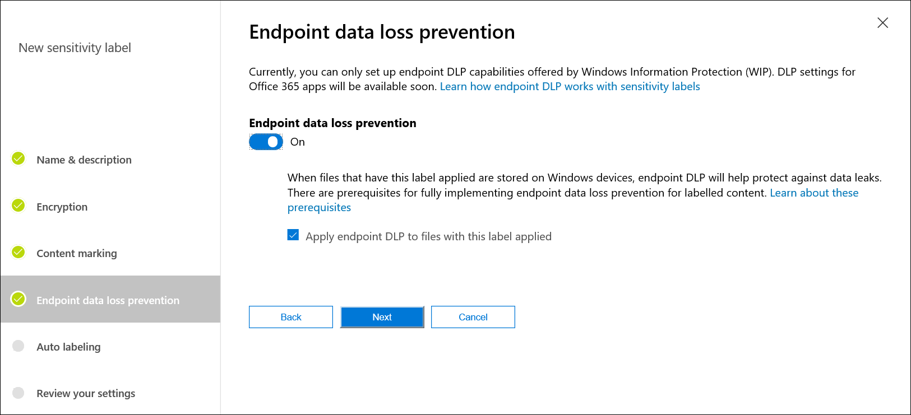
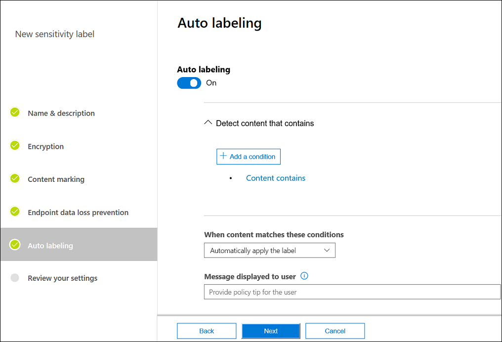
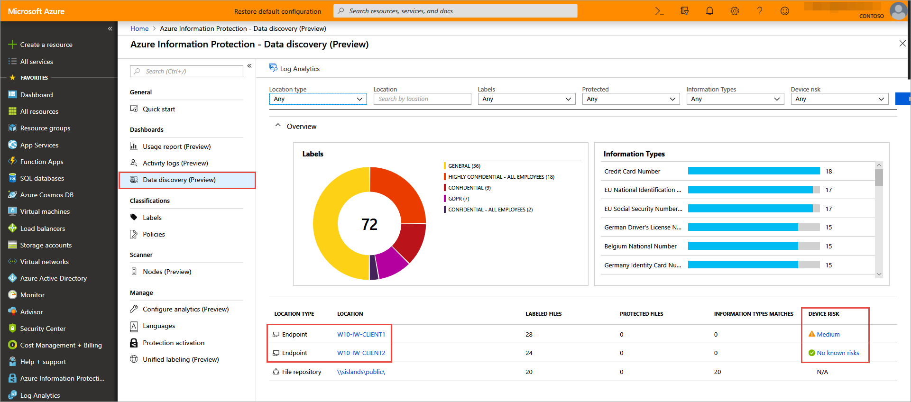
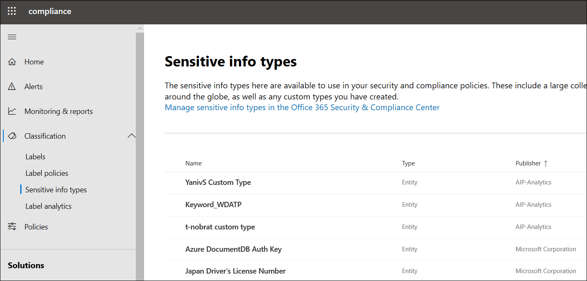

# How Windows Information Protection (WIP) protects a file that has a sensitivity label 

**Applies to:**

- [Windows Defender Advanced Threat Protection (Windows Defender ATP)](https://go.microsoft.com/fwlink/p/?linkid=2069559)
- Windows 10, version 1903
- Windows 10, version 1809

>[!IMPORTANT]
>Some information relates to prereleased product which may be substantially modified before it's commercially released. Microsoft makes no warranties, express or implied, with respect to the information provided here.

This topic explains how Windows Information Protection works with other Microsoft information protection technologies to protect files that have a sensitivity label. 
Microsoft information protection technologies work together as an integrated solution to help enterprises:

- Discover corporate data on endpoint devices
- Classify and label information based on its content and context
- Protect corporate data from unintentionally leaving to non-business environments
- Enable audit reports of user interactions with corporate data on endpoint devices

Microsoft information protection technologies include:

- [Windows Information Protection (WIP)](protect-enterprise-data-using-wip.md) is built in to Windows 10 and protects local data at rest on endpoint devices, and manages apps to protect local data in use. Data that leaves the endpoint device, such as email attachment, is not protected by WIP. 

- [Azure Information Protection](https://docs.microsoft.com/azure/information-protection/what-is-information-protection) is a cloud-based solution that can be purchased either standalone or as part of Microsoft 365 Enterprise. It helps an organization classify and protect its documents and emails by applying labels. Azure Information Protection is applied directly to content, and roams with the content as it's moved between locations and cloud services.

- [Microsoft Cloud App Security](https://docs.microsoft.com/cloud-app-security/what-is-cloud-app-security) is a cloud access security broker (CASB) solution that allows you to discover, classify, protect, and monitor user data in first-party and third-party Software-as-a-Service (SaaS) apps used by your organization.

## How WIP protects sensitivity labels with endpoint data loss prevention

You can create and manage [sensitivity labels](https://docs.microsoft.com/office365/securitycompliance/labels) in the Microsoft 365 compliance center. 
When you create a sensitivity label, you can specify that endpoint data loss prevention applies to content with that label. 

Office app users can choose a sensitivity label from a menu and apply it to a file.

WIP enforces default endpoint protection as follows: 

- If endpoint data loss prevention is enabled, the device enforces work protection for any file with the label
- If endpoint data loss prevention is not enabled:
  - The device enforces work protection to a file downloaded from a work site 
  - The device does not enforce work protection to a file downloaded from a personal site

Here's an example where a file remains protected without any work context beyond the sensitivity label: 

1. Sara creates a PDF file on a Mac and labels it as **Confidential**.
1. She emails the PDF from her Gmail account to Laura.
1. Laura opens the PDF file on her Windows 10 device. 
1. Windows Defender Advanced Threat Protection (Windows Defender ATP) scans Windows 10 for any file that gets modified or created, including files that were created on a personal site. 
1. Windows Defender ATP triggers WIP policy.
1. WIP policy protects the file even though it came from a personal site.

## How WIP protects automatically classified files

The next sections cover how Windows Defender ATP extends discovery and protection of sensitive information with improvements in Windows 10 version 1903. 

### Discovery

Windows Defender ATP can extract the content of the file itself and evaluate whether it contains sensitive information types such as credit card numbers or employee ID numbers. 
When you create a sensitivity label, you can specify that the label be added to any file that contains a sensitive information type. 

A default set of [sensitive information types](https://docs.microsoft.com/office365/securitycompliance/what-the-sensitive-information-types-look-for) in Microsoft 365 compliance center includes credit card numbers, phone numbers, driver’s license numbers, and so on.
You can also [create a custom sensitive information type](https://docs.microsoft.com/office365/securitycompliance/create-a-custom-sensitive-information-type), which can include any keyword or expression that you want to evaluate. 

### Protection

When a file is created or edited on a Windows 10 endpoint, Windows Defender ATP extracts the content and evaluates if it contains any default or custom sensitive information types that have been defined. 
If the file has a match, Windows Defender ATP applies endpoint data loss prevention even if the file had no label previously. 

Windows Defender ATP is integrated with Azure Information Protection for data discovery and reports sensitive information types that were discovered. 
Azure Information Protection aggregates the files with sensitivity labels and the sensitive information types they contain across the enterprise. 

You can see sensitive information types in Microsoft 365 compliance under **Classifications**. Default sensitive information types have Microsoft as the publisher. The publisher for custom types is the tenant name.

>[!NOTE]
>Automatic classification does not change the file itself, but it applies protection based on the label. 
>WIP protects a file that contains a sensitive information type as a work file.
>Azure Information Protection works differently in that it extends a file with a new attribute so the protection persists if the file is copied. 

## Prerequisites

- Endpoint data loss prevention requires Windows 10, version 1809
- Auto labelling requires Windows 10, version 1903
- Devices need to be onboarded to [Windows Defender ATP](https://docs.microsoft.com/windows/security/threat-protection/windows-defender-atp/windows-defender-advanced-threat-protection), which scans content for a label and applies WIP policy
- [Sensitivity labels](https://docs.microsoft.com/office365/securitycompliance/labels) need to be configured in Microsoft 365 compliance center
- WIP policy needs to be applied to endpoint devices by using [Intune](create-wip-policy-using-intune-azure.md) or [System Center Configuration Manager (SCCM)](overview-create-wip-policy-sccm.md)

