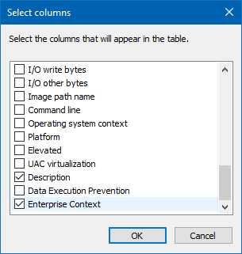

# Determine the Enterprise Context of an app running in Windows Information Protection (WIP)
**Applies to:**

- Windows 10, version 1607 and later
- Windows 10 Mobile, version 1607 and later

>Learn more about what features and functionality are supported in each Windows edition at [Compare Windows 10 Editions](https://www.microsoft.com/WindowsForBusiness/Compare).

Use Task Manager to check the context of your apps while running in Windows Information Protection (WIP) to make sure that your organization's policies are applied and running correctly.

## Viewing the Enterprise Context column in Task Manager
You need to add the Enterprise Context column to the **Details** tab of the Task Manager.

1. Make sure that you have an active WIP policy deployed and turned on in your organization.

2. Open the Task Manager (taskmgr.exe), click the **Details** tab, right-click in the column heading area, and click **Select columns**.

    The **Select columns** box appears.

    

3. Scroll down and check the **Enterprise Context** option, and then click **OK** to close the box.

    The **Enterprise Context** column should now be available in Task Manager.

    

## Review the Enterprise Context
The **Enterprise Context** column shows you what each app can do with your enterprise data:

- **Domain.** Shows the employee's work domain (such as, corp.contoso.com). This app is considered work-related and can freely touch and open work data and resources.

- **Personal.** Shows the text, *Personal*. This app is considered non-work-related and can't touch any work data or resources.

- **Exempt.** Shows the text, *Exempt*. WIP policies don't apply to these apps (such as, system components).

    >**Important** Enlightened apps can change between Work and Personal, depending on the data being touched. For example, Microsoft Word 2016 shows as **Personal** when an employee opens a personal letter, but changes to **Work** when that same employee opens the company financials.

