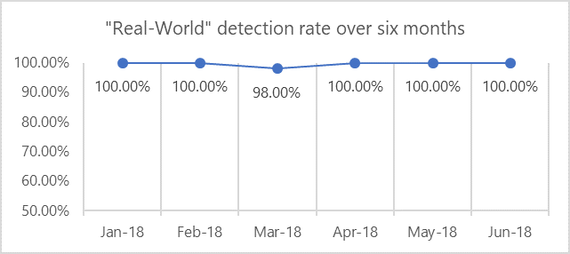
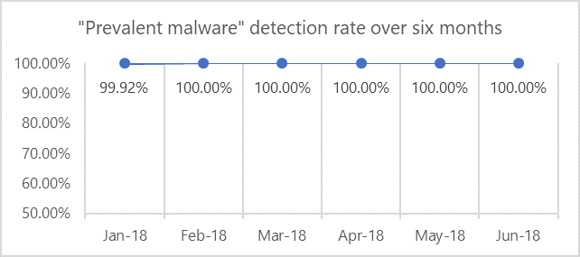

# Top scoring in industry antivirus tests

Antivirus capabilities in Windows Defender Advanced Threat Protection (ATP) **consistently receive high scores** from independent tests, making Windows Defender ATP a top choice in the antivirus market. Windows 10 has technological advances in AV as well as other built-in security solutions, raising the bar for exploits, malware, and other threats.

Windows Defender ATP [next generation protection](https://www.youtube.com/watch?v=Xy3MOxkX_o4) detects and stops malware at first sight by using a model that leverages predictive technologies, [machine learning](https://cloudblogs.microsoft.com/microsoftsecure/2018/06/07/machine-learning-vs-social-engineering/), [artificial intelligence](https://cloudblogs.microsoft.com/microsoftsecure/2018/02/14/how-artificial-intelligence-stopped-an-emotet-outbreak/), behavioral analysis, and other advanced technologies.

Millions of devices are protected from malware outbreaks and cyberattacks every day, sometimes [milliseconds after a campaign starts](https://cloudblogs.microsoft.com/microsoftsecure/2018/03/07/behavior-monitoring-combined-with-machine-learning-spoils-a-massive-dofoil-coin-mining-campaign/). In many cases, customers might not even know they were protected.

Test scores, real-world performance, and tight integration with the platform as well as other security technologies are the main reasons why Windows Defender ATP antivirus capabilities is [gaining a foothold in the enterprise market](https://docs.microsoft.com/windows/threat-protection/windows-defender-antivirus/windows-defender-antivirus-in-windows-10). 

## AV-TEST

AV-TEST is an independent IT security institute from Germany and has been testing internationally relevant IT security products for over 15 years.

The AV-TEST Product Review and Certification Report tests on three categories: protection, performance, and usability. The scores listed below are for the protection category against malware infections which has two scores, the AV-Test reference set (known as just "prevalent malware") and the real world testing.

**Real-world testing** refers to protection against zero-day malware attacks, inclusive of web and email threats.

**Prevalent malware** refers to detection of widespread and prevalent malware discovered in the last 4 weeks.

||Real World | Prevent malware | AV-Test report| Microsoft's analysis|
|---|---|---|---|---| 
|Jan. 2018| 100.00%| 99.92%| [Report (Jan-Feb)](https://www.av-test.org/en/antivirus/home-windows/windows-7/february-2018/kaspersky-lab-internet-security-18.0-180557/)| [Analysis (Jan-Feb)](https://query.prod.cms.rt.microsoft.com/cms/api/am/binary/RE27O5A?ocid=cx-blog-mmpc)|
|Feb. | 100.00% | 100.00%|[Report (Jan-Feb)](https://www.av-test.org/en/antivirus/home-windows/windows-7/february-2018/kaspersky-lab-internet-security-18.0-180557/)| [Analysis (Jan-Feb)](https://query.prod.cms.rt.microsoft.com/cms/api/am/binary/RE27O5A?ocid=cx-blog-mmpc)|
Mar. |98.00%| 100.00%|[Report (Mar-Apr)](https://www.av-test.org/en/antivirus/business-windows-client/windows-10/april-2018/microsoft-windows-defender-antivirus-4.12-181574/)|[Analysis (Mar-Apr)](https://query.prod.cms.rt.microsoft.com/cms/api/am/binary/RE2ouJA)|
Apr.|100.00%| 100.00%|[Report (Mar-Apr)](https://www.av-test.org/en/antivirus/business-windows-client/windows-10/april-2018/microsoft-windows-defender-antivirus-4.12-181574/)|[Analysis (Mar-Apr)](https://query.prod.cms.rt.microsoft.com/cms/api/am/binary/RE2ouJA)| 
May|100.00%| 100.00%| [Report (May-Jun)](https://www.av-test.org/en/antivirus/business-windows-client/windows-10/june-2018/microsoft-windows-defender-antivirus-4.12-182374/)|Analysis pending|
Jun.|100.00%| 100.00%| [Report (May-Jun)](https://www.av-test.org/en/antivirus/business-windows-client/windows-10/june-2018/microsoft-windows-defender-antivirus-4.12-182374/)|Analysis pending|

### Graphs

The graphs below show Windows Defender AV's detection rates in “Real World” and “Prevalent malware” testing over a six month period.

## AV Comparatives

AV-Comparatives is an independent organization offering systematic testing for security software such as PC/Mac-based antivirus products and mobile security solutions.

The **blocked** category tests whether malware was successfully blocked by AV.

The  **Real-World Protection Test (Enterprise)** evaluates the “real-world” protection capabilities with default settings. The goal is to find out whether the security software protects the computer by either hindering the malware from changing any systems or remediating all changes if any were made.

|| Real World (blocked)|
|---|---|
|Jan. 2018| No test|
|Feb.| 100.00%|
|Mar.| 94.40%%|
|Apr.| 96.40%%|
|May.| 100.00%|
|Jun.| 99.50%%|

* [Real-World Protection Test (Enterprise) February - June 2018](https://www.av-comparatives.org/tests/real-world-protection-test-february-june-2018/)

The **Malware Protection Test Enterprise** assesses a security program’s ability to protect a system against infection by malicious files before, during or after execution. It is only tested every *six months*.

||Malware (blocked)|
|---|---|
|Mar. 2018| 99.90%|

* [Malware Protection Test Enterprise March 2018](https://www.av-comparatives.org/tests/malware-protection-test-enterprise-march-2018-testresult/)

## Protection capabilities not represented in the tests

It is important to remember that [Windows Defender ATP](https://www.microsoft.com/en-us/WindowsForBusiness/windows-atp?ocid=cx-blog-mmpc) (which integrates our antivirus capabilities and the whole Windows security stack) provides a much larger set of protection features that are not factored into the tests. These features provide [additional layers of protection](https://cloudblogs.microsoft.com/microsoftsecure/2017/12/11/detonating-a-bad-rabbit-windows-defender-antivirus-and-layered-machine-learning-defenses/) that help prevent malware from getting onto devices in the first place  like endpoint detection and response (EDR) capabilities, Windows Defender SmartScreen, Windows Defender Exploit Guard, and others.

 To see these capabilities for yourself sign up for a [90-day trial of Windows Defender ATP](https://www.microsoft.com/windowsforbusiness/windows-atp?ocid=cx-blog-mmpc) today, or [enable Preview features on existing tenants](https://docs.microsoft.com/windows/security/threat-protection/windows-defender-atp/preview-settings-windows-defender-advanced-threat-protection).

