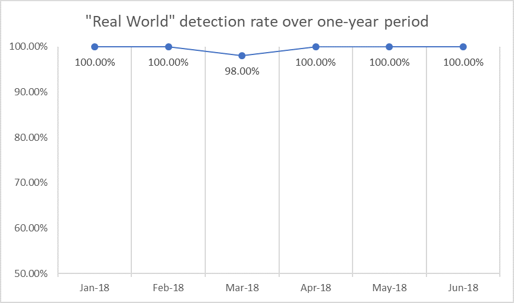

# Industry antivirus tests

The Windows Defender ATP team is committed to delivering industry-leading protection, customer choice, and transparency on the quality of our solutions. We release transparency reports to help our customers and the broader security community to stay informed and understand independent test results better.

## Top scoring in independent tests

Microsoft has worked hard to make our capabilities increasingly more effective by utilizing heuristic detections, machine learning, behavioral analysis, and other evolutions. By removing dependency on constant input from researchers, our antivirus solution can block nearly all malware at first sight and in milliseconds. That is why [Windows Defender Antivirus is the most deployed in the enterprise](https://docs.microsoft.com/windows/threat-protection/windows-defender-antivirus/windows-defender-antivirus-in-windows-10).

The time and effort Microsoft puts into improving Windows Defender Antivirus continues to show in the form of consistently high scores from independent tests.

### AV-TEST

The diagrams below show Windows Defender AV’s detection rates in “Real World” and “Prevalent malware” testing over a six month period

## Factors not represented in the tests

It is important to remember that [Windows Defender ATP](https://www.microsoft.com/en-us/WindowsForBusiness/windows-atp?ocid=cx-blog-mmpc) (which integrates our antivirus capabilities and the whole Windows security stack) provides a much larger set of protection features that are not factored into the tests. These features provide **additional layers of protection** that help prevent malware from getting onto devices in the first place:

If organizations like AV-Comparatives and AV-TEST performed testing against the complete endpoint protection solution, the results would better represent the kind of protection our customers actually enjoy daily.

 To see these capabilities for yourself sign up for a [90-day trial of Windows Defender ATP](https://www.microsoft.com/windowsforbusiness/windows-atp?ocid=cx-blog-mmpc) today, or [enable Preview features on existing tenants](https://docs.microsoft.com/windows/security/threat-protection/windows-defender-atp/preview-settings-windows-defender-advanced-threat-protection).

## Reports

### AV Test

**May-June 2018**

* [AV-Test results](https://www.av-test.org/en/antivirus/business-windows-client/windows-10/june-2018/microsoft-windows-defender-antivirus-4.12-182374/
)

**March-April 2018**

* [AV-Test results](https://www.av-test.org/en/antivirus/business-windows-client/windows-10/april-2018/microsoft-windows-defender-antivirus-4.12-181574/)

* [Microsoft transparency report](https://query.prod.cms.rt.microsoft.com/cms/api/am/binary/RE2ouJA)

**January-February 2018**

* [AV-Test results](https://www.av-test.org/en/antivirus/business-windows-client/windows-10/april-2018/microsoft-windows-defender-antivirus-4.12-181574/)

* [Microsoft transparency report](https://query.prod.cms.rt.microsoft.com/cms/api/am/binary/RE27O5A?ocid=cx-blog-mmpc)

### AV Comparatives

**March-June 2018**

* [Real-World Protection Test](https://www.av-comparatives.org/comparison/)

### Tom's Guide

https://www.tomsguide.com/us/best-antivirus,review-2588.html