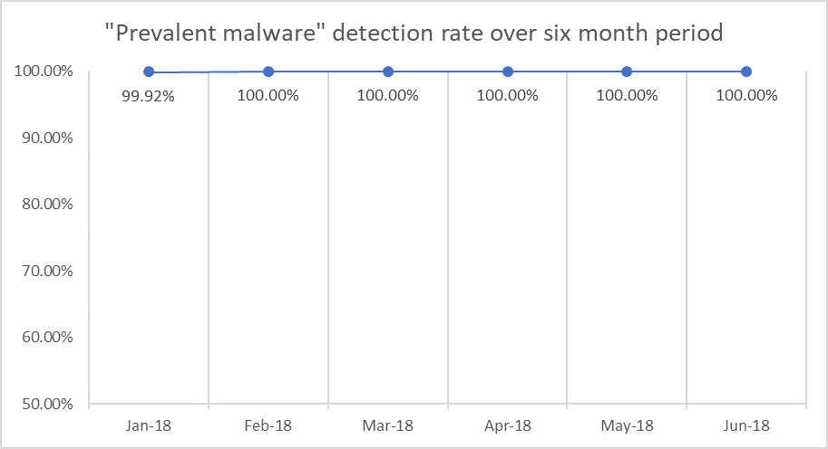

# Industry antivirus tests

Microsoft security stack continually performs well on independent tests. 

## Top scoring in independent tests

Microsoft has worked hard to make our capabilities increasingly more effective by utilizing heuristic detections, machine learning, behavioral analysis, and other evolutions. That is why [Windows Defender Antivirus is the most deployed in the enterprise](https://docs.microsoft.com/windows/threat-protection/windows-defender-antivirus/windows-defender-antivirus-in-windows-10).

The time and effort Microsoft puts into improving Windows Defender Antivirus continues to show in the form of consistently high scores from independent tests.

## AV-TEST

AV-TEST is an independent IT security institute from Germany and has been testing internationally relevant IT security products for over 15 years.

The AV-TEST Product Review and Certification Report tests on three categories: protection, performance, and usability. The scores listed below are for the protection category against malware infections which has two scores, the AV-Test reference set (known as just "prevent malware") and the real world testing.

**Prevent malware** refers to detection of widespread and prevalent malware discovered in the last 4 weeks.

**Real-world testing** refers to protection against 0-day malware attacks, inclusive of web and e-mail threats.

||**January-February 2018** | **March-April 2018**  |**May-June 2018**|
|-----|-----|-----|-----|
|Prevent Malware detection rate:| 99.92%, 100.00%|100.00%, 100.00%|100.00%, 100.00%| 
|Real World detection rate:| 100.00%, 100.00%| 98.00%, 100.00%| 100.00%, 100.00%|
||* [AV-Test results](https://www.av-test.org/en/antivirus/home-windows/windows-7/february-2018/kaspersky-lab-internet-security-18.0-180557/)|* [AV-Test results](https://www.av-test.org/en/antivirus/business-windows-client/windows-10/april-2018/microsoft-windows-defender-antivirus-4.12-181574/)|* [AV-Test results](https://www.av-test.org/en/antivirus/business-windows-client/windows-10/june-2018/microsoft-windows-defender-antivirus-4.12-182374/)|
||* [Microsoft transparency report](https://query.prod.cms.rt.microsoft.com/cms/api/am/binary/RE27O5A?ocid=cx-blog-mmpc)|* [Microsoft transparency report](https://query.prod.cms.rt.microsoft.com/cms/api/am/binary/RE2ouJA)|||

### Graphs

The graphs below show Windows Defender AV’s detection rates in “Real World” and “Prevalent malware” testing over a six month period.

## AV Comparatives

AV-Comparatives is an independent organization offering systematic testing for security software such as PC/Mac-based antivirus products and mobile security solutions.

The results show the AV Comparatives Enterprise Real-World Protection Test

### **March-June 2018**

Blocked (malware was successfully blocked by AV): **98.7%**

* [Real-World Protection Test](https://www.av-comparatives.org/comparison/)

## Factors not represented in the tests

It is important to remember that [Windows Defender ATP](https://www.microsoft.com/en-us/WindowsForBusiness/windows-atp?ocid=cx-blog-mmpc) (which integrates our antivirus capabilities and the whole Windows security stack) provides a much larger set of protection features that are not factored into the tests. These features provide **additional layers of protection** that help prevent malware from getting onto devices in the first place.

 To see these capabilities for yourself sign up for a [90-day trial of Windows Defender ATP](https://www.microsoft.com/windowsforbusiness/windows-atp?ocid=cx-blog-mmpc) today, or [enable Preview features on existing tenants](https://docs.microsoft.com/windows/security/threat-protection/windows-defender-atp/preview-settings-windows-defender-advanced-threat-protection).

